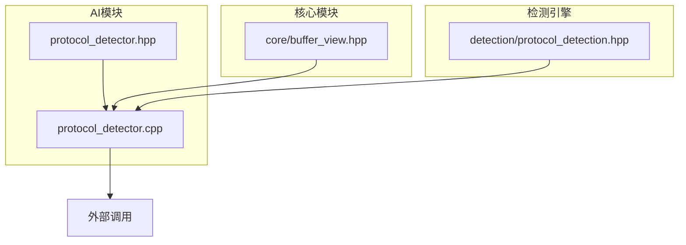
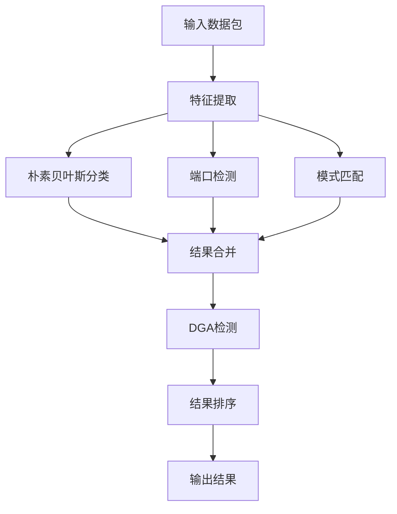
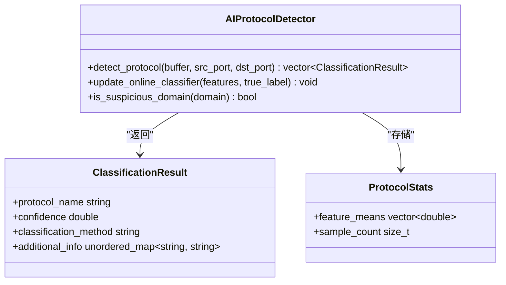
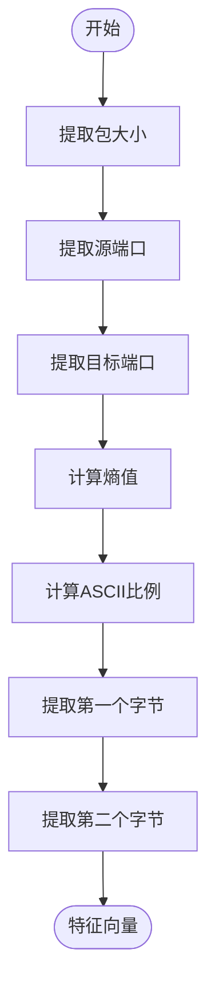
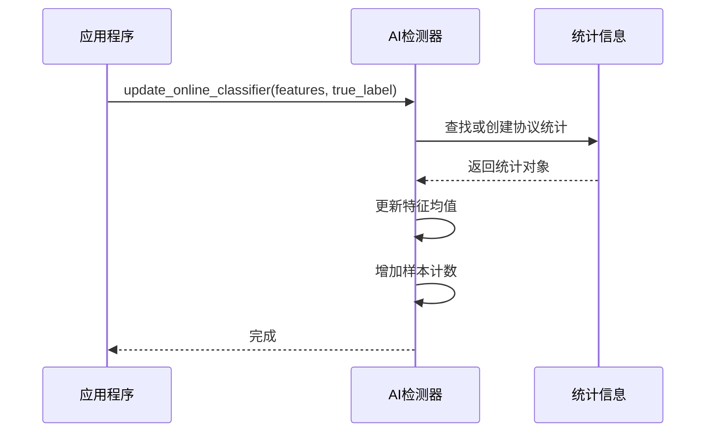
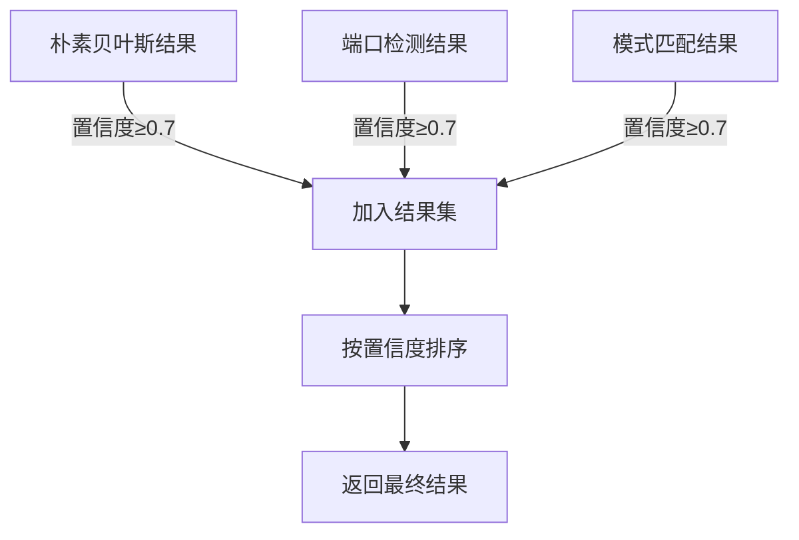
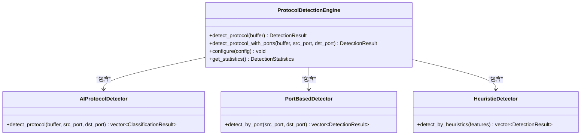
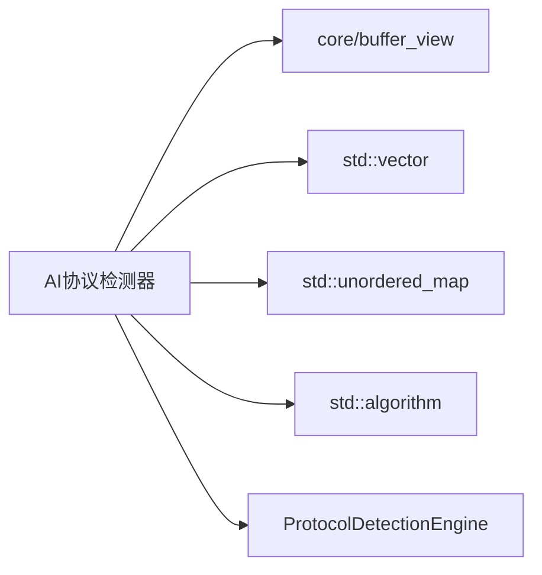

# AI协议检测器

<cite>
**本文档引用的文件**  
- [protocol_detector.hpp](file://include/ai/protocol_detector.hpp)
- [protocol_detector.cpp](file://src/ai/protocol_detector.cpp)
- [protocol_detection.hpp](file://include/detection/protocol_detection.hpp)
- [protocol_detection.cpp](file://src/detection/protocol_detection.cpp)
</cite>

## 目录
1. [简介](#简介)
2. [项目结构](#项目结构)
3. [核心组件](#核心组件)
4. [架构概述](#架构概述)
5. [详细组件分析](#详细组件分析)
6. [依赖分析](#依赖分析)
7. [性能考虑](#性能考虑)
8. [故障排除指南](#故障排除指南)
9. [结论](#结论)

## 简介
AI协议检测器是一个基于朴素贝叶斯分类算法的网络协议识别系统，集成在高性能网络协议解析库中。该系统通过多维度特征提取、机器学习分类和置信度评估机制，实现对网络流量中未知协议的智能识别。检测器结合了端口特征、载荷特征和时序模式等多种检测方法，支持在线学习和DGA（域名生成算法）检测等高级功能。

## 项目结构
AI协议检测器位于项目的`include/ai`和`src/ai`目录下，作为独立模块与其他协议解析组件协同工作。该模块通过`protocol_detector.hpp`头文件暴露接口，实现文件为`protocol_detector.cpp`。检测器与主协议检测引擎（ProtocolDetectionEngine）通过标准接口集成，同时依赖核心缓冲区视图（BufferView）进行数据访问。

**图源**  
- [protocol_detector.hpp](file://include/ai/protocol_detector.hpp#L1-L76)
- [protocol_detector.cpp](file://src/ai/protocol_detector.cpp#L1-L316)

**节源**  
- [protocol_detector.hpp](file://include/ai/protocol_detector.hpp#L1-L76)
- [protocol_detector.cpp](file://src/ai/protocol_detector.cpp#L1-L316)

## 核心组件
AI协议检测器的核心组件包括朴素贝叶斯分类器、特征提取模块、置信度评估机制和在线学习功能。系统通过`ClassificationResult`结构体返回检测结果，包含协议名称、置信度、分类方法和附加信息。`ProtocolStats`结构体用于存储协议特征的统计信息，支持在线更新和学习。

**节源**  
- [protocol_detector.hpp](file://include/ai/protocol_detector.hpp#L12-L23)
- [protocol_detector.cpp](file://src/ai/protocol_detector.cpp#L1-L316)

## 架构概述
AI协议检测器采用多层检测架构，结合了朴素贝叶斯分类、端口检测和模式匹配三种方法。系统首先提取数据包的基本特征，然后通过不同的分类器进行并行检测，最后根据置信度阈值筛选和排序结果。检测器支持DGA检测功能，能够识别可疑的域名生成行为。

**图源**  
- [protocol_detector.cpp](file://src/ai/protocol_detector.cpp#L18-L75)
- [protocol_detector.hpp](file://include/ai/protocol_detector.hpp#L26-L74)

## 详细组件分析

### 朴素贝叶斯分类器分析
朴素贝叶斯分类器是AI协议检测器的核心算法，通过计算特征概率来识别协议类型。分类器使用简化的高斯模型，基于特征均值进行概率计算。系统维护每个协议的特征统计信息，支持在线学习和模型更新。

**图源**  
- [protocol_detector.hpp](file://include/ai/protocol_detector.hpp#L12-L74)
- [protocol_detector.cpp](file://src/ai/protocol_detector.cpp#L1-L316)

### 特征提取方法分析
特征提取模块负责从数据包中提取关键特征，包括包大小、源端口、目标端口、熵值和ASCII比例等。系统还提取前两个字节作为特征，用于识别特定协议的签名。这些特征构成了朴素贝叶斯分类器的输入向量。

**图源**  
- [protocol_detector.cpp](file://src/ai/protocol_detector.cpp#L180-L215)
- [protocol_detector.hpp](file://include/ai/protocol_detector.hpp#L65-L67)

### 模型训练流程分析
模型训练流程通过`update_online_classifier`方法实现，支持在线学习功能。当获得真实的协议标签时，系统会更新对应协议的特征统计信息。训练过程采用简单的滑动平均算法，逐步调整特征均值，实现模型的持续优化。

**图源**  
- [protocol_detector.cpp](file://src/ai/protocol_detector.cpp#L85-L104)
- [protocol_detector.hpp](file://include/ai/protocol_detector.hpp#L45-L47)

### 置信度评估机制分析
置信度评估机制通过多检测器融合实现，系统对朴素贝叶斯、端口检测和模式匹配的结果进行综合评估。每个检测器返回独立的置信度分数，系统根据预设阈值（默认0.7）筛选结果，并按置信度排序输出。

**图源**  
- [protocol_detector.cpp](file://src/ai/protocol_detector.cpp#L18-L75)
- [protocol_detector.hpp](file://include/ai/protocol_detector.hpp#L26-L74)

### 集成到解析流程分析
AI协议检测器通过`ProtocolDetectionEngine`集成到主解析流程中。检测引擎协调多个检测器（端口、签名、启发式、深度检测），AI检测器作为其中的重要组成部分，提供基于机器学习的协议识别能力。系统支持灵活的配置和管理接口。

**图源**  
- [protocol_detection.hpp](file://include/detection/protocol_detection.hpp#L188-L291)
- [protocol_detection.cpp](file://src/detection/protocol_detection.cpp#L308-L315)

## 依赖分析
AI协议检测器依赖核心缓冲区视图（BufferView）进行数据访问，与主协议检测引擎（ProtocolDetectionEngine）通过标准接口集成。系统还依赖C++标准库组件，如vector、unordered_map和algorithm等。检测器与协议解析器模块松耦合，便于独立开发和测试。

**图源**  
- [protocol_detector.hpp](file://include/ai/protocol_detector.hpp#L1-L76)
- [protocol_detection.hpp](file://include/detection/protocol_detection.hpp#L1-L302)

**节源**  
- [protocol_detector.hpp](file://include/ai/protocol_detector.hpp#L1-L76)
- [protocol_detection.hpp](file://include/detection/protocol_detection.hpp#L1-L302)

## 性能考虑
AI协议检测器在设计时充分考虑了性能因素。特征提取采用高效的算法，如SIMD加速的熵值计算。分类过程避免复杂的数学运算，使用简化的概率计算模型。系统通过预加载基本签名和端口映射，减少运行时计算开销。在线学习功能采用增量更新策略，避免全量重新训练。

## 故障排除指南
当AI协议检测器出现异常时，可检查以下方面：确保输入数据包格式正确，验证特征提取结果的合理性，检查分类器的统计信息是否正常更新。对于低置信度结果，可调整置信度阈值或增加训练样本。DGA检测功能可通过测试已知的可疑域名进行验证。

**节源**  
- [protocol_detector.cpp](file://src/ai/protocol_detector.cpp#L1-L316)
- [protocol_detector.hpp](file://include/ai/protocol_detector.hpp#L1-L76)

## 结论
AI协议检测器通过朴素贝叶斯分类算法和多维度特征提取，实现了对网络协议的智能识别。系统结合了传统检测方法和机器学习技术，提供了高准确率的协议识别能力。检测器支持在线学习和DGA检测等高级功能，能够适应不断变化的网络环境。通过与主协议检测引擎的紧密集成，AI检测器为网络流量分析提供了强大的支持。