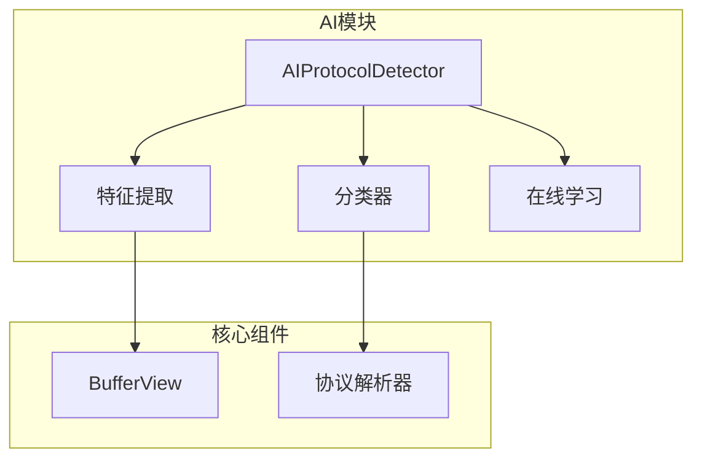
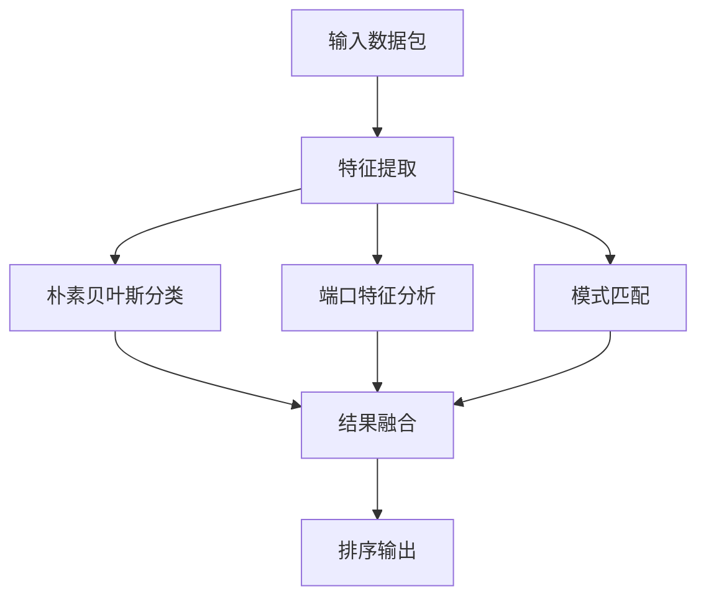
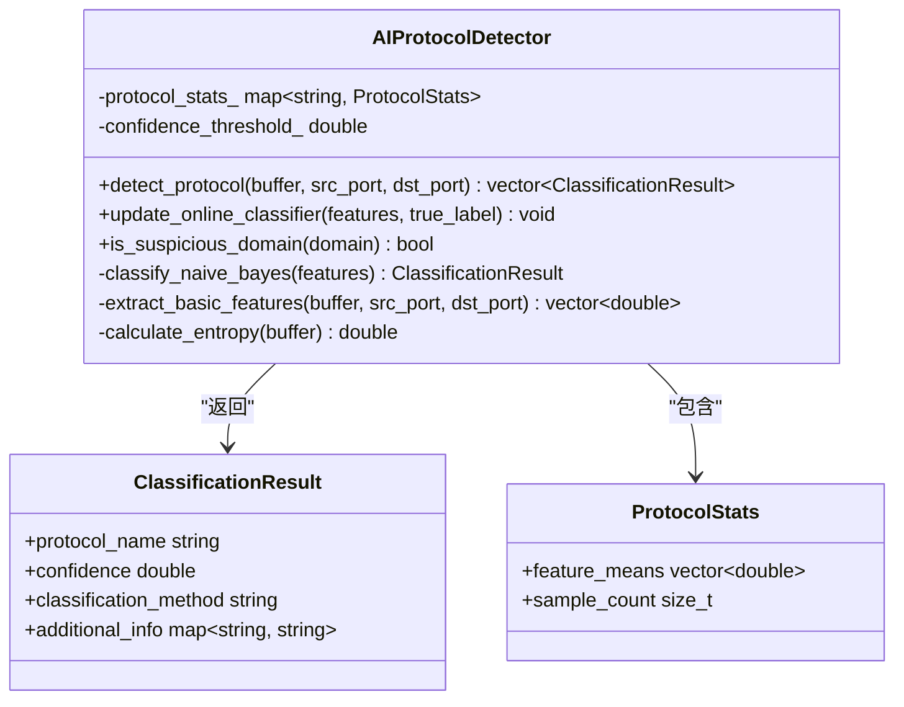
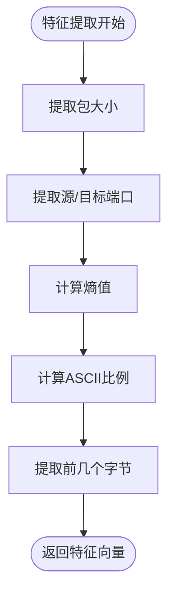
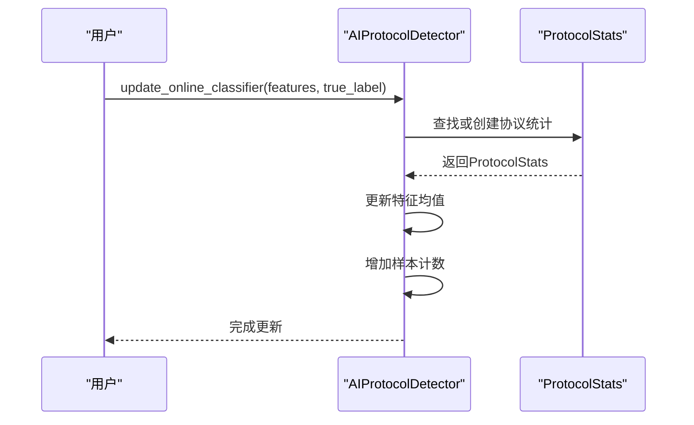
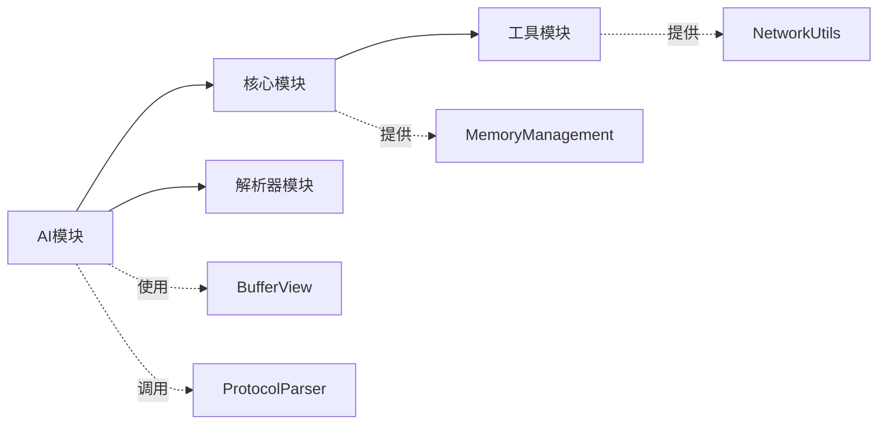

# AI增强协议检测

<cite>
**本文档引用的文件**
- [protocol_detector.hpp](file://include/ai/protocol_detector.hpp)
- [protocol_detector.cpp](file://src/ai/protocol_detector.cpp)
- [README.md](file://README.md)
- [IMPLEMENTATION_SUMMARY.md](file://IMPLEMENTATION_SUMMARY.md)
</cite>

## 目录
1. [简介](#简介)
2. [项目结构](#项目结构)
3. [核心组件](#核心组件)
4. [架构概述](#架构概述)
5. [详细组件分析](#详细组件分析)
6. [依赖分析](#依赖分析)
7. [性能考虑](#性能考虑)
8. [故障排除指南](#故障排除指南)
9. [结论](#结论)

## 简介
本文档详细说明了高性能网络协议解析库中AI增强协议检测功能的实现原理。该系统采用朴素贝叶斯分类器、端口特征分析和模式匹配等多种技术，实现了对网络流量的智能识别和分类。系统支持在线学习机制，能够动态适应新的网络模式，并提供置信度评估来量化检测结果的可靠性。

## 项目结构
该项目采用模块化设计，将AI协议检测功能独立在`include/ai`和`src/ai`目录中。核心的协议检测器实现为`AIProtocolDetector`类，通过特征提取、多分类器融合和在线学习等机制提供智能检测能力。

**图示来源**
- [protocol_detector.hpp](file://include/ai/protocol_detector.hpp#L26-L74)
- [protocol_detector.cpp](file://src/ai/protocol_detector.cpp#L9-L16)

**本节来源**
- [README.md](file://README.md#L1-L510)
- [org_design_doc.md](file://org_design_doc.md#L1-L415)

## 核心组件
AI协议检测系统的核心是`AIProtocolDetector`类，它实现了多种检测方法的融合。系统通过`detect_protocol`方法接收网络数据包并返回分类结果，同时支持`update_online_classifier`方法进行在线学习。

**本节来源**
- [protocol_detector.hpp](file://include/ai/protocol_detector.hpp#L26-L74)
- [protocol_detector.cpp](file://src/ai/protocol_detector.cpp#L18-L315)

## 架构概述
AI协议检测器采用多层分类架构，结合了基于统计的朴素贝叶斯分类、基于端口的规则匹配和基于模式的字符串匹配。这种融合方法提高了检测的准确性和鲁棒性。

**图示来源**
- [protocol_detector.cpp](file://src/ai/protocol_detector.cpp#L18-L31)
- [protocol_detector.hpp](file://include/ai/protocol_detector.hpp#L26-L74)

## 详细组件分析

### 朴素贝叶斯分类器分析
AI协议检测器实现了简化的高斯朴素贝叶斯分类器，通过计算特征向量与已知协议特征均值的差异来评估相似度。

**图示来源**
- [protocol_detector.hpp](file://include/ai/protocol_detector.hpp#L26-L74)
- [protocol_detector.cpp](file://src/ai/protocol_detector.cpp#L173-L205)

**本节来源**
- [protocol_detector.hpp](file://include/ai/protocol_detector.hpp#L26-L74)
- [protocol_detector.cpp](file://src/ai/protocol_detector.cpp#L173-L205)

### 特征工程方法
系统实现了多种特征提取方法，包括包大小、端口信息、熵值和ASCII比例等，为分类器提供丰富的输入特征。

**图示来源**
- [protocol_detector.cpp](file://src/ai/protocol_detector.cpp#L141-L167)
- [protocol_detector.hpp](file://include/ai/protocol_detector.hpp#L63-L65)

**本节来源**
- [protocol_detector.cpp](file://src/ai/protocol_detector.cpp#L141-L167)
- [protocol_detector.hpp](file://include/ai/protocol_detector.hpp#L63-L65)

### 在线学习机制
系统支持在线学习，能够根据真实标签更新协议特征统计，使模型能够适应网络环境的变化。

**图示来源**
- [protocol_detector.cpp](file://src/ai/protocol_detector.cpp#L33-L48)
- [protocol_detector.hpp](file://include/ai/protocol_detector.hpp#L58-L59)

**本节来源**
- [protocol_detector.cpp](file://src/ai/protocol_detector.cpp#L33-L48)
- [protocol_detector.hpp](file://include/ai/protocol_detector.hpp#L58-L59)

## 依赖分析
AI协议检测模块依赖于核心的BufferView类进行数据访问，同时与协议解析器协同工作以提供完整的协议识别功能。

**图示来源**
- [protocol_detector.hpp](file://include/ai/protocol_detector.hpp#L1-L74)
- [protocol_detector.cpp](file://src/ai/protocol_detector.cpp#L1-L315)

**本节来源**
- [protocol_detector.hpp](file://include/ai/protocol_detector.hpp#L1-L74)
- [protocol_detector.cpp](file://src/ai/protocol_detector.cpp#L1-L315)

## 性能考虑
AI协议检测器在设计时考虑了性能优化，采用简化的算法实现以平衡准确性和处理速度。系统通过配置参数可以调整检测的严格程度。

**本节来源**
- [README.md](file://README.md#L1-L510)
- [IMPLEMENTATION_SUMMARY.md](file://IMPLEMENTATION_SUMMARY.md#L1-L107)

## 故障排除指南
当AI协议检测功能出现问题时，可以检查配置参数、特征提取结果和分类器状态等关键环节。

**本节来源**
- [README.md](file://README.md#L1-L510)
- [protocol_detector.cpp](file://src/ai/protocol_detector.cpp#L1-L315)

## 结论
AI增强协议检测系统通过融合多种检测方法，提供了准确可靠的协议识别能力。系统的在线学习机制使其能够适应不断变化的网络环境，而置信度评估则为检测结果提供了可靠性度量。这种设计在保持高性能的同时，实现了智能化的协议检测功能。