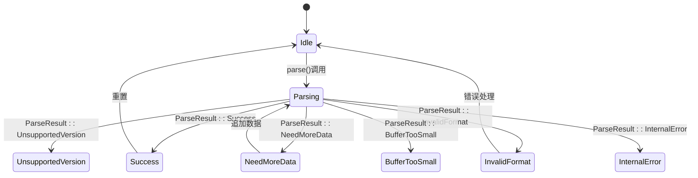
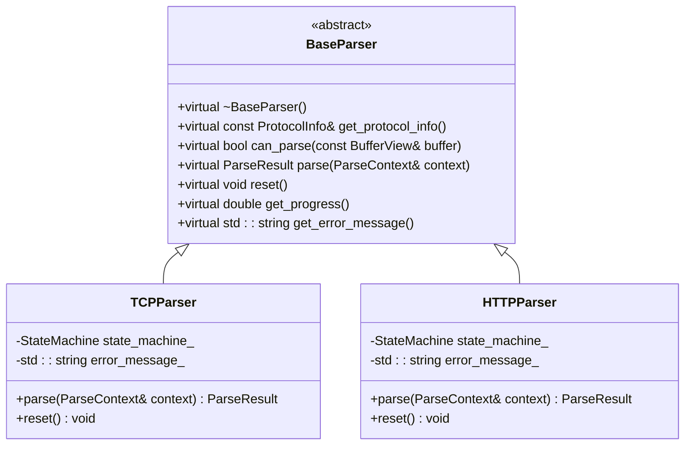

# BaseParser API参考

<cite>
**本文档中引用的文件**  
- [base_parser.hpp](file://include/parsers/base_parser.hpp#L62-L128)
- [buffer_view.hpp](file://include/core/buffer_view.hpp#L16-L100)
- [dhcp_parser.hpp](file://include/parsers/application/dhcp_parser.hpp#L190)
- [dns_parser.hpp](file://include/parsers/application/dns_parser.hpp#L87)
- [tcp_parser.hpp](file://include/parsers/transport/tcp_parser.hpp#L85)
- [udp_parser.hpp](file://include/parsers/transport/udp_parser.hpp#L33)
</cite>

## 目录
1. [简介](#简介)
2. [核心接口契约](#核心接口契约)
3. [ParseContext上下文机制](#parsecontext上下文机制)
4. [虚析构函数设计意图](#虚析构函数设计意图)
5. [继承实现标准模式](#继承实现标准模式)
6. [线程安全与异常安全](#线程安全与异常安全)

## 简介
`BaseParser` 是协议解析器的抽象基类，为所有具体协议解析器提供统一的接口契约和状态管理框架。该类采用纯虚函数定义核心行为，通过状态机机制支持复杂协议的分阶段解析，并确保多态资源释放的安全性。所有应用层、传输层、网络层和数据链路层的解析器均继承自此类，形成统一的解析器体系结构。

**Section sources**
- [base_parser.hpp](file://include/parsers/base_parser.hpp#L62-L128)

## 核心接口契约

### parse函数调用规范
`parse` 是 `BaseParser` 的核心纯虚函数，定义了解析器的基本行为契约：

- **输入参数**：`ParseContext& context`，包含待解析的数据缓冲区视图（`BufferView`）、当前解析偏移量和状态。
- **返回值**：`ParseResult` 枚举类型，表示解析结果状态。
- **消耗字节数语义**：通过 `context.offset` 的更新反映已消耗的字节数，调用方根据此值判断有效载荷起始位置。
- **解析状态语义**：`ParseResult` 包含多种状态，用于精确描述解析过程中的各种情况。



**Diagram sources**
- [base_parser.hpp](file://include/parsers/base_parser.hpp#L18-L25)
- [base_parser.hpp](file://include/parsers/base_parser.hpp#L62-L128)

### ParseResult语义定义
`ParseResult` 枚举定义了所有可能的解析结果状态，其语义如下：

| 枚举值 | 语义说明 |
|--------|----------|
| `Success` | 解析成功完成，数据格式正确 |
| `NeedMoreData` | 当前数据不足，需要更多输入数据 |
| `InvalidFormat` | 数据格式错误，无法继续解析 |
| `UnsupportedVersion` | 协议版本不支持 |
| `BufferTooSmall` | 缓冲区大小不足以容纳完整数据包 |
| `InternalError` | 解析器内部发生不可恢复错误 |

**Section sources**
- [base_parser.hpp](file://include/parsers/base_parser.hpp#L18-L25)

## ParseContext上下文机制

### 上下文对象结构
`ParseContext` 结构体在解析过程中作为状态载体，贯穿整个解析流程：

```cpp
struct ParseContext {
    BufferView buffer;                    // 数据缓冲区视图
    size_t offset = 0;                   // 当前解析偏移
    ParserState state = ParserState::Initial; // 当前解析状态
    std::unordered_map<std::string, std::any> metadata; // 元数据容器
};
```

**Section sources**
- [base_parser.hpp](file://include/parsers/base_parser.hpp#L51-L56)

### 元数据传递机制
`metadata` 字段用于在解析器之间传递协议栈层级信息、时间戳等上下文数据：

- **协议栈层级信息**：通过键如 `"layer"` 存储当前协议在OSI模型中的层级
- **时间戳信息**：通过键如 `"timestamp"` 存储数据包捕获时间
- **会话上下文**：在TCP流重组等场景中传递会话状态
- **性能监控数据**：注入解析耗时等监控指标

该机制支持跨层解析协作，例如IPv4解析器可将TTL值注入元数据供上层应用使用。

```mermaid
flowchart TD
A[数据包捕获] --> B[EthernetParser]
B --> C[IPv4Parser]
B --> |注入"src_mac", "dst_mac"| C
C --> D[TCPParser]
C --> |注入"ttl", "protocol"| D
D --> E[HTTPParser]
D --> |注入"src_port", "dst_port"| E
E --> F[解析完成]
```

**Diagram sources**
- [base_parser.hpp](file://include/parsers/base_parser.hpp#L51-L56)
- [ethernet_parser.hpp](file://include/parsers/datalink/ethernet_parser.hpp#L101)
- [ipv4_parser.hpp](file://include/parsers/network/ipv4_parser.hpp#L146)

## 虚析构函数设计意图
`BaseParser` 定义了虚析构函数 `virtual ~BaseParser() = default;`，其设计意图包括：

- **支持多态资源释放**：确保通过基类指针删除派生类对象时能正确调用派生类的析构函数
- **RAII资源管理**：允许派生类在析构函数中释放独占资源（如内存缓冲区、文件句柄等）
- **智能指针兼容性**：与 `std::unique_ptr<BaseParser>` 等智能指针无缝协作
- **异常安全保证**：默认析构函数不会抛出异常，符合C++异常安全规范

此设计使得解析器对象可以在工厂模式、注册表模式等场景下安全地进行动态创建和销毁。

**Section sources**
- [base_parser.hpp](file://include/parsers/base_parser.hpp#L62)

## 继承实现标准模式

### 基本继承结构
所有具体解析器均通过公有继承 `BaseParser` 实现：

```cpp
class TCPParser : public BaseParser {
public:
    const ProtocolInfo& get_protocol_info() const noexcept override;
    bool can_parse(const BufferView& buffer) const noexcept override;
    ParseResult parse(ParseContext& context) noexcept override;
    void reset() noexcept override;
};
```

**Section sources**
- [tcp_parser.hpp](file://include/parsers/transport/tcp_parser.hpp#L85)
- [udp_parser.hpp](file://include/parsers/transport/udp_parser.hpp#L33)

### 状态维护与不完整数据处理
继承类应利用基类提供的 `StateMachine` 机制维护解析状态：

- **状态转换**：通过 `state_machine_.set_state()` 更新解析状态
- **错误处理**：设置 `error_message_` 字段记录错误详情
- **不完整数据包策略**：返回 `ParseResult::NeedMoreData` 并保持当前状态，等待更多数据输入
- **进度报告**：重写 `get_progress()` 提供解析进度反馈



**Diagram sources**
- [base_parser.hpp](file://include/parsers/base_parser.hpp#L62-L128)
- [tcp_parser.hpp](file://include/parsers/transport/tcp_parser.hpp#L85)
- [http_parser.hpp](file://include/parsers/application/http_parser.hpp#L73)

## 线程安全与异常安全

### 线程安全约束
`BaseParser` 接口设计遵循以下线程安全原则：

- **无内部共享状态**：除 `error_message_` 外，状态信息存储在 `ParseContext` 中，支持多线程并发使用
- **const方法线程安全**：`get_protocol_info()` 和 `can_parse()` 可在多线程环境下安全调用
- **实例级独占访问**：单个解析器实例不应被多个线程同时调用 `parse()` 方法
- **状态隔离**：每个解析上下文独立，避免跨上下文状态污染

### 异常安全保证
接口提供以下异常安全保证：

- **noexcept规范**：所有接口标记为 `noexcept`，确保不会抛出异常
- **错误码返回**：使用 `ParseResult` 枚举替代异常传递错误信息
- **状态一致性**：在错误状态下保持对象可重用，通过 `reset()` 恢复初始状态
- **资源安全**：虚析构函数确保资源正确释放，符合RAII原则

这些设计确保了解析器在高并发、长时间运行的网络监控场景下的稳定性和可靠性。

**Section sources**
- [base_parser.hpp](file://include/parsers/base_parser.hpp#L62-L128)
- [buffer_view.hpp](file://include/core/buffer_view.hpp#L16-L100)