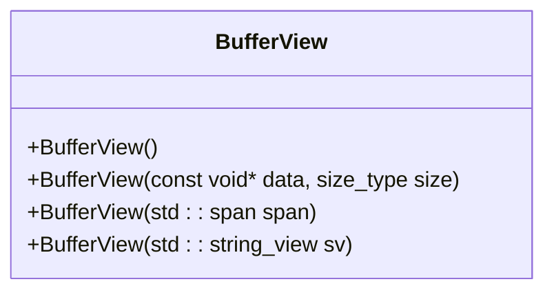
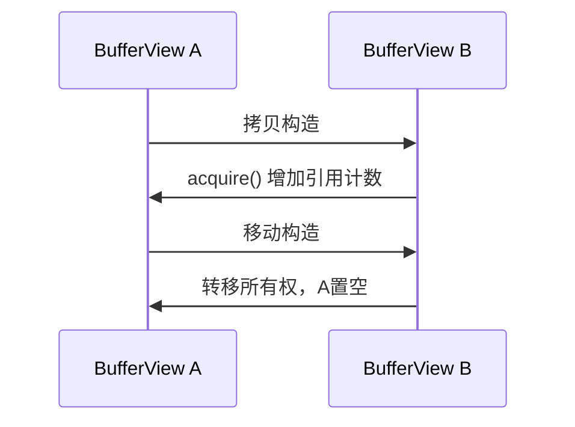
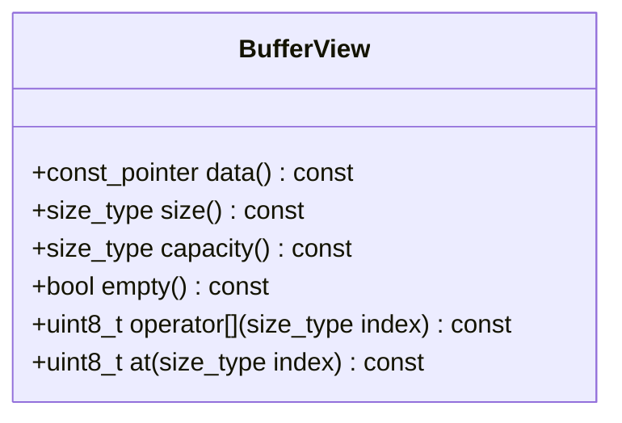
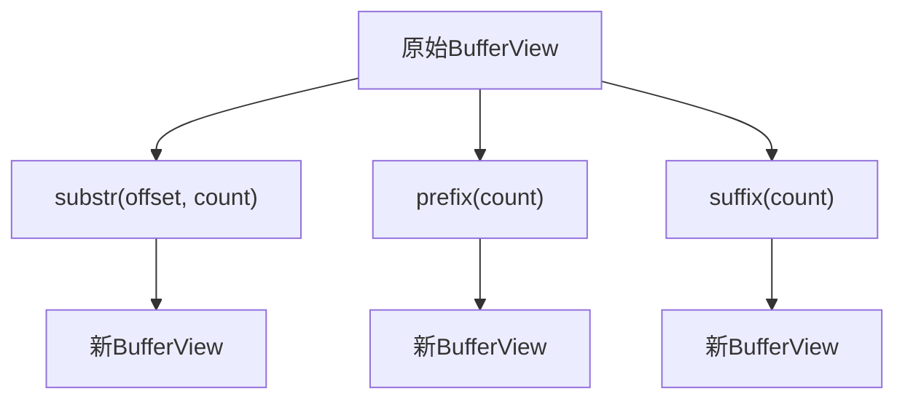
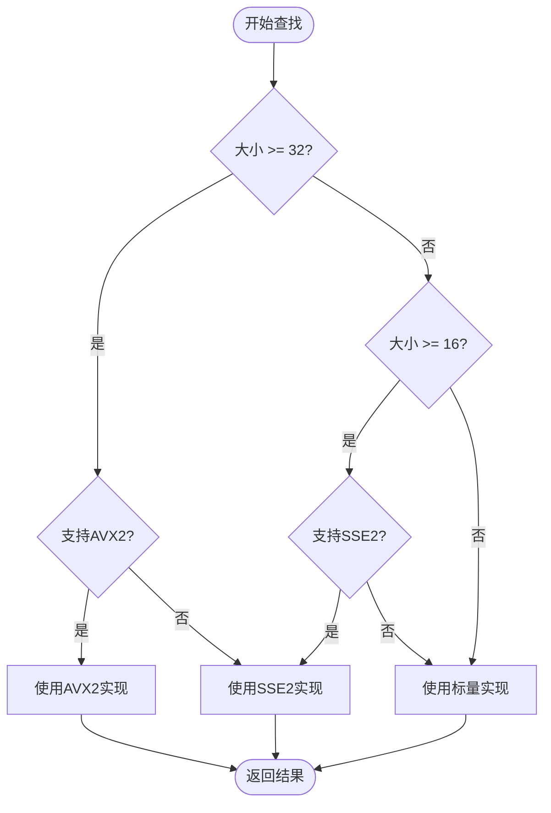
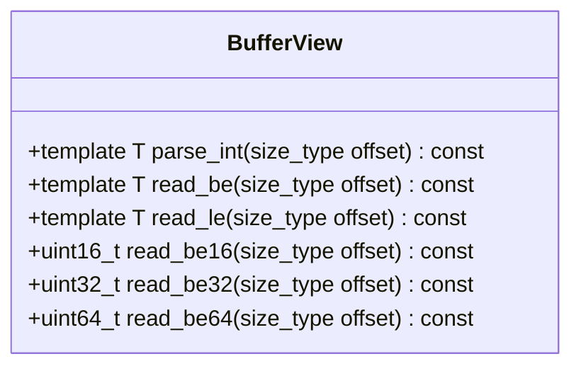
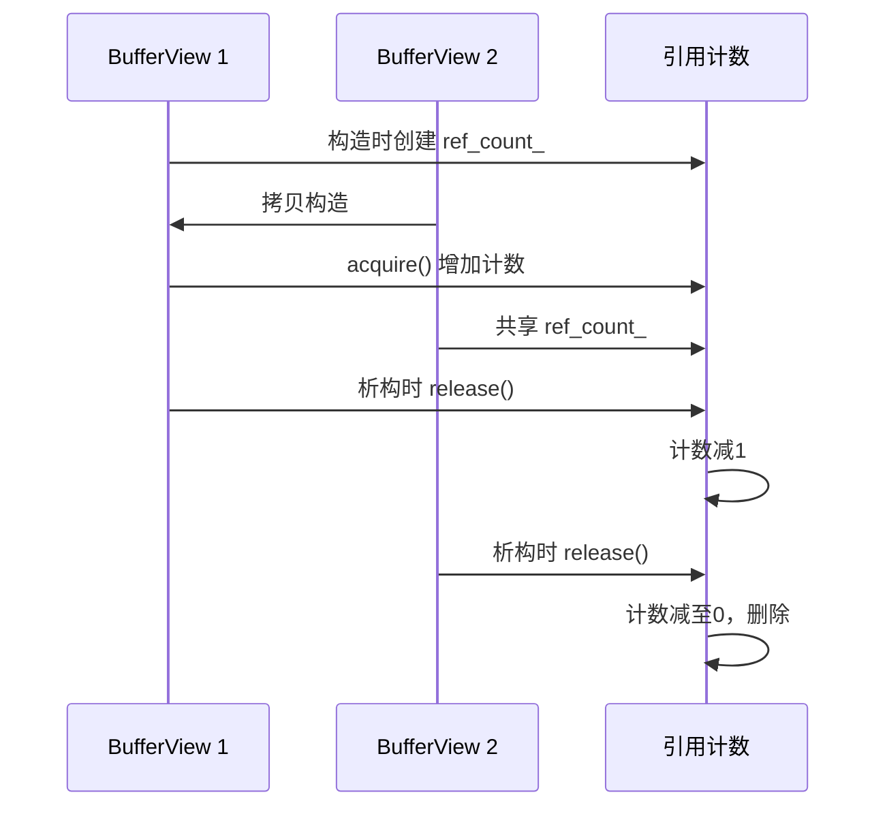
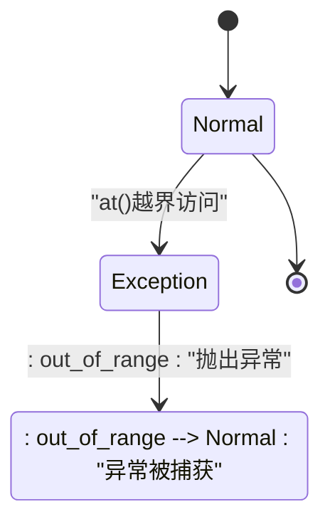
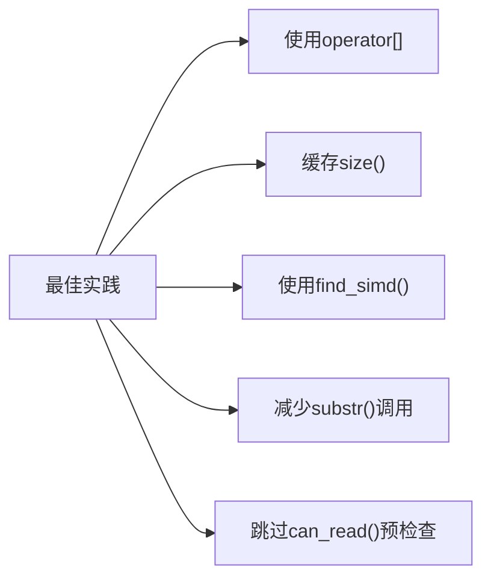
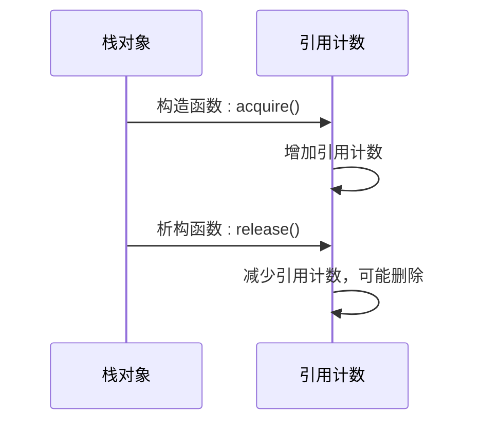

# BufferView API参考

<cite>
**本文档中引用的文件**   
- [buffer_view.hpp](file://include/core/buffer_view.hpp)
- [buffer_view.cpp](file://src/core/buffer_view.cpp)
- [live_capture.cpp](file://examples/live_capture.cpp)
- [icmp_parser.cpp](file://src/parsers/network/icmp_parser.cpp)
</cite>

## 目录
1. [简介](#简介)
2. [设计目的与核心作用](#设计目的与核心作用)
3. [构造函数](#构造函数)
4. [拷贝与移动语义](#拷贝与移动语义)
5. [数据访问接口](#数据访问接口)
6. [子视图创建](#子视图创建)
7. [SIMD加速查找](#simd加速查找)
8. [类型安全解析](#类型安全解析)
9. [安全移动与边界检查](#安全移动与边界检查)
10. [与C++20 span的集成](#与c20-span的集成)
11. [内存安全保证](#内存安全保证)
12. [异常行为](#异常行为)
13. [性能最佳实践](#性能最佳实践)
14. [RAII资源管理](#raii资源管理)
15. [使用示例](#使用示例)

## 简介
`BufferView` 是一个高性能的零拷贝缓冲区视图类，专为网络协议解析场景设计。它提供对原始数据的安全、高效访问，同时避免不必要的内存复制。该类支持C++20 `std::span` 集成、SIMD加速查找和引用计数管理，确保在复杂解析链中的内存安全和性能最优。

**Section sources**
- [buffer_view.hpp](file://include/core/buffer_view.hpp#L1-L137)
- [buffer_view.cpp](file://src/core/buffer_view.cpp#L1-L325)

## 设计目的与核心作用
`BufferView` 的设计目的是为网络协议解析器提供一种安全、高效的零拷贝数据访问机制。其核心作用包括：
- 实现零拷贝数据传递，避免内存复制开销
- 提供类型安全的数据解析接口
- 支持SIMD指令集加速模式匹配
- 通过引用计数管理生命周期，防止数据悬垂
- 与C++20 `std::span` 无缝集成，符合现代C++实践

该类在协议解析链中作为数据视图的统一接口，允许各层解析器安全地共享和操作数据片段。

**Section sources**
- [buffer_view.hpp](file://include/core/buffer_view.hpp#L1-L137)

## 构造函数
`BufferView` 提供多种构造方式以适应不同场景：

- `BufferView()`：默认构造函数，创建空视图
- `BufferView(const void* data, size_type size)`：从原始指针和大小构造
- `BufferView(std::span<const uint8_t> span)`：从`std::span`构造
- `BufferView(std::string_view sv)`：从`std::string_view`构造

所有构造函数均为`noexcept`，确保不会抛出异常。



**Diagram sources**
- [buffer_view.hpp](file://include/core/buffer_view.hpp#L25-L35)
- [buffer_view.cpp](file://src/core/buffer_view.cpp#L45-L60)

## 拷贝与移动语义
`BufferView` 实现了完整的拷贝和移动语义：

- 拷贝构造函数：增加引用计数，实现共享所有权
- 移动构造函数：转移所有权，源对象变为无效状态
- 拷贝赋值运算符：先释放原资源，再进行拷贝
- 移动赋值运算符：先释放原资源，再进行移动

所有操作均为`noexcept`，确保异常安全。



**Diagram sources**
- [buffer_view.hpp](file://include/core/buffer_view.hpp#L37-L42)
- [buffer_view.cpp](file://src/core/buffer_view.cpp#L62-L105)

## 数据访问接口
`BufferView` 提供多种数据访问方法：

- `data()`：返回指向数据的指针
- `size()`：返回当前视图大小
- `capacity()`：返回原始容量
- `empty()`：检查视图是否为空
- `operator[]`：无边界检查的索引访问
- `at()`：带边界检查的索引访问



**Diagram sources**
- [buffer_view.hpp](file://include/core/buffer_view.hpp#L44-L54)
- [buffer_view.cpp](file://src/core/buffer_view.cpp#L107-L132)

## 子视图创建
`BufferView` 支持创建子视图而无需数据复制：

- `substr(offset, count)`：创建指定偏移和长度的子视图
- `prefix(count)`：创建前缀子视图
- `suffix(count)`：创建后缀子视图

这些操作返回新的`BufferView`实例，共享底层数据但具有独立的引用计数。



**Diagram sources**
- [buffer_view.hpp](file://include/core/buffer_view.hpp#L56-L58)
- [buffer_view.cpp](file://src/core/buffer_view.cpp#L134-L154)

## SIMD加速查找
`BufferView` 利用SIMD指令集实现高性能查找：

- `find_simd(byte)`：查找单字节模式
- `find_simd(pattern, size)`：查找多字节模式
- 自动检测CPU特性（AVX2/SSE2）并选择最优实现



**Diagram sources**
- [buffer_view.hpp](file://include/core/buffer_view.hpp#L60-L61)
- [buffer_view.cpp](file://src/core/buffer_view.cpp#L156-L248)

## 类型安全解析
`BufferView` 提供类型安全的整数解析方法：

- `parse_int<T>(offset)`：按指定类型和偏移解析整数
- `read_be<T>(offset)`：大端序读取
- `read_le<T>(offset)`：小端序读取
- 提供便捷方法如`read_be16`、`read_le32`等



**Diagram sources**
- [buffer_view.hpp](file://include/core/buffer_view.hpp#L63-L77)
- [buffer_view.cpp](file://src/core/buffer_view.cpp#L250-L270)

## 安全移动与边界检查
`BufferView` 提供安全的数据访问保障：

- `safe_advance(count)`：安全前进指定字节数
- `can_read(count, offset)`：检查是否可读取指定字节数
- `at(index)`：带边界检查的访问，越界时抛出异常

```mermaid
flowchart TD
Start([开始读取]) --> CheckAccess{"访问方式"}
CheckAccess --> |operator[]| DirectAccess[直接访问，无检查]
CheckAccess --> |at()| CheckBounds["检查 index < size"]
CheckBounds --> |是| SafeAccess[安全访问]
CheckBounds --> |否| ThrowException["抛出std::out_of_range"]
CheckAccess --> |can_read()| CheckCapacity["检查 offset+count <= size"]
CheckCapacity --> |是| CanRead[可以读取]
CheckCapacity --> |否| CannotRead[无法读取]
```

**Diagram sources**
- [buffer_view.hpp](file://include/core/buffer_view.hpp#L79-L80)
- [buffer_view.cpp](file://src/core/buffer_view.cpp#L272-L288)

## 与C++20 span的集成
`BufferView` 与`std::span`无缝集成：

- 可从`std::span`构造
- 可转换为`std::span`通过`as_span()`
- 共享相同的零拷贝设计理念
- 提供比`std::span`更丰富的协议解析专用方法

```mermaid
classDiagram
class std : : span {
+T* data()
+size_t size()
}
class BufferView {
+const uint8_t* data()
+size_t size()
+std : : span<const uint8_t> as_span()
}
BufferView --> std : : span : "可转换为"
std : : span --> BufferView : "可构造自"
```

**Diagram sources**
- [buffer_view.hpp](file://include/core/buffer_view.hpp#L82-L83)
- [buffer_view.cpp](file://src/core/buffer_view.cpp#L290-L298)

## 内存安全保证
`BufferView` 通过以下机制确保内存安全：

- 引用计数管理：`acquire()`和`release()`方法管理生命周期
- 零拷贝设计：避免不必要的内存复制
- 边界检查：`at()`方法提供运行时边界检查
- `noexcept`保证：大多数操作不会抛出异常



**Diagram sources**
- [buffer_view.hpp](file://include/core/buffer_view.hpp#L85-L87)
- [buffer_view.cpp](file://src/core/buffer_view.cpp#L290-L325)

## 异常行为
`BufferView` 的异常行为如下：

- `at(index)`：当索引越界时抛出`std::out_of_range`
- 其他所有方法均为`noexcept`
- 构造函数不会抛出异常
- 移动操作不会抛出异常



**Diagram sources**
- [buffer_view.cpp](file://src/core/buffer_view.cpp#L128-L132)

## 性能最佳实践
使用`BufferView`的性能最佳实践：

- 优先使用`operator[]`而非`at()`以避免边界检查开销
- 在循环中缓存`size()`结果
- 使用`find_simd()`进行模式匹配
- 避免频繁创建子视图，重用现有视图
- 在已知数据有效时使用`parse_int`而非`can_read`预检查



**Section sources**
- [buffer_view.hpp](file://include/core/buffer_view.hpp#L1-L137)
- [buffer_view.cpp](file://src/core/buffer_view.cpp#L1-L325)

## RAII资源管理
`BufferView` 遵循RAII原则：

- 构造时获取资源（引用计数）
- 析构时释放资源（引用计数）
- 异常安全：即使抛出异常也能正确释放
- 自动管理生命周期，无需手动释放



**Section sources**
- [buffer_view.hpp](file://include/core/buffer_view.hpp#L43-L43)
- [buffer_view.cpp](file://src/core/buffer_view.cpp#L105-L105)

## 使用示例
在协议解析链中安全传递数据视图的示例：

```cpp
// 从原始数据创建BufferView
BufferView buffer(packet_data, packet_len);

// 创建网络层视图
BufferView network_buffer = buffer.substr(eth_header_size);

// 解析IPv4头部
IPv4Header header = network_buffer.parse_int<IPv4Header>();

// 创建传输层视图
BufferView transport_buffer = network_buffer.substr(ip_header_len);

// 安全检查
if (transport_buffer.can_read(sizeof(TCPHeader))) {
    TCPHeader tcp_header = transport_buffer.read_be<TCPHeader>();
}
```

此示例展示了如何在解析链中安全地传递和操作数据视图，避免数据悬垂。

**Section sources**
- [live_capture.cpp](file://examples/live_capture.cpp#L455-L470)
- [icmp_parser.cpp](file://src/parsers/network/icmp_parser.cpp#L129-L129)