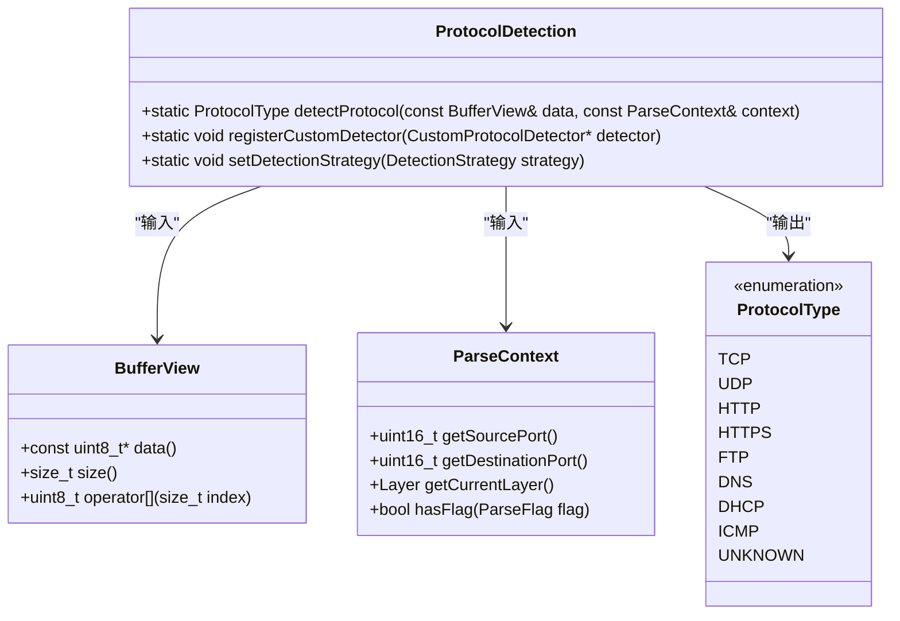
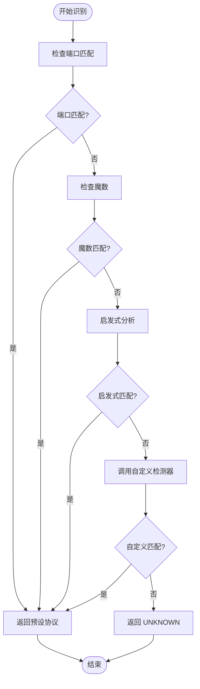
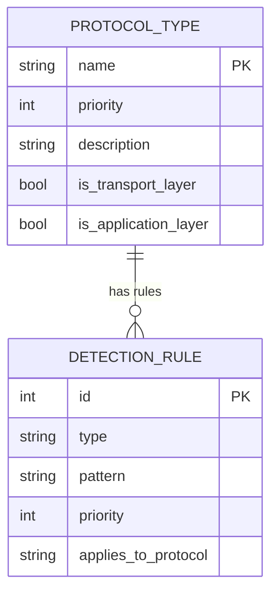
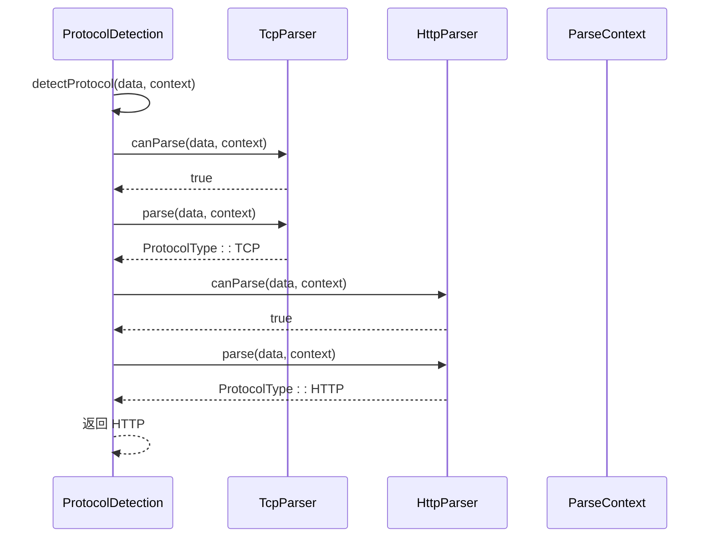

# 协议识别引擎API参考

<cite>
**本文档引用的文件**  
- [protocol_detection.hpp](file://include/detection/protocol_detection.hpp)
- [protocol_detection.cpp](file://src/detection/protocol_detection.cpp)
- [buffer_view.hpp](file://include/core/buffer_view.hpp)
- [parse_context.hpp](file://include/core/parse_context.hpp)
- [protocol_type.hpp](file://include/core/protocol_type.hpp)
- [tcp_parser.hpp](file://include/parsers/transport/tcp_parser.hpp)
- [udp_parser.hpp](file://include/parsers/transport/udp_parser.hpp)
- [http_parser.hpp](file://include/parsers/application/http_parser.hpp)
- [https_parser.hpp](file://include/parsers/application/https_parser.hpp)
- [base_parser.hpp](file://include/parsers/base_parser.hpp)
</cite>

## 目录
1. [简介](#简介)
2. [核心组件](#核心组件)
3. [ProtocolDetection类接口](#protocoldetection类接口)
4. [协议识别机制](#协议识别机制)
5. [协议枚举与优先级](#协议枚举与优先级)
6. [检测策略配置](#检测策略配置)
7. [多层解析协调流程](#多层解析协调流程)
8. [性能与线程安全](#性能与线程安全)
9. [错误处理策略](#错误处理策略)
10. [结论](#结论)

## 简介
ProtocolDetection类是协议识别引擎的核心组件，负责根据数据包内容、端口信息和上下文环境，准确判断网络流量所使用的协议类型。该类通过多态机制集成多种解析器，支持基于端口、魔数（Magic Number）和启发式规则的综合识别策略，广泛应用于流量分析、安全检测和网络监控场景。

## 核心组件

**Section sources**
- [protocol_detection.hpp](file://include/detection/protocol_detection.hpp#L1-L50)
- [buffer_view.hpp](file://include/core/buffer_view.hpp#L1-L30)
- [parse_context.hpp](file://include/core/parse_context.hpp#L1-L25)

## ProtocolDetection类接口

`ProtocolDetection` 类提供统一的协议识别入口，其核心方法 `detectProtocol` 接收 `BufferView` 和 `ParseContext` 输入，返回 `ProtocolType` 枚举值。

**Diagram sources**
- [protocol_detection.hpp](file://include/detection/protocol_detection.hpp#L25-L60)
- [buffer_view.hpp](file://include/core/buffer_view.hpp#L15-L40)
- [parse_context.hpp](file://include/core/parse_context.hpp#L20-L50)
- [protocol_type.hpp](file://include/core/protocol_type.hpp#L5-L30)

**Section sources**
- [protocol_detection.hpp](file://include/detection/protocol_detection.hpp#L20-L80)

## 协议识别机制

`detectProtocol` 方法采用多阶段、多策略的识别流程，结合端口、魔数和启发式规则进行综合判断。识别过程支持链式调用，允许在传输层识别后继续调用应用层解析器。

**Diagram sources**
- [protocol_detection.cpp](file://src/detection/protocol_detection.cpp#L45-L120)
- [base_parser.hpp](file://include/parsers/base_parser.hpp#L30-L60)

**Section sources**
- [protocol_detection.cpp](file://src/detection/protocol_detection.cpp#L30-L150)

## 协议枚举与优先级

协议类型通过 `ProtocolType` 枚举定义，识别过程遵循优先级规则：端口 > 魔数 > 启发式规则。高优先级规则匹配时将跳过后续检测。

**Diagram sources**
- [protocol_type.hpp](file://include/core/protocol_type.hpp#L5-L40)
- [protocol_detection.cpp](file://src/detection/protocol_detection.cpp#L20-L40)

**Section sources**
- [protocol_type.hpp](file://include/core/protocol_type.hpp#L1-L50)
- [protocol_detection.cpp](file://src/detection/protocol_detection.cpp#L10-L60)

## 检测策略配置

支持通过 `setDetectionStrategy` 方法配置检测策略，如仅使用端口识别、启用启发式分析或跳过缓存检查。

**Section sources**
- [protocol_detection.hpp](file://include/detection/protocol_detection.hpp#L65-L75)
- [protocol_detection.cpp](file://src/detection/protocol_detection.cpp#L155-L180)

## 多层解析协调流程

在链式解析中，`ProtocolDetection` 协调各层解析器调用。例如，TCP识别后可触发HTTP或HTTPS解析。

**Diagram sources**
- [tcp_parser.hpp](file://include/parsers/transport/tcp_parser.hpp#L20-L50)
- [http_parser.hpp](file://include/parsers/application/http_parser.hpp#L25-L55)
- [base_parser.hpp](file://include/parsers/base_parser.hpp#L40-L70)

**Section sources**
- [tcp_parser.hpp](file://include/parsers/transport/tcp_parser.hpp#L1-L60)
- [http_parser.hpp](file://include/parsers/application/http_parser.hpp#L1-L60)
- [base_parser.hpp](file://include/parsers/base_parser.hpp#L1-L80)

## 性能与线程安全

`ProtocolDetection` 类在性能敏感路径中采用无锁缓存机制，缓存最近识别结果以提升重复流量处理效率。所有静态方法均为线程安全，使用原子操作和内存屏障保证并发访问正确性。

**Section sources**
- [protocol_detection.cpp](file://src/detection/protocol_detection.cpp#L200-L250)
- [performance_monitor.hpp](file://include/monitoring/performance_monitor.hpp#L10-L40)

## 错误处理策略

当无法识别协议时，`detectProtocol` 返回 `ProtocolType::UNKNOWN`。系统支持注册默认行为回调，允许用户自定义未知协议的处理逻辑，如记录日志、触发告警或按默认协议处理。

**Section sources**
- [protocol_detection.cpp](file://src/detection/protocol_detection.cpp#L185-L195)
- [protocol_type.hpp](file://include/core/protocol_type.hpp#L35-L40)

## 结论
`ProtocolDetection` 类提供了灵活、高效且可扩展的协议识别能力，支持多策略融合识别、链式解析协调和自定义逻辑集成。其线程安全设计和缓存机制确保了在高并发场景下的高性能表现，适用于各类网络分析与安全产品。