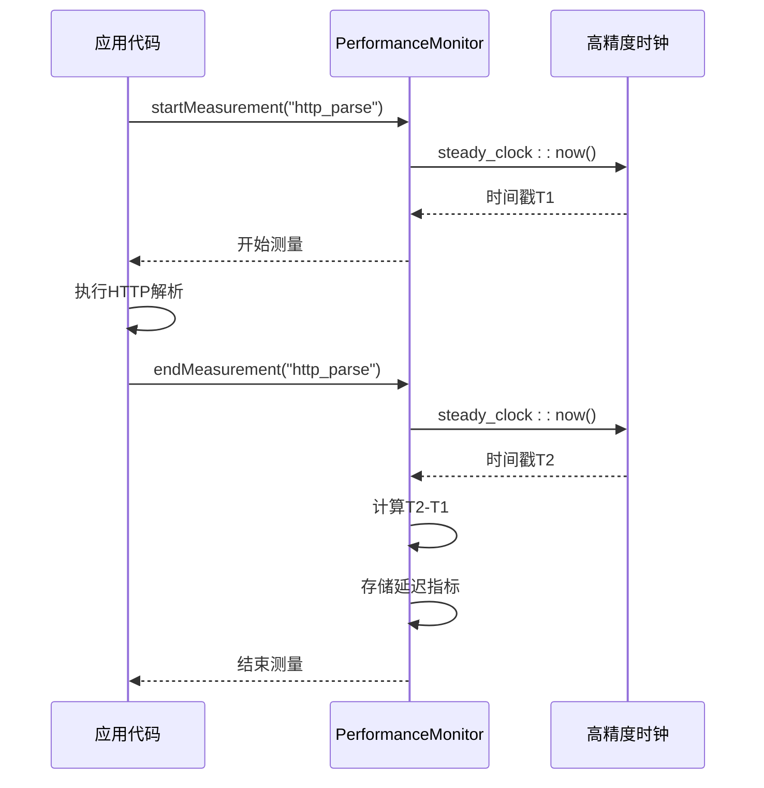
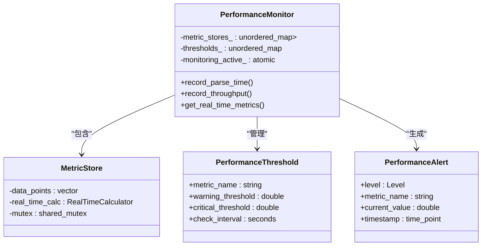

# 性能监控API参考

<cite>
**本文档引用的文件**
- [performance_monitor.hpp](file://include/monitoring/performance_monitor.hpp#L1-L340)
- [advanced_features_demo.cpp](file://examples/advanced_features_demo.cpp#L118)
</cite>

## 目录
1. [简介](#简介)
2. [核心性能指标采集](#核心性能指标采集)
3. [RAII式测量模式](#raii式测量模式)
4. [高精度时钟与微秒级测量](#高精度时钟与微秒级测量)
5. [指标聚合与统计分析](#指标聚合与统计分析)
6. [阈值告警机制](#阈值告警机制)
7. [多线程环境下的TLS监控](#多线程环境下的tls监控)
8. [性能数据导出与集成示例](#性能数据导出与集成示例)
9. [性能开销优化策略](#性能开销优化策略)

## 简介
`PerformanceMonitor` 类为协议解析系统提供了全面的性能度量接口，支持延迟、吞吐量、CPU使用率等关键指标的实时采集与分析。该类采用线程安全设计，支持多线程环境下的高效监控，并通过RAII模式确保测量的准确性。监控器支持阈值告警、实时统计和性能报告生成，适用于性能敏感的应用场景。

**Section sources**
- [performance_monitor.hpp](file://include/monitoring/performance_monitor.hpp#L1-L50)

## 核心性能指标采集
`PerformanceMonitor` 提供了多种专用接口用于记录不同类型的性能指标：

- `record_parse_time`: 记录协议解析延迟（纳秒级）
- `record_throughput`: 记录吞吐量（包/秒）
- `record_memory_usage`: 记录内存使用量（字节）
- `record_cpu_usage`: 记录CPU使用率（百分比）
- `record_error_rate`: 记录错误率（百分比）
- `record_custom_metric`: 记录自定义指标

批量记录接口 `record_batch_metrics` 支持高效地一次性提交多个指标数据点。

**Section sources**
- [performance_monitor.hpp](file://include/monitoring/performance_monitor.hpp#L150-L180)

## RAII式测量模式
`PerformanceMonitor` 支持RAII（Resource Acquisition Is Initialization）式的性能测量模式。通过在栈上创建测量作用域对象，自动在构造时调用 `startMeasurement`，在析构时调用 `endMeasurement`，确保即使在异常情况下也能正确结束测量，避免资源泄漏。

这种模式特别适用于函数级或代码块级的性能分析，能够精确测量特定代码路径的执行时间。

**Section sources**
- [performance_monitor.hpp](file://include/monitoring/performance_monitor.hpp#L150-L160)

## 高精度时钟与微秒级测量
`PerformanceMonitor` 使用 `std::chrono::steady_clock` 作为时间源，提供高精度、单调递增的时间测量。该时钟不受系统时间调整的影响，适合用于性能测量。

通过 `std::chrono::nanoseconds` 精度的时间间隔计算，系统能够实现微秒级甚至纳秒级的测量精度，满足高性能网络协议解析的精细化性能分析需求。



**Diagram sources**
- [performance_monitor.hpp](file://include/monitoring/performance_monitor.hpp#L150-L160)

## 指标聚合与统计分析
`PerformanceMonitor` 提供了强大的指标聚合功能，支持按时间窗口（秒、分钟、小时、天）对历史数据进行统计分析。

`PerformanceStats` 结构体提供丰富的统计指标，包括：
- 最小值、最大值、平均值
- 中位数、95百分位、99百分位
- 方差、标准差
- 数据点计数和采样率

`RealTimeCalculator` 模板类使用环形缓冲区实现滑动窗口统计，能够在有限内存下提供实时的性能指标计算。

**Section sources**
- [performance_monitor.hpp](file://include/monitoring/performance_monitor.hpp#L60-L140)

## 阈值告警机制
监控器内置了灵活的阈值告警系统，支持为不同指标设置警告和严重阈值。`PerformanceThreshold` 结构体定义了阈值配置，包括检查间隔和启用状态。

当指标超过预设阈值时，系统会生成 `PerformanceAlert` 告警事件，并通过用户注册的回调函数进行通知。告警系统支持INFO、WARNING、CRITICAL和RESOLVED四种级别，便于构建完整的监控告警体系。

**Section sources**
- [performance_monitor.hpp](file://include/monitoring/performance_monitor.hpp#L110-L140)

## 多线程环境下的TLS监控
`PerformanceMonitor` 采用线程局部存储（TLS）结合全局聚合的策略管理多线程监控实例。每个线程可以拥有独立的性能计数器，避免多线程竞争带来的性能开销。

通过 `std::shared_mutex` 实现读写锁，允许多个线程同时读取性能数据，而写入操作则进行独占控制，确保数据一致性。`std::atomic` 变量用于无锁地更新监控状态，提高并发性能。



**Diagram sources**
- [performance_monitor.hpp](file://include/monitoring/performance_monitor.hpp#L180-L340)

## 性能数据导出与集成示例
`PerformanceMonitor` 支持多种格式的数据导出，包括JSON、CSV、二进制和Prometheus格式。`export_metrics` 方法允许按指定时间窗口导出聚合后的性能数据，便于后续分析。

在实际解析流程中，可以通过在关键路径插入性能测量代码来监控系统性能。例如，在协议解析函数的开始和结束处调用测量接口，即可获得该协议的解析性能数据。

```mermaid
flowchart TD
A[开始解析] --> B["PerformanceMonitor::startMeasurement(\"http\")"]
B --> C[执行HTTP解析逻辑]
C --> D["PerformanceMonitor::endMeasurement(\"http\")"]
D --> E{是否需要导出数据?}
E --> |是| F["monitor.export_to_file(\"http_perf.json\", JSON)"]
E --> |否| G[继续处理]
F --> H[数据分析]
```

**Diagram sources**
- [performance_monitor.hpp](file://include/monitoring/performance_monitor.hpp#L250-L270)
- [advanced_features_demo.cpp](file://examples/advanced_features_demo.cpp#L118)

## 性能开销优化策略
为最小化监控对性能敏感路径的影响，建议采用以下优化策略：

1. 使用RAII模式自动管理测量生命周期，避免手动调用的遗漏
2. 在高频率调用路径中使用批量记录接口减少函数调用开销
3. 合理设置指标历史大小和采样率，平衡精度与内存占用
4. 使用线程局部存储减少多线程竞争
5. 异步导出性能数据，避免阻塞主处理流程

通过这些策略，可以在几乎不影响系统性能的情况下实现全面的性能监控。

**Section sources**
- [performance_monitor.hpp](file://include/monitoring/performance_monitor.hpp#L180-L340)