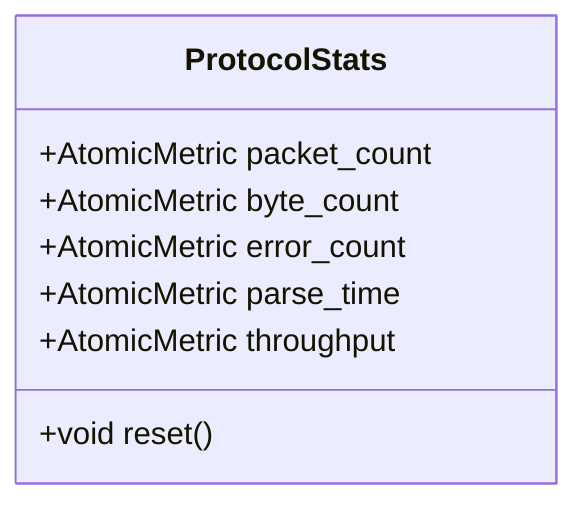
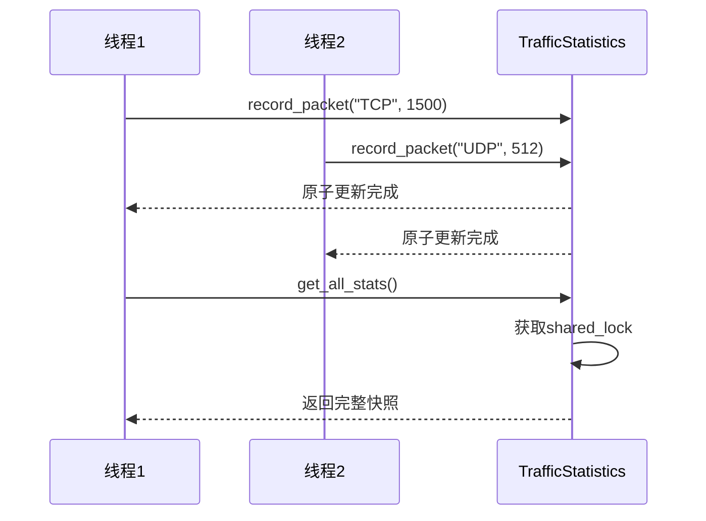
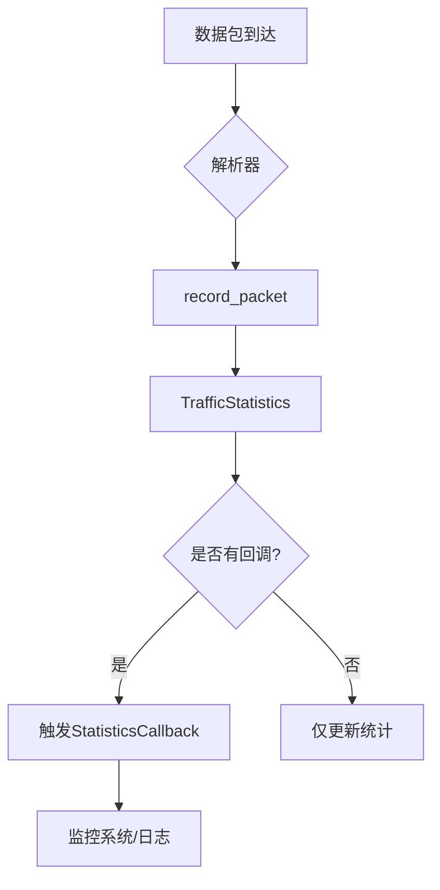

# 流量统计API参考

<cite>
**本文档引用的文件**
- [traffic_statistics.hpp](file://include/statistics/traffic_statistics.hpp)
- [traffic_statistics.cpp](file://src/statistics/traffic_statistics.cpp)
- [base_parser.hpp](file://include/parsers/base_parser.hpp)
</cite>

## 目录
1. [简介](#简介)
2. [核心统计接口](#核心统计接口)
3. [数据结构定义](#数据结构定义)
4. [线程安全与无锁设计](#线程安全与无锁设计)
5. [时间窗口与性能指标](#时间窗口与性能指标)
6. [重置与聚合操作](#重置与聚合操作)
7. [与ParseContext集成](#与parsecontext集成)
8. [高并发最佳实践](#高并发最佳实践)
9. [导出与监控功能](#导出与监控功能)

## 简介
`TrafficStatistics` 类为协议解析系统提供高性能的流量统计功能，支持数据包计数、字节流量汇总、协议分布统计等核心指标的实时记录与查询。该类采用无锁设计，在高并发场景下仍能保持优异性能，同时提供线程安全的统计快照获取机制。统计系统与解析上下文紧密集成，可精确追踪各协议层的解析行为。

**Section sources**
- [traffic_statistics.hpp](file://include/statistics/traffic_statistics.hpp#L117-L214)

## 核心统计接口

### 数据记录接口
`TrafficStatistics` 提供多个 `noexcept` 接口用于记录解析结果：
- `record_packet`: 记录指定协议的数据包数量和字节大小
- `record_parse_time`: 记录协议解析耗时（纳秒级）
- `record_error`: 记录协议解析错误次数
- `record_throughput`: 记录协议吞吐量（Mbps）

这些接口均采用原子操作实现，确保在多线程环境下的数据一致性。

### 批量统计接口
为优化高吞吐场景性能，提供模板化批量记录接口：
```cpp
template<TimestampType T>
void record_batch(std::span<const std::pair<std::string, size_t>> packets, 
                 std::chrono::time_point<...> timestamp) noexcept;
```
该接口支持一次性处理多个数据包记录，显著降低函数调用开销。

**Section sources**
- [traffic_statistics.hpp](file://include/statistics/traffic_statistics.hpp#L134-L143)
- [traffic_statistics.cpp](file://src/statistics/traffic_statistics.cpp#L20-L49)

## 数据结构定义

### ProtocolStats 结构
核心统计项封装在 `ProtocolStats` 结构中，包含以下原子度量：
- `packet_count`: 数据包计数器
- `byte_count`: 字节流量计数器
- `error_count`: 错误计数器
- `parse_time`: 解析时间直方图
- `throughput`: 吞吐速率统计



**Diagram sources**
- [traffic_statistics.hpp](file://include/statistics/traffic_statistics.hpp#L98-L107)

### AtomicMetric 原子度量类
`AtomicMetric` 类采用 `alignas(64)` 内存对齐，避免伪共享，包含：
- `value_`: 主值原子变量
- `count_`: 观察次数计数器
- `sum_squares_`: 平方和（用于方差计算）
支持计数器、测量值、直方图等多种度量类型。

**Section sources**
- [traffic_statistics.hpp](file://include/statistics/traffic_statistics.hpp#L58-L107)

## 线程安全与无锁设计

### 无锁更新策略
统计更新采用 `std::memory_order_relaxed` 内存序，最大化性能：
- 所有计数器更新使用 `fetch_add/fetch_sub`
- 总量统计通过原子变量维护
- 读写分离：写操作使用共享锁，读操作使用共享锁

### 统计快照获取
`getStatisticsSnapshot` 通过 `get_all_stats()` 获取线程安全的统计快照：
- 使用 `std::shared_lock` 保证读取一致性
- 返回 `std::vector<std::pair<std::string, ProtocolStats>>`
- 结果按协议名称排序以保证一致性



**Diagram sources**
- [traffic_statistics.hpp](file://include/statistics/traffic_statistics.hpp#L156-L161)
- [traffic_statistics.cpp](file://src/statistics/traffic_statistics.cpp#L70-L85)

## 时间窗口与性能指标

### 时间窗口统计
`get_time_window_stats` 方法返回指定时间窗口内的统计信息：
- 输入参数为 `std::chrono::seconds` 类型的窗口大小
- 返回 `TimeWindowStats` 结构，包含起止时间和性能指标
- 当前实现基于全量统计，生产环境建议维护时间序列数据

### 性能指标计算
`PerformanceMetrics` 结构提供系统级性能指标：
- `packets_per_second`: 每秒包数
- `bytes_per_second`: 每秒字节数
- `average_packet_size`: 平均包大小
- `error_rate`: 错误率
- `average_parse_time`: 平均解析时间

**Section sources**
- [traffic_statistics.hpp](file://include/statistics/traffic_statistics.hpp#L163-L186)

## 重置与聚合操作

### 重置操作
提供多种重置接口：
- `reset_all_stats()`: 重置所有统计项，重新开始计时
- `reset_protocol_stats(protocol)`: 重置特定协议统计
- `cleanup_inactive_protocols(threshold)`: 清理非活跃协议（包计数为0）

### 聚合实例
多个 `TrafficStatistics` 实例可通过导出数据进行聚合分析，或通过回调机制实现分布式统计汇总。

**Section sources**
- [traffic_statistics.hpp](file://include/statistics/traffic_statistics.hpp#L195-L201)
- [traffic_statistics.cpp](file://src/statistics/traffic_statistics.cpp#L140-L165)

## 与ParseContext集成

### 数据关联方式
`ParseContext` 中的元数据字段可用于关联统计信息：
```cpp
struct ParseContext {
    BufferView buffer;
    size_t offset = 0;
    ParserState state = ParserState::Initial;
    std::unordered_map<std::string, std::any> metadata;
};
```
解析器可在 `metadata` 中存储协议类型、会话ID等信息，供统计系统使用。

### 集成示例
```cpp
// 在解析器中
context.metadata["protocol"] = "HTTP";
// 在统计系统中
auto protocol = std::any_cast<std::string>(context.metadata["protocol"]);
stats.record_packet(protocol, packet_size);
```

**Section sources**
- [base_parser.hpp](file://include/parsers/base_parser.hpp#L51-L56)

## 高并发最佳实践

### 无锁更新示例
```cpp
// 推荐：批量处理
std::vector<std::pair<std::string, size_t>> batch;
// ... 收集解析结果
traffic_stats.record_batch(batch, timestamp);

// 推荐：直接调用原子接口
traffic_stats.record_packet("TCP", 1500);
traffic_stats.record_parse_time("TCP", duration);
```

### 性能优化建议
1. 尽量使用 `record_batch` 进行批量更新
2. 避免频繁调用 `get_all_stats()`，可缓存结果
3. 合理设置 `max_protocols` 构造参数
4. 使用 `noexcept` 接口避免异常开销

**Section sources**
- [traffic_statistics.cpp](file://src/statistics/traffic_statistics.cpp#L100-L130)

## 导出与监控功能

### 多格式导出
支持多种格式导出统计信息：
- JSON: 结构化数据，适合API传输
- CSV: 表格数据，适合数据分析
- Prometheus: 监控系统专用格式
- BINARY: 二进制格式（当前简化为JSON）

### 实时监控钩子
提供回调机制实现实时监控：
```cpp
using StatisticsCallback = std::function<void(const std::string&, const ProtocolStats&)>;
void set_statistics_callback(StatisticsCallback callback) noexcept;
```
可用于实现实时仪表盘、告警系统等。



**Diagram sources**
- [traffic_statistics.hpp](file://include/statistics/traffic_statistics.hpp#L203-L214)
- [traffic_statistics.cpp](file://src/statistics/traffic_statistics.cpp#L240-L255)