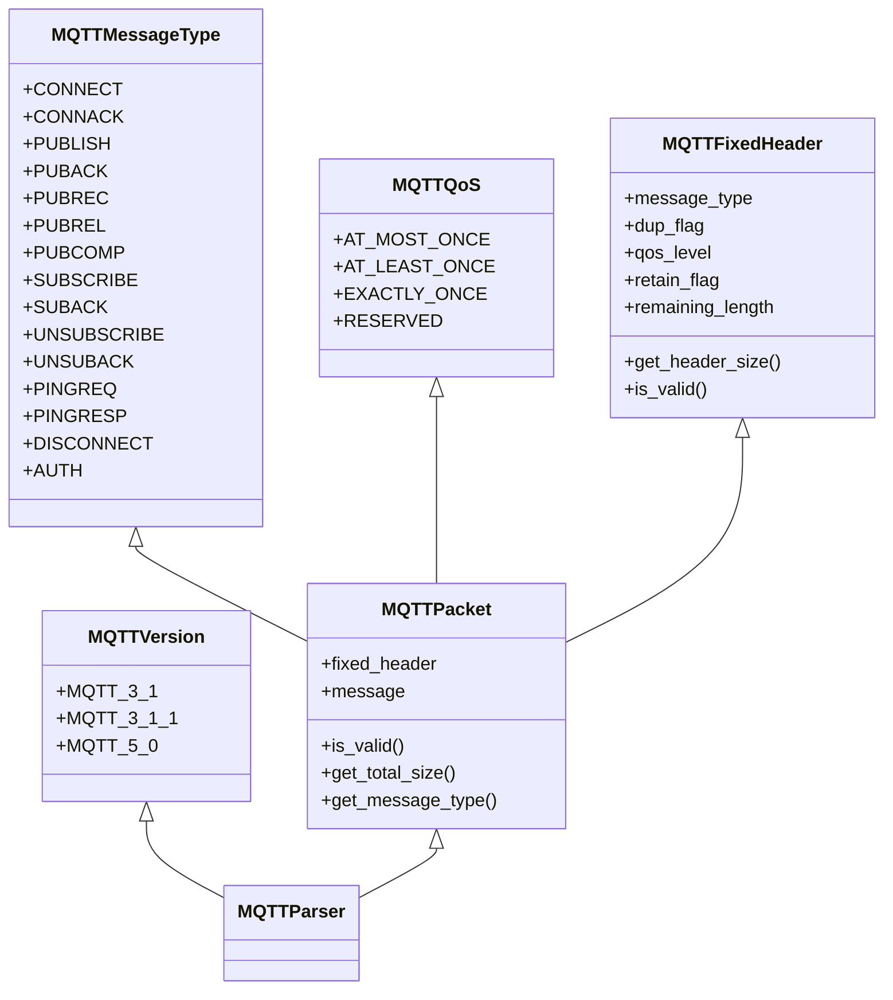
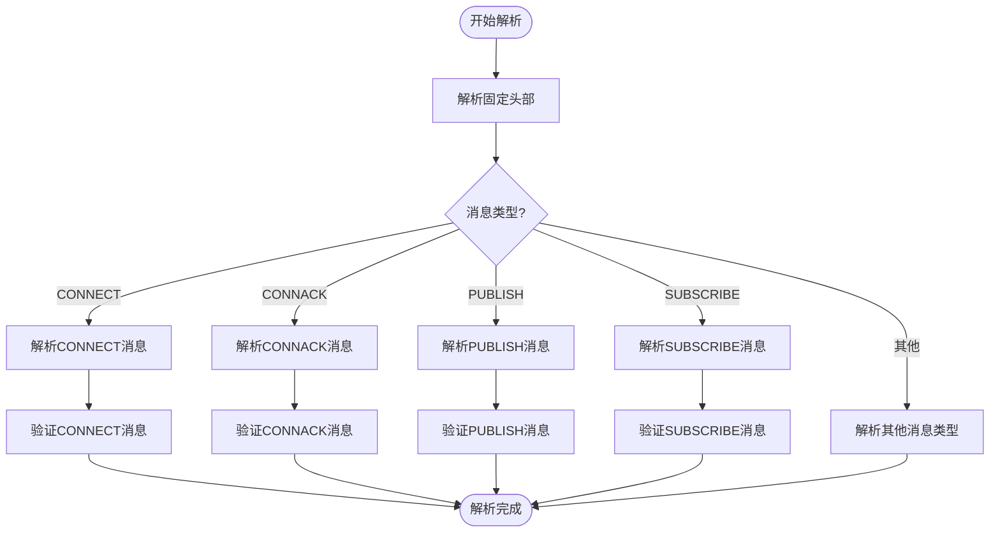
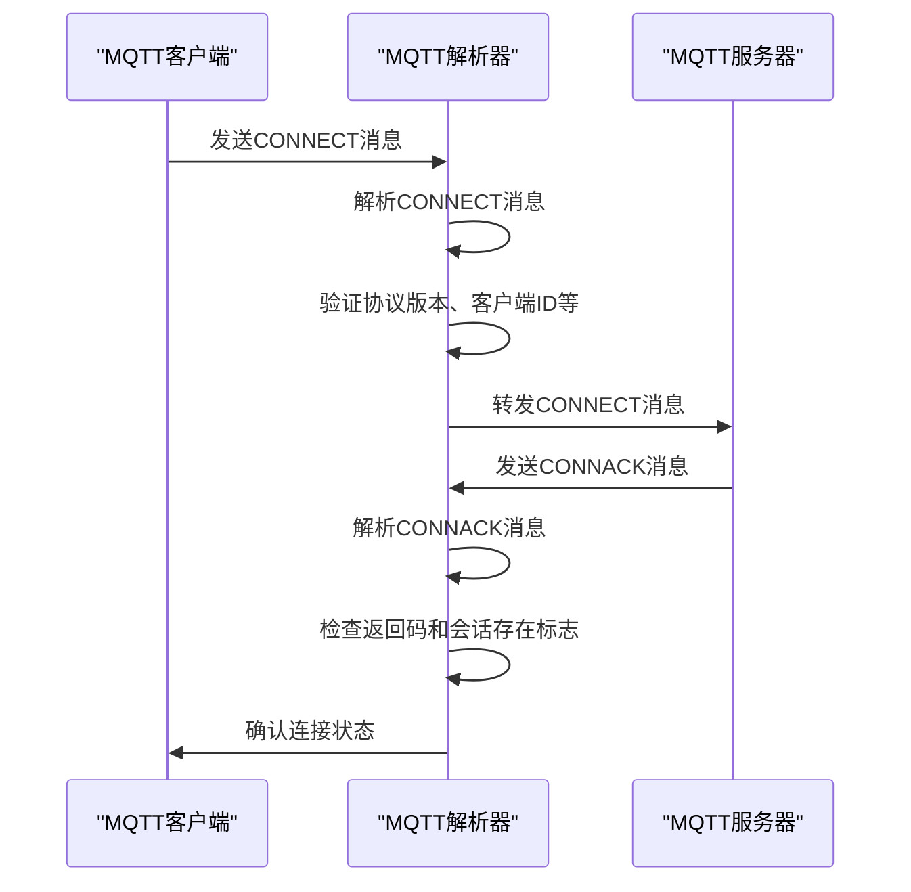
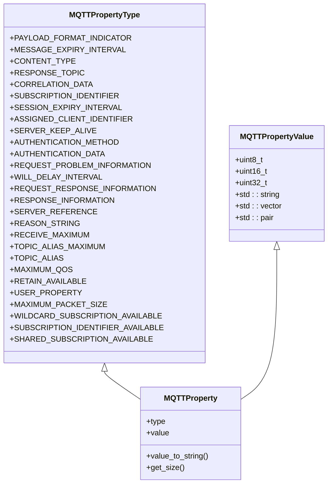
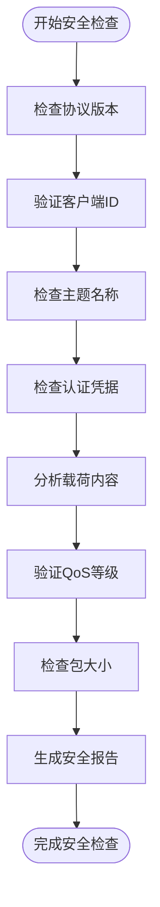
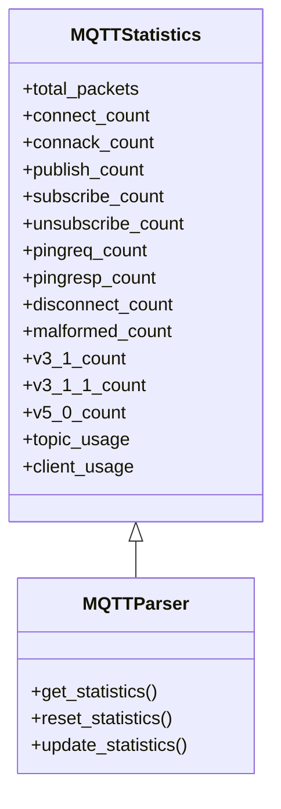

# MQTT协议解析器

<cite>
**本文档引用的文件**   
- [mqtt_parser.hpp](file://include/parsers/application/mqtt_parser.hpp)
- [mqtt_parser.cpp](file://src/parsers/application/mqtt_parser.cpp)
- [comprehensive_demo.cpp](file://examples/comprehensive_demo.cpp)
</cite>

## 目录
1. [项目结构](#项目结构)
2. [核心组件](#核心组件)
3. [MQTT协议解析](#mqtt协议解析)
4. [连接流程](#连接流程)
5. [属性处理](#属性处理)
6. [安全检查](#安全检查)
7. [统计功能](#统计功能)
8. [使用示例](#使用示例)

## 项目结构

根据项目目录结构，MQTT协议解析器位于`include/parsers/application/`和`src/parsers/application/`目录下，与其他应用层协议解析器并列。该解析器遵循统一的解析器架构，继承自`BaseParser`基类，实现了完整的MQTT协议解析功能。

**Section sources**
- [mqtt_parser.hpp](file://include/parsers/application/mqtt_parser.hpp)

## 核心组件

MQTT解析器的核心组件包括消息类型枚举、QoS等级定义、固定头部结构和完整的数据包结构。解析器支持MQTT 3.1、3.1.1和5.0三个版本，能够处理所有标准消息类型。



**Diagram sources**
- [mqtt_parser.hpp](file://include/parsers/application/mqtt_parser.hpp#L20-L150)

**Section sources**
- [mqtt_parser.hpp](file://include/parsers/application/mqtt_parser.hpp#L20-L150)

## MQTT协议解析

MQTT解析器实现了完整的协议解析功能，包括固定头部解析、可变头部解析和载荷解析。解析器通过签名模式识别MQTT数据包，支持所有MQTT消息类型。

### 消息类型解析

解析器支持以下MQTT消息类型：
- CONNECT：客户端连接请求
- CONNACK：连接确认
- PUBLISH：发布消息
- PUBACK：发布确认（QoS 1）
- PUBREC：发布收到（QoS 2）
- PUBREL：发布释放（QoS 2）
- PUBCOMP：发布完成（QoS 2）
- SUBSCRIBE：订阅请求
- SUBACK：订阅确认
- UNSUBSCRIBE：取消订阅
- UNSUBACK：取消订阅确认
- PINGREQ：心跳请求
- PINGRESP：心跳响应
- DISCONNECT：断开连接
- AUTH：认证交换（MQTT 5.0）

### QoS等级

MQTT支持三种服务质量等级：
- 最多一次（QoS 0）：消息发送后不确认，可能丢失
- 至少一次（QoS 1）：消息确保到达，但可能重复
- 只有一次（QoS 2）：消息确保到达且不重复，提供最高可靠性



**Diagram sources**
- [mqtt_parser.cpp](file://src/parsers/application/mqtt_parser.cpp#L33-L150)

**Section sources**
- [mqtt_parser.hpp](file://include/parsers/application/mqtt_parser.hpp#L152-L300)
- [mqtt_parser.cpp](file://src/parsers/application/mqtt_parser.cpp#L33-L150)

## 连接流程

MQTT连接流程遵循标准的客户端-服务器模式，通过CONNECT和CONNACK消息建立连接。

### 连接建立过程



### CONNECT消息结构

CONNECT消息包含以下字段：
- 协议名称：必须为"MQTT"或"MQIsdp"
- 协议版本：3（MQTT 3.1）、4（MQTT 3.1.1）或5（MQTT 5.0）
- 连接标志：包含清洁会话、遗嘱标志、QoS等级、保留标志、用户名和密码标志
- 保活时间：客户端期望的保活间隔（秒）
- 客户端ID：客户端唯一标识符
- 遗嘱主题：客户端意外断开时发布的主题
- 遗嘱消息：客户端意外断开时发布的内容
- 用户名和密码：认证凭据

**Section sources**
- [mqtt_parser.hpp](file://include/parsers/application/mqtt_parser.hpp#L302-L350)
- [mqtt_parser.cpp](file://src/parsers/application/mqtt_parser.cpp#L152-L200)

## 属性处理

MQTT 5.0引入了属性机制，允许在消息中携带额外的元数据信息。

### 属性类型

解析器支持以下MQTT 5.0属性类型：
- 载荷格式指示器：指示载荷是UTF-8字符串还是字节数据
- 消息过期间隔：消息在被丢弃前的有效时间
- 内容类型：描述载荷内容的MIME类型
- 响应主题：用于请求-响应模式的响应主题
- 关联数据：用于关联请求和响应的二进制数据
- 订阅标识符：用于识别订阅的整数
- 会话过期间隔：会话在服务器上保持的时间
- 分配的客户端标识符：服务器分配的客户端ID
- 服务器保活：服务器建议的保活时间
- 认证方法：使用的认证方法名称
- 认证数据：认证相关的二进制数据
- 请求问题信息：客户端是否请求问题信息
- 遗嘱延迟间隔：遗嘱消息发布的延迟时间
- 请求响应信息：客户端是否请求响应信息
- 响应信息：服务器提供的响应信息
- 服务器引用：客户端应连接的另一台服务器
- 原因字符串：人类可读的原因描述
- 接收最大值：客户端愿意接收的最大QoS 1或2消息数
- 主题别名最大值：客户端支持的最大主题别名数
- 主题别名：用于缩短主题名称的整数
- 最大QoS：服务器支持的最大QoS等级
- 保留可用：服务器是否支持保留消息
- 用户属性：UTF-8字符串对的列表
- 最大包大小：客户端支持的最大包大小
- 通配符订阅可用：服务器是否支持通配符订阅
- 订阅标识符可用：服务器是否支持订阅标识符
- 共享订阅可用：服务器是否支持共享订阅



**Diagram sources**
- [mqtt_parser.hpp](file://include/parsers/application/mqtt_parser.hpp#L352-L400)

**Section sources**
- [mqtt_parser.hpp](file://include/parsers/application/mqtt_parser.hpp#L352-L400)

## 安全检查

MQTT解析器内置了多层次的安全检查机制，确保协议合规性和安全性。

### 安全特性

- **协议版本验证**：检查协议版本是否受支持
- **客户端ID验证**：确保客户端ID符合规范
- **主题名验证**：检查主题名称是否包含非法字符
- **密码验证**：检测弱密码或明文传输风险
- **遗嘱消息检查**：分析遗嘱消息的安全性
- **QoS等级检查**：验证QoS等级的合理性
- **包大小限制**：防止超大包攻击
- **重复消息检测**：识别潜在的重放攻击

### 安全分析流程



**Section sources**
- [mqtt_parser.hpp](file://include/parsers/application/mqtt_parser.hpp#L600-L650)

## 统计功能

MQTT解析器提供了详细的统计功能，用于监控协议使用情况和性能特征。

### 统计指标

统计信息结构包含以下计数器：
- 总数据包数
- 各类型消息计数（CONNECT、CONNACK、PUBLISH等）
- 畸形包计数
- 各版本使用计数（v3.1、v3.1.1、v5.0）
- 主题使用统计
- 客户端使用统计



**Diagram sources**
- [mqtt_parser.hpp](file://include/parsers/application/mqtt_parser.hpp#L500-L550)

**Section sources**
- [mqtt_parser.hpp](file://include/parsers/application/mqtt_parser.hpp#L500-L550)

## 使用示例

以下示例展示了如何使用MQTT解析器进行协议分析。

### 基本使用

```cpp
// 创建MQTT解析器实例
MQTTParser parser;

// 准备数据包缓冲区
BufferView buffer(data, data_size);

// 创建解析上下文
ParseContext context;

// 执行解析
ParseResult result = parser.parse(context);

// 检查解析结果
if (result == ParseResult::SUCCESS) {
    // 获取解析后的MQTT数据包
    const MQTTPacket& packet = parser.get_mqtt_packet();
    
    // 分析数据包
    auto analysis = parser.analyze_packet();
    
    // 获取统计信息
    const auto& stats = parser.get_statistics();
}
```

### 高级分析

```cpp
// 对解析后的数据包进行深入分析
MQTTAnalysis analysis = parser.analyze_packet();

// 检查分析结果
if (analysis.is_client_message) {
    std::cout << "客户端消息: " << MQTTParser::message_type_to_string(packet.get_message_type()) << std::endl;
}

if (analysis.uses_authentication) {
    std::cout << "使用认证: " << (analysis.has_security_issues ? "有安全问题" : "安全") << std::endl;
}

// 输出安全警告
for (const auto& warning : analysis.security_warnings) {
    std::cout << "安全警告: " << warning << std::endl;
}
```

**Section sources**
- [comprehensive_demo.cpp](file://examples/comprehensive_demo.cpp#L100-L200)