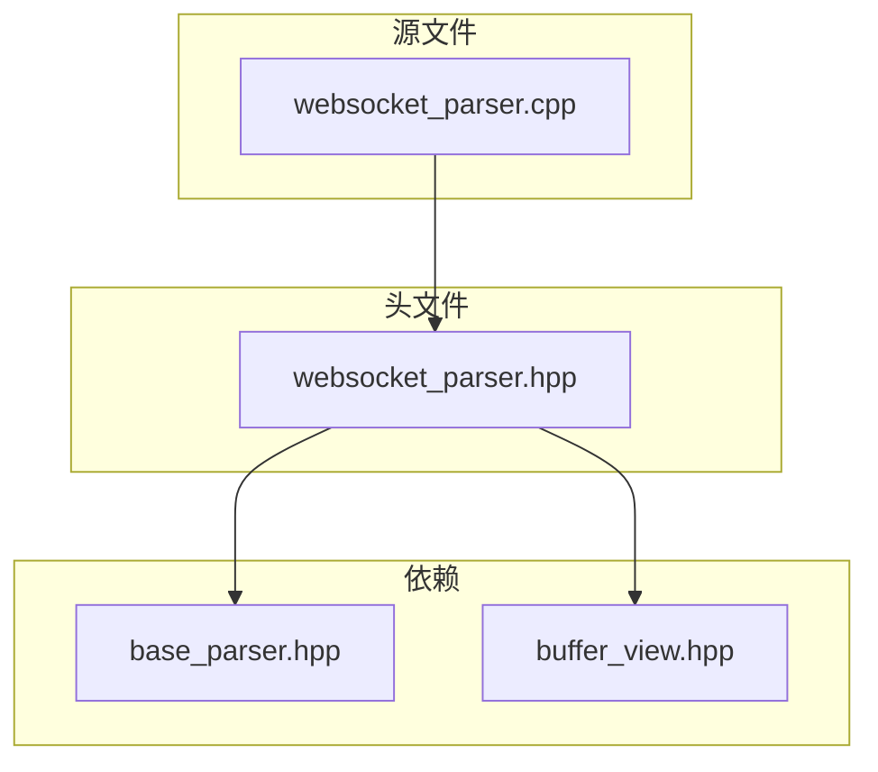
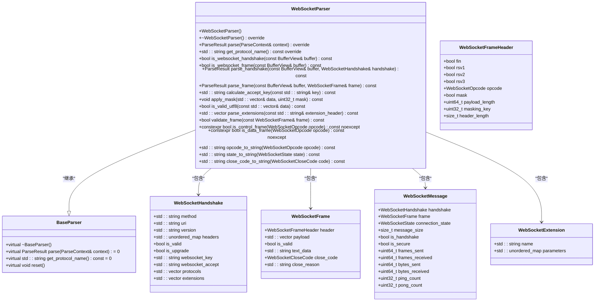
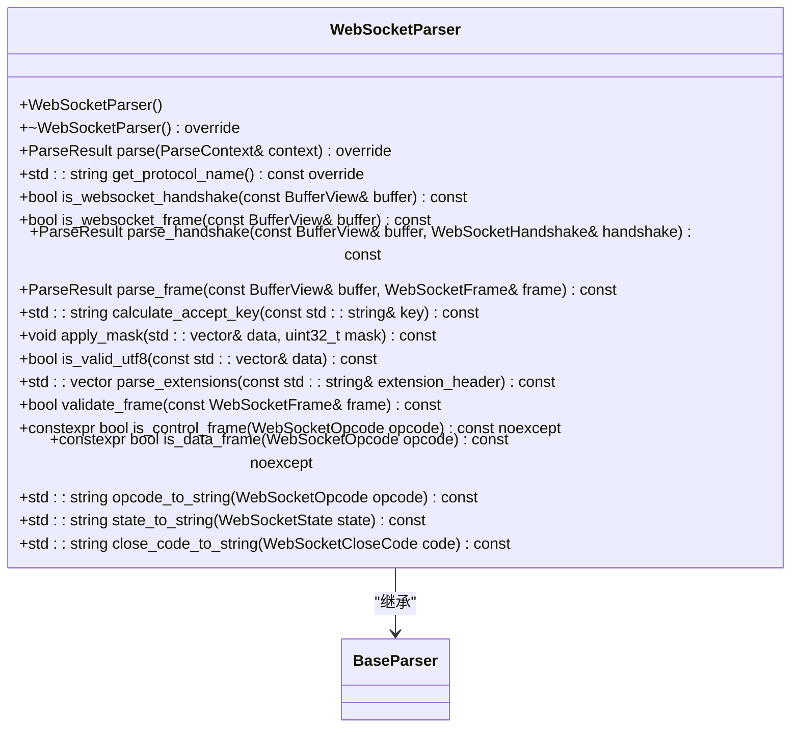
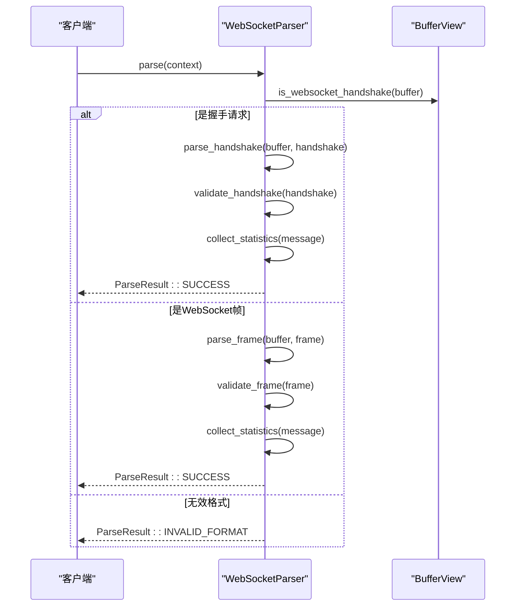
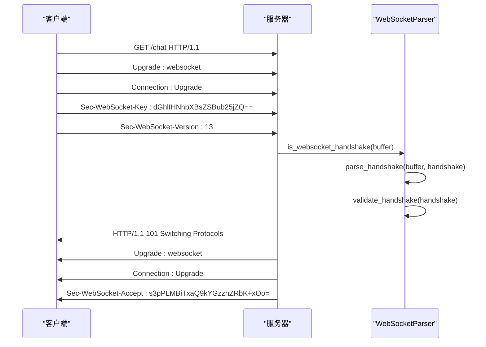
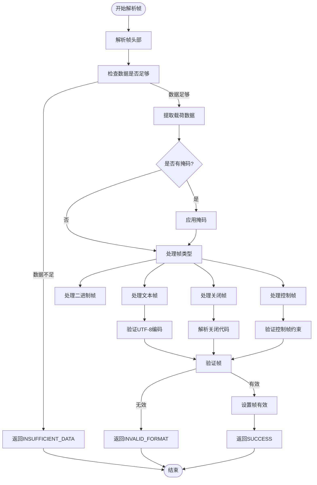
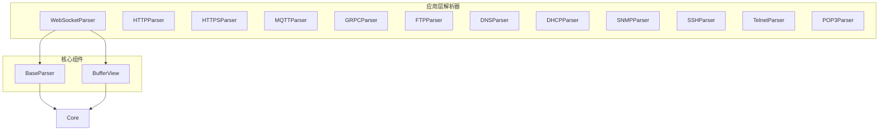
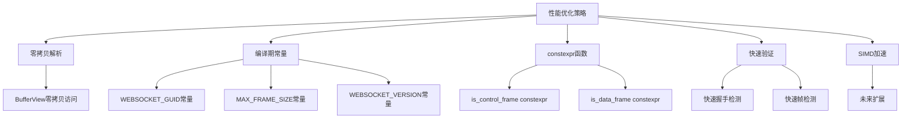
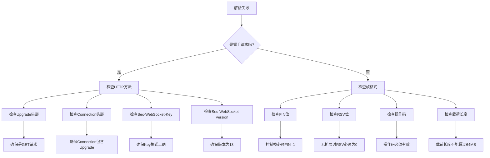

# WebSocket协议解析器

<cite>
**本文档引用的文件**   
- [websocket_parser.hpp](file://include/parsers/application/websocket_parser.hpp)
- [websocket_parser.cpp](file://src/parsers/application/websocket_parser.cpp)
- [README.md](file://README.md)
</cite>

## 目录
1. [引言](#引言)
2. [项目结构](#项目结构)
3. [核心组件](#核心组件)
4. [架构概述](#架构概述)
5. [详细组件分析](#详细组件分析)
6. [依赖分析](#依赖分析)
7. [性能考虑](#性能考虑)
8. [故障排除指南](#故障排除指南)
9. [结论](#结论)

## 引言
WebSocket协议解析器是高性能网络协议解析库中的一个关键组件，专门用于解析WebSocket协议。该解析器支持完整的WebSocket协议解析功能，包括握手流程、帧结构解析、掩码处理、分片重组、控制帧处理、扩展支持和安全检测。解析器采用现代C++23实现，具有零拷贝解析、高性能帧处理和完整的错误检测等特性。

## 项目结构
WebSocket协议解析器的代码结构遵循模块化设计，主要包含头文件和源文件两部分。头文件定义了协议相关的数据结构和类接口，源文件实现了具体的解析逻辑。

**图示来源**
- [websocket_parser.hpp](file://include/parsers/application/websocket_parser.hpp)
- [websocket_parser.cpp](file://src/parsers/application/websocket_parser.cpp)

**章节来源**
- [websocket_parser.hpp](file://include/parsers/application/websocket_parser.hpp)
- [websocket_parser.cpp](file://src/parsers/application/websocket_parser.cpp)

## 核心组件
WebSocket协议解析器的核心组件包括WebSocket操作码、连接状态、关闭代码、帧头信息、握手信息、帧信息、消息结构和扩展信息等数据结构，以及WebSocketParser类。

**章节来源**
- [websocket_parser.hpp](file://include/parsers/application/websocket_parser.hpp#L13-L137)

## 架构概述
WebSocket协议解析器采用分层架构设计，主要包括协议解析层、数据处理层和统计层。解析器继承自BaseParser基类，实现了WebSocket协议的完整解析功能。

**图示来源**
- [websocket_parser.hpp](file://include/parsers/application/websocket_parser.hpp#L139-L333)

**章节来源**
- [websocket_parser.hpp](file://include/parsers/application/websocket_parser.hpp#L139-L333)

## 详细组件分析
### WebSocketParser类分析
WebSocketParser类是WebSocket协议解析的核心实现，提供了完整的WebSocket协议解析功能。

#### 类图

**图示来源**
- [websocket_parser.hpp](file://include/parsers/application/websocket_parser.hpp#L139-L333)

#### 解析流程

**图示来源**
- [websocket_parser.cpp](file://src/parsers/application/websocket_parser.cpp#L65-L108)

**章节来源**
- [websocket_parser.hpp](file://include/parsers/application/websocket_parser.hpp#L139-L333)
- [websocket_parser.cpp](file://src/parsers/application/websocket_parser.cpp#L65-L108)

### WebSocket握手流程
WebSocket握手是建立WebSocket连接的第一步，通过HTTP升级请求实现。

**图示来源**
- [websocket_parser.cpp](file://src/parsers/application/websocket_parser.cpp#L110-L158)

**章节来源**
- [websocket_parser.hpp](file://include/parsers/application/websocket_parser.hpp#L175-L183)
- [websocket_parser.cpp](file://src/parsers/application/websocket_parser.cpp#L110-L158)

### WebSocket帧结构解析
WebSocket帧结构解析是解析器的核心功能之一，负责解析WebSocket帧的各个字段。

**图示来源**
- [websocket_parser.cpp](file://src/parsers/application/websocket_parser.cpp#L160-L238)

**章节来源**
- [websocket_parser.hpp](file://include/parsers/application/websocket_parser.hpp#L185-L193)
- [websocket_parser.cpp](file://src/parsers/application/websocket_parser.cpp#L160-L238)

## 依赖分析
WebSocket协议解析器依赖于基础解析器和缓冲区视图组件，同时与其他应用层协议解析器并列。

**图示来源**
- [websocket_parser.hpp](file://include/parsers/application/websocket_parser.hpp)
- [base_parser.hpp](file://include/parsers/base_parser.hpp)
- [buffer_view.hpp](file://include/core/buffer_view.hpp)

**章节来源**
- [websocket_parser.hpp](file://include/parsers/application/websocket_parser.hpp)
- [base_parser.hpp](file://include/parsers/base_parser.hpp)
- [buffer_view.hpp](file://include/core/buffer_view.hpp)

## 性能考虑
WebSocket协议解析器在设计时充分考虑了性能优化，采用了多种技术来提高解析效率。

### 性能优化策略

**图示来源**
- [websocket_parser.hpp](file://include/parsers/application/websocket_parser.hpp#L323-L332)
- [websocket_parser.cpp](file://src/parsers/application/websocket_parser.cpp#L54-L63)

**章节来源**
- [websocket_parser.hpp](file://include/parsers/application/websocket_parser.hpp#L323-L332)
- [websocket_parser.cpp](file://src/parsers/application/websocket_parser.cpp#L54-L63)

## 故障排除指南
### 常见问题及解决方案

**章节来源**
- [websocket_parser.hpp](file://include/parsers/application/websocket_parser.hpp)
- [websocket_parser.cpp](file://src/parsers/application/websocket_parser.cpp)

## 结论
WebSocket协议解析器是一个功能完整、性能优越的WebSocket协议解析组件。它实现了WebSocket协议的完整解析功能，包括握手流程、帧结构解析、掩码处理、分片重组、控制帧处理、扩展支持和安全检测。解析器采用现代C++23实现，具有零拷贝解析、高性能帧处理和完整的错误检测等特性。通过合理的架构设计和性能优化，该解析器能够高效地处理WebSocket协议数据，适用于各种网络协议分析场景。