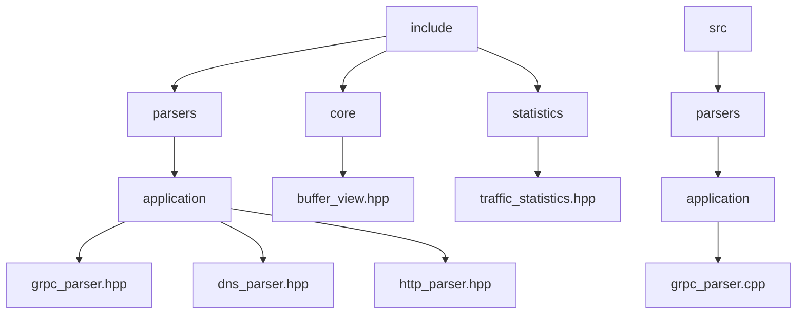
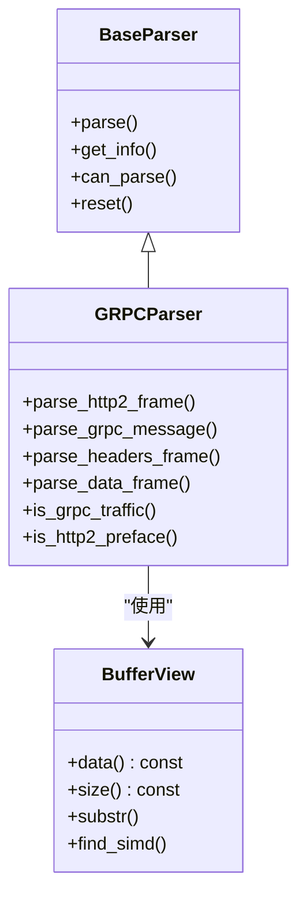
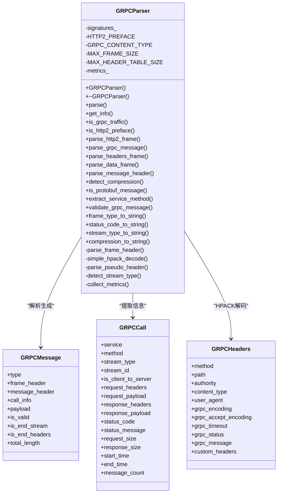
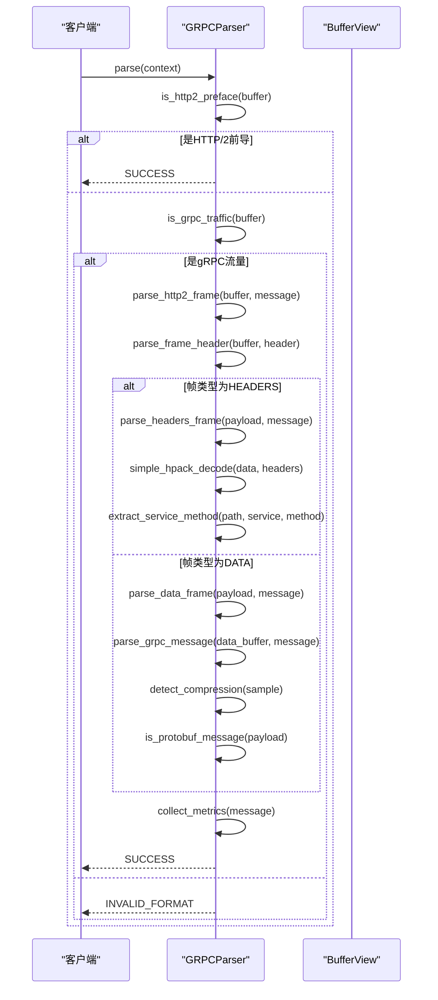
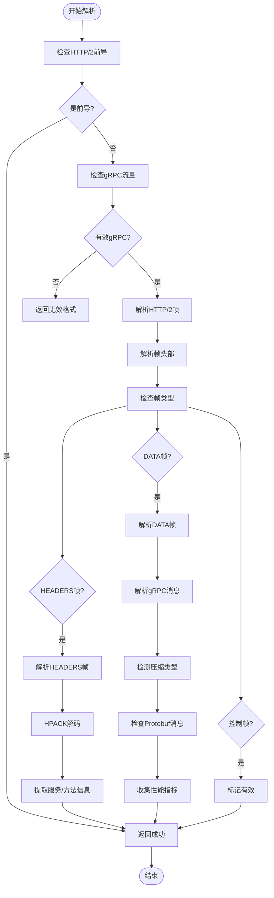
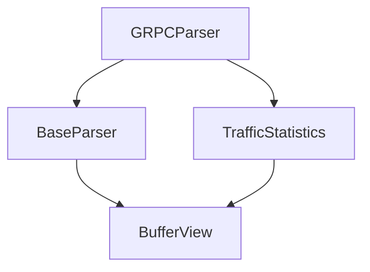

# gRPC协议解析器

<cite>
**本文档引用的文件**
- [grpc_parser.hpp](file://include/parsers/application/grpc_parser.hpp)
- [grpc_parser.cpp](file://src/parsers/application/grpc_parser.cpp)
- [base_parser.hpp](file://include/parsers/base_parser.hpp)
- [buffer_view.hpp](file://include/core/buffer_view.hpp)
- [traffic_statistics.hpp](file://include/statistics/traffic_statistics.hpp)
</cite>

## 目录
1. [简介](#简介)
2. [项目结构](#项目结构)
3. [核心组件](#核心组件)
4. [架构概述](#架构概述)
5. [详细组件分析](#详细组件分析)
6. [依赖分析](#依赖分析)
7. [性能考量](#性能考量)
8. [故障排除指南](#故障排除指南)
9. [结论](#结论)

## 简介
gRPC协议解析器是一个高性能的C++20库，专门用于解析基于HTTP/2的gRPC协议。该解析器支持流式传输解析、Protocol Buffers载荷检测、服务方法识别、元数据处理和性能监控等核心功能。解析器采用零拷贝设计，利用SIMD指令集加速数据处理，确保在高吞吐量场景下的卓越性能。通过继承BaseParser基类，gRPCParser实现了与现有解析框架的无缝集成，支持链式协议解析和实时流量分析。该解析器广泛应用于网络监控、安全分析和性能诊断等场景。

## 项目结构
本项目采用模块化设计，将不同协议的解析器分离到独立的目录中。gRPC协议解析器位于`include/parsers/application/`目录下，包含头文件和实现文件。核心组件如BufferView和BaseParser提供基础功能支持。统计模块提供性能指标收集功能。整个项目结构清晰，便于扩展和维护。

**图示来源**
- [grpc_parser.hpp](file://include/parsers/application/grpc_parser.hpp#L1-L380)
- [buffer_view.hpp](file://include/core/buffer_view.hpp#L1-L138)

**本节来源**
- [grpc_parser.hpp](file://include/parsers/application/grpc_parser.hpp#L1-L380)
- [grpc_parser.cpp](file://src/parsers/application/grpc_parser.cpp#L1-L593)

## 核心组件
gRPC协议解析器的核心组件包括GRPCParser类、各种枚举类型和数据结构。GRPCParser类继承自BaseParser，实现了gRPC协议的完整解析功能。关键枚举类型包括GRPCMessageType、GRPCCompression、GRPCStatusCode和GRPCStreamType，用于表示gRPC消息的各种属性。核心数据结构如GRPCMessageHeader、HTTP2FrameHeader和GRPCCall用于存储解析过程中的各种信息。这些组件共同构成了一个完整的gRPC协议解析系统，能够准确识别和解析gRPC流量。

**本节来源**
- [grpc_parser.hpp](file://include/parsers/application/grpc_parser.hpp#L176-L377)
- [grpc_parser.cpp](file://src/parsers/application/grpc_parser.cpp#L17-L27)

## 架构概述
gRPC协议解析器采用分层架构设计，从底层的BufferView到上层的GRPCParser形成完整的解析链。BufferView提供零拷贝的数据访问接口，BaseParser定义了解析器的通用接口，GRPCParser实现具体的gRPC协议解析逻辑。这种设计使得解析器既高效又易于扩展。解析器通过检测HTTP/2连接前导和gRPC内容类型来识别gRPC流量，然后逐层解析HTTP/2帧和gRPC消息，最终提取出有用的信息。

**图示来源**
- [grpc_parser.hpp](file://include/parsers/application/grpc_parser.hpp#L176-L377)
- [base_parser.hpp](file://include/parsers/base_parser.hpp#L1-L188)
- [buffer_view.hpp](file://include/core/buffer_view.hpp#L1-L138)

## 详细组件分析

### gRPC解析器分析
gRPCParser类是整个解析器的核心，负责实现gRPC协议的完整解析功能。它通过继承BaseParser获得基本的解析能力，并在此基础上添加了gRPC特有的解析逻辑。解析器首先检测HTTP/2连接前导，然后解析HTTP/2帧头部，根据帧类型调用相应的解析函数。对于HEADERS帧，解析器会进行HPACK解码以提取HTTP头部信息；对于DATA帧，则会解析gRPC消息头部和载荷。

#### 对象导向组件

**图示来源**
- [grpc_parser.hpp](file://include/parsers/application/grpc_parser.hpp#L176-L377)
- [grpc_parser.cpp](file://src/parsers/application/grpc_parser.cpp#L17-L27)

#### API/服务组件

**图示来源**
- [grpc_parser.hpp](file://include/parsers/application/grpc_parser.hpp#L176-L377)
- [grpc_parser.cpp](file://src/parsers/application/grpc_parser.cpp#L17-L27)

#### 复杂逻辑组件

**图示来源**
- [grpc_parser.hpp](file://include/parsers/application/grpc_parser.hpp#L176-L377)
- [grpc_parser.cpp](file://src/parsers/application/grpc_parser.cpp#L17-L27)

**本节来源**
- [grpc_parser.hpp](file://include/parsers/application/grpc_parser.hpp#L176-L377)
- [grpc_parser.cpp](file://src/parsers/application/grpc_parser.cpp#L17-L27)

## 依赖分析
gRPC协议解析器依赖于多个核心组件，形成了一个完整的依赖链。最底层是BufferView，提供高效的数据访问接口；中间层是BaseParser，定义了解析器的通用接口；最上层是GRPCParser，实现具体的gRPC协议解析逻辑。此外，解析器还依赖于traffic_statistics模块来收集性能指标。这种分层依赖结构确保了代码的模块化和可维护性。

**图示来源**
- [grpc_parser.hpp](file://include/parsers/application/grpc_parser.hpp#L176-L377)
- [base_parser.hpp](file://include/parsers/base_parser.hpp#L1-L188)
- [buffer_view.hpp](file://include/core/buffer_view.hpp#L1-L138)
- [traffic_statistics.hpp](file://include/statistics/traffic_statistics.hpp#L1-L255)

**本节来源**
- [grpc_parser.hpp](file://include/parsers/application/grpc_parser.hpp#L176-L377)
- [base_parser.hpp](file://include/parsers/base_parser.hpp#L1-L188)
- [buffer_view.hpp](file://include/core/buffer_view.hpp#L1-L138)

## 性能考量
gRPC协议解析器在设计时充分考虑了性能因素。通过使用BufferView实现零拷贝数据访问，避免了不必要的内存复制。利用SIMD指令集加速数据查找和处理，显著提高了处理速度。解析器采用状态机模式，减少了函数调用开销。性能指标收集功能可以帮助用户了解解析器的运行状况，包括总调用数、成功调用数、失败调用数、请求和响应字节数、平均延迟等。这些指标对于性能调优和故障诊断非常有价值。

## 故障排除指南
当遇到gRPC协议解析问题时，可以按照以下步骤进行排查：首先检查输入数据是否完整，确保有足够的数据供解析器使用；其次验证数据是否符合HTTP/2和gRPC协议规范；然后检查解析器的状态，确认是否正确识别了gRPC流量；最后查看性能指标，分析是否存在性能瓶颈。如果问题仍然存在，可以启用调试模式，获取更详细的日志信息。

**本节来源**
- [grpc_parser.hpp](file://include/parsers/application/grpc_parser.hpp#L176-L377)
- [grpc_parser.cpp](file://src/parsers/application/grpc_parser.cpp#L17-L27)

## 结论
gRPC协议解析器是一个功能强大、性能优越的网络协议解析工具。它不仅能够准确解析gRPC协议的各种特性，还提供了丰富的性能监控功能。通过与现有解析框架的无缝集成，该解析器可以轻松地嵌入到各种网络分析应用中。其模块化设计和清晰的代码结构使得扩展和维护变得简单。无论是用于网络监控、安全分析还是性能诊断，gRPC协议解析器都是一个可靠的选择。