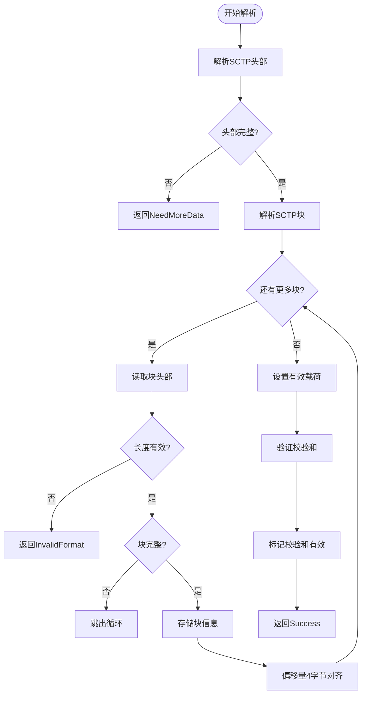
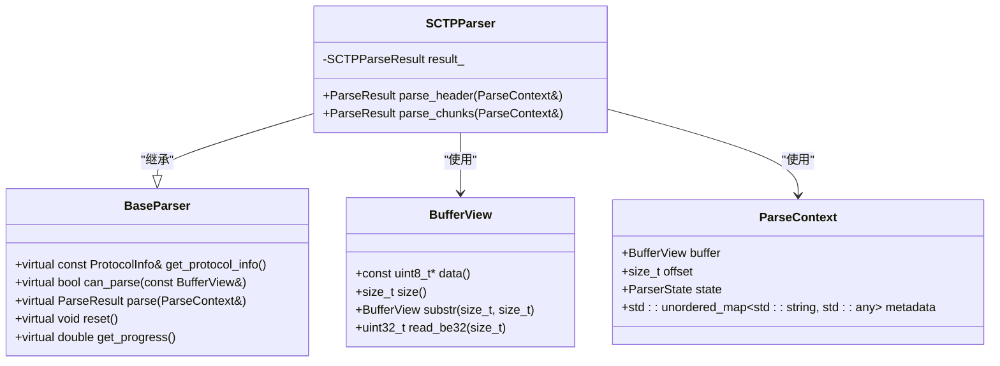

# SCTP解析器

<cite>
**本文档引用文件**  
- [sctp_parser.hpp](file://include/parsers/transport/sctp_parser.hpp#L1-L85)
- [sctp_parser.cpp](file://src/parsers/transport/sctp_parser.cpp#L1-L134)
- [base_parser.hpp](file://include/parsers/base_parser.hpp#L1-L188)
- [buffer_view.hpp](file://include/core/buffer_view.hpp#L1-L138)
</cite>

## 目录
1. [引言](#引言)
2. [项目结构](#项目结构)
3. [核心组件](#核心组件)
4. [架构概述](#架构概述)
5. [详细组件分析](#详细组件分析)
6. [依赖分析](#依赖分析)
7. [性能考量](#性能考量)
8. [故障排除指南](#故障排除指南)
9. [结论](#结论)

## 引言
本文档系统阐述SCTP协议解析器的核心功能，重点解析其复杂的多流（multi-streaming）与多宿主（multi-homing）特性在解析过程中的体现。详细描述通用SCTP头部及各类块（如INIT、SACK、DATA、HEARTBEAT）的解析逻辑，说明如何识别和处理Chunk类型与长度字段。解释关联ID、流ID、序列号等关键参数的提取方式，并展示如何通过ParseContext传递会话状态以支持可靠消息传输。涵盖校验和验证、分片重组、控制消息与数据消息的区分处理机制，提供高可靠性通信场景下的使用建议与性能优化路径。

## 项目结构
SCTP解析器位于`include/parsers/transport/`和`src/parsers/transport/`目录下，遵循分层架构设计。核心解析逻辑由`sctp_parser.hpp`和`sctp_parser.cpp`实现，依赖于基础解析框架`base_parser.hpp`以及高性能缓冲区视图`buffer_view.hpp`。整个项目采用C++17标准，支持SIMD加速和零拷贝数据处理。

**Section sources**
- [sctp_parser.hpp](file://include/parsers/transport/sctp_parser.hpp#L1-L85)
- [sctp_parser.cpp](file://src/parsers/transport/sctp_parser.cpp#L1-L134)

## 核心组件
SCTP解析器的核心组件包括SCTP头部结构体、块头部结构体、解析结果结构体以及SCTPParser类。该类继承自BaseParser，实现了can_parse、parse、reset等接口，能够解析SCTP协议数据包并提取关键信息。解析结果包含头部信息、块列表、有效载荷及校验和有效性标志。

**Section sources**
- [sctp_parser.hpp](file://include/parsers/transport/sctp_parser.hpp#L56-L85)
- [sctp_parser.cpp](file://src/parsers/transport/sctp_parser.cpp#L20-L30)

## 架构概述
SCTP解析器采用模块化设计，基于基类BaseParser提供的状态机框架进行扩展。通过ParseContext上下文对象管理解析过程中的偏移量、状态和元数据。BufferView提供零拷贝、SIMD加速的数据访问能力，确保高效解析性能。

```mermaid
graph TB
subgraph "解析层"
SCTPParser[SCTPParser]
BaseParser[BaseParser]
end
subgraph "数据访问层"
BufferView[BufferView]
end
subgraph "上下文管理"
ParseContext[ParseContext]
end
SCTPParser --> BaseParser : "继承"
SCTPParser --> BufferView : "使用"
SCTPParser --> ParseContext : "使用"
```

**Diagram sources**
- [sctp_parser.hpp](file://include/parsers/transport/sctp_parser.hpp#L56-L85)
- [base_parser.hpp](file://include/parsers/base_parser.hpp#L1-L188)
- [buffer_view.hpp](file://include/core/buffer_view.hpp#L1-L138)

## 详细组件分析

### SCTP头部与块解析机制
SCTPParser通过`parse_header`和`parse_chunks`两个私有方法分别解析SCTP通用头部和后续的块序列。头部包含源端口、目的端口、验证标签和校验和四个字段，共12字节。块头部包含类型、标志和长度字段，长度字段用于确定每个块的实际大小，并考虑4字节对齐填充。

#### 解析流程图


**Diagram sources**
- [sctp_parser.cpp](file://src/parsers/transport/sctp_parser.cpp#L60-L130)

### 多流与多宿主特性的体现
虽然当前解析器主要关注协议格式解析，但其设计为支持SCTP的多流与多宿主特性奠定了基础。通过ParseContext中的metadata字段，可以记录不同流ID的状态信息，实现流级别的状态跟踪。未来可通过扩展SCTPParseResult结构体来提取流ID、传输序列号等字段，从而支持真正的多流处理。

**Section sources**
- [sctp_parser.hpp](file://include/parsers/transport/sctp_parser.hpp#L56-L85)
- [base_parser.hpp](file://include/parsers/base_parser.hpp#L1-L188)

### 校验和与分片处理
解析器在`parse_chunks`方法末尾设置`checksum_valid`标志，当前实现中简单标记为true，实际应用中应集成完整的校验和计算逻辑。对于分片重组，解析器通过`substr`方法支持从BufferView中提取子视图，为上层应用实现分片重组提供了基础能力。

**Section sources**
- [sctp_parser.cpp](file://src/parsers/transport/sctp_parser.cpp#L120-L130)
- [buffer_view.hpp](file://include/core/buffer_view.hpp#L1-L138)

## 依赖分析
SCTP解析器直接依赖于BaseParser抽象基类和BufferView高性能缓冲区。BaseParser定义了统一的解析接口和状态机框架，BufferView提供安全、高效的数据访问能力。这种设计实现了良好的解耦，使得SCTPParser可以专注于协议特定逻辑的实现。



**Diagram sources**
- [sctp_parser.hpp](file://include/parsers/transport/sctp_parser.hpp#L56-L85)
- [base_parser.hpp](file://include/parsers/base_parser.hpp#L1-L188)
- [buffer_view.hpp](file://include/core/buffer_view.hpp#L1-L138)

## 性能考量
SCTP解析器通过零拷贝BufferView设计和SIMD加速查找实现了高性能解析。BufferView的引用计数机制避免了不必要的内存复制，而find_simd等方法利用AVX2/SSE2指令集加速模式匹配。解析器采用状态机模式，支持增量解析，适用于流式数据处理场景。

**Section sources**
- [buffer_view.hpp](file://include/core/buffer_view.hpp#L1-L138)
- [sctp_parser.cpp](file://src/parsers/transport/sctp_parser.cpp#L1-L134)

## 故障排除指南
当解析失败时，可通过检查ParseResult返回值进行诊断：NeedMoreData表示数据不足，InvalidFormat表示格式错误。可通过调试`result_.chunks`向量验证块解析是否正确。若校验和验证失败，需检查`verification_tag`和`checksum`字段的字节序处理是否正确。

**Section sources**
- [sctp_parser.cpp](file://src/parsers/transport/sctp_parser.cpp#L60-L130)
- [base_parser.hpp](file://include/parsers/base_parser.hpp#L1-L188)

## 结论
SCTP解析器实现了SCTP协议的基本解析功能，具备良好的扩展性和高性能特性。通过继承BaseParser框架，保证了与其他协议解析器的一致性。未来可进一步完善校验和验证、支持流ID和序列号提取、实现分片重组等功能，以全面支持SCTP的多流与多宿主特性。