# TCP解析器

<cite>
**本文档引用文件**   
- [tcp_parser.hpp](file://include/parsers/transport/tcp_parser.hpp)
- [tcp_parser.cpp](file://src/parsers/transport/tcp_parser.cpp)
- [buffer_view.hpp](file://include/core/buffer_view.hpp)
- [base_parser.hpp](file://include/parsers/base_parser.hpp)
- [README.md](file://README.md)
- [org_design_doc.md](file://org_design_doc.md)
</cite>

## 目录
1. [引言](#引言)
2. [项目结构](#项目结构)
3. [核心组件](#核心组件)
4. [架构概述](#架构概述)
5. [详细组件分析](#详细组件分析)
6. [依赖分析](#依赖分析)
7. [性能考量](#性能考量)
8. [故障排除指南](#故障排除指南)
9. [结论](#结论)

## 引言
本文档深入讲解TCP协议解析器的实现机制，重点描述TCP头部字段的解析过程，包括源端口、目的端口、序列号、确认号、数据偏移、标志位（URG、ACK、PSH、RST、SYN、FIN）、窗口大小、校验和及紧急指针的提取与验证。详细说明TCP标志位的状态机处理逻辑、分片重组支持以及校验和计算优化策略。结合ParseContext展示如何维护TCP流状态，并提供高并发场景下的零拷贝内存管理与SIMD加速实践示例。

## 项目结构
本项目采用模块化设计，包含核心组件、协议解析器、性能监控和工具类。协议解析器分为数据链路层、网络层、传输层和应用层，每层都有对应的解析器实现。

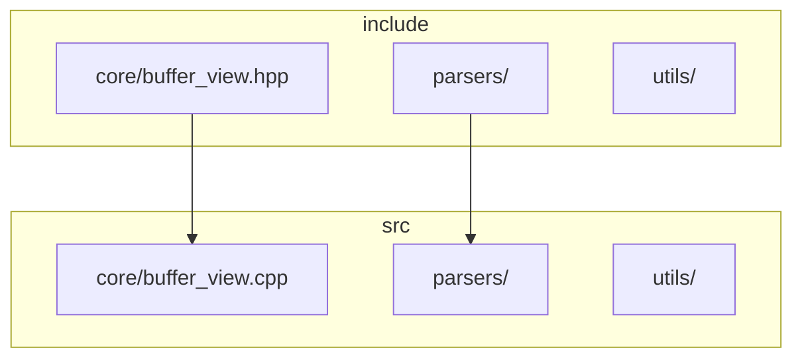

**图示来源**
- [buffer_view.hpp](file://include/core/buffer_view.hpp)
- [tcp_parser.hpp](file://include/parsers/transport/tcp_parser.hpp)

**本节来源**
- [README.md](file://README.md#L0-L510)

## 核心组件
TCP解析器的核心组件包括TCPHeader结构体、TCPParseResult结果结构体、TCPParser类和TCPParserFactory工厂类。这些组件共同实现了TCP协议的完整解析功能。

**本节来源**
- [tcp_parser.hpp](file://include/parsers/transport/tcp_parser.hpp#L0-L122)
- [tcp_parser.cpp](file://src/parsers/transport/tcp_parser.cpp#L0-L179)

## 架构概述
TCP解析器采用分阶段解析策略，依次解析TCP头部、选项和载荷。解析过程遵循状态机模式，确保解析的正确性和完整性。

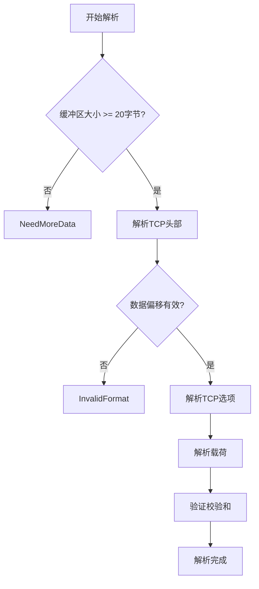

**图示来源**
- [tcp_parser.cpp](file://src/parsers/transport/tcp_parser.cpp#L50-L179)

**本节来源**
- [tcp_parser.cpp](file://src/parsers/transport/tcp_parser.cpp#L0-L179)

## 详细组件分析
### TCP头部解析分析
TCP头部解析是整个解析过程的第一步，负责提取和验证TCP头部的各个字段。

#### TCP头部结构
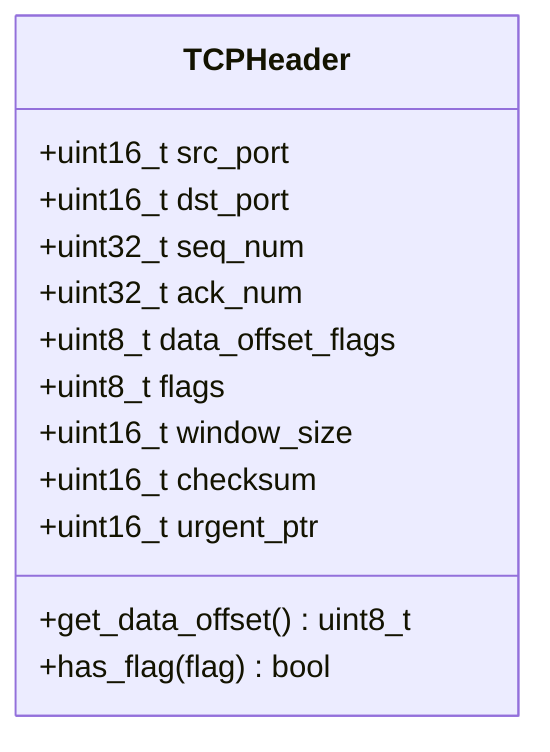

**图示来源**
- [tcp_parser.hpp](file://include/parsers/transport/tcp_parser.hpp#L45-L65)

#### 头部解析流程
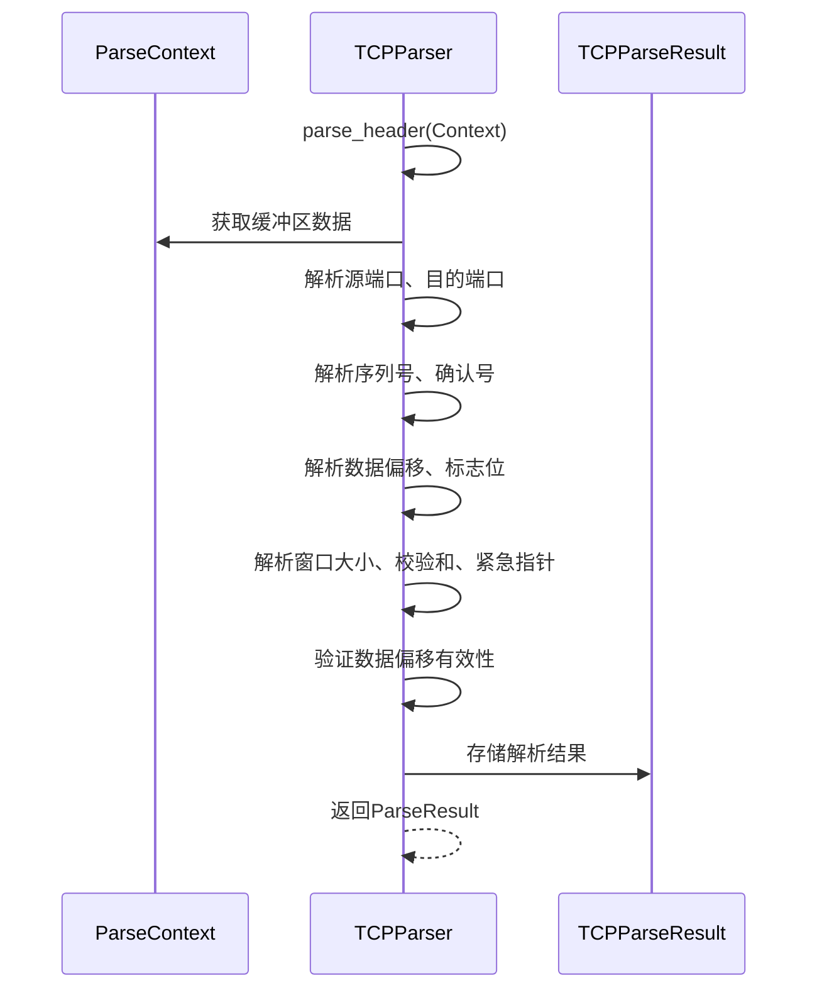

**图示来源**
- [tcp_parser.cpp](file://src/parsers/transport/tcp_parser.cpp#L70-L100)

**本节来源**
- [tcp_parser.hpp](file://include/parsers/transport/tcp_parser.hpp#L45-L65)
- [tcp_parser.cpp](file://src/parsers/transport/tcp_parser.cpp#L70-L100)

### TCP选项解析分析
TCP选项解析处理TCP头部中的可选字段，支持多种TCP选项类型。

#### 选项类型定义
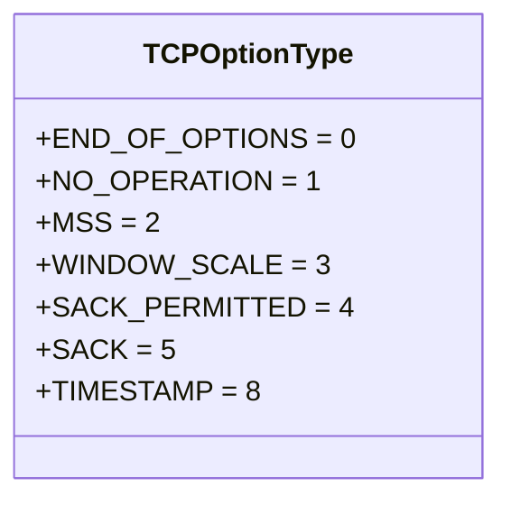

**图示来源**
- [tcp_parser.hpp](file://include/parsers/transport/tcp_parser.hpp#L15-L35)

#### 选项解析流程
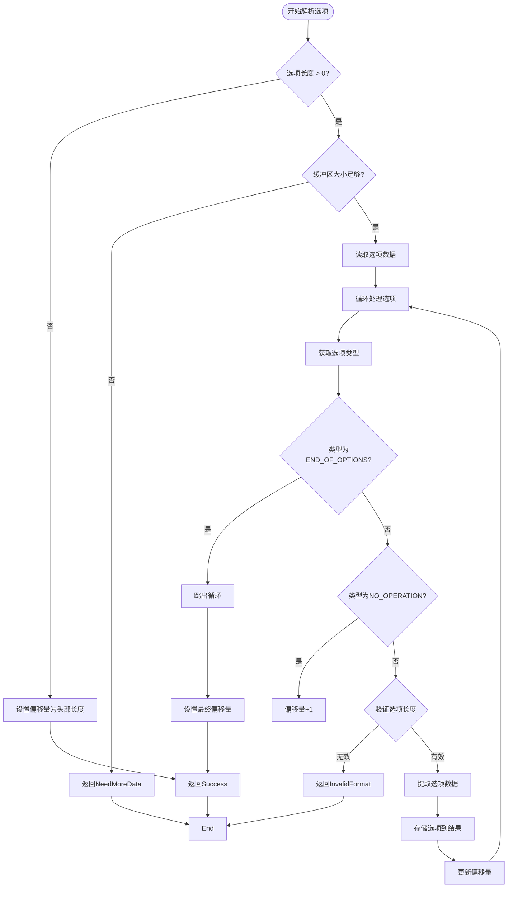

**图示来源**
- [tcp_parser.cpp](file://src/parsers/transport/tcp_parser.cpp#L102-L140)

**本节来源**
- [tcp_parser.hpp](file://include/parsers/transport/tcp_parser.hpp#L37-L43)
- [tcp_parser.cpp](file://src/parsers/transport/tcp_parser.cpp#L102-L140)

### 零拷贝内存管理分析
BufferView类实现了高性能的零拷贝缓冲区视图，支持SIMD加速和引用计数管理。

#### BufferView设计
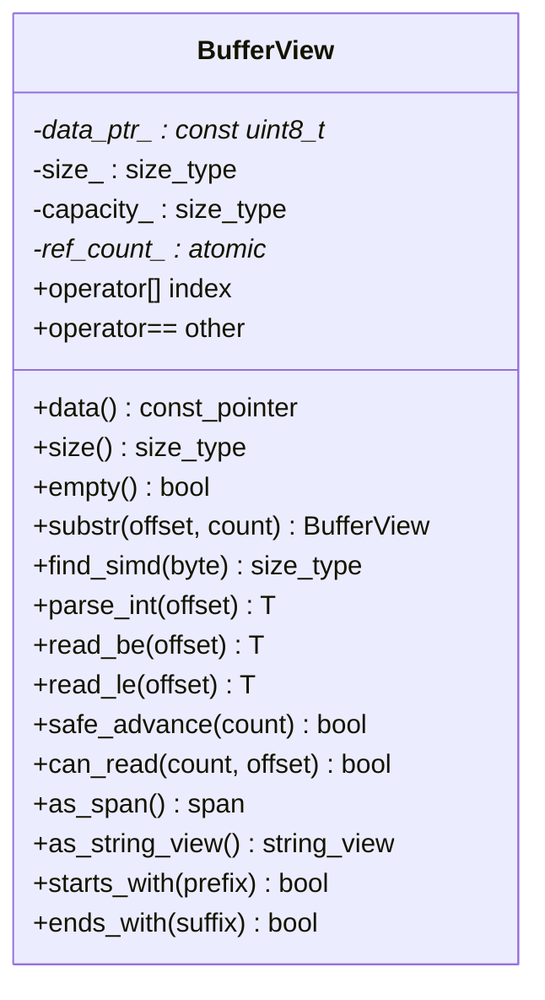

**图示来源**
- [buffer_view.hpp](file://include/core/buffer_view.hpp#L20-L137)

#### 内存管理流程
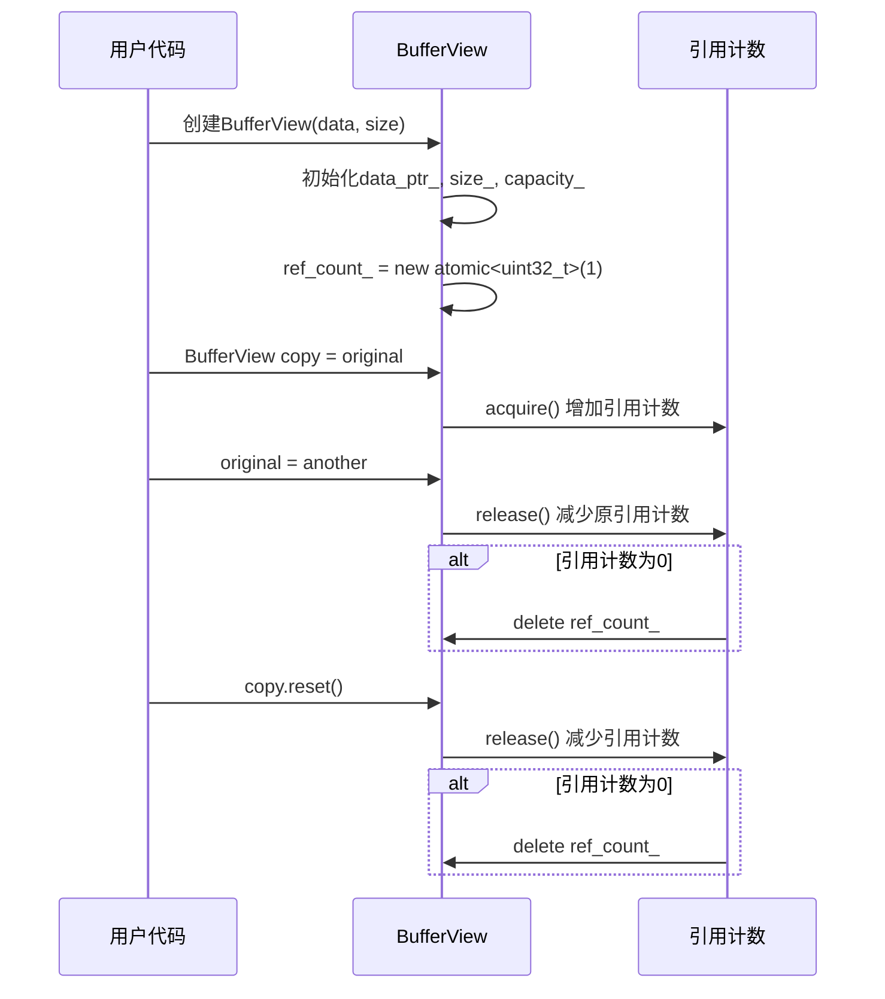

**图示来源**
- [buffer_view.hpp](file://include/core/buffer_view.hpp#L20-L137)

**本节来源**
- [buffer_view.hpp](file://include/core/buffer_view.hpp#L0-L137)

## 依赖分析
TCP解析器依赖于核心的BufferView类和基础的BaseParser类，通过ParseContext在解析过程中传递状态和元数据。

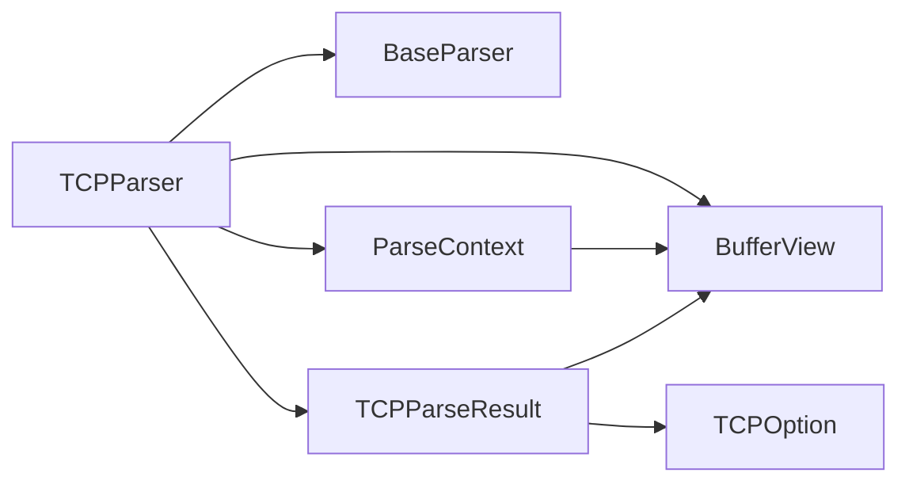

**图示来源**
- [tcp_parser.hpp](file://include/parsers/transport/tcp_parser.hpp#L0-L122)
- [base_parser.hpp](file://include/parsers/base_parser.hpp#L0-L187)

**本节来源**
- [tcp_parser.hpp](file://include/parsers/transport/tcp_parser.hpp#L0-L122)
- [base_parser.hpp](file://include/parsers/base_parser.hpp#L0-L187)

## 性能考量
TCP解析器在设计时充分考虑了性能优化，采用了零拷贝、SIMD加速和编译期优化等技术。

### SIMD加速查找
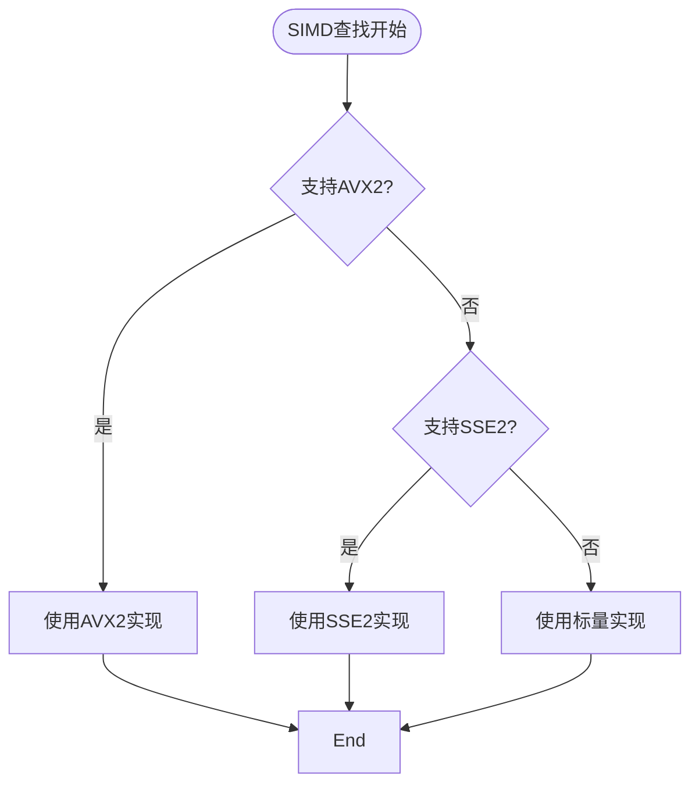

**图示来源**
- [buffer_view.hpp](file://include/core/buffer_view.hpp#L100-L120)

### 性能优化策略
- **零拷贝设计**: BufferView不复制数据，只维护指针和大小
- **引用计数**: 自动管理缓冲区生命周期
- **内存对齐**: 优化的内存访问模式
- **SIMD加速**: 使用AVX2/SSE2指令集加速查找操作
- **编译器优化**: 推荐使用-O3 -march=native编译选项

**本节来源**
- [README.md](file://README.md#L300-L350)
- [org_design_doc.md](file://org_design_doc.md#L0-L415)

## 故障排除指南
### 常见解析错误
- **NeedMoreData**: 缓冲区大小小于TCP头部最小长度（20字节）
- **InvalidFormat**: 数据偏移字段无效（小于5或大于15）
- **InvalidFormat**: 选项长度无效或超出范围

### 错误排查方法
1. **检查输入数据**: 确保输入的缓冲区包含完整的TCP头部
2. **验证数据偏移**: 确认数据偏移字段值在5-15范围内
3. **检查选项格式**: 确保选项长度字段正确，不超出头部范围
4. **调试模式**: 启用调试模式查看详细的解析过程

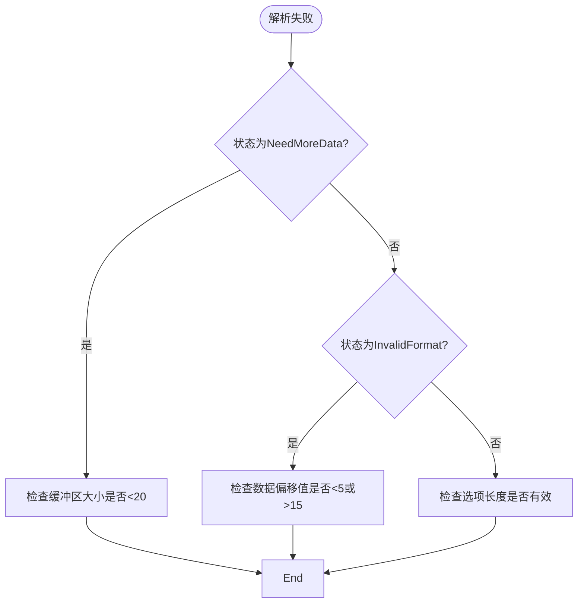

**本节来源**
- [tcp_parser.cpp](file://src/parsers/transport/tcp_parser.cpp#L70-L140)
- [README.md](file://README.md#L400-L450)

## 结论
TCP解析器实现了完整的TCP协议解析功能，采用模块化设计和高性能优化策略。通过零拷贝BufferView和SIMD加速，确保了高并发场景下的性能表现。解析器遵循状态机模式，确保解析过程的正确性和完整性。结合ParseContext机制，能够有效维护TCP流状态，为上层应用提供可靠的协议解析服务。