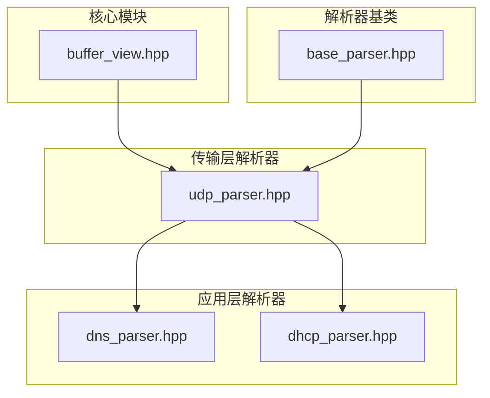
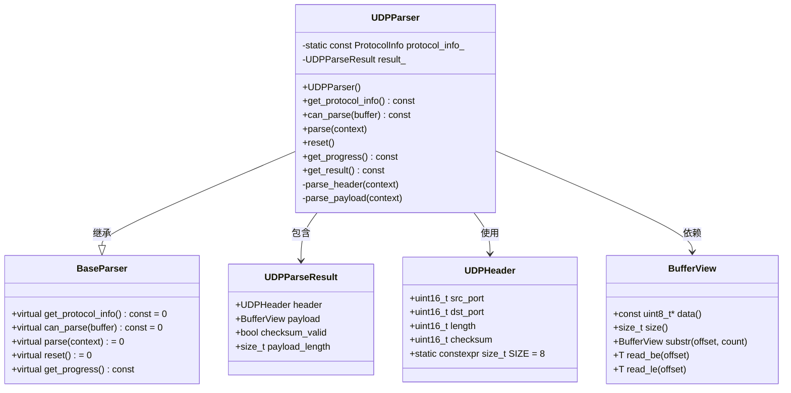
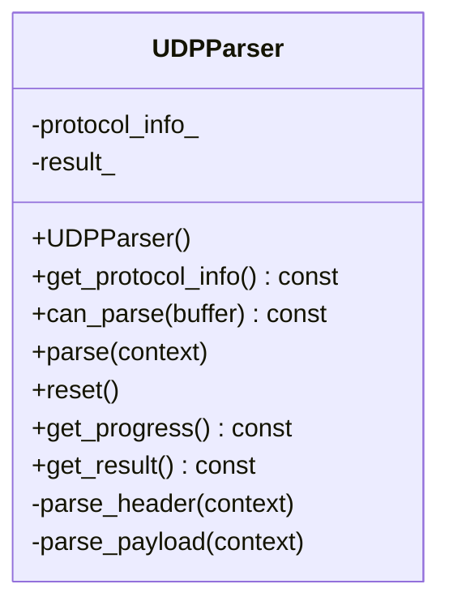
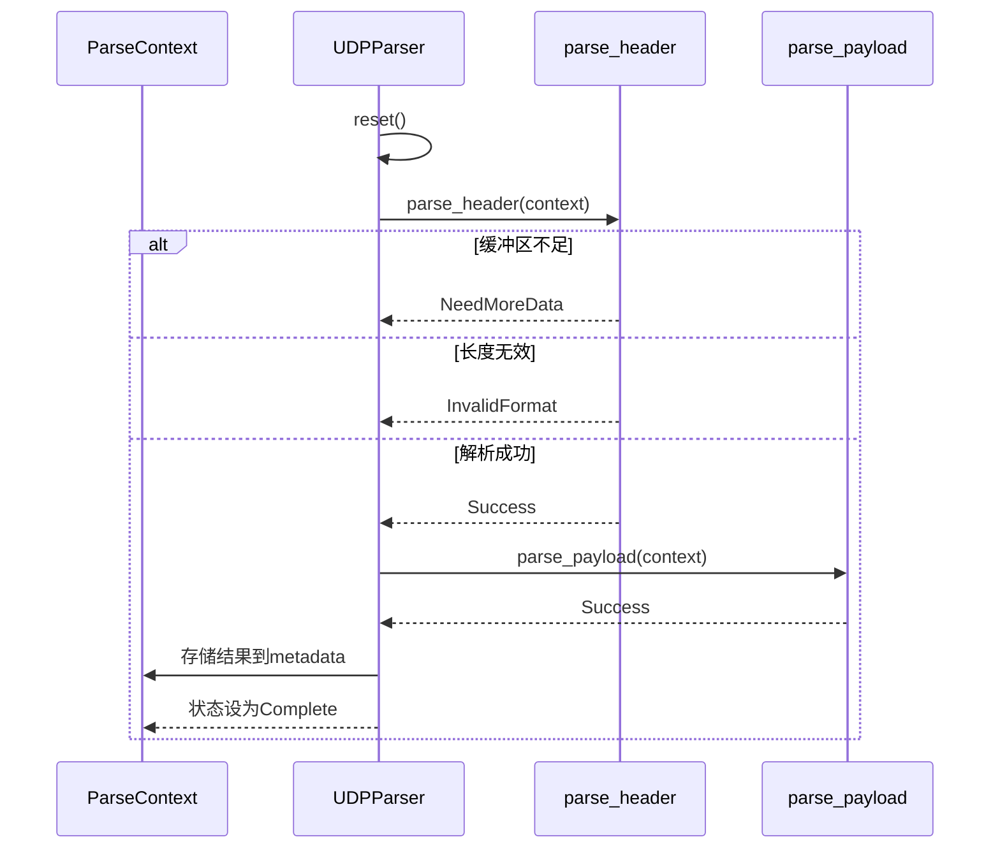
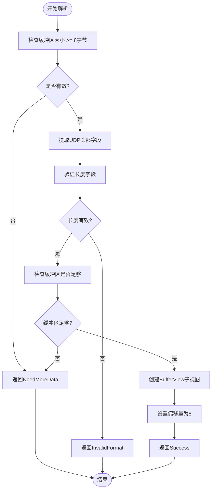
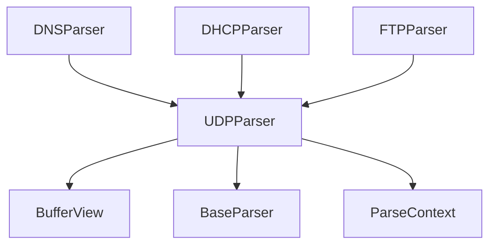

# UDP解析器

<cite>
**本文档引用的文件**  
- [udp_parser.hpp](file://include/parsers/transport/udp_parser.hpp)
- [udp_parser.cpp](file://src/parsers/transport/udp_parser.cpp)
- [buffer_view.hpp](file://include/core/buffer_view.hpp)
- [base_parser.hpp](file://include/parsers/base_parser.hpp)
- [dns_parser.hpp](file://include/parsers/application/dns_parser.hpp)
- [dhcp_parser.hpp](file://include/parsers/application/dhcp_parser.hpp)
</cite>

## 目录
1. [简介](#简介)
2. [项目结构](#项目结构)
3. [核心组件](#核心组件)
4. [架构概述](#架构概述)
5. [详细组件分析](#详细组件分析)
6. [依赖分析](#依赖分析)
7. [性能考量](#性能考量)
8. [故障排除指南](#故障排除指南)
9. [结论](#结论)

## 简介
本文档全面介绍UDP协议解析器的设计与实现，重点突出其轻量级、无连接特性的解析流程。详细解析UDP头部结构，包括源端口、目的端口、长度和校验和字段的读取与验证机制。说明如何通过端口号快速映射至上层应用协议（如DNS、DHCP、TFTP），并结合BufferView与ParseContext实现零拷贝解析。提供在高性能场景下校验和可选验证的配置方式、错误处理策略及与其他解析器的链式调用模式。包含典型使用示例与边界情况处理指导。

## 项目结构
UDP解析器位于`include/parsers/transport/`和`src/parsers/transport/`目录下，遵循模块化设计原则。核心组件包括UDP头部定义、解析结果结构体、UDPParser类及其工厂类。该解析器依赖于核心缓冲区视图（BufferView）和基础解析器框架（BaseParser），并与上层应用协议解析器（如DNS、DHCP）协同工作。

**图示来源**  
- [udp_parser.hpp](file://include/parsers/transport/udp_parser.hpp#L1-L70)
- [buffer_view.hpp](file://include/core/buffer_view.hpp#L1-L138)
- [base_parser.hpp](file://include/parsers/base_parser.hpp#L1-L188)

**本节来源**  
- [udp_parser.hpp](file://include/parsers/transport/udp_parser.hpp#L1-L70)
- [udp_parser.cpp](file://src/parsers/transport/udp_parser.cpp#L1-L106)

## 核心组件
UDP解析器的核心组件包括UDPHeader结构体、UDPParseResult结构体、UDPParser类和UDPParserFactory类。UDPHeader定义了UDP协议头部的四个字段：源端口、目的端口、长度和校验和。UDPParseResult封装了解析结果，包括头部信息、载荷视图、校验和有效性及载荷长度。UDPParser继承自BaseParser，实现了can_parse、parse、reset等接口。UDPParserFactory用于创建UDPParser实例，并注册到全局解析器注册表中。

**本节来源**  
- [udp_parser.hpp](file://include/parsers/transport/udp_parser.hpp#L1-L70)
- [udp_parser.cpp](file://src/parsers/transport/udp_parser.cpp#L1-L106)

## 架构概述
UDP解析器采用分层架构设计，基于ParseContext进行状态管理，利用BufferView实现零拷贝数据访问。解析过程分为两个阶段：头部解析和载荷解析。通过端口号可快速识别上层协议，实现与DNS、DHCP等应用层解析器的链式调用。

**图示来源**  
- [udp_parser.hpp](file://include/parsers/transport/udp_parser.hpp#L1-L70)
- [buffer_view.hpp](file://include/core/buffer_view.hpp#L1-L138)
- [base_parser.hpp](file://include/parsers/base_parser.hpp#L1-L188)

## 详细组件分析

### UDP解析器分析
UDPParser实现了UDP协议的完整解析流程。其设计遵循轻量级、高性能原则，支持零拷贝解析和链式调用。

#### 类结构分析

**图示来源**  
- [udp_parser.hpp](file://include/parsers/transport/udp_parser.hpp#L1-L70)
- [udp_parser.cpp](file://src/parsers/transport/udp_parser.cpp#L1-L106)

#### 解析流程分析

**图示来源**  
- [udp_parser.cpp](file://src/parsers/transport/udp_parser.cpp#L1-L106)

#### 零拷贝机制分析

**图示来源**  
- [udp_parser.cpp](file://src/parsers/transport/udp_parser.cpp#L1-L106)
- [buffer_view.hpp](file://include/core/buffer_view.hpp#L1-L138)

**本节来源**  
- [udp_parser.hpp](file://include/parsers/transport/udp_parser.hpp#L1-L70)
- [udp_parser.cpp](file://src/parsers/transport/udp_parser.cpp#L1-L106)
- [buffer_view.hpp](file://include/core/buffer_view.hpp#L1-L138)

### 上层协议映射分析
UDP解析器通过目的端口号实现与上层应用协议的快速映射。常见端口对应关系如下：

| 端口号 | 协议 | 文件 |
|--------|------|------|
| 53 | DNS | [dns_parser.hpp](file://include/parsers/application/dns_parser.hpp) |
| 67/68 | DHCP | [dhcp_parser.hpp](file://include/parsers/application/dhcp_parser.hpp) |
| 69 | TFTP | 未提供 |

**本节来源**  
- [dns_parser.hpp](file://include/parsers/application/dns_parser.hpp#L1-L146)
- [dhcp_parser.hpp](file://include/parsers/application/dhcp_parser.hpp#L1-L284)

## 依赖分析
UDP解析器依赖于核心缓冲区管理模块和基础解析器框架，同时为上层应用协议解析器提供数据支持。

**图示来源**  
- [udp_parser.hpp](file://include/parsers/transport/udp_parser.hpp#L1-L70)
- [base_parser.hpp](file://include/parsers/base_parser.hpp#L1-L188)
- [buffer_view.hpp](file://include/core/buffer_view.hpp#L1-L138)

**本节来源**  
- [udp_parser.hpp](file://include/parsers/transport/udp_parser.hpp#L1-L70)
- [base_parser.hpp](file://include/parsers/base_parser.hpp#L1-L188)
- [buffer_view.hpp](file://include/core/buffer_view.hpp#L1-L138)

## 性能考量
UDP解析器在设计上充分考虑了高性能需求：
- 使用BufferView实现零拷贝访问，避免内存复制开销
- 采用SIMD指令加速模式匹配（通过find_simd方法）
- 解析过程无动态内存分配，减少GC压力
- 校验和验证可配置跳过，适用于高性能监控场景
- 使用constexpr和noexcept优化编译时计算和异常处理

**本节来源**  
- [buffer_view.hpp](file://include/core/buffer_view.hpp#L1-L138)
- [udp_parser.cpp](file://src/parsers/transport/udp_parser.cpp#L1-L106)

## 故障排除指南
常见问题及解决方案：

1. **解析失败（NeedMoreData）**
   - 检查输入缓冲区是否完整包含UDP数据包
   - 确保缓冲区大小至少为8字节（UDP头部）

2. **格式错误（InvalidFormat）**
   - 验证长度字段是否小于8字节
   - 检查数据是否被截断或损坏

3. **校验和验证问题**
   - 在高性能场景下可选择性跳过校验和验证
   - 确保网络层已进行校验和验证

4. **链式解析失败**
   - 确认上层协议解析器已正确注册
   - 检查端口号映射是否正确

**本节来源**  
- [udp_parser.cpp](file://src/parsers/transport/udp_parser.cpp#L1-L106)
- [base_parser.hpp](file://include/parsers/base_parser.hpp#L1-L188)

## 结论
UDP解析器是一个轻量级、高性能的协议解析组件，采用零拷贝设计，支持快速上层协议识别。其模块化架构便于扩展，可与DNS、DHCP等应用层解析器无缝集成。通过合理的错误处理机制和性能优化策略，适用于各种网络分析和安全监控场景。