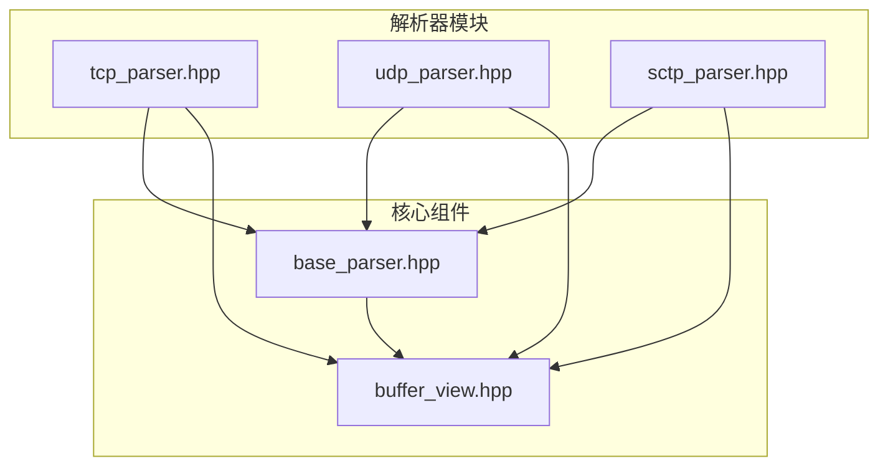
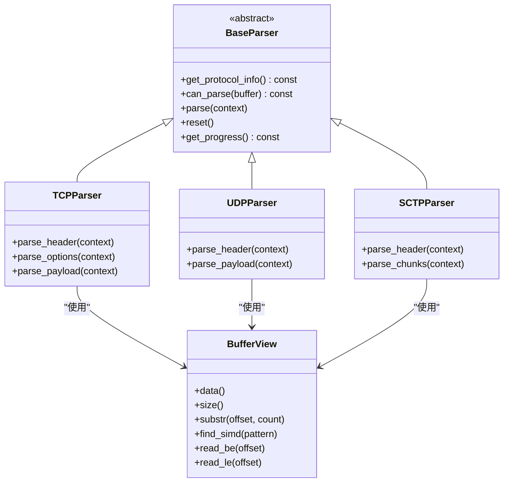
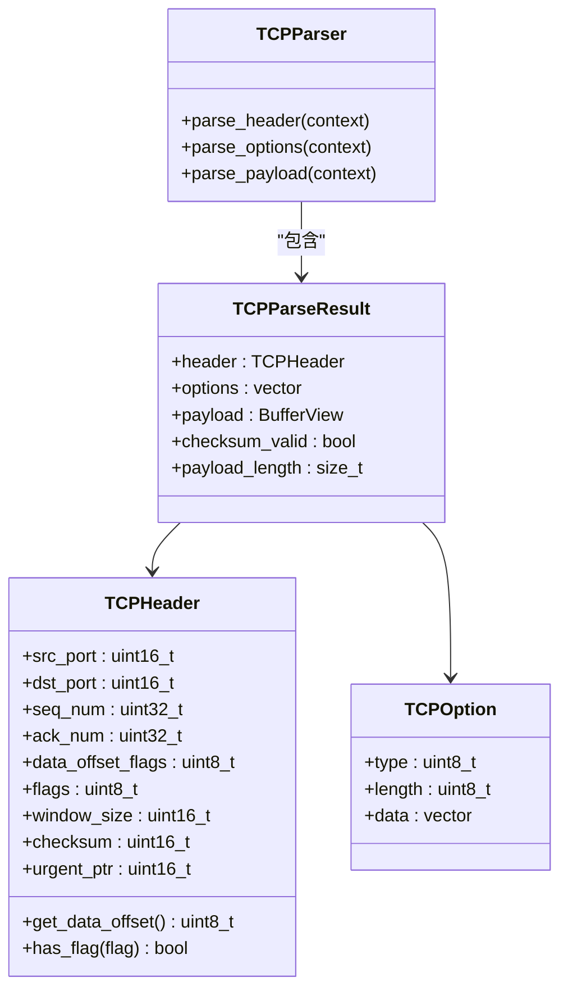
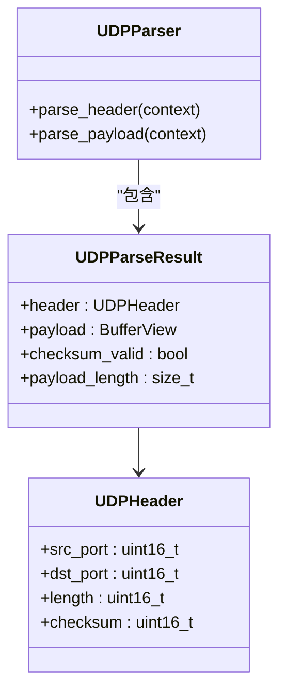
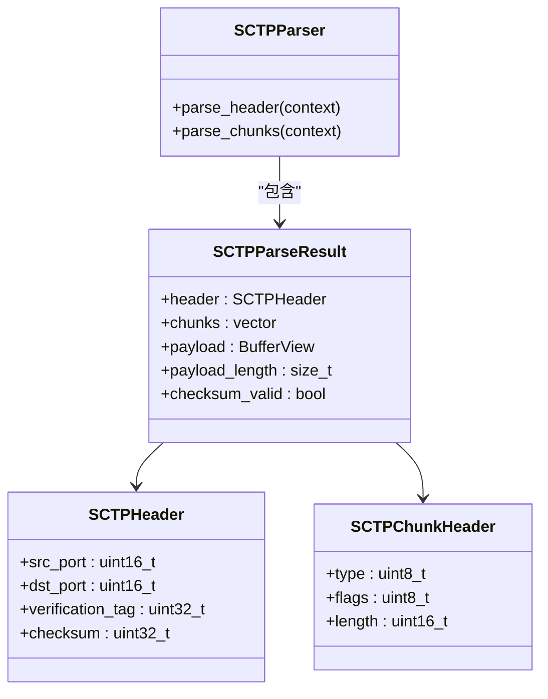
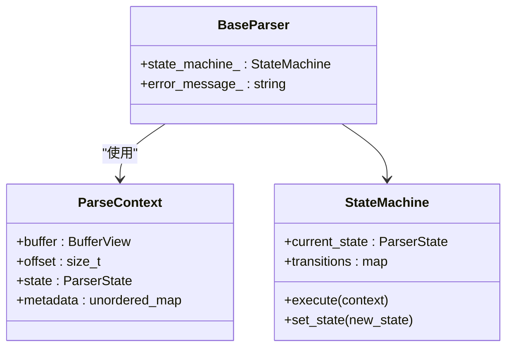
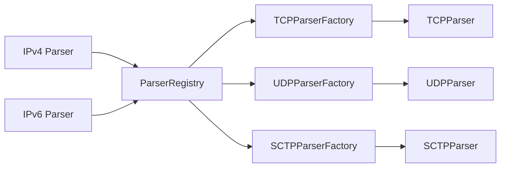

# 传输层解析器

<cite>
**本文档引用文件**  
- [tcp_parser.hpp](file://include/parsers/transport/tcp_parser.hpp)
- [udp_parser.hpp](file://include/parsers/transport/udp_parser.hpp)
- [sctp_parser.hpp](file://include/parsers/transport/sctp_parser.hpp)
- [base_parser.hpp](file://include/parsers/base_parser.hpp)
- [buffer_view.hpp](file://include/core/buffer_view.hpp)
</cite>

## 目录
1. [引言](#引言)
2. [项目结构](#项目结构)
3. [核心组件](#核心组件)
4. [架构概述](#架构概述)
5. [详细组件分析](#详细组件分析)
6. [依赖分析](#依赖分析)
7. [性能考虑](#性能考虑)
8. [故障排除指南](#故障排除指南)
9. [结论](#结论)

## 引言
本文档全面介绍TCP、UDP和SCTP传输层协议解析器的工作原理。详细描述TCP头部字段（如序列号、确认号、窗口大小）、标志位解析、校验和验证机制；UDP轻量级解析流程；SCTP多流与多宿主特性的解析支持。说明端口号到应用层协议的映射机制，以及如何通过ParseContext传递流状态信息。提供高并发场景下的解析性能建议和零拷贝内存管理实践。

## 项目结构
本项目采用分层架构设计，按协议层级组织解析器模块。核心组件包括缓冲区视图、基础解析器、各层协议解析器及工厂模式注册机制。传输层解析器位于`include/parsers/transport/`目录下，包含TCP、UDP和SCTP三种协议的独立实现。

**Diagram sources**  
- [tcp_parser.hpp](file://include/parsers/transport/tcp_parser.hpp#L1-L122)
- [udp_parser.hpp](file://include/parsers/transport/udp_parser.hpp#L1-L69)
- [sctp_parser.hpp](file://include/parsers/transport/sctp_parser.hpp#L1-L84)
- [base_parser.hpp](file://include/parsers/base_parser.hpp#L1-L187)
- [buffer_view.hpp](file://include/core/buffer_view.hpp#L1-L137)

**Section sources**
- [tcp_parser.hpp](file://include/parsers/transport/tcp_parser.hpp#L1-L122)
- [udp_parser.hpp](file://include/parsers/transport/udp_parser.hpp#L1-L69)
- [sctp_parser.hpp](file://include/parsers/transport/sctp_parser.hpp#L1-L84)

## 核心组件
本系统的核心组件包括高性能零拷贝缓冲区视图（BufferView）、通用解析器基类（BaseParser）以及针对TCP、UDP和SCTP协议的具体解析器实现。这些组件共同构成了一个高效、可扩展的协议解析框架。

**Section sources**
- [base_parser.hpp](file://include/parsers/base_parser.hpp#L1-L187)
- [buffer_view.hpp](file://include/core/buffer_view.hpp#L1-L137)

## 架构概述
系统采用工厂模式与注册表机制实现解析器的动态创建与管理。所有解析器继承自BaseParser抽象基类，遵循统一接口规范。BufferView提供零拷贝数据访问能力，并支持SIMD加速查找操作。

**Diagram sources**  
- [base_parser.hpp](file://include/parsers/base_parser.hpp#L1-L187)
- [tcp_parser.hpp](file://include/parsers/transport/tcp_parser.hpp#L1-L122)
- [udp_parser.hpp](file://include/parsers/transport/udp_parser.hpp#L1-L69)
- [sctp_parser.hpp](file://include/parsers/transport/sctp_parser.hpp#L1-L84)
- [buffer_view.hpp](file://include/core/buffer_view.hpp#L1-L137)

## 详细组件分析

### TCP解析器分析
TCP解析器实现了完整的TCP头部解析功能，包括序列号、确认号、窗口大小等字段提取，支持多种TCP选项（如MSS、窗口缩放、SACK等）的识别与解析。校验和验证在解析过程中进行，结果存储于解析结果结构中。

#### 类图

**Diagram sources**  
- [tcp_parser.hpp](file://include/parsers/transport/tcp_parser.hpp#L1-L122)

**Section sources**
- [tcp_parser.hpp](file://include/parsers/transport/tcp_parser.hpp#L1-L122)

### UDP解析器分析
UDP解析器提供轻量级解析流程，仅需解析固定8字节头部，包含源端口、目的端口、长度和校验和字段。由于UDP为无连接协议，解析过程简单高效，适用于高吞吐量场景。

#### 类图

**Diagram sources**  
- [udp_parser.hpp](file://include/parsers/transport/udp_parser.hpp#L1-L69)

**Section sources**
- [udp_parser.hpp](file://include/parsers/transport/udp_parser.hpp#L1-L69)

### SCTP解析器分析
SCTP解析器支持多流与多宿主特性，能够解析多种SCTP块类型（如DATA、INIT、SACK等）。通过遍历块链表的方式处理可变长度的SCTP数据包，确保对复杂传输模式的支持。

#### 类图

**Diagram sources**  
- [sctp_parser.hpp](file://include/parsers/transport/sctp_parser.hpp#L1-L84)

**Section sources**
- [sctp_parser.hpp](file://include/parsers/transport/sctp_parser.hpp#L1-L84)

### 解析上下文机制
ParseContext结构用于在解析过程中传递流状态信息，包括当前偏移量、解析状态和元数据容器。该机制支持跨多个数据包的连续解析，适用于分片重组等复杂场景。

**Diagram sources**  
- [base_parser.hpp](file://include/parsers/base_parser.hpp#L1-L187)

**Section sources**
- [base_parser.hpp](file://include/parsers/base_parser.hpp#L1-L187)

## 依赖分析
系统通过ParserRegistry实现解析器的集中注册与管理，各协议解析器通过工厂模式注册到全局注册表中。IP层解析完成后可根据协议号查找对应的传输层解析器实例。

**Diagram sources**  
- [base_parser.hpp](file://include/parsers/base_parser.hpp#L1-L187)
- [tcp_parser.hpp](file://include/parsers/transport/tcp_parser.hpp#L1-L122)
- [udp_parser.hpp](file://include/parsers/transport/udp_parser.hpp#L1-L69)
- [sctp_parser.hpp](file://include/parsers/transport/sctp_parser.hpp#L1-L84)

**Section sources**
- [base_parser.hpp](file://include/parsers/base_parser.hpp#L1-L187)

## 性能考虑
为实现高并发场景下的高效解析，建议采用以下优化策略：
- 利用BufferView的SIMD加速功能进行快速模式匹配
- 复用解析器实例避免频繁构造/析构开销
- 使用对象池管理ParseContext生命周期
- 启用编译器优化（如LTO、PGO）提升热点函数性能
- 对频繁访问的端口号建立应用层协议映射缓存

**Section sources**
- [buffer_view.hpp](file://include/core/buffer_view.hpp#L1-L137)

## 故障排除指南
当解析失败时，可通过以下步骤进行诊断：
1. 检查输入缓冲区是否完整（ParseResult::NeedMoreData）
2. 验证协议类型是否受支持（调用can_parse方法）
3. 查看错误消息（get_error_message方法）
4. 确认校验和有效性（checksum_valid标志）
5. 检查数据偏移是否越界（safe_advance返回值）

**Section sources**
- [base_parser.hpp](file://include/parsers/base_parser.hpp#L1-L187)
- [tcp_parser.hpp](file://include/parsers/transport/tcp_parser.hpp#L1-L122)
- [udp_parser.hpp](file://include/parsers/transport/udp_parser.hpp#L1-L69)
- [sctp_parser.hpp](file://include/parsers/transport/sctp_parser.hpp#L1-L84)

## 结论
本文档详细介绍了传输层协议解析器的设计与实现。通过模块化架构、零拷贝内存管理和高效状态机机制，系统能够在高并发环境下稳定运行。未来可进一步扩展对更多传输协议的支持，并优化SIMD指令集的应用范围。