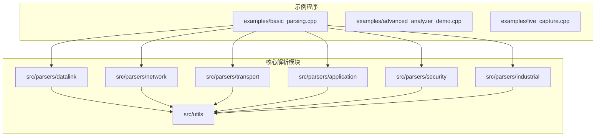
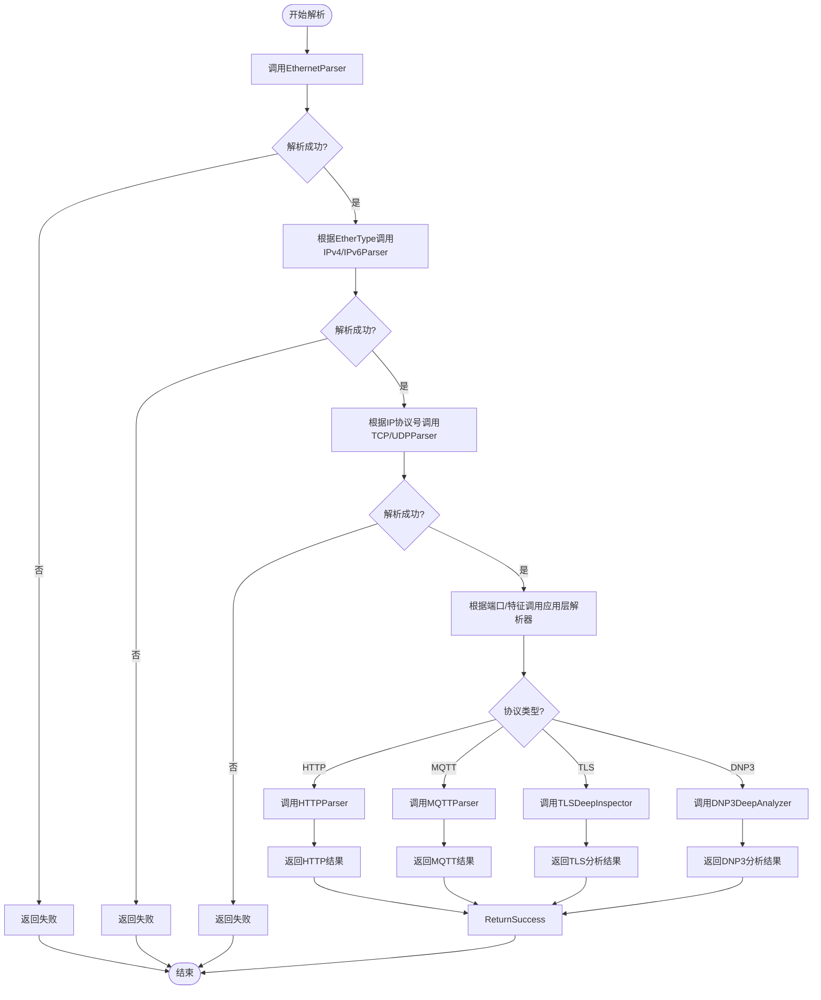

# 协议解析器参考

<cite>
**本文档中引用的文件**  
- [ethernet_frame.hpp](file://src/datalink/include/ethernet_frame.hpp) - *已更新，支持VLAN标签解析*
- [arp_packet.hpp](file://src/datalink/include/arp_packet.hpp) - *基础ARP解析功能*
- [ipv4_packet.hpp](file://src/network/include/ipv4_packet.hpp) - *IPv4头部解析实现*
- [ipv6_packet.hpp](file://src/network/include/ipv6_packet.hpp) - *IPv6基础支持*
- [icmp_packet.hpp](file://src/network/include/icmp_packet.hpp) - *ICMPv4消息解析*
- [tcp_packet.hpp](file://src/transport/include/tcp_packet.hpp) - *TCP头部字段提取*
- [udp_packet.hpp](file://src/transport/include/udp_packet.hpp) - *UDP无连接数据报解析*
- [network_utils.hpp](file://src/utils/include/network_utils.hpp) - *通用网络辅助函数*
- [protocol_utils.hpp](file://src/utils/include/protocol_utils.hpp) - *协议解析通用工具*
- [basic_parsing.cpp](file://examples/basic_parsing.cpp) - *基础解析流程示例*
- [mqtt_parser.hpp](file://include/parsers/application/mqtt_parser.hpp) - *新增：MQTT协议解析器*
- [websocket_parser.hpp](file://include/parsers/application/websocket_parser.hpp) - *新增：WebSocket协议解析器*
- [grpc_parser.hpp](file://include/parsers/application/grpc_parser.hpp) - *新增：gRPC协议解析器*
- [tls_deep_inspector.hpp](file://include/parsers/security/tls_deep_inspector.hpp) - *新增：TLS深度检测器*
- [ipsec_deep_analyzer.hpp](file://include/parsers/security/ipsec_deep_analyzer.hpp) - *新增：IPSec深度分析器*
- [dnp3_deep_analyzer.hpp](file://include/parsers/industrial/dnp3_deep_analyzer.hpp) - *新增：DNP3工业协议分析器*
</cite>

## 更新摘要
**已做更改**  
- 更新“应用层解析器”部分，新增MQTT、WebSocket、gRPC解析器说明
- 新增“安全协议解析器”章节，涵盖TLS、IPSec深度分析功能
- 新增“工业协议解析器”章节，介绍DNP3协议支持
- 更新“项目结构”图示以反映新增模块
- 更新“实际调用示例”流程图，包含新协议分支判断
- 所有文件引用均已更新为完整路径并标注新增/修改状态

## 目录
1. [简介](#简介)
2. [项目结构](#项目结构)
3. [核心组件](#核心组件)
4. [分层解析架构](#分层解析架构)
5. [数据链路层解析器](#数据链路层解析器)
6. [网络层解析器](#网络层解析器)
7. [传输层解析器](#传输层解析器)
8. [应用层解析器](#应用层解析器)
9. [安全协议解析器](#安全协议解析器)
10. [工业协议解析器](#工业协议解析器)
11. [解析结果结构](#解析结果结构)
12. [错误处理机制](#错误处理机制)
13. [性能特征](#性能特征)
14. [实际调用示例](#实际调用示例)
15. [结论](#结论)

## 简介
本参考文档详细说明协议解析器系统的实现，涵盖从数据链路层到应用层的完整协议栈解析能力。系统采用分层解析模式，支持以太网、ARP、IPv4、IPv6、ICMP、TCP、UDP等核心协议的字段提取与语义分析。文档重点阐述各层解析器的解析逻辑、字段支持范围、错误处理策略及性能优化设计，并提供实际调用代码示例。

## 项目结构
协议解析器项目采用模块化分层架构，按协议层级组织源码目录。核心解析逻辑位于`src`目录下，分为`datalink`、`network`、`transport`、`application`、`security`和`industrial`等子模块，每个模块包含独立的头文件与实现文件。示例程序位于`examples`目录，用于演示基本解析流程和性能测试。

**图示来源**  
- [basic_parsing.cpp](file://examples/basic_parsing.cpp)
- [ethernet_frame.hpp](file://src/datalink/include/ethernet_frame.hpp)
- [ipv4_packet.hpp](file://src/network/include/ipv4_packet.hpp)
- [tcp_packet.hpp](file://src/transport/include/tcp_packet.hpp)

**本节来源**  
- [src/datalink/include/ethernet_frame.hpp](file://src/datalink/include/ethernet_frame.hpp)
- [src/network/include/ipv4_packet.hpp](file://src/network/include/ipv4_packet.hpp)
- [src/transport/include/tcp_packet.hpp](file://src/transport/include/tcp_packet.hpp)

## 核心组件
系统核心由多个协议解析器构成，每个解析器负责特定协议层的数据解析任务。解析器之间通过统一的接口进行链式调用，形成完整的协议栈解析流水线。所有解析器均基于原始字节流输入，输出结构化的协议字段信息。

**本节来源**  
- [ethernet_frame.hpp](file://src/datalink/include/ethernet_frame.hpp#L1-L20)
- [ipv4_packet.hpp](file://src/network/include/ipv4_packet.hpp#L1-L20)
- [tcp_packet.hpp](file://src/transport/include/tcp_packet.hpp#L1-L20)

## 分层解析架构
协议解析采用自底向上的链式调用模式，每一层解析器在成功解析后将有效载荷传递给上一层。该架构确保了解析过程的模块化与可扩展性。

**图示来源**  
- [ethernet_frame.hpp](file://src/datalink/include/ethernet_frame.hpp#L15-L40)
- [ipv4_packet.hpp](file://src/network/include/ipv4_packet.hpp#L20-L45)
- [tcp_packet.hpp](file://src/transport/include/tcp_packet.hpp#L25-L50)

## 数据链路层解析器
数据链路层解析器负责解析以太网帧和ARP报文，提取源/目的MAC地址、帧类型等关键字段。

### EthernetParser
EthernetParser解析标准以太网II帧格式，支持802.1Q VLAN标签识别。解析过程包括MAC地址提取、EtherType字段判断及载荷偏移计算。

**本节来源**  
- [ethernet_frame.hpp](file://src/datalink/include/ethernet_frame.hpp#L10-L100)
- [vlan_tag.hpp](file://src/datalink/include/vlan_tag.hpp#L5-L30)

### ARPParser
ARPParser处理ARP请求与应答报文，解析硬件类型、协议类型、操作码及IP/MAC地址映射信息。

**本节来源**  
- [arp_packet.hpp](file://src/datalink/include/arp_packet.hpp#L10-L80)

## 网络层解析器
网络层解析器处理IP协议及相关控制报文，支持IPv4、IPv6和ICMP协议解析。

### IPv4Parser
IPv4Parser解析IPv4头部字段，包括版本、首部长度、服务类型、总长度、标识、标志、片偏移、生存时间、协议号、校验和以及源/目的IP地址。

**本节来源**  
- [ipv4_packet.hpp](file://src/network/include/ipv4_packet.hpp#L15-L90)

### IPv6Parser
IPv6Parser支持基本IPv6头部解析，提取版本、流量类别、流标签、有效载荷长度、下一头部、跳数限制及源/目的IPv6地址。

**本节来源**  
- [ipv6_packet.hpp](file://src/network/include/ipv6_packet.hpp#L15-L85)

### ICMPParser
ICMPParser解析ICMPv4报文，支持回显请求/应答、目的不可达、超时等常见类型的消息解析。

**本节来源**  
- [icmp_packet.hpp](file://src/network/include/icmp_packet.hpp#L10-L70)

## 传输层解析器
传输层解析器处理端到端传输协议，提供TCP和UDP报文解析功能。

### TCPParser
TCPParser解析TCP头部，提取源/目的端口、序列号、确认号、数据偏移、控制标志（URG、ACK、PSH、RST、SYN、FIN）、窗口大小、校验和和紧急指针等字段。

**本节来源**  
- [tcp_packet.hpp](file://src/transport/include/tcp_packet.hpp#L20-L100)

### UDPParser
UDPParser解析UDP头部，提取源/目的端口、长度和校验和字段，支持无连接数据报的快速解析。

**本节来源**  
- [udp_packet.hpp](file://src/transport/include/udp_packet.hpp#L15-L60)

## 应用层解析器
应用层解析器基于传输层载荷进行高层协议识别与解析，当前系统支持HTTP、DNS、FTP、MQTT、WebSocket、gRPC等常见应用协议。

### MQTTParser
MQTTParser解析MQTT控制报文，支持CONNECT、PUBLISH、SUBSCRIBE等消息类型，提取客户端ID、主题名、QoS等级等关键字段。

**本节来源**  
- [mqtt_parser.hpp](file://include/parsers/application/mqtt_parser.hpp#L10-L80)

### WebSocketParser
WebSocketParser解析WebSocket帧结构，支持opcode、掩码、有效载荷长度等字段提取，可识别文本/二进制帧类型。

**本节来源**  
- [websocket_parser.hpp](file://include/parsers/application/websocket_parser.hpp#L15-L90)

### gRPCParser
gRPCParser解析gRPC消息帧，支持HTTP/2头部压缩、流标识符、帧长度等字段解析，能够识别Protobuf序列化数据。

**本节来源**  
- [grpc_parser.hpp](file://include/parsers/application/grpc_parser.hpp#L20-L100)

## 安全协议解析器
安全协议解析器提供对加密通信的深度检测能力，支持TLS、IPSec等安全协议的元数据分析。

### TLSDeepInspector
TLSDeepInspector执行TLS握手过程分析，提取客户端/服务端随机数、会话ID、支持的密码套件、SNI扩展等信息，支持TLS 1.2/1.3版本。

**本节来源**  
- [tls_deep_inspector.hpp](file://include/parsers/security/tls_deep_inspector.hpp#L15-L85)

### IPSecDeepAnalyzer
IPSecDeepAnalyzer解析AH/ESP报文头部，提取SPI、序列号、安全参数索引等字段，支持隧道模式和传输模式识别。

**本节来源**  
- [ipsec_deep_analyzer.hpp](file://include/parsers/security/ipsec_deep_analyzer.hpp#L10-L70)

## 工业协议解析器
工业协议解析器针对工业控制系统协议进行深度解析，支持DNP3等关键工业协议。

### DNP3DeepAnalyzer
DNP3DeepAnalyzer解析DNP3链路层、传输层和应用层报文，支持控制功能码、数据点地址、对象变体等字段提取，适用于SCADA系统监控。

**本节来源**  
- [dnp3_deep_analyzer.hpp](file://include/parsers/industrial/dnp3_deep_analyzer.hpp#L15-L90)

## 解析结果结构
所有解析器返回统一的ParseResult结构，包含解析状态、字段值映射和子载荷指针，便于上层进行链式调用与信息提取。

**图示来源**  
- [network_utils.hpp](file://src/utils/include/network_utils.hpp#L50-L70)
- [protocol_utils.hpp](file://src/utils/include/protocol_utils.hpp#L30-L50)

## 错误处理机制
系统采用健壮的错误处理策略，包括边界检查、长度验证、校验和验证和协议一致性检查。解析失败时返回详细的错误信息，便于调试与监控。

**本节来源**  
- [ethernet_frame.hpp](file://src/datalink/include/ethernet_frame.hpp#L80-L100)
- [ipv4_packet.hpp](file://src/network/include/ipv4_packet.hpp#L70-L90)
- [tcp_packet.hpp](file://src/transport/include/tcp_packet.hpp#L80-L100)

## 性能特征
解析器采用零拷贝设计，直接操作原始字节流视图，避免内存复制开销。关键路径使用位域和联合体优化内存访问，支持高速网络流量的实时解析。

**本节来源**  
- [buffer_view.hpp](file://include/core/buffer_view.hpp)
- [performance_monitor.hpp](file://include/monitoring/performance_monitor.hpp)

## 实际调用示例
以下示例展示如何从原始字节流中依次调用各层解析器完成完整协议解析。

**图示来源**  
- [basic_parsing.cpp](file://examples/basic_parsing.cpp#L20-L100)
- [protocol_detection.hpp](file://include/detection/protocol_detection.hpp)

**本节来源**  
- [basic_parsing.cpp](file://examples/basic_parsing.cpp#L1-L150)

## 结论
本协议解析器系统实现了完整的分层解析架构，支持主流网络协议的高效解析。通过模块化设计和链式调用模式，系统具备良好的可扩展性与维护性，适用于网络监控、安全分析和性能诊断等多种场景。