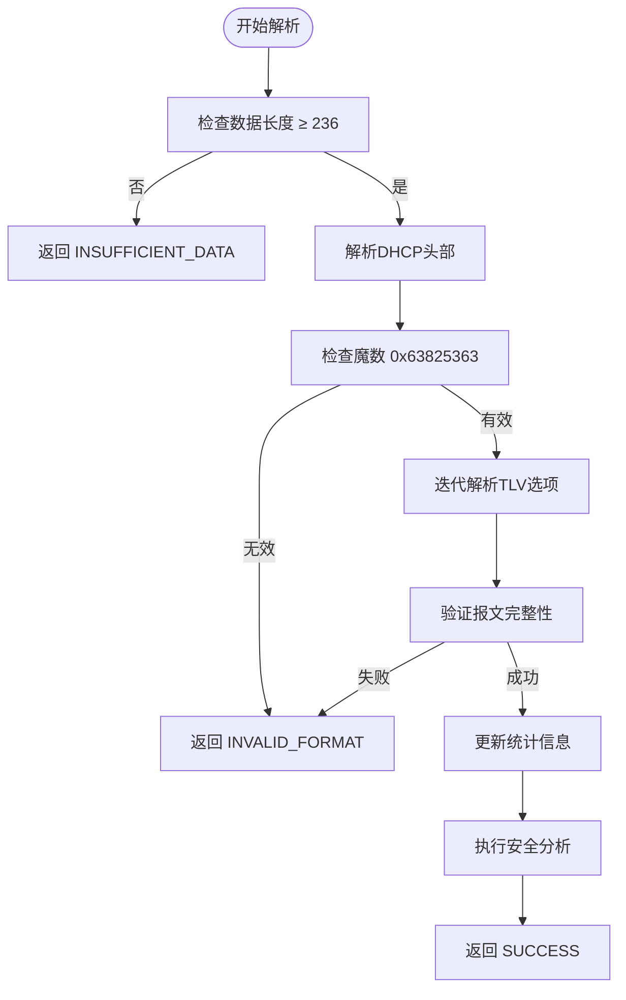
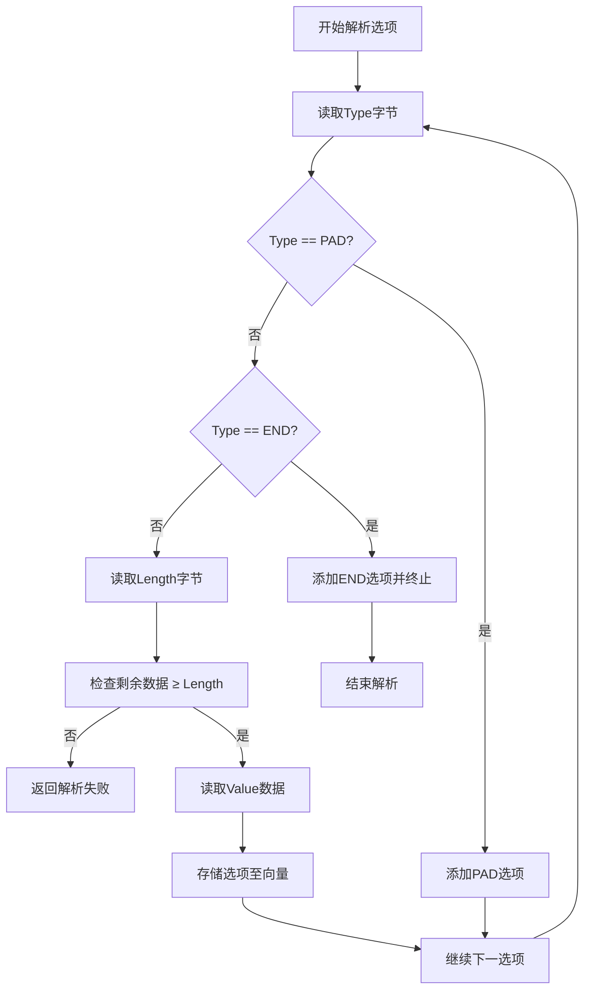
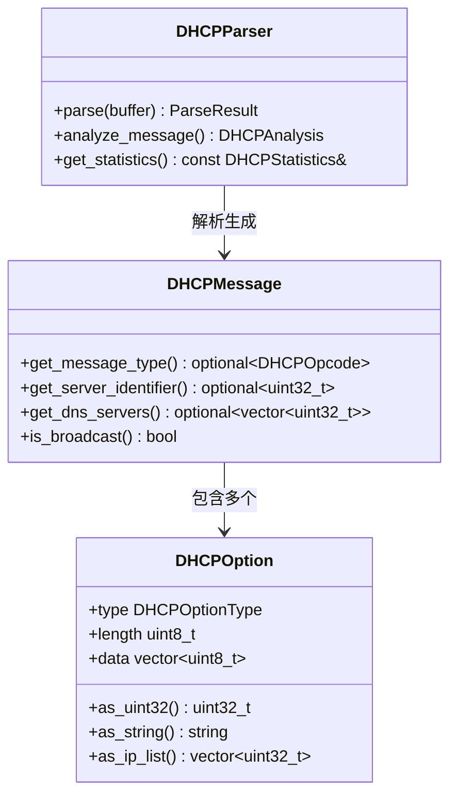

# DHCP解析器

<cite>
**本文档引用文件**  
- [dhcp_parser.hpp](file://include/parsers/application/dhcp_parser.hpp)
- [dhcp_parser.cpp](file://src/parsers/application/dhcp_parser.cpp)
</cite>

## 目录
1. [引言](#引言)
2. [DHCP消息结构解析](#dhcp消息结构解析)
3. [固定字段与头部映射](#固定字段与头部映射)
4. [变长选项字段TLV解析策略](#变长选项字段tlv解析策略)
5. [关键选项提取逻辑](#关键选项提取逻辑)
6. [消息类型识别与会话追踪](#消息类型识别与会话追踪)
7. [广播流量识别示例](#广播流量识别示例)
8. [安全与统计分析](#安全与统计分析)
9. [结论](#结论)

## 引言
动态主机配置协议（DHCP）是网络中自动分配IP地址及其他网络配置参数的核心协议。本项目中的`DHCPParser`类实现了对DHCPv4协议的完整解析，能够从原始网络数据包中提取结构化信息，支持对DISCOVER、OFFER、REQUEST、ACK等消息类型的识别，并结合MAC地址实现客户端会话追踪。本文档深入解析其工作机制，重点阐述DHCP头部字段映射、TLV格式选项解析及关键功能实现。

**Section sources**  
- [dhcp_parser.hpp](file://include/parsers/application/dhcp_parser.hpp#L1-L283)
- [dhcp_parser.cpp](file://src/parsers/application/dhcp_parser.cpp#L1-L518)

## DHCP消息结构解析
DHCP协议基于BOOTP框架，使用UDP传输，客户端使用端口68，服务器使用端口67。一个完整的DHCP消息由固定长度的头部和可变长度的选项字段组成。在代码中，`DHCPMessage`结构体封装了整个DHCP报文，包含`DHCPHeader`和`std::vector<DHCPOption>`类型的选项列表。

解析入口为`DHCPParser::parse(const BufferView& buffer)`方法，该方法首先检查缓冲区大小是否满足最小DHCP报文长度（236字节），然后依次解析头部和选项字段。若存在选项部分，则需验证魔数（Magic Cookie）为`0x63825363`后，再进行TLV格式的迭代解析。



**Diagram sources**  
- [dhcp_parser.cpp](file://src/parsers/application/dhcp_parser.cpp#L120-L180)

**Section sources**  
- [dhcp_parser.hpp](file://include/parsers/application/dhcp_parser.hpp#L150-L170)
- [dhcp_parser.cpp](file://src/parsers/application/dhcp_parser.cpp#L120-L180)

## 固定字段与头部映射
DHCP头部包含多个固定长度字段，定义于`DHCPHeader`结构体中。这些字段在内存中按网络字节序排列，解析时需进行字节序转换（ntoh系列函数）。主要字段包括：

- **op**：操作码，`BOOTREQUEST`（1）或`BOOTREPLY`（2）
- **htype**：硬件类型，如以太网为1
- **hlen**：硬件地址长度，以太网MAC为6字节
- **xid**：事务ID，用于匹配请求与响应
- **ciaddr/yiaddr/siaddr/giaddr**：客户端、分配、服务器、网关IP地址
- **chaddr**：16字节客户端硬件地址（通常为MAC）
- **flags**：标志位，最高位为1表示广播响应

在`parse_header`方法中，通过指针逐字段读取并赋值，同时调用`ntohl`、`ntohs`等函数转换字节序。例如，事务ID（xid）的解析如下：
```cpp
dhcp_message_.header.xid = ntohl(*reinterpret_cast<const uint32_t*>(ptr));
```

**Section sources**  
- [dhcp_parser.hpp](file://include/parsers/application/dhcp_parser.hpp#L100-L120)
- [dhcp_parser.cpp](file://src/parsers/application/dhcp_parser.cpp#L385-L420)

## 变长选项字段TLV解析策略
DHCP选项采用TLV（Type-Length-Value）格式，位于固定头部之后，以魔数`0x63825363`开头。选项字段的解析由`parse_options`和`parse_single_option`两个私有方法协同完成。

`parse_options`从指定偏移量开始循环调用`parse_single_option`，直到遇到`END`（255）选项或数据结束。`parse_single_option`的逻辑如下：
1. 读取`type`字节，转换为`DHCPOptionType`枚举
2. 若为`PAD`（0）或`END`（255），直接添加并返回
3. 否则读取`length`字节
4. 根据长度读取`value`数据
5. 将选项加入`options`向量

此过程确保了对任意顺序和数量的选项进行正确解析，同时跳过填充字节（PAD）并终止于END标记。



**Diagram sources**  
- [dhcp_parser.cpp](file://src/parsers/application/dhcp_parser.cpp#L385-L450)

**Section sources**  
- [dhcp_parser.hpp](file://include/parsers/application/dhcp_parser.hpp#L70-L90)
- [dhcp_parser.cpp](file://src/parsers/application/dhcp_parser.cpp#L385-L450)

## 关键选项提取逻辑
`DHCPMessage`类提供了多个便捷方法用于提取关键选项信息，这些方法通过遍历`options`向量查找特定`DHCPOptionType`并返回解析后的值。例如：

- `get_message_type()`：查找类型53（`DHCP_MESSAGE_TYPE`），返回第一个数据字节对应的`DHCPOpcode`
- `get_server_identifier()`：查找类型54（`DHCP_SERVER_IDENTIFIER`），返回4字节IP地址
- `get_dns_servers()`：查找类型6（`DNS_SERVER`），调用`as_ip_list()`将数据按4字节分组并转换为主机序IP
- `get_domain_name()`：查找类型15（`DOMAIN_NAME`），返回字符串形式的域名

`DHCPOption`结构体提供了`as_uint32()`、`as_string()`等方法，内部使用`ntohl`等函数进行字节序转换和数据解释，确保跨平台一致性。

**Section sources**  
- [dhcp_parser.hpp](file://include/parsers/application/dhcp_parser.hpp#L175-L195)
- [dhcp_parser.cpp](file://src/parsers/application/dhcp_parser.cpp#L49-L110)

## 消息类型识别与会话追踪
通过`get_message_type()`方法获取`DHCPOpcode`后，可判断消息类型：
- `DISCOVER`（1）、`REQUEST`（3）等为客户端请求
- `OFFER`（2）、`ACK`（5）等为服务器响应

在`analyze_message()`方法中，根据消息类型设置`is_client_request`或`is_server_response`标志。会话追踪依赖于两个关键字段：
1. **Transaction ID (xid)**：同一会话中请求与响应的xid必须相同
2. **Client Hardware Address (chaddr)**：客户端MAC地址，用于标识唯一客户端

此外，`mac_to_string`工具方法将`chaddr`前`hlen`字节格式化为标准MAC字符串（如`aa:bb:cc:dd:ee:ff`），便于日志记录和会话关联。



**Diagram sources**  
- [dhcp_parser.hpp](file://include/parsers/application/dhcp_parser.hpp#L150-L170)
- [dhcp_parser.cpp](file://src/parsers/application/dhcp_parser.cpp#L220-L280)

**Section sources**  
- [dhcp_parser.hpp](file://include/parsers/application/dhcp_parser.hpp#L175-L195)
- [dhcp_parser.cpp](file://src/parsers/application/dhcp_parser.cpp#L220-L280)

## 广播流量识别示例
在真实网络中，DHCP流量通常为广播。客户端发送的DISCOVER和REQUEST消息目的MAC为`ff:ff:ff:ff:ff:ff`，目的IP为`255.255.255.255`。服务器响应时，若客户端在`flags`字段设置了广播标志（最高位为1），则服务器也以广播方式发送OFFER和ACK。

在代码中，`is_broadcast()`方法检查`flags`字段是否设置了`DHCP_BROADCAST_FLAG`（0x80）。结合`EthernetHeader::is_broadcast()`和`IPv4Parser`中的广播地址检测，可完整识别DHCP广播流量。

例如，一个典型的DHCPDISCOVER包：
- UDP源端口68，目的端口67
- IP源地址0.0.0.0，目的地址255.255.255.255
- 以太网目的MAC为全F
- DHCP flags字段最高位为1
- 选项53为1（DISCOVER）

此类数据包可被`DHCPParser`正确识别并解析出客户端MAC、事务ID及请求选项列表。

**Section sources**  
- [dhcp_parser.hpp](file://include/parsers/application/dhcp_parser.hpp#L197-L200)
- [dhcp_parser.cpp](file://src/parsers/application/dhcp_parser.cpp#L112-L115)
- [ethernet_parser.cpp](file://src/parsers/datalink/ethernet_parser.cpp#L36-L40)
- [ipv4_parser.cpp](file://src/parsers/network/ipv4_parser.cpp#L342-L345)

## 安全与统计分析
`DHCPParser`内置了基本的验证和统计功能：
- **验证机制**：`validate_header`检查操作码、硬件类型和跳数；`validate_option`验证关键选项的数据长度
- **安全分析**：`perform_security_analysis`预留接口，可用于检测异常选项长度、伪造服务器标识等
- **统计信息**：`DHCPStatistics`结构体记录各类消息数量、选项使用频率及错误计数，便于网络监控

`analyze_message()`方法返回`DHCPAnalysis`结构，包含是否为中继代理、是否续租、厂商类标识等高级信息，为网络行为分析提供支持。

**Section sources**  
- [dhcp_parser.hpp](file://include/parsers/application/dhcp_parser.hpp#L210-L250)
- [dhcp_parser.cpp](file://src/parsers/application/dhcp_parser.cpp#L220-L320)
- [dhcp_parser.cpp](file://src/parsers/application/dhcp_parser.cpp#L470-L495)

## 结论
`DHCPParser`实现了一个健壮、高效的DHCPv4协议解析器，能够准确解析固定头部和TLV格式的选项字段，提取关键网络配置信息，并支持消息类型识别与客户端会话追踪。其模块化设计和丰富的分析接口使其适用于网络监控、安全审计和故障排查等多种场景。通过结合MAC地址和事务ID，可有效重建DHCP交互流程，为深入分析网络行为提供数据基础。