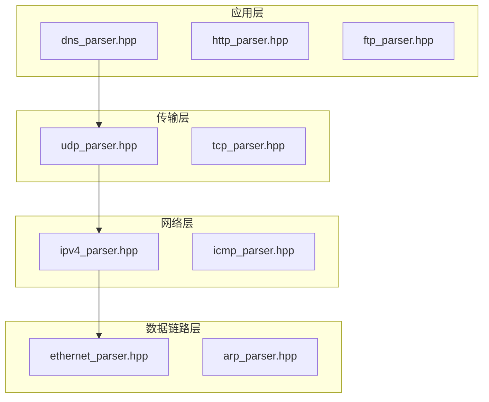
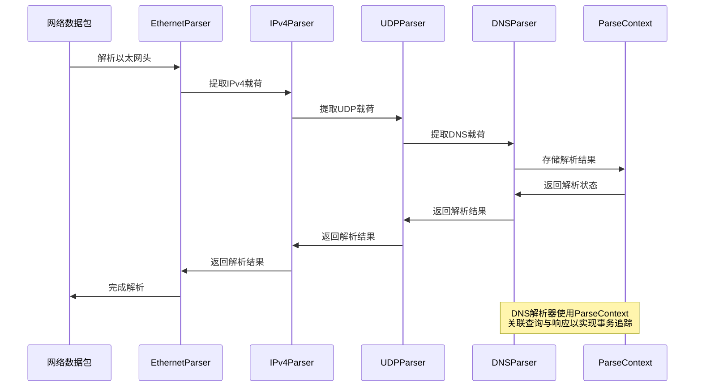
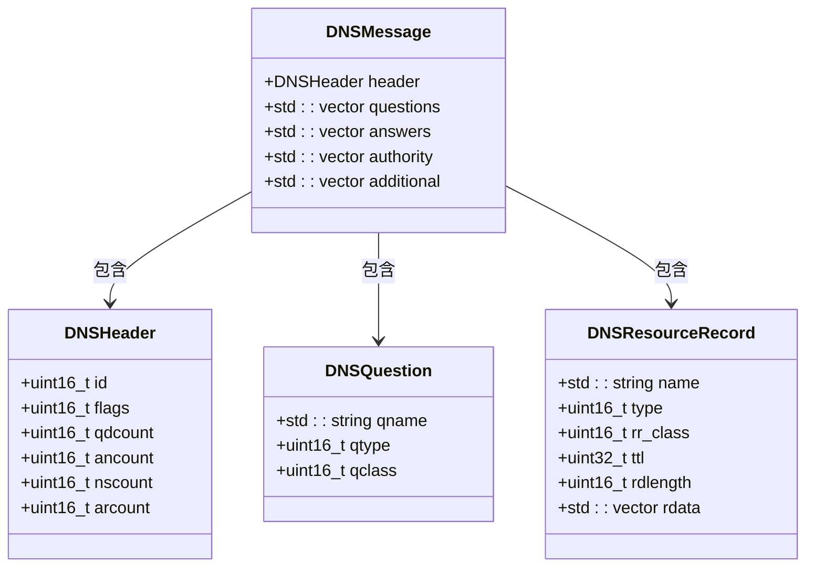
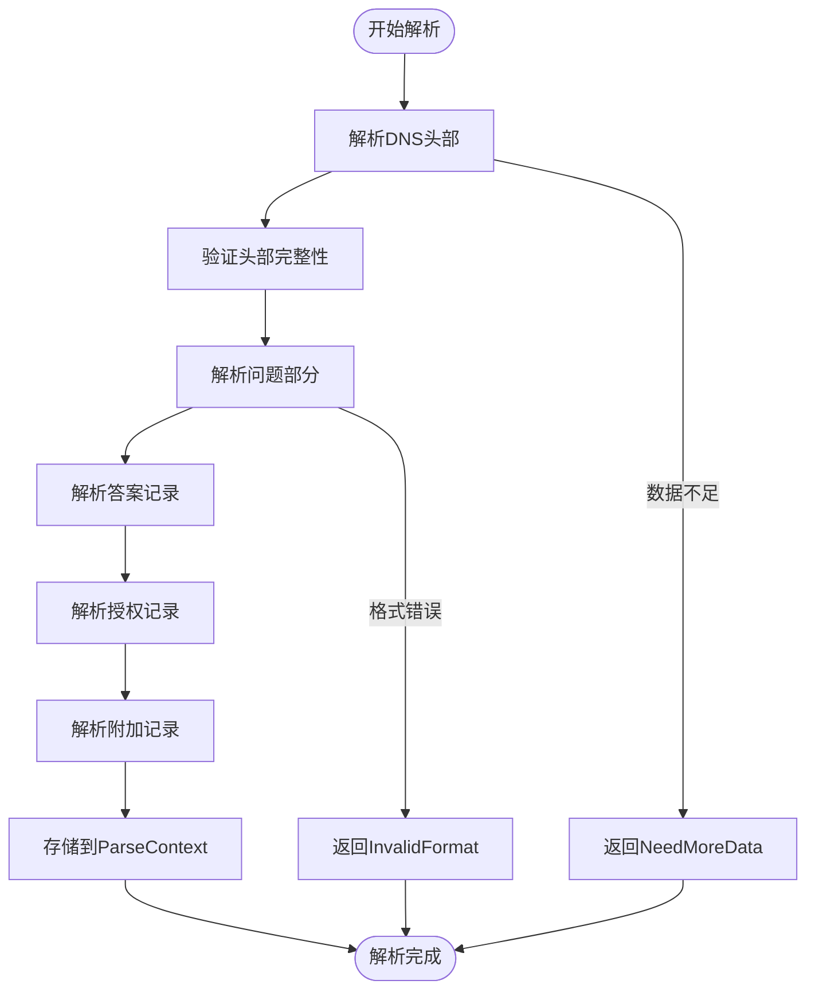
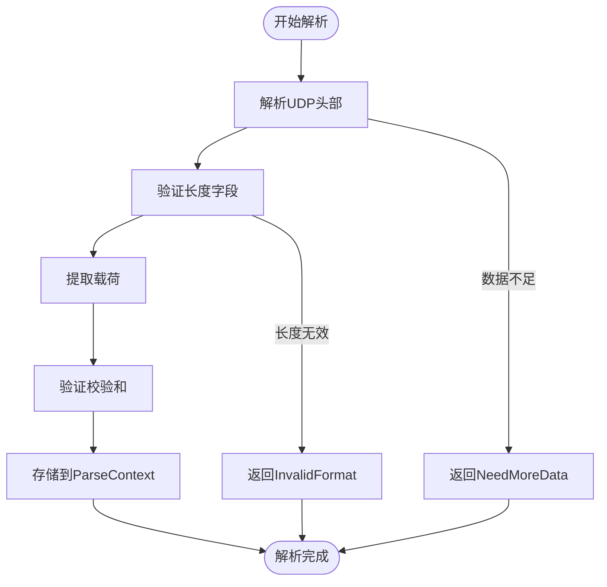

# DNS解析器

<cite>
**本文档引用的文件**  
- [dns_parser.hpp](file://include/parsers/application/dns_parser.hpp)
- [dns_parser.cpp](file://src/parsers/application/dns_parser.cpp)
- [base_parser.hpp](file://include/parsers/base_parser.hpp)
- [buffer_view.hpp](file://include/core/buffer_view.hpp)
- [udp_parser.hpp](file://include/parsers/transport/udp_parser.hpp)
- [udp_parser.cpp](file://src/parsers/transport/udp_parser.cpp)
- [ipv4_parser.hpp](file://include/parsers/network/ipv4_parser.hpp)
- [ipv4_parser.cpp](file://src/parsers/network/ipv4_parser.cpp)
- [ethernet_parser.hpp](file://include/parsers/datalink/ethernet_parser.hpp)
- [ethernet_parser.cpp](file://src/parsers/datalink/ethernet_parser.cpp)
</cite>

## 目录
1. [简介](#简介)
2. [项目结构](#项目结构)
3. [核心组件](#核心组件)
4. [架构概述](#架构概述)
5. [详细组件分析](#详细组件分析)
6. [依赖分析](#依赖分析)
7. [性能考虑](#性能考虑)
8. [故障排除指南](#故障排除指南)
9. [结论](#结论)

## 简介
本文档全面文档化DNS协议解析器的设计与实现，涵盖对DNS查询与响应消息的头部字段（如Transaction ID、Flags、Question Count）的位级解析技术。详细说明问题部分（Question Section）中QNAME的标签序列解码算法，以及资源记录（Resource Record）中TTL、数据长度和RDATA的结构化解析策略。描述对A、AAAA、CNAME、MX等常见记录类型的差异化处理逻辑，以及DNS压缩指针的递归解析机制。提供从UDP/TCP承载的DNS流量中正确提取完整消息的边界检测方案，并展示如何通过ParseContext关联查询与响应以实现事务追踪。

## 项目结构
本项目采用分层架构设计，将协议解析器按网络协议栈层次组织。核心解析逻辑位于`include/parsers`目录下，分为应用层、传输层、网络层和数据链路层四个子模块。每个解析器实现统一的`BaseParser`接口，确保解析行为的一致性。`core/buffer_view.hpp`提供高性能零拷贝缓冲区视图，支持SIMD加速查找和类型安全解析。

**图源**  
- [dns_parser.hpp](file://include/parsers/application/dns_parser.hpp)
- [udp_parser.hpp](file://include/parsers/transport/udp_parser.hpp)
- [ipv4_parser.hpp](file://include/parsers/network/ipv4_parser.hpp)
- [ethernet_parser.hpp](file://include/parsers/datalink/ethernet_parser.hpp)

**本节来源**  
- [dns_parser.hpp](file://include/parsers/application/dns_parser.hpp)
- [udp_parser.hpp](file://include/parsers/transport/udp_parser.hpp)

## 核心组件
DNS解析器的核心组件包括`DNSHeader`、`DNSQuestion`、`DNSResourceRecord`和`DNSMessage`结构体，分别表示DNS消息的头部、问题、资源记录和完整消息。`DNSParser`类继承自`BaseParser`，实现`parse`方法以解析DNS数据包。`ParseContext`用于在解析过程中传递上下文信息，包括缓冲区、偏移量和元数据。

**本节来源**  
- [dns_parser.hpp](file://include/parsers/application/dns_parser.hpp#L15-L145)
- [dns_parser.cpp](file://src/parsers/application/dns_parser.cpp#L1-L302)

## 架构概述
系统采用分层解析架构，从数据链路层开始逐层解析网络协议。每个解析器负责解析特定协议层，并将载荷传递给下一层解析器。`BufferView`提供统一的数据访问接口，支持零拷贝子视图创建和SIMD加速查找。`ParseContext`贯穿整个解析过程，用于存储解析状态和元数据。

**图源**  
- [dns_parser.cpp](file://src/parsers/application/dns_parser.cpp#L1-L302)
- [udp_parser.cpp](file://src/parsers/transport/udp_parser.cpp#L1-L106)
- [ipv4_parser.cpp](file://src/parsers/network/ipv4_parser.cpp#L1-L384)
- [ethernet_parser.cpp](file://src/parsers/datalink/ethernet_parser.cpp#L1-L240)

## 详细组件分析
### DNS解析器分析
DNS解析器负责解析DNS协议消息，包括头部、问题部分和资源记录。它支持DNS压缩指针的递归解析，并能正确处理各种记录类型。

#### DNS消息结构

**图源**  
- [dns_parser.hpp](file://include/parsers/application/dns_parser.hpp#L15-L90)

#### DNS解析流程

**图源**  
- [dns_parser.cpp](file://src/parsers/application/dns_parser.cpp#L1-L302)

**本节来源**  
- [dns_parser.hpp](file://include/parsers/application/dns_parser.hpp#L1-L145)
- [dns_parser.cpp](file://src/parsers/application/dns_parser.cpp#L1-L302)

### UDP解析器分析
UDP解析器负责解析UDP协议头部，并提取DNS载荷。

#### UDP解析流程

**图源**  
- [udp_parser.cpp](file://src/parsers/transport/udp_parser.cpp#L1-L106)

**本节来源**  
- [udp_parser.hpp](file://include/parsers/transport/udp_parser.hpp#L1-L70)
- [udp_parser.cpp](file://src/parsers/transport/udp_parser.cpp#L1-L106)

## 依赖分析
DNS解析器依赖于UDP解析器提取DNS载荷，UDP解析器依赖于IPv4解析器提取UDP载荷，IPv4解析器依赖于Ethernet解析器提取IPv4载荷。这种分层依赖关系确保了协议解析的正确性和可扩展性。

**图源**  
- [ethernet_parser.cpp](file://src/parsers/datalink/ethernet_parser.cpp#L1-L240)
- [ipv4_parser.cpp](file://src/parsers/network/ipv4_parser.cpp#L1-L384)
- [udp_parser.cpp](file://src/parsers/transport/udp_parser.cpp#L1-L106)
- [dns_parser.cpp](file://src/parsers/application/dns_parser.cpp#L1-L302)

**本节来源**  
- [ethernet_parser.cpp](file://src/parsers/datalink/ethernet_parser.cpp#L1-L240)
- [ipv4_parser.cpp](file://src/parsers/network/ipv4_parser.cpp#L1-L384)
- [udp_parser.cpp](file://src/parsers/transport/udp_parser.cpp#L1-L106)
- [dns_parser.cpp](file://src/parsers/application/dns_parser.cpp#L1-L302)

## 性能考虑
系统采用零拷贝设计，`BufferView`通过引用计数管理缓冲区生命周期，避免不必要的内存复制。`BufferView`支持SIMD加速查找，可显著提高模式匹配性能。解析器采用状态机设计，支持增量解析，适用于流式数据处理。

## 故障排除指南
当DNS解析失败时，应首先检查`ParseContext`中的元数据，确认各层协议解析是否成功。若UDP校验和验证失败，可能是数据包在传输过程中被损坏。若DNS头部解析失败，可能是数据包不完整或格式错误。可通过`get_error_message()`方法获取详细的错误信息。

**本节来源**  
- [dns_parser.cpp](file://src/parsers/application/dns_parser.cpp#L1-L302)
- [udp_parser.cpp](file://src/parsers/transport/udp_parser.cpp#L1-L106)
- [base_parser.hpp](file://include/parsers/base_parser.hpp#L1-L188)

## 结论
本文档详细描述了DNS协议解析器的设计与实现。系统采用分层架构，各解析器通过统一接口协作，确保了解析过程的正确性和可扩展性。`BufferView`和`ParseContext`的设计支持高效的数据访问和状态管理，为高性能网络协议分析提供了坚实基础。