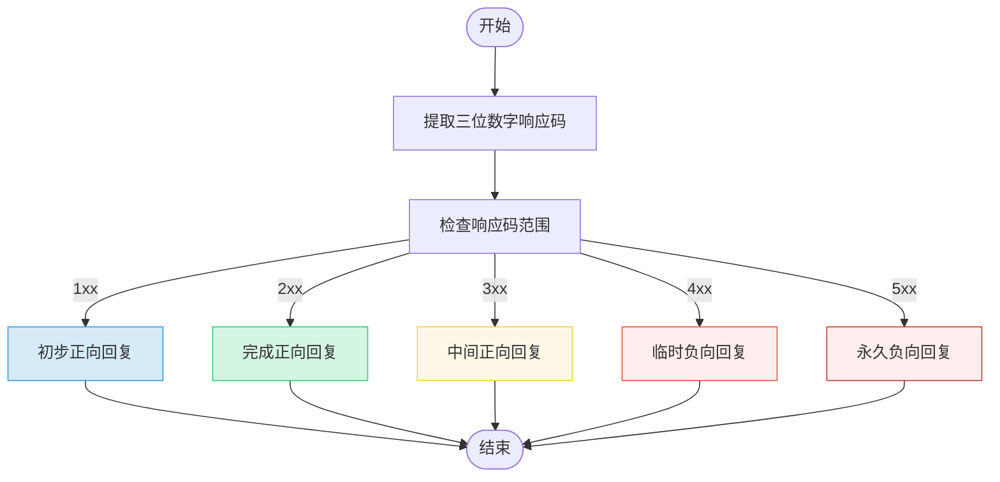

# FTP解析器

<cite>
**本文档引用的文件**
- [ftp_parser.hpp](file://include/parsers/application/ftp_parser.hpp)
- [ftp_parser.cpp](file://src/parsers/application/ftp_parser.cpp)
- [base_parser.hpp](file://include/parsers/base_parser.hpp)
</cite>

## 目录
1. [简介](#简介)
2. [项目结构](#项目结构)
3. [核心组件](#核心组件)
4. [架构概述](#架构概述)
5. [详细组件分析](#详细组件分析)
6. [依赖分析](#依赖分析)
7. [性能考虑](#性能考虑)
8. [故障排除指南](#故障排除指南)
9. [结论](#结论)

## 简介
本文档系统性地文档化FTP协议解析器的双通道识别能力，重点说明如何通过命令通道（默认端口21）中的ASCII命令（如USER、PASS、PORT、PASV）实现协议识别。描述状态机如何跟踪FTP会话阶段（认证、主动/被动模式协商、数据传输），并解析PORT命令中的IP地址与端口信息以关联数据通道。阐述对响应码（如220、331、226）的语义解析逻辑，以及如何通过命令序列模式识别文件传输行为。提供从TCP流中分离命令与数据通道元数据的分析示例，强调上下文感知解析的必要性。

## 项目结构
FTP协议解析器位于`include/parsers/application/`和`src/parsers/application/`目录下，作为协议解析框架的一部分。该解析器继承自`BaseParser`基类，遵循统一的解析接口规范。项目采用分层架构，将解析逻辑与底层网络数据处理分离，支持多种应用层协议的扩展。


**Diagram sources**
- [ftp_parser.hpp](file://include/parsers/application/ftp_parser.hpp#L1-L225)
- [base_parser.hpp](file://include/parsers/base_parser.hpp#L1-L187)

**Section sources**
- [ftp_parser.hpp](file://include/parsers/application/ftp_parser.hpp#L1-L225)
- [base_parser.hpp](file://include/parsers/base_parser.hpp#L1-L187)

## 核心组件
FTP解析器的核心组件包括命令与响应的解析逻辑、状态跟踪机制、协议识别方法以及双通道关联能力。解析器通过识别命令通道中的ASCII命令（如USER、PASS、PORT、PASV）来实现协议识别，并利用状态机跟踪FTP会话的不同阶段。

**Section sources**
- [ftp_parser.hpp](file://include/parsers/application/ftp_parser.hpp#L1-L225)
- [ftp_parser.cpp](file://src/parsers/application/ftp_parser.cpp#L1-L495)

## 架构概述
FTP解析器采用面向对象的设计模式，继承自`BaseParser`基类，实现了统一的解析接口。解析器通过状态机机制跟踪FTP会话的各个阶段，包括连接建立、用户认证、模式协商和数据传输等。命令通道使用默认端口21，而数据通道则根据主动或被动模式动态分配端口。


**Diagram sources**
- [ftp_parser.hpp](file://include/parsers/application/ftp_parser.hpp#L1-L225)
- [base_parser.hpp](file://include/parsers/base_parser.hpp#L1-L187)

## 详细组件分析

### FTP解析器分析
FTP解析器实现了完整的FTP协议解析功能，能够识别命令和响应消息，并提取关键信息用于会话跟踪和行为分析。

#### 命令与响应解析


**Diagram sources**
- [ftp_parser.cpp](file://src/parsers/application/ftp_parser.cpp#L25-L100)
- [ftp_parser.hpp](file://include/parsers/application/ftp_parser.hpp#L168-L223)

#### 状态机与会话跟踪
```mermaid
stateDiagram-v2
[*] --> Idle
Idle --> Authentication : "USER command"
Authentication --> Authentication : "PASS command"
Authentication --> Authenticated : "230 User logged in"
Authenticated --> ActiveMode : "PORT command"
Authenticated --> PassiveMode : "PASV command"
ActiveMode --> DataTransfer : "200 Command OK"
PassiveMode --> DataTransfer : "227 Entering passive mode"
DataTransfer --> Authenticated : "226 Data connection closed"
Authenticated --> Idle : "QUIT command"
note right of Authentication
用户名和密码验证阶段
end
note right of ActiveMode
客户端指定数据通道地址和端口
end
note right of PassiveMode
服务器指定数据通道端口
end
```

**Diagram sources**
- [ftp_parser.cpp](file://src/parsers/application/ftp_parser.cpp#L200-L300)
- [base_parser.hpp](file://include/parsers/base_parser.hpp#L54-L54)

#### 响应码语义解析


**Diagram sources**
- [ftp_parser.cpp](file://src/parsers/application/ftp_parser.cpp#L350-L400)
- [ftp_parser.hpp](file://include/parsers/application/ftp_parser.hpp#L25-L120)

**Section sources**
- [ftp_parser.cpp](file://src/parsers/application/ftp_parser.cpp#L1-L495)
- [ftp_parser.hpp](file://include/parsers/application/ftp_parser.hpp#L1-L225)

## 依赖分析
FTP解析器依赖于基础解析框架提供的通用功能，包括缓冲区视图管理、解析上下文维护和状态机机制。同时，它与其他应用层协议解析器共享相同的接口规范，便于集成到统一的协议分析系统中。


**Diagram sources**
- [base_parser.hpp](file://include/parsers/base_parser.hpp#L1-L187)
- [ftp_parser.hpp](file://include/parsers/application/ftp_parser.hpp#L1-L225)

**Section sources**
- [base_parser.hpp](file://include/parsers/base_parser.hpp#L1-L187)
- [ftp_parser.hpp](file://include/parsers/application/ftp_parser.hpp#L1-L225)

## 性能考虑
FTP解析器在设计时考虑了性能优化，采用高效的字符串处理算法和内存管理策略。解析过程中避免不必要的内存分配，使用栈上对象存储临时数据。对于多行响应的处理，采用流式解析方式，减少内存占用。

## 故障排除指南
当FTP解析出现问题时，可检查以下方面：
- 确保输入数据符合FTP协议格式
- 验证TCP流是否完整，特别是多行响应的完整性
- 检查命令和响应的顺序是否符合FTP协议规范
- 确认PORT命令中的IP地址和端口信息是否正确解析

**Section sources**
- [ftp_parser.cpp](file://src/parsers/application/ftp_parser.cpp#L450-L495)
- [ftp_parser.hpp](file://include/parsers/application/ftp_parser.hpp#L200-L223)

## 结论
FTP解析器成功实现了对FTP协议的双通道识别能力，能够准确解析命令通道中的ASCII命令，并通过状态机跟踪会话阶段。解析器对响应码的语义解析逻辑完善，支持主动和被动模式下的数据通道关联。整体设计遵循模块化原则，易于维护和扩展。