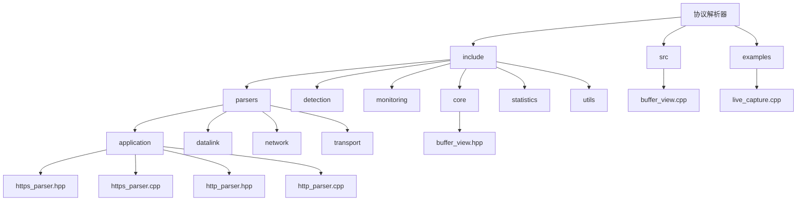
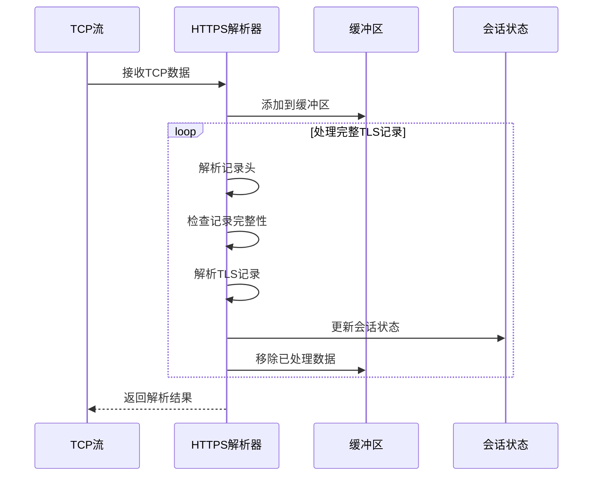
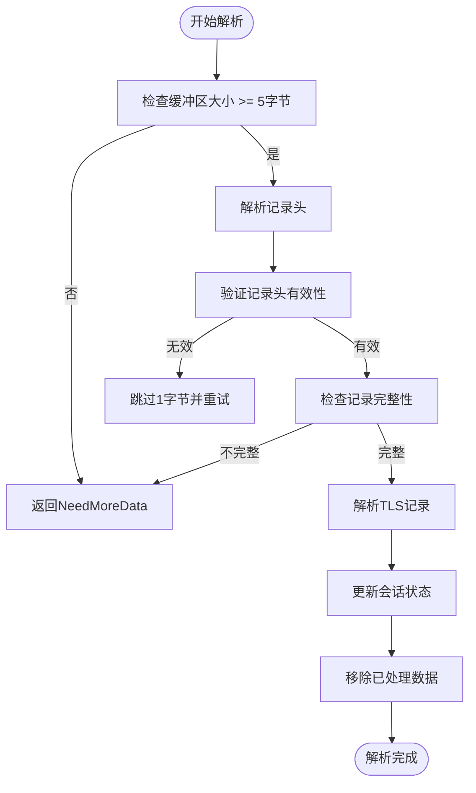
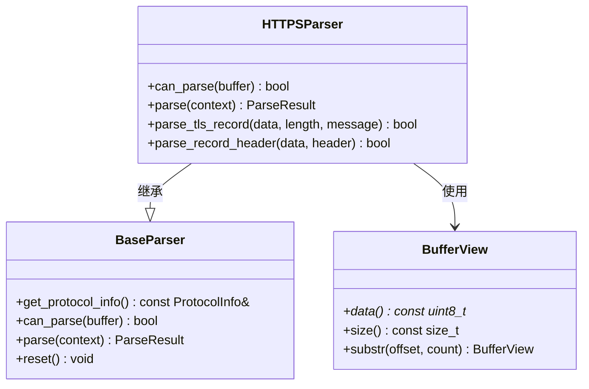
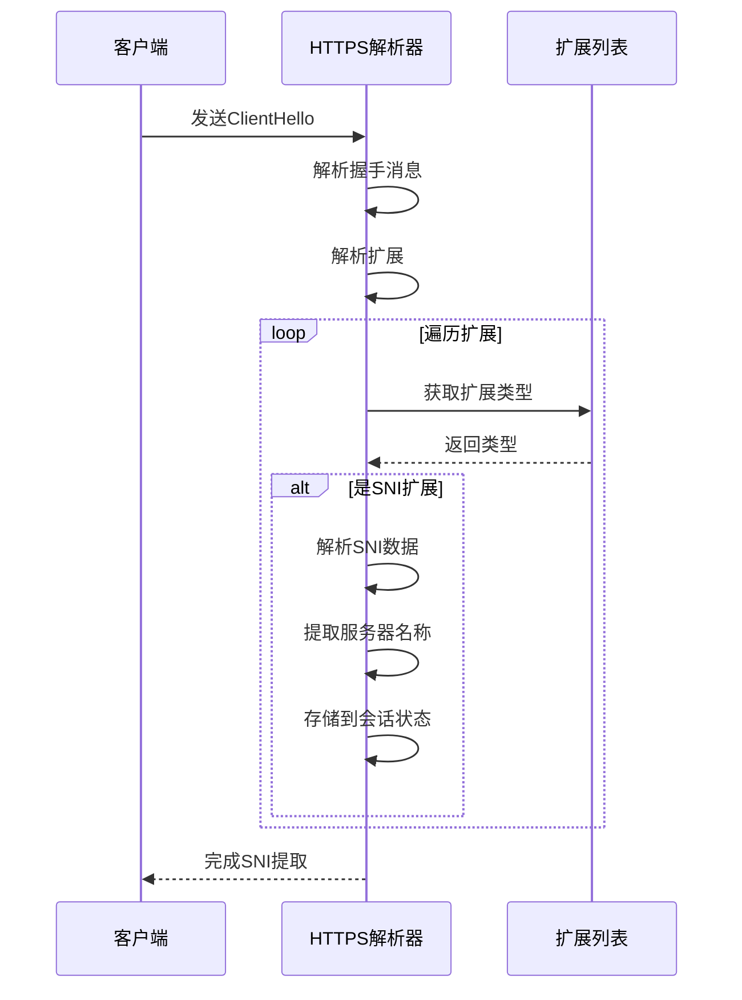
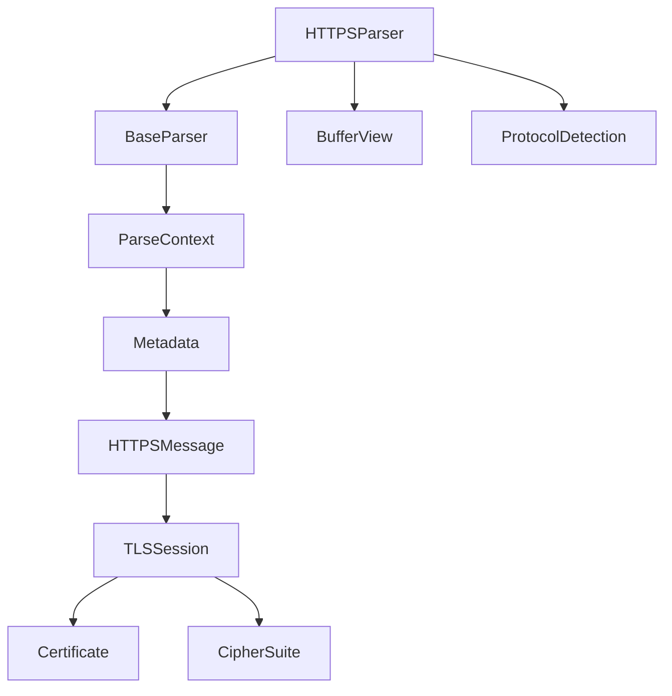

# HTTPS解析器

<cite>
**本文档引用的文件**
- [https_parser.hpp](file://include/parsers/application/https_parser.hpp)
- [https_parser.cpp](file://src/parsers/application/https_parser.cpp)
- [base_parser.hpp](file://include/parsers/base_parser.hpp)
- [buffer_view.hpp](file://include/core/buffer_view.hpp)
- [buffer_view.cpp](file://src/core/buffer_view.cpp)
- [http_parser.cpp](file://src/parsers/application/http_parser.cpp)
- [live_capture.cpp](file://examples/live_capture.cpp)
</cite>

## 目录
1. [引言](#引言)
2. [项目结构](#项目结构)
3. [核心组件](#核心组件)
4. [架构概述](#架构概述)
5. [详细组件分析](#详细组件分析)
6. [依赖分析](#依赖分析)
7. [性能考虑](#性能考虑)
8. [故障排除指南](#故障排除指南)
9. [结论](#结论)

## 引言
本文档系统性地描述了HTTPS协议的识别与解析流程，重点阐述如何通过TLS记录层协议特征在不解密的情况下实现零拷贝协议识别。文档详细说明了解析器如何结合TCP端口（443）与载荷前缀模式匹配进行启发式判断，区分纯TLS流量与其他基于TLS的应用协议。同时，阐述了ParseResult中对加密载荷的透明封装策略，以及如何将TLS记录层信息传递给上层安全分析模块。提供了混合HTTP/HTTPS流量环境中协议分流的代码示例，并讨论了SNI（Server Name Indication）提取的扩展可能性。

## 项目结构
项目采用分层架构设计，包含核心组件、检测模块、监控模块、解析器模块、统计模块和工具模块。解析器模块进一步细分为数据链路层、网络层、传输层和应用层解析器。

**图示来源**
- [https_parser.hpp](file://include/parsers/application/https_parser.hpp)
- [https_parser.cpp](file://src/parsers/application/https_parser.cpp)
- [buffer_view.hpp](file://include/core/buffer_view.hpp)
- [buffer_view.cpp](file://src/core/buffer_view.cpp)

**本节来源**
- [https_parser.hpp](file://include/parsers/application/https_parser.hpp)
- [https_parser.cpp](file://src/parsers/application/https_parser.cpp)

## 核心组件
HTTPS解析器的核心组件包括TLS记录头解析、握手消息解析、扩展解析和会话状态管理。解析器通过零拷贝方式处理TLS记录，利用BufferView实现高性能数据访问。

**本节来源**
- [https_parser.hpp](file://include/parsers/application/https_parser.hpp#L1-L318)
- [https_parser.cpp](file://src/parsers/application/https_parser.cpp#L1-L608)

## 架构概述
HTTPS解析器采用分层解析架构，从TCP流中识别TLS记录，解析记录头，然后根据内容类型分发到相应的解析器。解析器维护会话状态，跟踪TLS握手过程，并提取关键信息如SNI。

**图示来源**
- [https_parser.cpp](file://src/parsers/application/https_parser.cpp#L100-L200)
- [https_parser.hpp](file://include/parsers/application/https_parser.hpp#L200-L300)

## 详细组件分析

### TLS记录解析分析
HTTPS解析器通过分析TLS记录头中的Content Type、Protocol Version和Length字段来识别和解析TLS流量。解析器首先检查数据缓冲区是否足够大以包含完整的TLS记录头。

**图示来源**
- [https_parser.cpp](file://src/parsers/application/https_parser.cpp#L100-L150)
- [https_parser.hpp](file://include/parsers/application/https_parser.hpp#L250-L300)

**本节来源**
- [https_parser.cpp](file://src/parsers/application/https_parser.cpp#L100-L200)
- [https_parser.hpp](file://include/parsers/application/https_parser.hpp#L200-L300)

### 协议识别机制
HTTPS解析器使用多种机制进行协议识别，包括端口检查、内容类型验证和载荷模式匹配。解析器首先检查TCP端口是否为443，然后验证TLS记录头的Content Type字段。

**图示来源**
- [https_parser.hpp](file://include/parsers/application/https_parser.hpp#L1-L100)
- [base_parser.hpp](file://include/parsers/base_parser.hpp#L1-L100)
- [buffer_view.hpp](file://include/core/buffer_view.hpp#L1-L100)

**本节来源**
- [https_parser.hpp](file://include/parsers/application/https_parser.hpp#L1-L100)
- [base_parser.hpp](file://include/parsers/base_parser.hpp#L1-L100)

### SNI提取分析
SNI（Server Name Indication）扩展允许客户端在TLS握手期间指定目标主机名。HTTPS解析器能够解析SNI扩展并提取服务器名称，这对于流量分类和安全分析非常重要。

**图示来源**
- [https_parser.cpp](file://src/parsers/application/https_parser.cpp#L400-L450)
- [https_parser.hpp](file://include/parsers/application/https_parser.hpp#L150-L200)

**本节来源**
- [https_parser.cpp](file://src/parsers/application/https_parser.cpp#L400-L450)
- [https_parser.hpp](file://include/parsers/application/https_parser.hpp#L150-L200)

## 依赖分析
HTTPS解析器依赖于核心BufferView类进行高效的数据访问，同时继承自BaseParser类以实现统一的解析接口。解析器还依赖于协议检测模块来确定是否可以解析给定的数据流。

**图示来源**
- [https_parser.hpp](file://include/parsers/application/https_parser.hpp)
- [base_parser.hpp](file://include/parsers/base_parser.hpp)
- [buffer_view.hpp](file://include/core/buffer_view.hpp)

**本节来源**
- [https_parser.hpp](file://include/parsers/application/https_parser.hpp)
- [base_parser.hpp](file://include/parsers/base_parser.hpp)

## 性能考虑
HTTPS解析器设计时充分考虑了性能因素，采用零拷贝技术减少内存复制开销。BufferView类支持SIMD加速查找，提高了模式匹配的效率。解析器还使用缓冲区来处理分段的TLS记录，避免了不必要的数据重组。

**本节来源**
- [buffer_view.hpp](file://include/core/buffer_view.hpp#L50-L100)
- [buffer_view.cpp](file://src/core/buffer_view.cpp#L100-L200)

## 故障排除指南
当HTTPS解析器遇到问题时，可以检查以下几个方面：确保输入数据缓冲区足够大以包含完整的TLS记录头；验证TLS记录头的Content Type是否在有效范围内；检查协议版本是否被支持；确认缓冲区中包含完整的TLS记录。

**本节来源**
- [https_parser.cpp](file://src/parsers/application/https_parser.cpp#L150-L200)
- [https_parser.hpp](file://include/parsers/application/https_parser.hpp#L250-L300)

## 结论
HTTPS解析器成功实现了基于TLS记录层特征的零拷贝协议识别。通过结合TCP端口检查和载荷前缀模式匹配，解析器能够准确区分HTTPS流量与其他TLS应用协议。SNI提取功能为流量分析提供了重要信息。整体设计注重性能和可扩展性，为网络安全分析提供了可靠的基础。