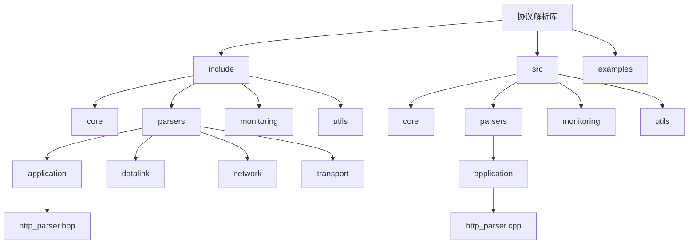
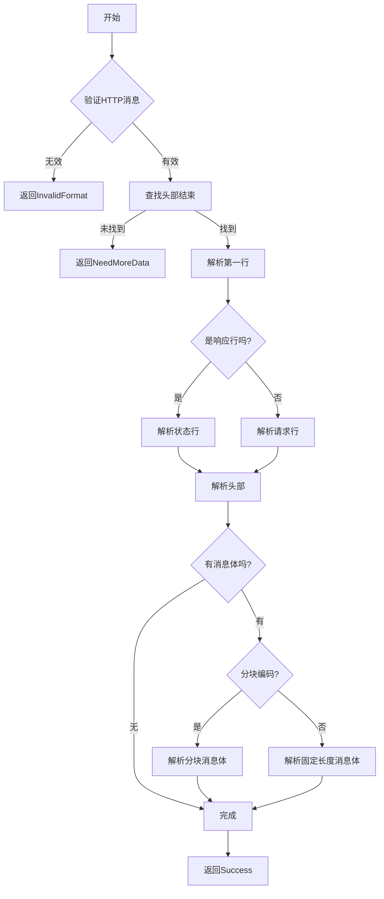
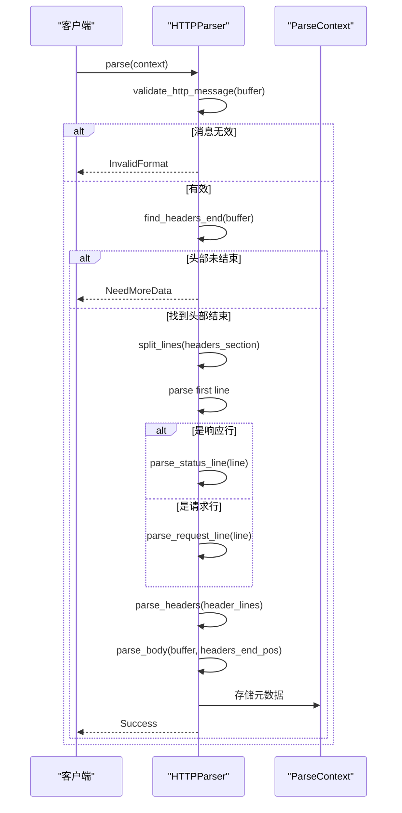
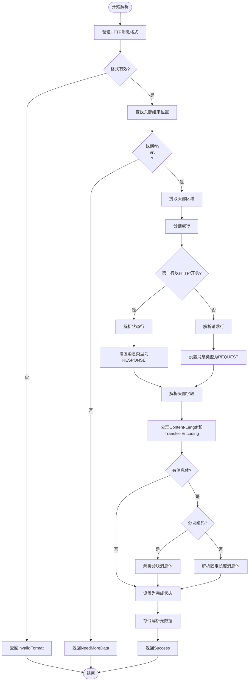
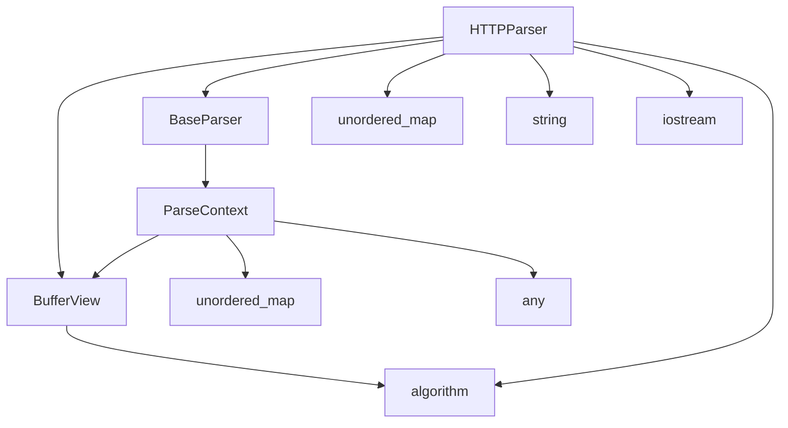

# HTTP解析器

<cite>
**本文档引用的文件**
- [http_parser.hpp](file://include/parsers/application/http_parser.hpp)
- [http_parser.cpp](file://src/parsers/application/http_parser.cpp)
- [buffer_view.hpp](file://include/core/buffer_view.hpp)
- [base_parser.hpp](file://include/parsers/base_parser.hpp)
- [README.md](file://README.md)
</cite>

## 目录
1. [简介](#简介)
2. [项目结构](#项目结构)
3. [核心组件](#核心组件)
4. [架构概述](#架构概述)
5. [详细组件分析](#详细组件分析)
6. [依赖分析](#依赖分析)
7. [性能考虑](#性能考虑)
8. [故障排除指南](#故障排除指南)
9. [结论](#结论)

## 简介
本文档详细说明了HTTP协议解析器的实现机制，重点描述了对HTTP请求行（Method, URI, Version）和响应行（Status Code, Reason Phrase）的快速状态机解析策略。文档涵盖了头部字段的逐字符解析优化技术，支持分块传输编码（Chunked Encoding）的流式处理逻辑，以及如何通过Content-Length或关闭连接判断消息边界。结合ParseContext传递解析状态，展示了与TCP传输层的协同工作流程。

## 项目结构
该项目是一个基于C++20的高性能网络协议解析库，采用模块化设计，支持从数据链路层到应用层的完整协议栈解析。项目结构清晰地分离了核心组件、解析器、监控和工具模块，便于扩展和维护。



**图示来源**
- [http_parser.hpp](file://include/parsers/application/http_parser.hpp)
- [http_parser.cpp](file://src/parsers/application/http_parser.cpp)

**章节来源**
- [README.md](file://README.md)

## 核心组件
HTTP解析器的核心组件包括HTTPParser类、HTTPMessage结构体以及相关的枚举类型。这些组件共同实现了HTTP协议的完整解析功能，支持请求和响应消息的解析，并提供了丰富的接口来访问解析结果。

**章节来源**
- [http_parser.hpp](file://include/parsers/application/http_parser.hpp#L1-L135)
- [http_parser.cpp](file://src/parsers/application/http_parser.cpp#L1-L500)

## 架构概述
HTTP解析器采用基于状态机的设计模式，继承自BaseParser基类。解析过程分为多个阶段：首先验证消息格式，然后查找头部结束位置，接着解析请求行或状态行，随后解析头部字段，最后处理消息体。整个解析过程充分利用了BufferView的零拷贝特性，确保了高性能。



**图示来源**
- [http_parser.cpp](file://src/parsers/application/http_parser.cpp#L1-L500)
- [http_parser.hpp](file://include/parsers/application/http_parser.hpp#L1-L135)

## 详细组件分析
### HTTP解析器分析
HTTPParser类实现了HTTP协议的完整解析功能，通过状态机模式逐步解析HTTP消息的各个部分。解析器首先验证消息的基本格式，然后定位头部结束位置，接着解析请求行或状态行，随后逐个解析头部字段，最后根据Content-Length或Transfer-Encoding头部处理消息体。

#### 对象导向组件
```mermaid
classDiagram
class HTTPParser {
-http_message_ : HTTPMessage
-is_complete_ : bool
-expected_body_length_ : size_t
-is_chunked_ : bool
-error_message_ : string
+parse(context) : ParseResult
+get_protocol_info() : ProtocolInfo
+can_parse(buffer) : bool
+get_progress() : double
+reset() : void
+get_error_message() : string
+get_message_type() : HTTPMessageType
+is_request() : bool
+is_response() : bool
+is_complete() : bool
+get_method() : HTTPMethod
+get_uri() : string
+get_status_code() : uint16_t
+get_reason_phrase() : string
+get_version() : HTTPVersion
+get_header(name) : string
+get_headers() : unordered_map~string,string~
+get_body() : string
+get_content_length() : size_t
+is_chunked_encoding() : bool
+is_keep_alive() : bool
+method_to_string(method) : string
+string_to_method(method_str) : HTTPMethod
+version_to_string(version) : string
+string_to_version(version_str) : HTTPVersion
}
class HTTPMessage {
-type : HTTPMessageType
-request : HTTPRequest
-response : HTTPResponse
+HTTPMessage()
+~HTTPMessage()
+HTTPMessage(const HTTPMessage&)
+operator=(const HTTPMessage&) : HTTPMessage&
+HTTPMessage(HTTPMessage&&)
+operator=(HTTPMessage&&) : HTTPMessage&
}
class HTTPRequest {
-method : HTTPMethod
-uri : string
-version : HTTPVersion
-headers : unordered_map~string,string~
-body : string
}
class HTTPResponse {
-version : HTTPVersion
-status_code : uint16_t
-reason_phrase : string
-headers : unordered_map~string,string~
-body : string
}
enum HTTPMethod {
GET
POST
PUT
DELETE_METHOD
HEAD
OPTIONS
PATCH
TRACE
CONNECT
UNKNOWN
}
enum HTTPVersion {
HTTP_1_0
HTTP_1_1
HTTP_2_0
UNKNOWN
}
enum HTTPMessageType {
REQUEST
RESPONSE
UNKNOWN
}
HTTPParser --> HTTPMessage : "包含"
HTTPMessage --> HTTPRequest : "包含"
HTTPMessage --> HTTPResponse : "包含"
```

**图示来源**
- [http_parser.hpp](file://include/parsers/application/http_parser.hpp#L1-L135)
- [http_parser.cpp](file://src/parsers/application/http_parser.cpp#L1-L500)

#### API/服务组件


**图示来源**
- [http_parser.cpp](file://src/parsers/application/http_parser.cpp#L1-L500)
- [base_parser.hpp](file://include/parsers/base_parser.hpp#L1-L188)

#### 复杂逻辑组件


**图示来源**
- [http_parser.cpp](file://src/parsers/application/http_parser.cpp#L1-L500)
- [http_parser.hpp](file://include/parsers/application/http_parser.hpp#L1-L135)

**章节来源**
- [http_parser.cpp](file://src/parsers/application/http_parser.cpp#L1-L500)
- [http_parser.hpp](file://include/parsers/application/http_parser.hpp#L1-L135)

## 依赖分析
HTTP解析器依赖于多个核心组件，包括BufferView用于高效的数据访问，BaseParser提供解析器的基本接口，以及标准库组件如unordered_map和string。这些依赖关系确保了解析器的高性能和可扩展性。



**图示来源**
- [http_parser.hpp](file://include/parsers/application/http_parser.hpp#L1-L135)
- [base_parser.hpp](file://include/parsers/base_parser.hpp#L1-L188)
- [buffer_view.hpp](file://include/core/buffer_view.hpp#L1-L137)

**章节来源**
- [http_parser.hpp](file://include/parsers/application/http_parser.hpp#L1-L135)
- [base_parser.hpp](file://include/parsers/base_parser.hpp#L1-L188)

## 性能考虑
HTTP解析器在设计时充分考虑了性能优化，采用了多种技术来提高解析效率。通过使用BufferView实现零拷贝数据访问，利用SIMD指令加速字段分隔符查找，避免动态内存分配，以及采用高效的字符串处理算法，确保了解析器在高吞吐场景下的卓越性能。

## 故障排除指南
当HTTP解析器遇到问题时，可以通过检查解析器返回的状态码来诊断问题。ParseResult枚举提供了详细的错误信息，包括NeedMoreData表示需要更多数据，InvalidFormat表示格式错误等。此外，可以通过get_error_message方法获取具体的错误描述，帮助定位和解决问题。

**章节来源**
- [http_parser.cpp](file://src/parsers/application/http_parser.cpp#L1-L500)
- [http_parser.hpp](file://include/parsers/application/http_parser.hpp#L1-L135)

## 结论
HTTP解析器通过精心设计的状态机架构和高效的实现策略，成功实现了对HTTP协议的快速解析。其模块化的设计使得代码易于维护和扩展，而对性能的深入优化确保了在高负载环境下的稳定表现。该解析器是整个协议解析库中的关键组件，为上层应用提供了可靠的数据解析服务。