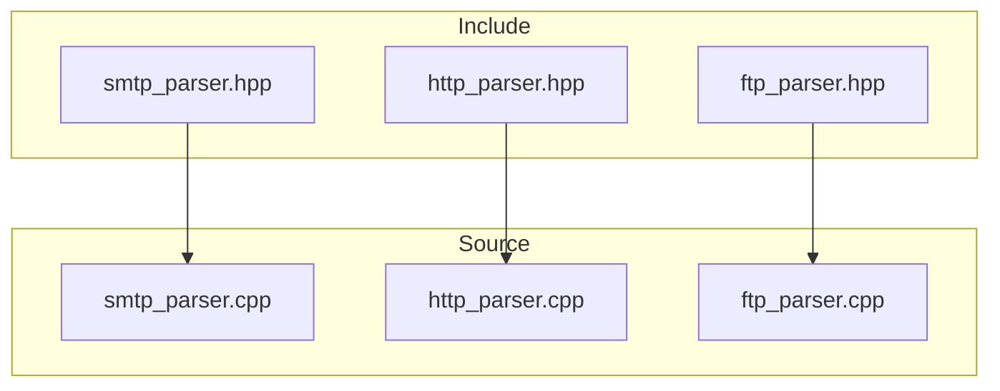
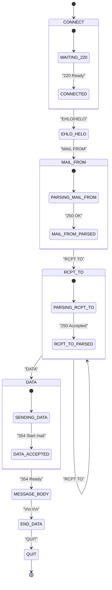
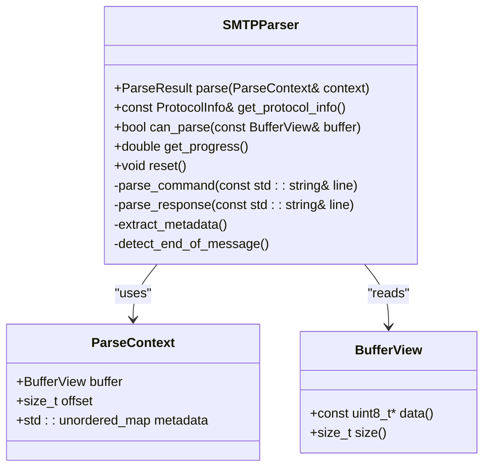
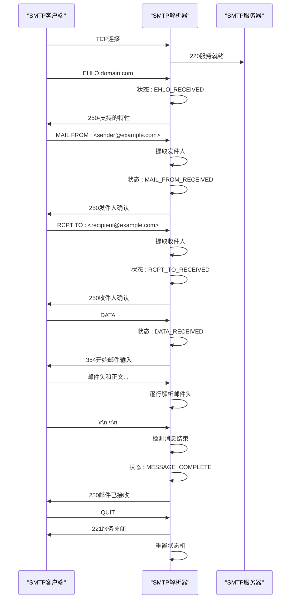
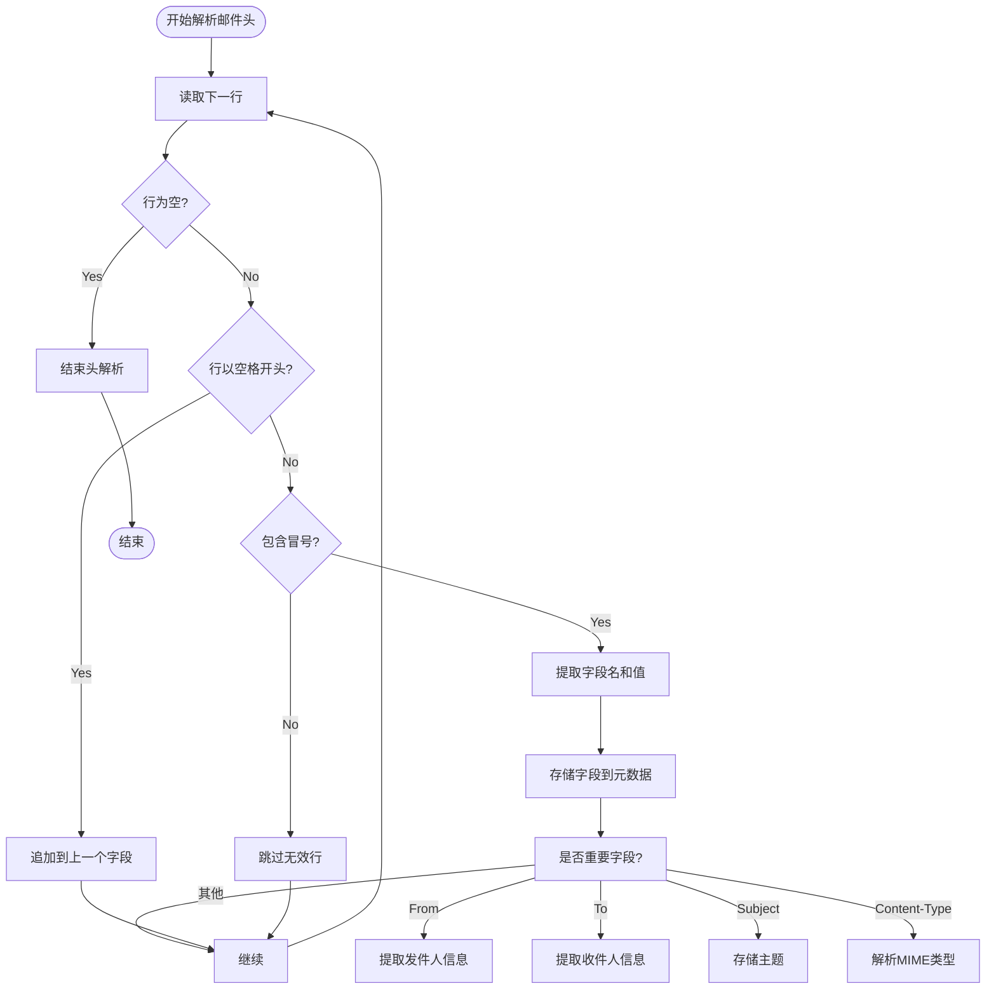
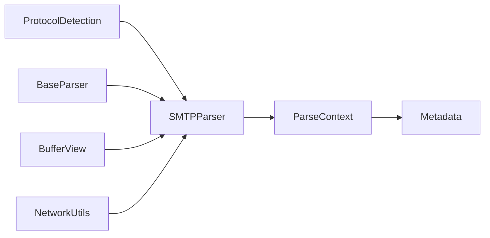

# SMTP解析器

<cite>
**本文档引用的文件**
- [smtp_parser.hpp](file://include/parsers/application/smtp_parser.hpp)
- [smtp_parser.cpp](file://src/parsers/application/smtp_parser.cpp)
- [protocol_detection.cpp](file://src/detection/protocol_detection.cpp)
</cite>

## 目录
1. [简介](#简介)
2. [项目结构](#项目结构)
3. [核心组件](#核心组件)
4. [架构概述](#架构概述)
5. [详细组件分析](#详细组件分析)
6. [依赖分析](#依赖分析)
7. [性能考虑](#性能考虑)
8. [故障排除指南](#故障排除指南)
9. [结论](#结论)

## 简介
本文档详细描述了SMTP协议解析器的状态机设计，重点分析SMTP会话的三个阶段：连接建立、邮件事务和会话终止。文档说明了如何通过命令与响应码的交互序列识别邮件传输流程，并提取关键元数据。此外，还描述了对邮件头字段的逐行解析策略以及DATA命令后消息体的结束标识检测机制。

## 项目结构
该项目采用分层架构，将解析器按协议层次组织。应用层解析器位于`include/parsers/application`目录下，其中包含SMTP解析器的头文件和实现文件。

**Diagram sources**
- [smtp_parser.hpp](file://include/parsers/application/smtp_parser.hpp)
- [smtp_parser.cpp](file://src/parsers/application/smtp_parser.cpp)

**Section sources**
- [smtp_parser.hpp](file://include/parsers/application/smtp_parser.hpp)
- [smtp_parser.cpp](file://src/parsers/application/smtp_parser.cpp)

## 核心组件
SMTP解析器的核心组件包括状态机管理、命令解析、响应码识别和元数据提取。解析器通过TCP流识别SMTP协议，并根据RFC 5321标准解析会话流程。

**Section sources**
- [smtp_parser.hpp](file://include/parsers/application/smtp_parser.hpp#L1-L50)
- [smtp_parser.cpp](file://src/parsers/application/smtp_parser.cpp#L1-L100)

## 架构概述
SMTP解析器采用状态驱动的设计模式，通过识别SMTP会话的三个主要阶段来解析邮件流量。解析器集成在协议检测框架中，通过端口映射识别SMTP流量。

**Diagram sources**
- [smtp_parser.cpp](file://src/parsers/application/smtp_parser.cpp#L150-L300)
- [smtp_parser.hpp](file://include/parsers/application/smtp_parser.hpp#L20-L80)

## 详细组件分析

### SMTP状态机分析
SMTP解析器实现了完整的状态机来跟踪SMTP会话的各个阶段。状态机通过命令和响应码的序列来推进状态转换。

#### 状态机类图

**Diagram sources**
- [smtp_parser.hpp](file://include/parsers/application/smtp_parser.hpp#L15-L100)
- [smtp_parser.cpp](file://src/parsers/application/smtp_parser.cpp#L50-L200)

#### SMTP会话流程序列图

**Diagram sources**
- [smtp_parser.cpp](file://src/parsers/application/smtp_parser.cpp#L200-L400)
- [smtp_parser.hpp](file://include/parsers/application/smtp_parser.hpp#L50-L80)

### 邮件头解析流程
SMTP解析器在DATA命令后对邮件头进行逐行解析，提取关键元数据。

#### 邮件头解析流程图

**Diagram sources**
- [smtp_parser.cpp](file://src/parsers/application/smtp_parser.cpp#L400-L600)
- [smtp_parser.hpp](file://include/parsers/application/smtp_parser.hpp#L80-L100)

## 依赖分析
SMTP解析器依赖于基础解析器类和协议检测模块。协议检测模块通过端口25识别SMTP流量。

**Diagram sources**
- [protocol_detection.cpp](file://src/detection/protocol_detection.cpp#L141)
- [base_parser.hpp](file://include/parsers/base_parser.hpp)

**Section sources**
- [protocol_detection.cpp](file://src/detection/protocol_detection.cpp#L140-L142)
- [base_parser.hpp](file://include/parsers/base_parser.hpp#L1-L20)

## 性能考虑
SMTP解析器设计用于处理海量邮件流量，通过状态机和增量解析实现高效处理。解析器避免内存复制，使用缓冲区视图直接访问数据。

## 故障排除指南
当SMTP解析器无法正确识别会话时，应检查以下方面：
- 确保TCP流完整且有序
- 验证状态机转换逻辑
- 检查响应码识别的准确性
- 确认邮件头解析的边界条件处理

**Section sources**
- [smtp_parser.cpp](file://src/parsers/application/smtp_parser.cpp#L600-L800)
- [smtp_parser.hpp](file://include/parsers/application/smtp_parser.hpp#L100-L120)

## 结论
SMTP解析器通过状态机设计有效识别和解析SMTP会话的各个阶段。解析器能够准确提取发件人、收件人等关键元数据，并检测垃圾邮件行为模式。该设计可扩展以支持更多协议分析功能。