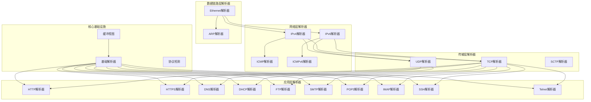
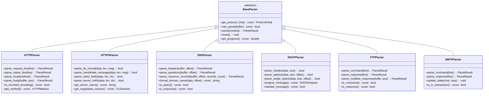
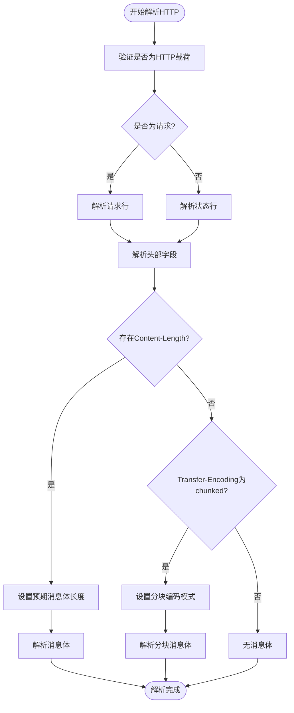
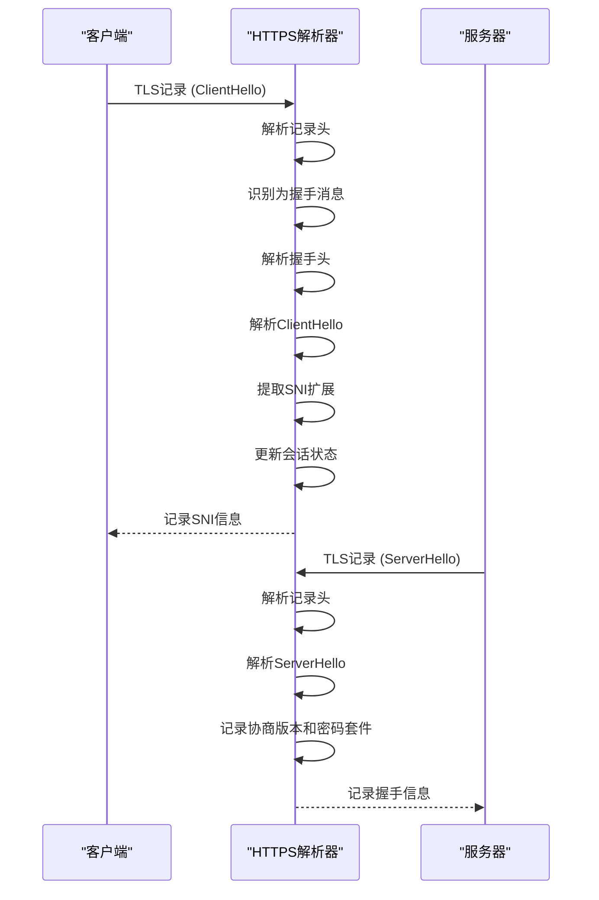
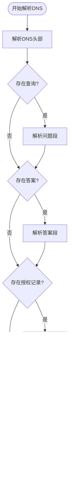
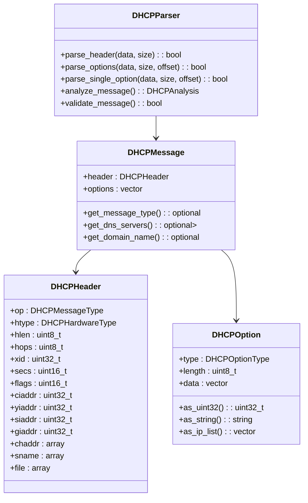
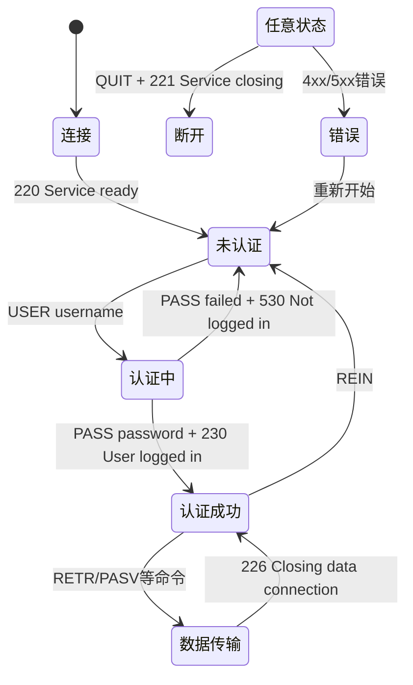
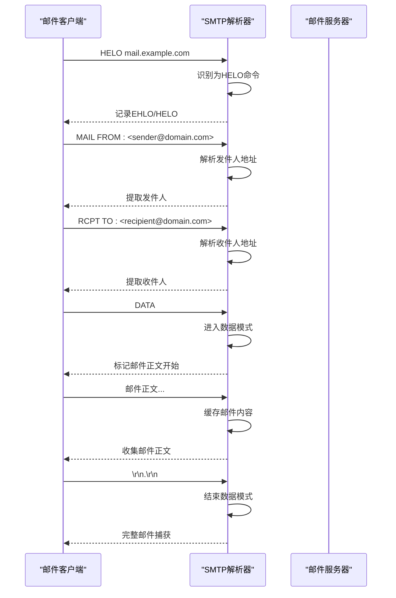
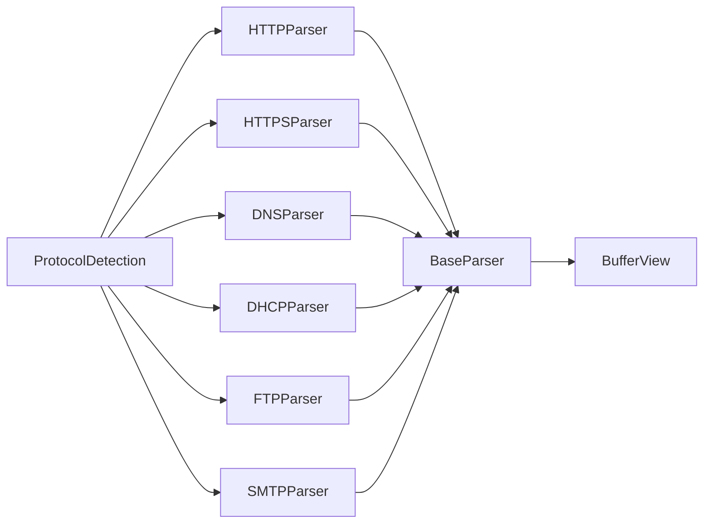

# 应用层解析器

<cite>
**本文档中引用的文件**  
- [http_parser.hpp](file://include/parsers/application/http_parser.hpp)
- [https_parser.hpp](file://include/parsers/application/https_parser.hpp)
- [dns_parser.hpp](file://include/parsers/application/dns_parser.hpp)
- [dhcp_parser.hpp](file://include/parsers/application/dhcp_parser.hpp)
- [ftp_parser.hpp](file://include/parsers/application/ftp_parser.hpp)
- [smtp_parser.hpp](file://include/parsers/application/smtp_parser.hpp)
- [base_parser.hpp](file://include/parsers/base_parser.hpp)
- [buffer_view.hpp](file://include/core/buffer_view.hpp)
</cite>

## 目录
1. [引言](#引言)
2. [项目结构](#项目结构)
3. [核心组件](#核心组件)
4. [架构概述](#架构概述)
5. [详细组件分析](#详细组件分析)
6. [依赖分析](#依赖分析)
7. [性能考虑](#性能考虑)
8. [故障排除指南](#故障排除指南)
9. [结论](#结论)

## 引言
本文档系统性地文档化了HTTP、HTTPS、DNS、DHCP、FTP和SMTP等应用层协议解析器的实现机制。重点说明各协议的解析策略，包括HTTP请求/响应行、头部字段、分块编码的解析；HTTPS的TLS记录层识别；DNS查询/响应结构与资源记录解析；DHCP选项字段解析；FTP命令通道识别；SMTP协议状态机解析逻辑。同时强调应用层解析的上下文依赖性，展示如何结合传输层端口与载荷特征进行智能协议识别，并提供典型应用场景的完整解析链代码示例。

## 项目结构
本项目采用分层模块化设计，将协议解析功能划分为多个独立但可组合的组件。整体结构遵循网络协议栈的层次模型，从底层到高层依次组织解析器。

**图示来源**  
- [http_parser.hpp](file://include/parsers/application/http_parser.hpp)
- [https_parser.hpp](file://include/parsers/application/https_parser.hpp)
- [dns_parser.hpp](file://include/parsers/application/dns_parser.hpp)
- [dhcp_parser.hpp](file://include/parsers/application/dhcp_parser.hpp)
- [ftp_parser.hpp](file://include/parsers/application/ftp_parser.hpp)
- [smtp_parser.hpp](file://include/parsers/application/smtp_parser.hpp)
- [base_parser.hpp](file://include/parsers/base_parser.hpp)
- [buffer_view.hpp](file://include/core/buffer_view.hpp)

**本节来源**  
- [include/parsers/application/http_parser.hpp](file://include/parsers/application/http_parser.hpp)
- [include/parsers/application/https_parser.hpp](file://include/parsers/application/https_parser.hpp)
- [include/parsers/application/dns_parser.hpp](file://include/parsers/application/dns_parser.hpp)
- [include/parsers/application/dhcp_parser.hpp](file://include/parsers/application/dhcp_parser.hpp)
- [include/parsers/application/ftp_parser.hpp](file://include/parsers/application/ftp_parser.hpp)
- [include/parsers/application/smtp_parser.hpp](file://include/parsers/application/smtp_parser.hpp)

## 核心组件
本系统的核心组件为各类应用层协议解析器，均继承自`BaseParser`抽象基类。每个解析器负责特定协议的语法分析、语义提取和状态管理。解析过程基于`BufferView`提供的内存视图接口，支持零拷贝高效处理网络数据包。

解析器通过统一的`ParseContext`上下文对象与外部交互，返回`ParseResult`枚举表示解析状态（成功、部分完成、失败）。所有解析器实现`can_parse`方法用于协议识别，结合端口号和载荷特征进行智能判断。

**本节来源**  
- [base_parser.hpp](file://include/parsers/base_parser.hpp)
- [buffer_view.hpp](file://include/core/buffer_view.hpp)
- [protocol_detection.hpp](file://include/detection/protocol_detection.hpp)

## 架构概述
系统采用面向对象的设计模式，通过继承和多态实现协议解析的扩展性。所有解析器共享相同的接口契约，便于集成到统一的流量分析框架中。

**图示来源**  
- [base_parser.hpp](file://include/parsers/base_parser.hpp)
- [http_parser.hpp](file://include/parsers/application/http_parser.hpp)
- [https_parser.hpp](file://include/parsers/application/https_parser.hpp)
- [dns_parser.hpp](file://include/parsers/application/dns_parser.hpp)
- [dhcp_parser.hpp](file://include/parsers/application/dhcp_parser.hpp)
- [ftp_parser.hpp](file://include/parsers/application/ftp_parser.hpp)
- [smtp_parser.hpp](file://include/parsers/application/smtp_parser.hpp)

## 详细组件分析

### HTTP解析器分析
HTTP解析器实现了完整的HTTP/1.0和HTTP/1.1协议解析功能，支持请求行、状态行、头部字段和消息体的逐段解析。

#### HTTP请求行解析策略
HTTP请求行采用`METHOD URI VERSION`格式，解析器通过空格分隔提取各部分，并映射到`HTTPMethod`枚举类型。URI进行基本验证，版本字符串转换为`HTTPVersion`枚举。

#### HTTP响应行解析策略
状态行采用`VERSION STATUS_CODE REASON_PHRASE`格式，解析器提取版本、状态码（转换为`uint16_t`）和原因短语。状态码用于后续业务逻辑判断。

#### 头部字段解析
头部字段以`Name: Value`形式存在，解析器逐行读取并存入`unordered_map<string, string>`。支持常见头部如`Content-Length`、`Transfer-Encoding`、`Host`等的语义提取。

#### 分块编码解析
当`Transfer-Encoding: chunked`时，解析器启用分块模式。每块以十六进制长度开头，后跟数据和CRLF。最后一块为长度0。解析器维护`is_chunked_`标志和当前块状态。

**图示来源**  
- [http_parser.hpp](file://include/parsers/application/http_parser.hpp#L135-L200)

**本节来源**  
- [http_parser.hpp](file://include/parsers/application/http_parser.hpp)
- [http_parser.cpp](file://src/parsers/application/http_parser.cpp)

### HTTPS解析器分析
HTTPS解析器专注于TLS记录层和握手协议的解析，不涉及加密内容解密。

#### TLS记录层识别
TLS记录以`ContentType(1) + Version(2) + Length(2)`开头。解析器通过检查第一个字节是否为22（握手）、23（应用数据）等已知类型来识别TLS流量。

#### 握手消息解析
握手消息包含`HandshakeType(1) + Length(3)`头，后跟具体内容。解析器支持ClientHello、ServerHello、Certificate等关键消息的结构化解析。

#### SNI提取
从ClientHello的扩展字段中提取服务器名称指示（SNI），用于识别目标域名。这是非加密环境下识别HTTPS站点的关键手段。

**图示来源**  
- [https_parser.hpp](file://include/parsers/application/https_parser.hpp#L50-L150)

**本节来源**  
- [https_parser.hpp](file://include/parsers/application/https_parser.hpp)
- [https_parser.cpp](file://src/parsers/application/https_parser.cpp)

### DNS解析器分析
DNS解析器处理UDP/TCP上的DNS查询与响应，支持标准查询、反向查询和动态更新。

#### 查询/响应结构解析
DNS消息由头部、问题段、答案段、授权段和附加段组成。解析器首先解析12字节头部，然后根据`qdcount`、`ancount`等字段数量依次解析各段。

#### 资源记录解析
资源记录包含名称、类型、类、TTL、数据长度和数据。名称采用压缩编码，解析器需处理指针跳转。类型映射到`DNSRecordType`枚举，如A、AAAA、MX、TXT等。

**图示来源**  
- [dns_parser.hpp](file://include/parsers/application/dns_parser.hpp#L50-L100)

**本节来源**  
- [dns_parser.hpp](file://include/parsers/application/dns_parser.hpp)
- [dns_parser.cpp](file://src/parsers/application/dns_parser.cpp)

### DHCP解析器分析
DHCP解析器处理BOOTP格式的DHCP消息，支持DISCOVER-OFFER-REQUEST-ACK四步交互。

#### 选项字段解析
DHCP选项采用`Type(1) + Length(1) + Data(N)`格式。解析器遍历选项区，识别已知类型如子网掩码(1)、路由器(3)、DNS服务器(6)、主机名(12)、域名(15)等。

#### 消息类型识别
通过选项53（DHCP消息类型）确定当前消息是DISCOVER、OFFER、REQUEST还是ACK。结合源/目的IP和端口判断客户端或服务器角色。

**图示来源**  
- [dhcp_parser.hpp](file://include/parsers/application/dhcp_parser.hpp#L100-L200)

**本节来源**  
- [dhcp_parser.hpp](file://include/parsers/application/dhcp_parser.hpp)
- [dhcp_parser.cpp](file://src/parsers/application/dhcp_parser.cpp)

### FTP解析器分析
FTP解析器识别控制通道（端口21）上的命令与响应，支持主动和被动模式分析。

#### 命令通道识别
FTP采用明文命令如USER、PASS、LIST、RETR等。解析器通过关键字匹配识别命令类型，并提取参数。响应以三位数字代码开头，解析器映射到`FTPResponseCode`枚举。

#### 状态机解析逻辑
FTP会话具有明确的状态转换：未认证 → 认证 → 传输中。解析器通过命令-响应对更新内部状态，例如USER+331→等待密码，PASS+230→认证成功。

**图示来源**  
- [ftp_parser.hpp](file://include/parsers/application/ftp_parser.hpp#L150-L200)

**本节来源**  
- [ftp_parser.hpp](file://include/parsers/application/ftp_parser.hpp)
- [ftp_parser.cpp](file://src/parsers/application/ftp_parser.cpp)

### SMTP解析器分析
SMTP解析器处理邮件传输过程中的命令与响应，支持MAIL FROM、RCPT TO、DATA等核心命令。

#### 协议状态机解析
SMTP会话遵循严格的阶段：连接 → HELO/EHLO → MAIL FROM → RCPT TO → DATA → 结束。解析器跟踪当前阶段，验证命令序列的合法性。

#### 命令与响应解析
命令如`MAIL FROM:<user@domain.com>`，解析器提取发件人地址。响应代码如250（成功）、550（邮箱不存在）用于判断邮件传输状态。

**图示来源**  
- [smtp_parser.hpp](file://include/parsers/application/smtp_parser.hpp)

**本节来源**  
- [smtp_parser.hpp](file://include/parsers/application/smtp_parser.hpp)
- [smtp_parser.cpp](file://src/parsers/application/smtp_parser.cpp)

## 依赖分析
系统各组件之间存在清晰的依赖关系，遵循单一职责原则和依赖倒置原则。

**图示来源**  
- [base_parser.hpp](file://include/parsers/base_parser.hpp)
- [buffer_view.hpp](file://include/core/buffer_view.hpp)
- [protocol_detection.hpp](file://include/detection/protocol_detection.hpp)

**本节来源**  
- [include/parsers/base_parser.hpp](file://include/parsers/base_parser.hpp)
- [include/core/buffer_view.hpp](file://include/core/buffer_view.hpp)
- [include/detection/protocol_detection.hpp](file://include/detection/protocol_detection.hpp)

## 性能考虑
- 所有解析器采用零拷贝设计，通过`BufferView`直接访问原始数据
- 关键路径避免动态内存分配，使用预分配缓冲区
- 字符串比较使用哈希或长度检查优化
- 状态机减少不必要的正则表达式匹配
- 支持多线程并行解析不同流

## 故障排除指南
- **解析失败**：检查`get_error_message()`返回的具体错误
- **部分解析**：确认是否收到完整数据包，TCP流可能分段
- **协议误识别**：验证端口与载荷特征是否匹配，避免误判
- **内存泄漏**：确保`reset()`方法正确清理内部状态
- **性能瓶颈**：使用`performance_monitor`统计各解析器耗时

**本节来源**  
- [base_parser.hpp](file://include/parsers/base_parser.hpp)
- [performance_monitor.hpp](file://include/monitoring/performance_monitor.hpp)
- 各解析器的`get_error_message()`方法

## 结论
本文档详细分析了应用层协议解析器的设计与实现。系统通过统一的基类接口和模块化设计，实现了对HTTP、HTTPS、DNS、DHCP、FTP和SMTP等协议的高效解析。各解析器结合传输层端口与应用层载荷特征，能够准确识别协议类型并提取关键语义信息。该架构具有良好的扩展性和维护性，适用于网络监控、安全分析和流量分类等场景。