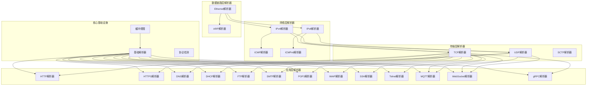
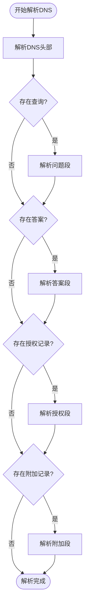
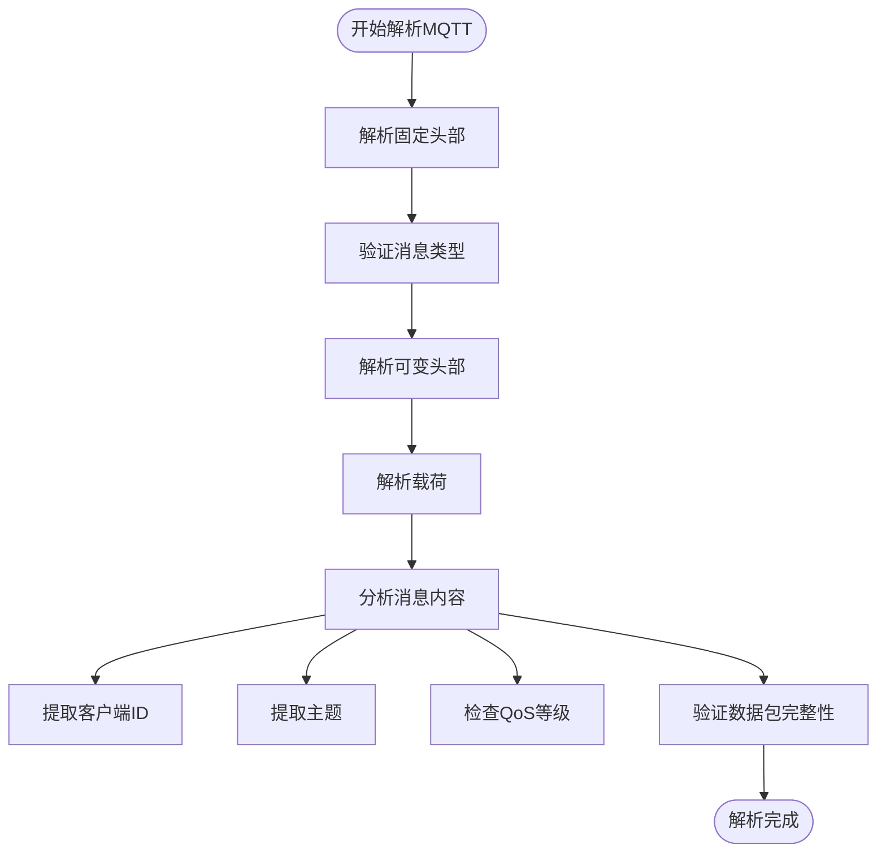
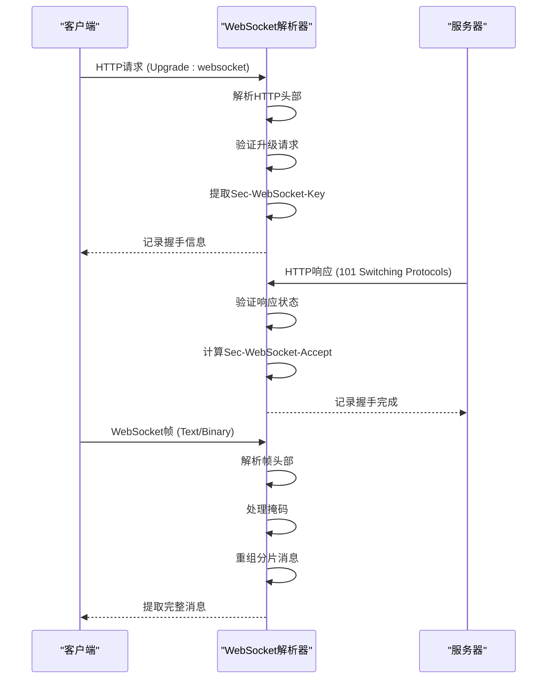
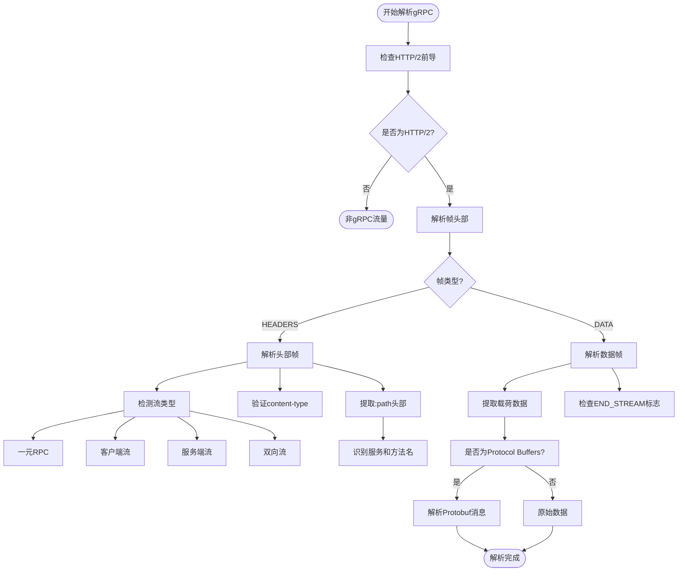
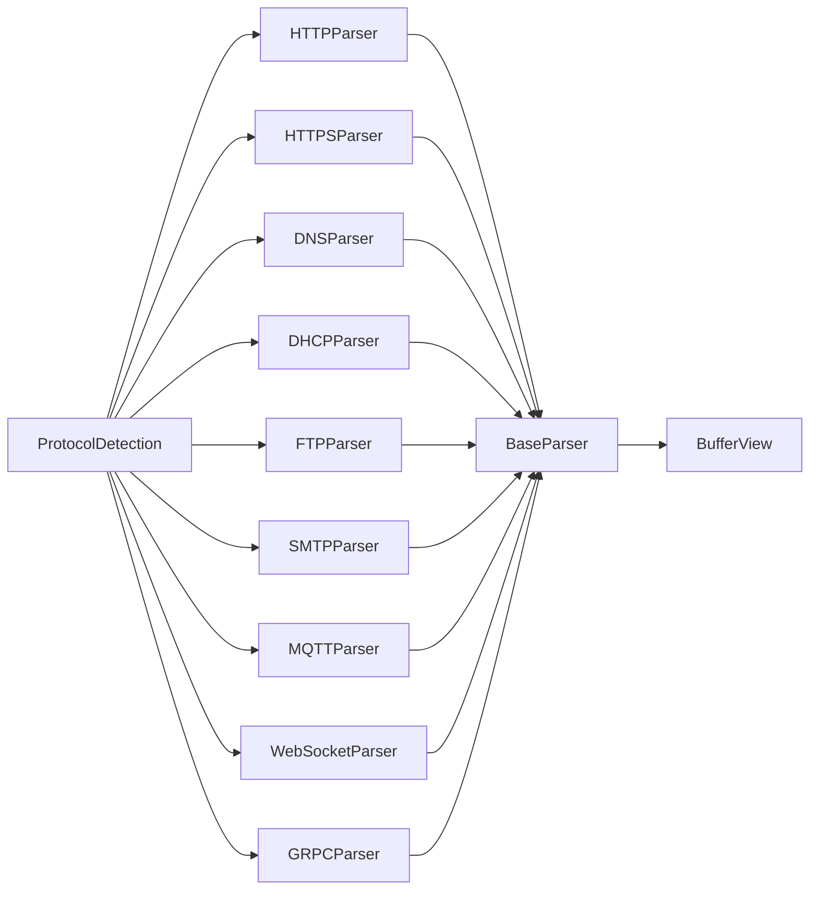

# 应用层解析器

<cite>
**本文档中引用的文件**  
- [http_parser.hpp](file://include/parsers/application/http_parser.hpp)
- [https_parser.hpp](file://include/parsers/application/https_parser.hpp)
- [dns_parser.hpp](file://include/parsers/application/dns_parser.hpp)
- [dhcp_parser.hpp](file://include/parsers/application/dhcp_parser.hpp)
- [ftp_parser.hpp](file://include/parsers/application/ftp_parser.hpp)
- [smtp_parser.hpp](file://include/parsers/application/smtp_parser.hpp)
- [base_parser.hpp](file://include/parsers/base_parser.hpp)
- [buffer_view.hpp](file://include/core/buffer_view.hpp)
- [mqtt_parser.hpp](file://include/parsers/application/mqtt_parser.hpp) - *新增于提交 5c71c0afd2d1cea10ed32f0105b8e006a5b02b5d*
- [websocket_parser.hpp](file://include/parsers/application/websocket_parser.hpp) - *新增于提交 5c71c0afd2d1cea10ed32f0105b8e006a5b02b5d*
- [grpc_parser.hpp](file://include/parsers/application/grpc_parser.hpp) - *新增于提交 5c71c0afd2d1cea10ed32f0105b8e006a5b02b5d*
</cite>

## 更新摘要
**变更内容**  
- 在引言和项目结构中添加了对MQTT、WebSocket和gRPC解析器的支持
- 新增了MQTT、WebSocket和gRPC解析器的详细分析章节
- 更新了架构概述图以包含新的现代应用协议解析器
- 更新了依赖分析图以反映新增的解析器组件
- 所有新增内容均基于提交 `5c71c0afd2d1cea10ed32f0105b8e006a5b02b5d` 中实现的现代应用协议解析器

## 目录
1. [引言](#引言)
2. [项目结构](#项目结构)
3. [核心组件](#核心组件)
4. [架构概述](#架构概述)
5. [详细组件分析](#详细组件分析)
6. [依赖分析](#依赖分析)
7. [性能考虑](#性能考虑)
8. [故障排除指南](#故障排除指南)
9. [结论](#结论)

## 引言
本文档系统性地文档化了HTTP、HTTPS、DNS、DHCP、FTP、SMTP、MQTT、WebSocket和gRPC等应用层协议解析器的实现机制。重点说明各协议的解析策略，包括HTTP请求/响应行、头部字段、分块编码的解析；HTTPS的TLS记录层识别；DNS查询/响应结构与资源记录解析；DHCP选项字段解析；FTP命令通道识别；SMTP协议状态机解析逻辑；MQTT固定头部、可变头部和载荷解析；WebSocket握手过程和帧格式解析；gRPC基于HTTP/2的帧解析和消息结构解析。同时强调应用层解析的上下文依赖性，展示如何结合传输层端口与载荷特征进行智能协议识别，并提供典型应用场景的完整解析链代码示例。

## 项目结构
本项目采用分层模块化设计，将协议解析功能划分为多个独立但可组合的组件。整体结构遵循网络协议栈的层次模型，从底层到高层依次组织解析器。

**图示来源**  
- [http_parser.hpp](file://include/parsers/application/http_parser.hpp)
- [https_parser.hpp](file://include/parsers/application/https_parser.hpp)
- [dns_parser.hpp](file://include/parsers/application/dns_parser.hpp)
- [dhcp_parser.hpp](file://include/parsers/application/dhcp_parser.hpp)
- [ftp_parser.hpp](file://include/parsers/application/ftp_parser.hpp)
- [smtp_parser.hpp](file://include/parsers/application/smtp_parser.hpp)
- [mqtt_parser.hpp](file://include/parsers/application/mqtt_parser.hpp)
- [websocket_parser.hpp](file://include/parsers/application/websocket_parser.hpp)
- [grpc_parser.hpp](file://include/parsers/application/grpc_parser.hpp)
- [base_parser.hpp](file://include/parsers/base_parser.hpp)
- [buffer_view.hpp](file://include/core/buffer_view.hpp)

**本节来源**  
- [include/parsers/application/http_parser.hpp](file://include/parsers/application/http_parser.hpp)
- [include/parsers/application/https_parser.hpp](file://include/parsers/application/https_parser.hpp)
- [include/parsers/application/dns_parser.hpp](file://include/parsers/application/dns_parser.hpp)
- [include/parsers/application/dhcp_parser.hpp](file://include/parsers/application/dhcp_parser.hpp)
- [include/parsers/application/ftp_parser.hpp](file://include/parsers/application/ftp_parser.hpp)
- [include/parsers/application/smtp_parser.hpp](file://include/parsers/application/smtp_parser.hpp)
- [include/parsers/application/mqtt_parser.hpp](file://include/parsers/application/mqtt_parser.hpp)
- [include/parsers/application/websocket_parser.hpp](file://include/parsers/application/websocket_parser.hpp)
- [include/parsers/application/grpc_parser.hpp](file://include/parsers/application/grpc_parser.hpp)

## 核心组件
本系统的核心组件为各类应用层协议解析器，均继承自`BaseParser`抽象基类。每个解析器负责特定协议的语法分析、语义提取和状态管理。解析过程基于`BufferView`提供的内存视图接口，支持零拷贝高效处理网络数据包。

解析器通过统一的`ParseContext`上下文对象与外部交互，返回`ParseResult`枚举表示解析状态（成功、部分完成、失败）。所有解析器实现`can_parse`方法用于协议识别，结合端口号和载荷特征进行智能判断。新增的MQTT、WebSocket和gRPC解析器同样遵循这一设计模式，实现了对现代应用协议的完整支持。

**本节来源**  
- [base_parser.hpp](file://include/parsers/base_parser.hpp)
- [buffer_view.hpp](file://include/core/buffer_view.hpp)
- [protocol_detection.hpp](file://include/detection/protocol_detection.hpp)
- [mqtt_parser.hpp](file://include/parsers/application/mqtt_parser.hpp)
- [websocket_parser.hpp](file://include/parsers/application/websocket_parser.hpp)
- [grpc_parser.hpp](file://include/parsers/application/grpc_parser.hpp)

## 架构概述
系统采用面向对象的设计模式，通过继承和多态实现协议解析的扩展性。所有解析器共享相同的接口契约，便于集成到统一的流量分析框架中。

```mermaid
classDiagram
class BaseParser {
<<abstract>>
+get_protocol_info() const : ProtocolInfo&
+can_parse(buffer) const : bool
+parse(context) : ParseResult
+reset() : void
+get_progress() const : double
}
class HTTPParser {
+parse_request_line(line) : ParseResult
+parse_status_line(line) : ParseResult
+parse_headers(lines) : ParseResult
+parse_body(buffer, pos) : ParseResult
+is_chunked_encoding() const : bool
+get_method() const : HTTPMethod
}
class HTTPSParser {
+parse_tls_record(data, len, msg) : bool
+parse_handshake_message(data, len, msg) : bool
+parse_client_hello(data, len, ch) : bool
+parse_server_hello(data, len, sh) : bool
+get_server_name() const : string
+get_negotiated_version() const : TLSVersion
}
class DNSParser {
+parse_header(buffer, offset) : ParseResult
+parse_questions(buffer, offset) : ParseResult
+parse_resource_records(buffer, offset, records, count) : ParseResult
+format_domain_name(data, offset) const : string
+is_query() const : bool
+is_response() const : bool
}
class DHCPParser {
+parse_header(data, size) : bool
+parse_options(data, size, offset) : bool
+parse_single_option(data, size, offset) : bool
+analyze_message() const : DHCPAnalysis
+validate_message() const : bool
}
class FTPParser {
+parse_command(line) : ParseResult
+parse_response(line) : ParseResult
+parse_multiline_response(buffer, pos) : ParseResult
+is_command() const : bool
+is_response() const : bool
}
class SMTPParser {
+parse_command(line) : ParseResult
+parse_response(line) : ParseResult
+update_state(cmd, resp) : void
+is_in_transaction() const : bool
}
class MQTTParser {
+parse_fixed_header(data, size, offset) : ParseResult
+parse_variable_header(data, size, offset) : ParseResult
+parse_payload(data, size, offset) : ParseResult
+parse_connect_message(data, size, offset) : ParseResult
+parse_connack_message(data, size, offset) : ParseResult
+get_client_id() const : string
+get_topic() const : string
+get_qos_level() const : MQTTQoS
}
class WebSocketParser {
+parse_handshake(buffer, handshake) : ParseResult
+parse_frame(buffer, frame) : ParseResult
+parse_frame_header(buffer, header) : ParseResult
+is_control_frame(opcode) : bool
+is_data_frame(opcode) : bool
+get_connection_state() const : WebSocketState
}
class GRPCParser {
+parse_http2_frame(buffer, message) : ParseResult
+parse_grpc_message(buffer, message) : ParseResult
+parse_headers_frame(buffer, message) : ParseResult
+parse_data_frame(buffer, message) : ParseResult
+extract_service_method(path, service, method) : bool
+get_stream_type() const : GRPCStreamType
}
BaseParser <|-- HTTPParser
BaseParser <|-- HTTPSParser
BaseParser <|-- DNSParser
BaseParser <|-- DHCPParser
BaseParser <|-- FTPParser
BaseParser <|-- SMTPParser
BaseParser <|-- MQTTParser
BaseParser <|-- WebSocketParser
BaseParser <|-- GRPCParser
```

**图示来源**  
- [base_parser.hpp](file://include/parsers/base_parser.hpp)
- [http_parser.hpp](file://include/parsers/application/http_parser.hpp)
- [https_parser.hpp](file://include/parsers/application/https_parser.hpp)
- [dns_parser.hpp](file://include/parsers/application/dns_parser.hpp)
- [dhcp_parser.hpp](file://include/parsers/application/dhcp_parser.hpp)
- [ftp_parser.hpp](file://include/parsers/application/ftp_parser.hpp)
- [smtp_parser.hpp](file://include/parsers/application/smtp_parser.hpp)
- [mqtt_parser.hpp](file://include/parsers/application/mqtt_parser.hpp)
- [websocket_parser.hpp](file://include/parsers/application/websocket_parser.hpp)
- [grpc_parser.hpp](file://include/parsers/application/grpc_parser.hpp)

## 详细组件分析

### HTTP解析器分析
HTTP解析器实现了完整的HTTP/1.0和HTTP/1.1协议解析功能，支持请求行、状态行、头部字段和消息体的逐段解析。

#### HTTP请求行解析策略
HTTP请求行采用`METHOD URI VERSION`格式，解析器通过空格分隔提取各部分，并映射到`HTTPMethod`枚举类型。URI进行基本验证，版本字符串转换为`HTTPVersion`枚举。

#### HTTP响应行解析策略
状态行采用`VERSION STATUS_CODE REASON_PHRASE`格式，解析器提取版本、状态码（转换为`uint16_t`）和原因短语。状态码用于后续业务逻辑判断。

#### 头部字段解析
头部字段以`Name: Value`形式存在，解析器逐行读取并存入`unordered_map<string, string>`。支持常见头部如`Content-Length`、`Transfer-Encoding`、`Host`等的语义提取。

#### 分块编码解析
当`Transfer-Encoding: chunked`时，解析器启用分块模式。每块以十六进制长度开头，后跟数据和CRLF。最后一块为长度0。解析器维护`is_chunked_`标志和当前块状态。

**图示来源**  
- [http_parser.hpp](file://include/parsers/application/http_parser.hpp#L135-L200)

**本节来源**  
- [http_parser.hpp](file://include/parsers/application/http_parser.hpp)
- [http_parser.cpp](file://src/parsers/application/http_parser.cpp)

### HTTPS解析器分析
HTTPS解析器专注于TLS记录层和握手协议的解析，不涉及加密内容解密。

#### TLS记录层识别
TLS记录以`ContentType(1) + Version(2) + Length(2)`开头。解析器通过检查第一个字节是否为22（握手）、23（应用数据）等已知类型来识别TLS流量。

#### 握手消息解析
握手消息包含`HandshakeType(1) + Length(3)`头，后跟具体内容。解析器支持ClientHello、ServerHello、Certificate等关键消息的结构化解析。

#### SNI提取
从ClientHello的扩展字段中提取服务器名称指示（SNI），用于识别目标域名。这是非加密环境下识别HTTPS站点的关键手段。

**图示来源**  
- [https_parser.hpp](file://include/parsers/application/https_parser.hpp#L50-L150)

**本节来源**  
- [https_parser.hpp](file://include/parsers/application/https_parser.hpp)
- [https_parser.cpp](file://src/parsers/application/https_parser.cpp)

### DNS解析器分析
DNS解析器处理UDP/TCP上的DNS查询与响应，支持标准查询、反向查询和动态更新。

#### 查询/响应结构解析
DNS消息由头部、问题段、答案段、授权段和附加段组成。解析器首先解析12字节头部，然后根据`qdcount`、`ancount`等字段数量依次解析各段。

#### 资源记录解析
资源记录包含名称、类型、类、TTL、数据长度和数据。名称采用压缩编码，解析器需处理指针跳转。类型映射到`DNSRecordType`枚举，如A、AAAA、MX、TXT等。

**图示来源**  
- [dns_parser.hpp](file://include/parsers/application/dns_parser.hpp#L50-L100)

**本节来源**  
- [dns_parser.hpp](file://include/parsers/application/dns_parser.hpp)
- [dns_parser.cpp](file://src/parsers/application/dns_parser.cpp)

### DHCP解析器分析
DHCP解析器处理BOOTP格式的DHCP消息，支持DISCOVER-OFFER-REQUEST-ACK四步交互。

#### 选项字段解析
DHCP选项采用`Type(1) + Length(1) + Data(N)`格式。解析器遍历选项区，识别已知类型如子网掩码(1)、路由器(3)、DNS服务器(6)、主机名(12)、域名(15)等。

#### 消息类型识别
通过选项53（DHCP消息类型）确定当前消息是DISCOVER、OFFER、REQUEST还是ACK。结合源/目的IP和端口判断客户端或服务器角色。

**图示来源**  
- [dhcp_parser.hpp](file://include/parsers/application/dhcp_parser.hpp#L100-L200)

**本节来源**  
- [dhcp_parser.hpp](file://include/parsers/application/dhcp_parser.hpp)
- [dhcp_parser.cpp](file://src/parsers/application/dhcp_parser.cpp)

### FTP解析器分析
FTP解析器识别控制通道（端口21）上的命令与响应，支持主动和被动模式分析。

#### 命令通道识别
FTP采用明文命令如USER、PASS、LIST、RETR等。解析器通过关键字匹配识别命令类型，并提取参数。响应以三位数字代码开头，解析器映射到`FTPResponseCode`枚举。

#### 状态机解析逻辑
FTP会话具有明确的状态转换：未认证 → 认证 → 传输中。解析器通过命令-响应对更新内部状态，例如USER+331→等待密码，PASS+230→认证成功。

**图示来源**  
- [ftp_parser.hpp](file://include/parsers/application/ftp_parser.hpp#L150-L200)

**本节来源**  
- [ftp_parser.hpp](file://include/parsers/application/ftp_parser.hpp)
- [ftp_parser.cpp](file://src/parsers/application/ftp_parser.cpp)

### SMTP解析器分析
SMTP解析器处理邮件传输过程中的命令与响应，支持MAIL FROM、RCPT TO、DATA等核心命令。

#### 协议状态机解析
SMTP会话遵循严格的阶段：连接 → HELO/EHLO → MAIL FROM → RCPT TO → DATA → 结束。解析器跟踪当前阶段，验证命令序列的合法性。

#### 命令与响应解析
命令如`MAIL FROM:<user@domain.com>`，解析器提取发件人地址。响应代码如250（成功）、550（邮箱不存在）用于判断邮件传输状态。

**图示来源**  
- [smtp_parser.hpp](file://include/parsers/application/smtp_parser.hpp)

**本节来源**  
- [smtp_parser.hpp](file://include/parsers/application/smtp_parser.hpp)
- [smtp_parser.cpp](file://src/parsers/application/smtp_parser.cpp)

### MQTT解析器分析
MQTT解析器实现了对MQTT协议的完整解析，支持MQTT 3.1.1和MQTT 5.0版本，能够处理连接、发布、订阅等各类消息。

#### 固定头部解析
MQTT固定头部包含消息类型、标志位和剩余长度。解析器首先验证控制字节，然后使用变长编码解析剩余长度字段，确定消息总长度。

#### 可变头部和载荷解析
根据消息类型解析相应的可变头部。例如CONNECT消息包含协议名、协议版本、连接标志等；PUBLISH消息包含主题名和报文标识符。载荷部分根据消息类型包含客户端ID、遗嘱消息、应用消息等。

#### QoS等级处理
解析器识别QoS等级（0-2），用于确定消息传递保证级别。QoS 1和2需要额外的确认机制，解析器能够识别PUBACK、PUBREC等相应控制包。

**图示来源**  
- [mqtt_parser.hpp](file://include/parsers/application/mqtt_parser.hpp#L100-L200)

**本节来源**  
- [mqtt_parser.hpp](file://include/parsers/application/mqtt_parser.hpp)
- [mqtt_parser.cpp](file://src/parsers/application/mqtt_parser.cpp)

### WebSocket解析器分析
WebSocket解析器处理从HTTP升级到WebSocket的完整过程，包括握手阶段和数据帧传输阶段。

#### 握手过程解析
WebSocket连接始于HTTP升级请求，包含`Upgrade: websocket`和`Connection: Upgrade`头部。解析器验证这些关键头部，并提取`Sec-WebSocket-Key`用于验证握手完整性。

#### 帧格式解析
WebSocket帧包含FIN位、操作码、掩码标志和载荷长度。解析器正确处理变长的载荷长度字段（7位、7+16位或7+64位），并根据掩码标志应用相应的解掩码操作。

#### 分片消息处理
当FIN位为0时，表示消息分片。解析器能够重组分片消息，将多个CONTINUATION帧组合成完整的消息。

**图示来源**  
- [websocket_parser.hpp](file://include/parsers/application/websocket_parser.hpp#L150-L250)

**本节来源**  
- [websocket_parser.hpp](file://include/parsers/application/websocket_parser.hpp)
- [websocket_parser.cpp](file://src/parsers/application/websocket_parser.cpp)

### gRPC解析器分析
gRPC解析器基于HTTP/2协议实现，能够解析gRPC调用的完整流程，包括头部帧、数据帧和状态码。

#### HTTP/2帧解析
gRPC建立在HTTP/2之上，解析器首先识别HTTP/2连接前导（"PRI * HTTP/2.0\r\n\r\nSM\r\n\r\n"），然后解析各种帧类型，特别是HEADERS和DATA帧。

#### 头部压缩检测
解析器能够检测HPACK头部压缩，识别常见的gRPC伪头部如`:method`、`:path`、`:authority`，以及常规头部如`content-type`、`user-agent`等。

#### 流式RPC识别
通过分析消息模式，解析器能够区分一元RPC、客户端流、服务端流和双向流四种调用模式，并跟踪每个流的生命周期。

**图示来源**  
- [grpc_parser.hpp](file://include/parsers/application/grpc_parser.hpp#L100-L200)

**本节来源**  
- [grpc_parser.hpp](file://include/parsers/application/grpc_parser.hpp)
- [grpc_parser.cpp](file://src/parsers/application/grpc_parser.cpp)

## 依赖分析
系统各组件之间存在清晰的依赖关系，遵循单一职责原则和依赖倒置原则。

**图示来源**  
- [base_parser.hpp](file://include/parsers/base_parser.hpp)
- [buffer_view.hpp](file://include/core/buffer_view.hpp)
- [protocol_detection.hpp](file://include/detection/protocol_detection.hpp)
- [mqtt_parser.hpp](file://include/parsers/application/mqtt_parser.hpp)
- [websocket_parser.hpp](file://include/parsers/application/websocket_parser.hpp)
- [grpc_parser.hpp](file://include/parsers/application/grpc_parser.hpp)

**本节来源**  
- [include/parsers/base_parser.hpp](file://include/parsers/base_parser.hpp)
- [include/core/buffer_view.hpp](file://include/core/buffer_view.hpp)
- [include/detection/protocol_detection.hpp](file://include/detection/protocol_detection.hpp)
- [include/parsers/application/mqtt_parser.hpp](file://include/parsers/application/mqtt_parser.hpp)
- [include/parsers/application/websocket_parser.hpp](file://include/parsers/application/websocket_parser.hpp)
- [include/parsers/application/grpc_parser.hpp](file://include/parsers/application/grpc_parser.hpp)

## 性能考虑
- 所有解析器采用零拷贝设计，通过`BufferView`直接访问原始数据
- 关键路径避免动态内存分配，使用预分配缓冲区
- 字符串比较使用哈希或长度检查优化
- 状态机减少不必要的正则表达式匹配
- 支持多线程并行解析不同流
- 新增的MQTT、WebSocket和gRPC解析器同样遵循高性能设计原则，确保现代应用协议的高效解析

## 故障排除指南
- **解析失败**：检查`get_error_message()`返回的具体错误
- **部分解析**：确认是否收到完整数据包，TCP流可能分段
- **协议误识别**：验证端口与载荷特征是否匹配，避免误判
- **内存泄漏**：确保`reset()`方法正确清理内部状态
- **性能瓶颈**：使用`performance_monitor`统计各解析器耗时
- **MQTT连接问题**：检查CONNECT消息中的协议版本和客户端ID是否有效
- **WebSocket握手失败**：验证Sec-WebSocket-Key和Sec-WebSocket-Accept的计算是否正确
- **gRPC调用异常**：检查HTTP/2帧格式和gRPC消息头是否符合规范

**本节来源**  
- [base_parser.hpp](file://include/parsers/base_parser.hpp)
- [performance_monitor.hpp](file://include/monitoring/performance_monitor.hpp)
- 各解析器的`get_error_message()`方法
- [mqtt_parser.hpp](file://include/parsers/application/mqtt_parser.hpp)
- [websocket_parser.hpp](file://include/parsers/application/websocket_parser.hpp)
- [grpc_parser.hpp](file://include/parsers/application/grpc_parser.hpp)

## 结论
本文档详细分析了应用层协议解析器的设计与实现。系统通过统一的基类接口和模块化设计，实现了对HTTP、HTTPS、DNS、DHCP、FTP、SMTP、MQTT、WebSocket和gRPC等协议的高效解析。各解析器结合传输层端口与应用层载荷特征，能够准确识别协议类型并提取关键语义信息。新增的MQTT、WebSocket和gRPC解析器扩展了系统对现代应用协议的支持能力。该架构具有良好的扩展性和维护性，适用于网络监控、安全分析和流量分类等场景。