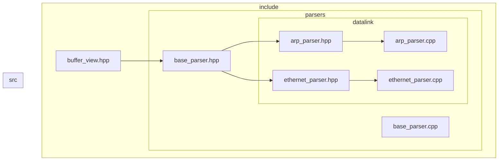
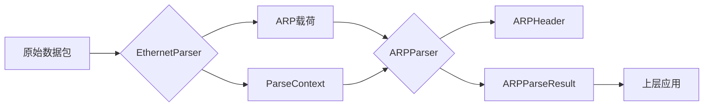
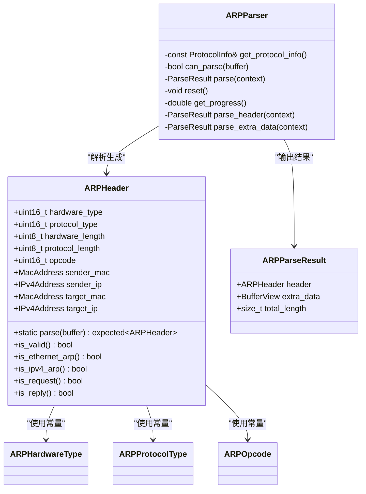
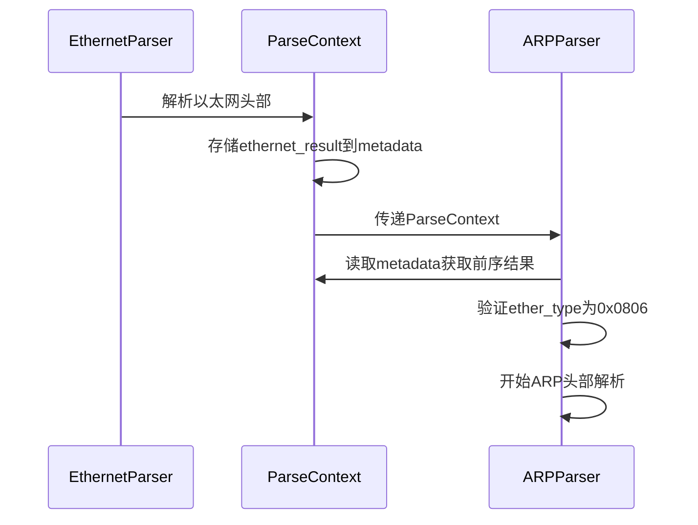
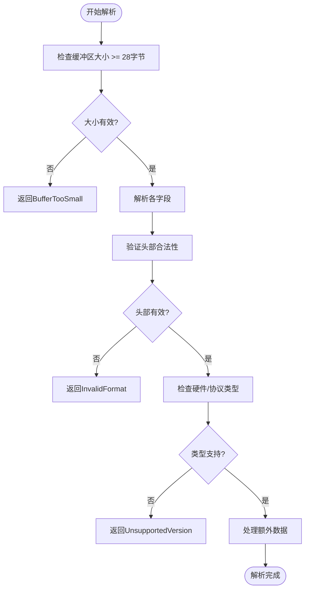
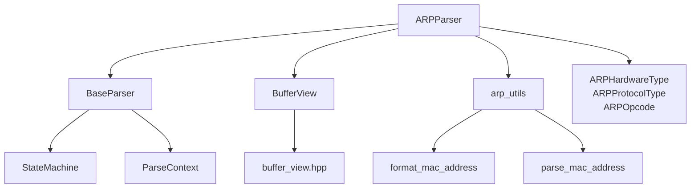

# ARP解析器

<cite>
**本文档中引用的文件**  
- [arp_parser.hpp](file://include/parsers/datalink/arp_parser.hpp)
- [arp_parser.cpp](file://src/parsers/datalink/arp_parser.cpp)
- [ethernet_parser.hpp](file://include/parsers/datalink/ethernet_parser.hpp)
- [ethernet_parser.cpp](file://src/parsers/datalink/ethernet_parser.cpp)
- [base_parser.hpp](file://include/parsers/base_parser.hpp)
</cite>

## 目录
1. [简介](#简介)
2. [项目结构](#项目结构)
3. [核心组件](#核心组件)
4. [架构概述](#架构概述)
5. [详细组件分析](#详细组件分析)
6. [依赖分析](#依赖分析)
7. [性能考虑](#性能考虑)
8. [故障排除指南](#故障排除指南)
9. [结论](#结论)

## 简介
本文档深入讲解ARPParser的实现细节，包括ARP请求与响应报文的硬件类型、协议类型、操作码等字段的解析过程。说明如何从BufferView中提取发送方和目标方的MAC与IP地址，并验证ARP报文的合法性。阐述该解析器如何依赖前序Ethernet解析结果进行上下文关联，以及如何通过ParseContext传递网络层协议信息。提供处理ARP缓存毒化检测的扩展思路，并给出在流量统计模块中识别ARP风暴的使用示例。包含对非标准ARP帧长和错误校验的边界处理说明。

## 项目结构
项目采用分层模块化设计，将协议解析器按OSI模型分层组织。ARP解析器位于数据链路层（datalink），依赖于核心缓冲区视图（buffer_view）和基础解析器框架（base_parser）。解析器通过工厂模式注册到全局注册表，支持动态创建和协议识别。

**Diagram sources**
- [arp_parser.hpp](file://include/parsers/datalink/arp_parser.hpp#L1-L270)
- [ethernet_parser.hpp](file://include/parsers/datalink/ethernet_parser.hpp#L1-L182)
- [base_parser.hpp](file://include/parsers/base_parser.hpp#L1-L188)

**Section sources**
- [arp_parser.hpp](file://include/parsers/datalink/arp_parser.hpp#L1-L270)
- [ethernet_parser.hpp](file://include/parsers/datalink/ethernet_parser.hpp#L1-L182)

## 核心组件
ARP解析器的核心组件包括ARPHeader结构体、ARPParser类和ARP工具函数集合。ARPHeader负责从缓冲区解析原始字节并验证字段合法性，ARPParser实现状态机驱动的解析流程，工具函数提供MAC/IP地址格式化和字符串解析功能。

**Section sources**
- [arp_parser.hpp](file://include/parsers/datalink/arp_parser.hpp#L1-L270)
- [arp_parser.cpp](file://src/parsers/datalink/arp_parser.cpp#L1-L422)

## 架构概述
ARP解析器遵循分层解析架构，作为数据链路层协议解析器之一，接收来自以太网解析器的载荷数据。解析过程通过状态机控制，确保解析流程的清晰性和可扩展性。

**Diagram sources**
- [arp_parser.hpp](file://include/parsers/datalink/arp_parser.hpp#L1-L270)
- [ethernet_parser.hpp](file://include/parsers/datalink/ethernet_parser.hpp#L1-L182)

## 详细组件分析

### ARP报文解析流程分析
ARP解析器通过状态机实现分阶段解析。初始状态调用parse_header解析ARP头部，成功后进入Parsing状态处理额外数据，最终完成解析。

#### 报文字段解析

**Diagram sources**
- [arp_parser.hpp](file://include/parsers/datalink/arp_parser.hpp#L1-L270)
- [arp_parser.cpp](file://src/parsers/datalink/arp_parser.cpp#L1-L422)

**Section sources**
- [arp_parser.hpp](file://include/parsers/datalink/arp_parser.hpp#L1-L270)
- [arp_parser.cpp](file://src/parsers/datalink/arp_parser.cpp#L1-L422)

### 上下文关联与协议传递分析
ARP解析器依赖前序Ethernet解析结果进行上下文关联，通过ParseContext中的metadata传递网络层协议信息。

#### 解析上下文传递流程

**Diagram sources**
- [ethernet_parser.cpp](file://src/parsers/datalink/ethernet_parser.cpp#L1-L240)
- [arp_parser.cpp](file://src/parsers/datalink/arp_parser.cpp#L1-L422)

**Section sources**
- [ethernet_parser.cpp](file://src/parsers/datalink/ethernet_parser.cpp#L1-L240)
- [arp_parser.cpp](file://src/parsers/datalink/arp_parser.cpp#L1-L422)

### 边界处理与错误校验分析
ARP解析器对非标准帧长和错误数据进行严格校验，确保解析的健壮性。

#### 边界处理流程图

**Diagram sources**
- [arp_parser.cpp](file://src/parsers/datalink/arp_parser.cpp#L1-L422)

**Section sources**
- [arp_parser.cpp](file://src/parsers/datalink/arp_parser.cpp#L1-L422)

## 依赖分析
ARP解析器依赖多个核心组件和工具模块，形成清晰的依赖关系网络。

**Diagram sources**
- [arp_parser.hpp](file://include/parsers/datalink/arp_parser.hpp#L1-L270)
- [base_parser.hpp](file://include/parsers/base_parser.hpp#L1-L188)

**Section sources**
- [arp_parser.hpp](file://include/parsers/datalink/arp_parser.hpp#L1-L270)
- [base_parser.hpp](file://include/parsers/base_parser.hpp#L1-L188)

## 性能考虑
ARP解析器设计注重性能优化，采用无异常解析接口（noexcept）、值传递优化和静态常量定义。状态机避免递归调用，减少栈空间消耗。地址解析使用memcpy而非逐字节复制，提升内存操作效率。

## 故障排除指南
常见问题包括缓冲区过小、ARP头部格式错误和不支持的硬件类型。解析器通过ParseResult枚举返回详细错误码，辅助调试。使用get_error_message可获取具体错误描述，结合日志系统定位问题。

**Section sources**
- [arp_parser.cpp](file://src/parsers/datalink/arp_parser.cpp#L1-L422)
- [base_parser.hpp](file://include/parsers/base_parser.hpp#L1-L188)

## 结论
ARP解析器实现了完整的ARP协议解析功能，支持标准ARP请求/响应报文的字段解析、合法性验证和上下文关联。通过状态机架构确保解析流程的清晰性，利用ParseContext实现跨解析器的数据传递。提供丰富的工具函数支持地址格式化和解析，为上层应用如ARP缓存毒化检测和ARP风暴识别提供坚实基础。