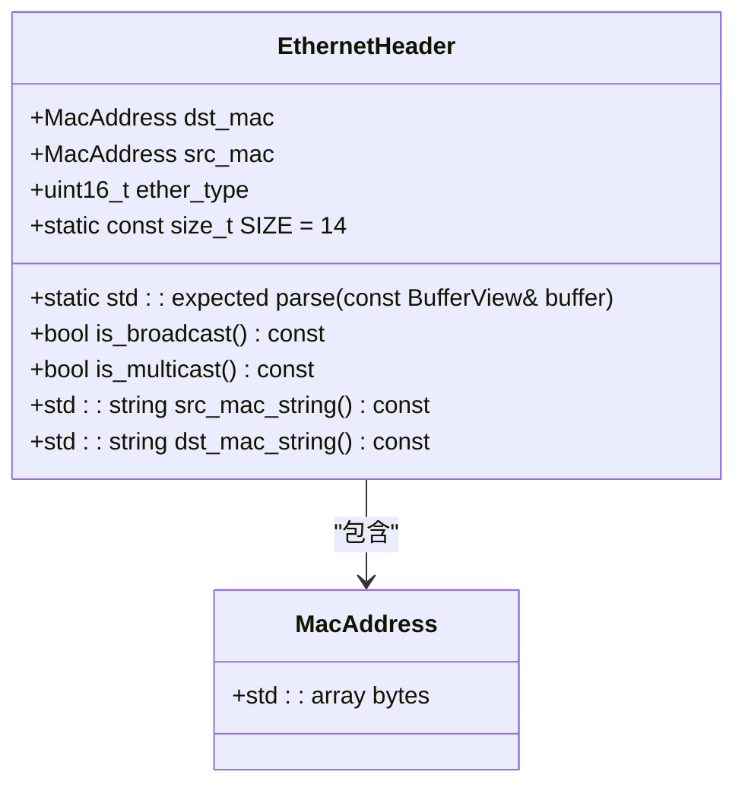
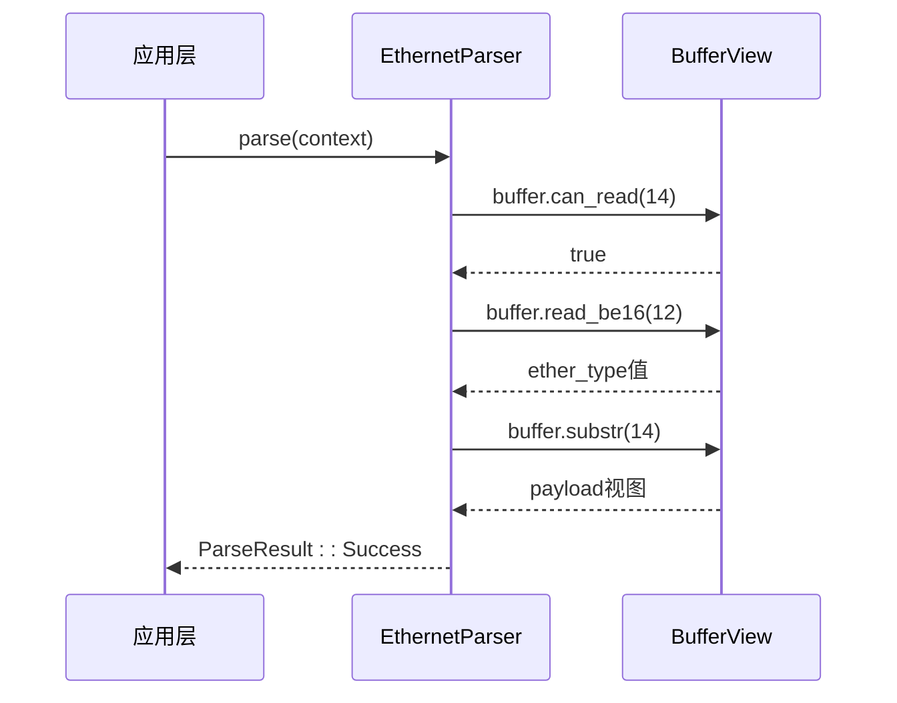
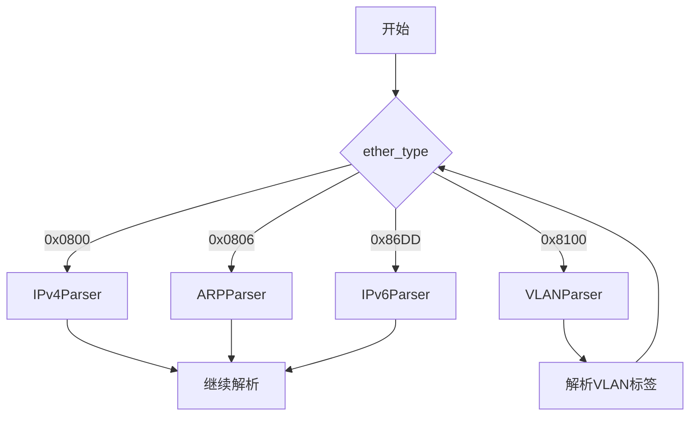
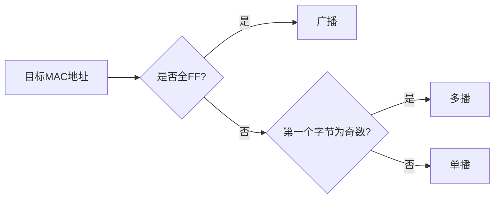

# Ethernet解析器

<cite>
**本文档引用的文件**
- [ethernet_parser.hpp](file://include/parsers/datalink/ethernet_parser.hpp#L27-L140)
- [buffer_view.hpp](file://include/core/buffer_view.hpp#L0-L137)
- [base_parser.hpp](file://include/parsers/base_parser.hpp#L18-L56)
- [ethernet_parser.cpp](file://src/parsers/datalink/ethernet_parser.cpp#L54-L56)
</cite>

## 目录
1. [简介](#简介)
2. [以太网帧头结构体定义与字段映射](#以太网帧头结构体定义与字段映射)
3. [零拷贝解析机制](#零拷贝解析机制)
4. [ParseResult与consumed_bytes计算](#parseresult与consumed_bytes计算)
5. [EtherType驱动的链式协议解析](#ethertype驱动的链式协议解析)
6. [ParseContext元数据提取示例](#parsecontext元数据提取示例)
7. [广播与单播MAC地址识别策略](#广播与单播mac地址识别策略)
8. [不完整帧与非法长度帧的错误处理](#不完整帧与非法长度帧的错误处理)
9. [实时捕获流程中的集成方式](#实时捕获流程中的集成方式)

## 简介
EthernetParser是协议解析框架中的数据链路层核心组件，负责对以太网帧进行高效、安全的解析。该解析器采用零拷贝设计，通过BufferView实现高性能内存访问，并支持VLAN标签解析与链式上层协议解析。其设计目标是在保证正确性的前提下最大化解析性能，适用于高吞吐量网络流量分析场景。

**Section sources**
- [ethernet_parser.hpp](file://include/parsers/datalink/ethernet_parser.hpp#L101-L140)

## 以太网帧头结构体定义与字段映射

`EthernetHeader`结构体定义了标准以太网帧头的三个核心字段：目标MAC地址（dst_mac）、源MAC地址（src_mac）和以太网类型（ether_type）。该结构体大小固定为14字节（`SIZE = 14`），符合IEEE 802.3标准。

MAC地址使用`std::array<uint8_t, 6>`类型表示，确保内存布局紧凑且可预测。`ether_type`字段为16位无符号整数，用于标识上层协议类型（如IPv4为0x0800，ARP为0x0806）。

结构体提供了静态`parse`方法，接收`BufferView`并返回`std::expected<EthernetHeader, ParseResult>`，实现了解析成功与失败的类型安全区分。同时提供`is_broadcast()`和`is_multicast()`成员函数用于地址类型判断，以及`src_mac_string()`和`dst_mac_string()`用于生成MAC地址的字符串表示。



**Diagram sources**
- [ethernet_parser.hpp](file://include/parsers/datalink/ethernet_parser.hpp#L27-L54)
- [arp_parser.hpp](file://include/parsers/datalink/arp_parser.hpp#L44)

**Section sources**
- [ethernet_parser.hpp](file://include/parsers/datalink/ethernet_parser.hpp#L27-L54)

## 零拷贝解析机制

EthernetParser通过`protocol_parser::core::BufferView`实现零拷贝解析。`BufferView`是一个高性能缓冲区视图类，封装原始数据指针、大小和容量信息，避免数据复制。其核心特性包括：

- **引用计数管理**：通过`std::atomic<uint32_t>* ref_count_`实现共享所有权，确保生命周期安全
- **SIMD加速查找**：利用AVX2/SSE2指令集优化字节模式匹配
- **类型安全读取**：提供`read_be<T>()`和`read_le<T>()`模板方法，自动处理字节序转换
- **子视图创建**：`substr()`、`prefix()`、`suffix()`方法返回新视图而非复制数据

在解析过程中，`EthernetHeader::parse()`方法直接操作`BufferView`的底层指针，通过`can_read()`检查边界安全性，使用`parse_int<T>()`模板进行类型化读取，整个过程无需内存复制。



**Diagram sources**
- [buffer_view.hpp](file://include/core/buffer_view.hpp#L0-L137)
- [ethernet_parser.hpp](file://include/parsers/datalink/ethernet_parser.hpp#L27-L54)

**Section sources**
- [buffer_view.hpp](file://include/core/buffer_view.hpp#L0-L137)

## ParseResult与consumed_bytes计算

`ParseResult`是解析状态的枚举类型，定义于`base_parser.hpp`中，包含`Success`、`NeedMoreData`、`InvalidFormat`等状态。EthernetParser在解析过程中根据输入数据完整性返回相应状态。

`consumed_bytes`并非直接字段，而是通过`ParseContext`的`offset`字段间接体现。当解析成功时，解析器会更新`context.offset`为已消耗的字节数（通常为14字节以太网头长度，若含VLAN则额外+4字节）。上层调用者可通过比较解析前后`offset`值计算实际消耗字节数。

例如，在`parse_header()`状态机函数中，若成功解析以太网头，则设置`context.offset += EthernetHeader::SIZE`，从而记录消耗。

**Section sources**
- [base_parser.hpp](file://include/parsers/base_parser.hpp#L18-L25)
- [ethernet_parser.hpp](file://include/parsers/datalink/ethernet_parser.hpp#L101-L140)

## EtherType驱动的链式协议解析

`EthernetParseResult`结构体中的`next_protocol`字段存储`ether_type`值，用于驱动上层协议的链式解析。典型流程如下：

1. EthernetParser解析帧头，提取`ether_type`
2. 将`next_protocol`存入`result_`，并将`payload`指向后续数据
3. 主解析循环根据`next_protocol`值选择下一解析器（如IPv4Parser、ArpParser）
4. 调用下一解析器的`parse()`方法处理`payload`

这种设计实现了协议栈的松耦合与可扩展性。新增协议只需注册对应解析器并匹配`ether_type`即可。



**Diagram sources**
- [ethernet_parser.hpp](file://include/parsers/datalink/ethernet_parser.hpp#L90-L95)
- [ipv4_parser.hpp](file://include/parsers/network/ipv4_parser.hpp#L46)

**Section sources**
- [ethernet_parser.hpp](file://include/parsers/datalink/ethernet_parser.hpp#L90-L95)

## ParseContext元数据提取示例

`ParseContext`结构体包含`metadata`字段（`std::unordered_map<std::string, std::any>`），可用于存储和传递解析过程中的元数据。以下为从上下文中提取以太网相关信息的代码逻辑示例：

```cpp
// 假设context为ParseContext引用
auto& result = ethernet_parser.get_result();
context.metadata["src_mac"] = result.header.src_mac_string();
context.metadata["dst_mac"] = result.header.dst_mac_string();
context.metadata["ether_type"] = result.header.ether_type;
context.metadata["is_broadcast"] = result.header.is_broadcast();
context.metadata["is_multicast"] = result.header.is_multicast();
```

上层应用可通过`std::any_cast`安全提取这些元数据：

```cpp
if (context.metadata.contains("src_mac")) {
    std::string src_mac = std::any_cast<std::string>(context.metadata.at("src_mac"));
}
```

**Section sources**
- [base_parser.hpp](file://include/parsers/base_parser.hpp#L51-L56)
- [ethernet_parser.hpp](file://include/parsers/datalink/ethernet_parser.hpp#L90-L95)

## 广播与单播MAC地址识别策略

EthernetHeader提供`is_broadcast()`和`is_multicast()`成员函数用于地址类型识别：

- `is_broadcast()`：检查目标MAC是否为全`FF`（即`ff:ff:ff:ff:ff:ff`），是则返回`true`
- `is_multicast()`：检查目标MAC第一个字节的最低有效位（LSB）是否为1（即奇数），是则为多播地址

单播地址则既非广播也非多播。该策略符合IEEE 802.3标准，可用于流量分类、过滤和统计。



**Diagram sources**
- [ethernet_parser.hpp](file://include/parsers/datalink/ethernet_parser.hpp#L27-L54)

**Section sources**
- [ethernet_parser.hpp](file://include/parsers/datalink/ethernet_parser.hpp#L27-L54)

## 不完整帧与非法长度帧的错误处理

EthernetParser在`can_parse()`方法中首先检查缓冲区大小是否至少为`EthernetHeader::SIZE`（14字节），若不足则返回`false`，触发`ParseResult::NeedMoreData`。

在`parse_header()`中，若`buffer.can_read(14)`返回`false`，则返回`ParseResult::BufferTooSmall`。若解析出的`ether_type`小于1536（传统以太网长度字段范围），则可能为802.3帧，此时根据配置决定是否支持。

非法`ether_type`值（如0x0000）通过`is_valid_ether_type()`辅助函数验证，若无效则返回`ParseResult::InvalidFormat`。所有边界检查均在不触发未定义行为的前提下完成。

**Section sources**
- [ethernet_parser.hpp](file://include/parsers/datalink/ethernet_parser.hpp#L101-L140)
- [buffer_view.hpp](file://include/core/buffer_view.hpp#L0-L137)

## 实时捕获流程中的集成方式

在实时捕获场景（如`live_capture.cpp`）中，EthernetParser通常作为解析管道的第一环。典型集成流程如下：

1. 使用Npcap捕获原始帧，填充`BufferView`
2. 创建`ParseContext`，设置`buffer`和初始`offset`
3. 实例化`EthernetParser`，调用`parse(context)`
4. 若成功，根据`next_protocol`选择下一解析器
5. 循环直至解析完成或出错
6. 提取`metadata`进行日志记录或统计

该模式实现了模块化、可扩展的协议解析架构，支持高吞吐量实时分析。

**Section sources**
- [ethernet_parser.hpp](file://include/parsers/datalink/ethernet_parser.hpp#L101-L140)
- [base_parser.hpp](file://include/parsers/base_parser.hpp#L51-L56)