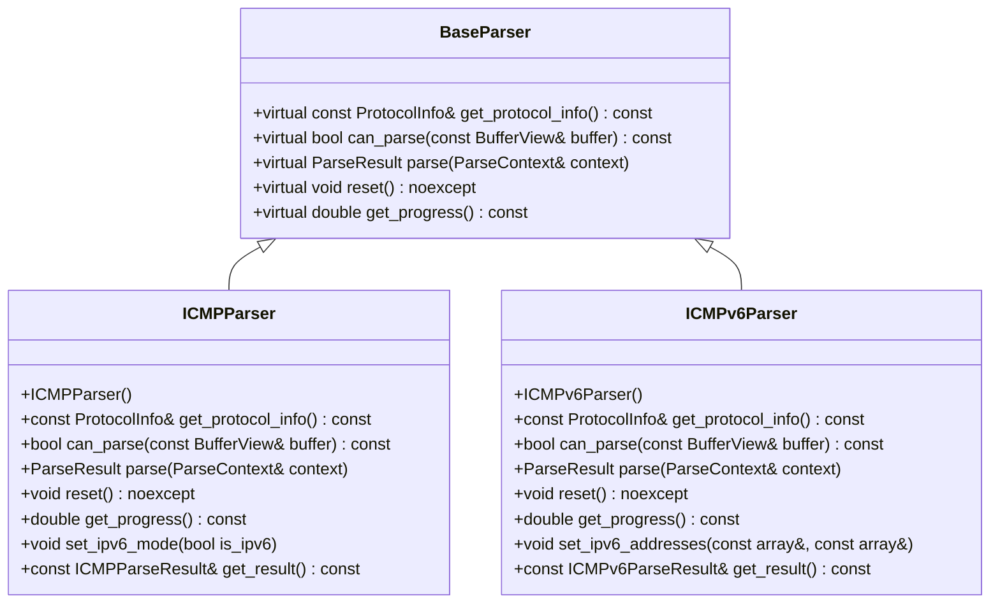
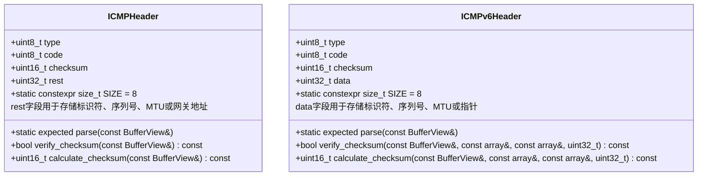
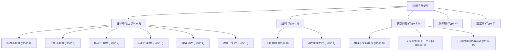
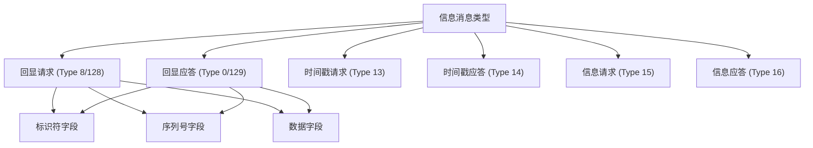
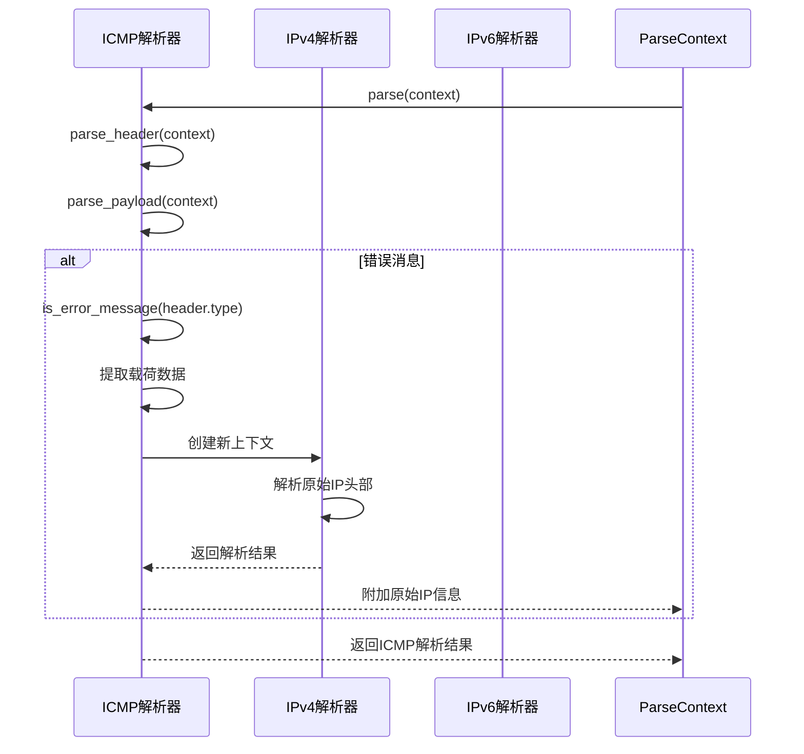
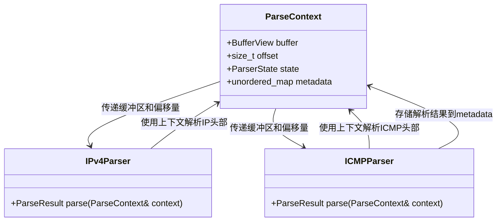
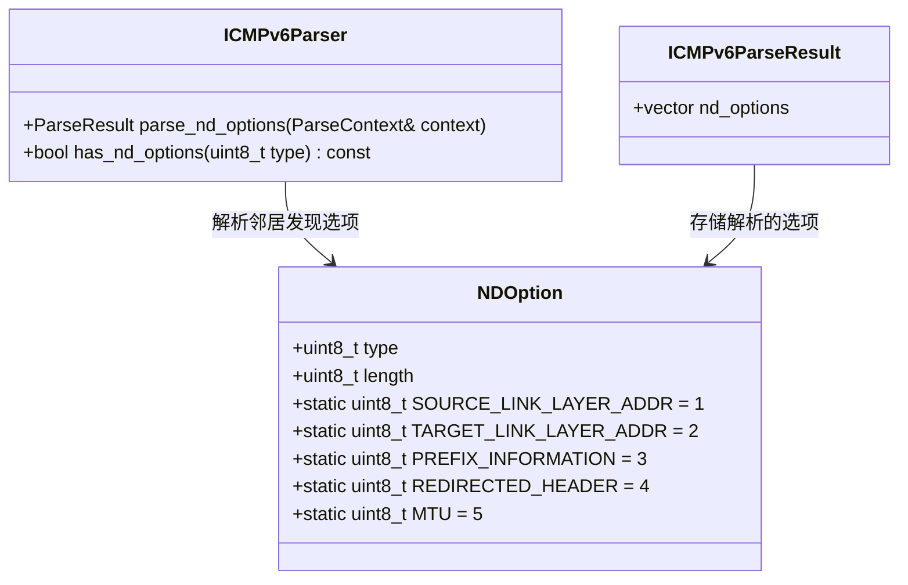

# ICMP解析器

<cite>
**本文档引用的文件**   
- [icmp_parser.hpp](file://include/parsers/network/icmp_parser.hpp)
- [icmp_parser.cpp](file://src/parsers/network/icmp_parser.cpp)
- [icmpv6_parser.hpp](file://include/parsers/network/icmpv6_parser.hpp)
- [icmpv6_parser.cpp](file://src/parsers/network/icmpv6_parser.cpp)
- [base_parser.hpp](file://include/parsers/base_parser.hpp)
- [ipv4_parser.hpp](file://include/parsers/network/ipv4_parser.hpp)
- [ipv6_parser.hpp](file://include/parsers/network/ipv6_parser.hpp)
</cite>

## 目录
1. [引言](#引言)
2. [ICMP与ICMPv6解析器实现原理](#icmp与icmpv6解析器实现原理)
3. [消息结构异同对比](#消息结构异同对比)
4. [ICMP消息类型分类解析](#icmp消息类型分类解析)
5. [错误消息中的原始IP头部提取](#错误消息中的原始ip头部提取)
6. [ParseContext机制与IP层上下文关联](#parsecontext机制与ip层上下文关联)
7. [实际抓包解析示例](#实际抓包解析示例)
8. [网络探测与故障诊断应用模式](#网络探测与故障诊断应用模式)
9. [与IPv6扩展头的交互处理](#与ipv6扩展头的交互处理)
10. [结论](#结论)

## 引言
本文档系统阐述ICMP与ICMPv6协议解析器的实现原理，详细分析两种协议在消息结构上的异同。文档深入解析各类ICMP消息类型（如回显请求/应答、目标不可达、超时、重定向等）及其代码字段的语义，并说明如何从ICMP错误消息中提取原始IP头部信息以支持诊断功能。通过分析ParseContext机制，展示ICMP报文如何与IP层上下文关联。文档还提供实际抓包解析示例，分析ICMP在网络探测与故障诊断中的应用模式，并讨论其与IPv6扩展头的交互处理。

## ICMP与ICMPv6解析器实现原理

ICMP与ICMPv6解析器均继承自`BaseParser`基类，采用状态机模式进行解析。解析器通过`ParseContext`上下文对象管理解析过程，包含数据缓冲区、当前偏移量和解析状态等信息。解析过程分为多个阶段，通过状态转换函数逐步完成。

ICMP解析器通过`set_ipv6_mode`方法区分ICMPv4和ICMPv6模式，而ICMPv6解析器则专门处理ICMPv6协议。两种解析器均实现了`can_parse`方法用于判断是否可以解析给定缓冲区，`parse`方法执行实际解析，`reset`方法重置解析状态。

**图示来源**
- [base_parser.hpp](file://include/parsers/base_parser.hpp#L100-L180)
- [icmp_parser.hpp](file://include/parsers/network/icmp_parser.hpp#L150-L200)
- [icmpv6_parser.hpp](file://include/parsers/network/icmpv6_parser.hpp#L150-L200)

**本节来源**
- [icmp_parser.hpp](file://include/parsers/network/icmp_parser.hpp#L150-L225)
- [icmpv6_parser.hpp](file://include/parsers/network/icmpv6_parser.hpp#L150-L263)
- [base_parser.hpp](file://include/parsers/base_parser.hpp#L100-L180)

## 消息结构异同对比

ICMP与ICMPv6消息结构在基本框架上相似，但存在重要差异。两者都包含类型、代码和校验和字段，但校验和计算方式不同。ICMPv6的校验和计算需要包含IPv6伪头部信息，而ICMPv4则不需要。

**图示来源**
- [icmp_parser.hpp](file://include/parsers/network/icmp_parser.hpp#L50-L100)
- [icmpv6_parser.hpp](file://include/parsers/network/icmpv6_parser.hpp#L50-L100)

**本节来源**
- [icmp_parser.hpp](file://include/parsers/network/icmp_parser.hpp#L50-L100)
- [icmpv6_parser.hpp](file://include/parsers/network/icmpv6_parser.hpp#L50-L100)

## ICMP消息类型分类解析

ICMP协议定义了多种消息类型，可分为错误消息和信息消息两大类。错误消息用于报告网络问题，信息消息用于网络诊断和控制。

### 错误消息类型

错误消息包括目标不可达、超时、参数问题等。每种错误类型都有对应的代码值，提供更详细的错误信息。

**图示来源**
- [icmp_parser.hpp](file://include/parsers/network/icmp_parser.hpp#L10-L40)
- [icmpv6_parser.hpp](file://include/parsers/network/icmpv6_parser.hpp#L10-L40)

### 信息消息类型

信息消息主要用于网络诊断，包括回显请求/应答、时间戳请求/应答等。

**图示来源**
- [icmp_parser.hpp](file://include/parsers/network/icmp_parser.hpp#L10-L40)
- [icmpv6_parser.hpp](file://include/parsers/network/icmpv6_parser.hpp#L10-L40)

**本节来源**
- [icmp_parser.hpp](file://include/parsers/network/icmp_parser.hpp#L10-L40)
- [icmpv6_parser.hpp](file://include/parsers/network/icmpv6_parser.hpp#L10-L40)
- [icmp_parser.cpp](file://src/parsers/network/icmp_parser.cpp#L200-L250)
- [icmpv6_parser.cpp](file://src/parsers/network/icmpv6_parser.cpp#L250-L300)

## 错误消息中的原始IP头部提取

ICMP错误消息（如目标不可达、超时等）的载荷部分包含导致错误的原始IP数据包的头部和部分数据。这一特性使得ICMP能够提供精确的错误诊断信息。

当ICMP解析器检测到错误消息时，会将载荷数据传递给IP解析器进行二次解析。通过这种方式，可以提取原始IP头部中的源地址、目标地址、协议类型等关键信息，为网络故障诊断提供重要线索。

**图示来源**
- [icmp_parser.cpp](file://src/parsers/network/icmp_parser.cpp#L150-L200)
- [icmpv6_parser.cpp](file://src/parsers/network/icmpv6_parser.cpp#L150-L200)
- [ipv4_parser.hpp](file://include/parsers/network/ipv4_parser.hpp#L100-L150)
- [ipv6_parser.hpp](file://include/parsers/network/ipv6_parser.hpp#L50-L100)

**本节来源**
- [icmp_parser.cpp](file://src/parsers/network/icmp_parser.cpp#L150-L200)
- [icmpv6_parser.cpp](file://src/parsers/network/icmpv6_parser.cpp#L150-L200)

## ParseContext机制与IP层上下文关联

`ParseContext`结构是解析器间通信的核心机制，它在不同协议层解析器之间传递上下文信息。该结构包含数据缓冲区、当前偏移量、解析状态和元数据映射。

当IP解析器解析到ICMP协议时，会创建ICMP解析器并传递`ParseContext`。ICMP解析器完成解析后，可以将结果信息存入`metadata`映射，供上层应用或其他解析器使用。这种机制实现了协议栈各层之间的松耦合和信息共享。

**图示来源**
- [base_parser.hpp](file://include/parsers/base_parser.hpp#L50-L60)
- [icmp_parser.hpp](file://include/parsers/network/icmp_parser.hpp#L150-L200)
- [ipv4_parser.hpp](file://include/parsers/network/ipv4_parser.hpp#L150-L200)

**本节来源**
- [base_parser.hpp](file://include/parsers/base_parser.hpp#L50-L60)
- [icmp_parser.hpp](file://include/parsers/network/icmp_parser.hpp#L150-L200)
- [ipv4_parser.hpp](file://include/parsers/network/ipv4_parser.hpp#L150-L200)

## 实际抓包解析示例

在实际网络抓包分析中，ICMP解析器能够准确识别各种ICMP消息并提取关键信息。例如，当收到一个ICMP目标不可达消息时，解析器会：

1. 解析ICMP头部，确定类型为3（目标不可达），代码为3（端口不可达）
2. 验证校验和有效性
3. 提取载荷中的原始IP头部和TCP/UDP头部
4. 将原始数据包的五元组信息存入元数据
5. 返回完整的解析结果

这种解析能力使得网络分析工具能够准确诊断"端口不可达"等网络问题，为运维人员提供精确的故障定位信息。

**本节来源**
- [icmp_parser.cpp](file://src/parsers/network/icmp_parser.cpp#L100-L200)
- [icmpv6_parser.cpp](file://src/parsers/network/icmpv6_parser.cpp#L100-L200)

## 网络探测与故障诊断应用模式

ICMP协议在网络探测和故障诊断中扮演着关键角色。Ping工具利用ICMP回显请求/应答消息检测主机可达性，Traceroute工具则利用ICMP超时消息实现路径跟踪。

ICMP解析器为这些工具提供了底层支持。通过解析ICMP消息，工具可以获得：
- 网络延迟（通过回显请求/应答的时间差）
- 路径信息（通过Traceroute中的ICMP超时消息）
- 网络问题诊断（通过目标不可达等错误消息）
- MTU信息（通过"需要分片"错误消息）

这些信息对于网络性能监控、故障排查和网络优化至关重要。

**本节来源**
- [icmp_parser.hpp](file://include/parsers/network/icmp_parser.hpp#L10-L40)
- [icmpv6_parser.hpp](file://include/parsers/network/icmpv6_parser.hpp#L10-L40)
- [icmp_parser.cpp](file://src/parsers/network/icmp_parser.cpp#L200-L250)

## 与IPv6扩展头的交互处理

ICMPv6与IPv6扩展头的交互处理是IPv6网络中的重要特性。当IPv6数据包包含扩展头时，ICMPv6错误消息的生成和处理需要特殊考虑。

ICMPv6解析器在处理包含扩展头的数据包时，需要：
1. 正确解析IPv6基本头部和所有扩展头
2. 在生成ICMPv6错误消息时，确保错误消息的载荷包含足够的原始数据
3. 处理邻居发现协议（NDP）相关的ICMPv6消息，这些消息可能包含链路层地址选项

对于邻居发现消息，ICMPv6解析器会额外解析ND选项，如源链路层地址、目标链路层地址等，这些信息对于IPv6地址解析和邻居发现至关重要。

**图示来源**
- [icmpv6_parser.hpp](file://include/parsers/network/icmpv6_parser.hpp#L110-L130)
- [icmpv6_parser.cpp](file://src/parsers/network/icmpv6_parser.cpp#L200-L250)

**本节来源**
- [icmpv6_parser.hpp](file://include/parsers/network/icmpv6_parser.hpp#L110-L130)
- [icmpv6_parser.cpp](file://src/parsers/network/icmpv6_parser.cpp#L200-L250)

## 结论
ICMP与ICMPv6解析器实现了对两种重要网络控制协议的完整解析支持。通过统一的解析框架和状态机模式，解析器能够高效处理各种ICMP消息类型。ICMP错误消息中包含原始IP头部的特性，使其成为网络诊断的重要工具。ParseContext机制实现了协议层间的有效通信，而与IPv6扩展头的交互处理则体现了对现代网络协议的全面支持。这些特性共同构成了一个强大、灵活的ICMP协议分析能力，为网络监控、故障诊断和安全分析提供了坚实的基础。