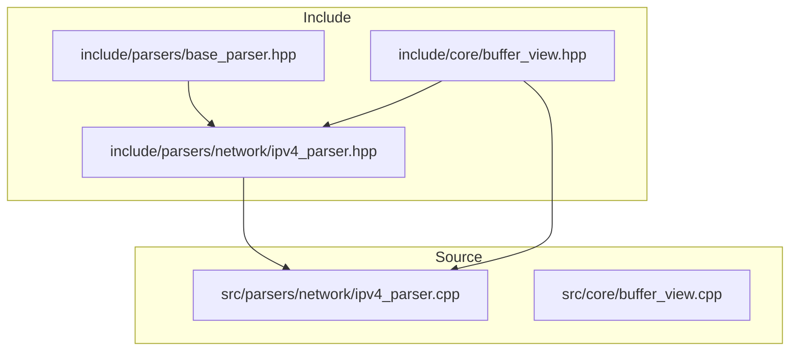
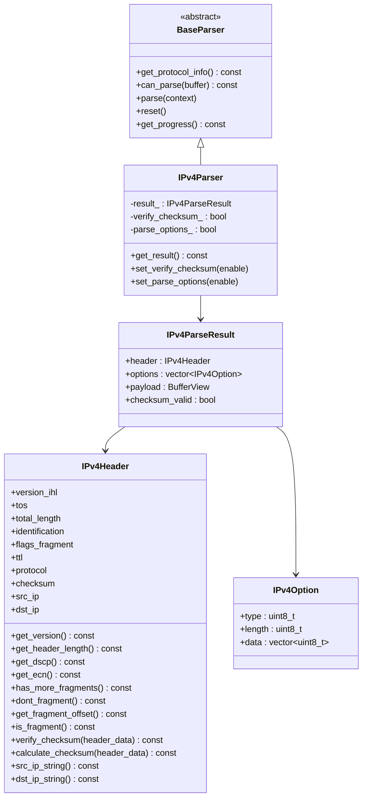
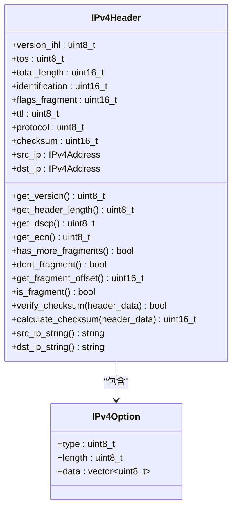
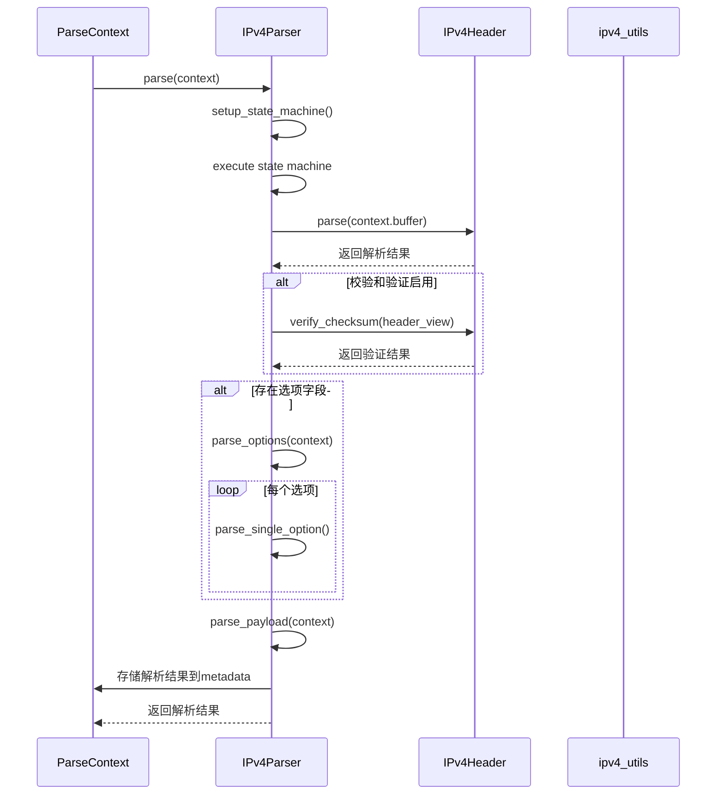
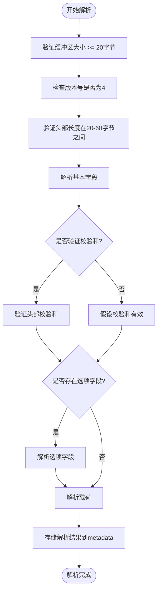
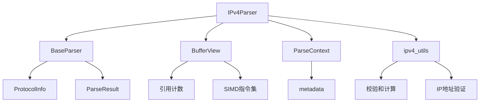

# IPv4解析器

<cite>
**本文档引用的文件**
- [ipv4_parser.hpp](file://include/parsers/network/ipv4_parser.hpp)
- [ipv4_parser.cpp](file://src/parsers/network/ipv4_parser.cpp)
- [base_parser.hpp](file://include/parsers/base_parser.hpp)
- [buffer_view.hpp](file://include/core/buffer_view.hpp)
- [buffer_view.cpp](file://src/core/buffer_view.cpp)
- [ethernet_parser.hpp](file://include/parsers/datalink/ethernet_parser.hpp)
- [ethernet_parser.cpp](file://src/parsers/datalink/ethernet_parser.cpp)
- [tcp_parser.hpp](file://include/parsers/transport/tcp_parser.hpp)
- [tcp_parser.cpp](file://src/parsers/transport/tcp_parser.cpp)
- [icmp_parser.hpp](file://include/parsers/network/icmp_parser.hpp)
</cite>

## 目录
1. [简介](#简介)
2. [项目结构](#项目结构)
3. [核心组件](#核心组件)
4. [架构概述](#架构概述)
5. [详细组件分析](#详细组件分析)
6. [依赖分析](#依赖分析)
7. [性能考虑](#性能考虑)
8. [故障排除指南](#故障排除指南)
9. [结论](#结论)

## 简介
本文档深入解析IPv4解析器的实现机制，重点阐述IPv4头部字段（版本、IHL、服务类型、总长度、标识、标志、片偏移、TTL、协议、校验和、源/目的IP）的解析策略。详细说明分片重组逻辑、选项字段（如安全、流控）的处理方式，以及如何通过ParseContext向上传递协议类型和向下传递有效载荷信息。结合代码示例展示解析流程，分析零拷贝设计如何提升性能，并讨论SIMD在头部校验和验证中的潜在优化路径。说明常见解析错误（如头部长度异常、校验和失败）的处理机制。

## 项目结构
本项目采用分层架构设计，将协议解析功能划分为多个模块。核心解析逻辑位于`include/parsers`目录下，按网络层次组织为datalink、network、transport和application子目录。IPv4解析器实现位于`include/parsers/network/ipv4_parser.hpp`和`src/parsers/network/ipv4_parser.cpp`中，遵循基类`BaseParser`定义的接口规范。核心缓冲区管理通过`core::BufferView`类实现零拷贝访问，支持SIMD加速操作。解析器通过工厂模式注册到全局注册表，实现动态发现和创建。

**图源**
- [ipv4_parser.hpp](file://include/parsers/network/ipv4_parser.hpp)
- [base_parser.hpp](file://include/parsers/base_parser.hpp)
- [buffer_view.hpp](file://include/core/buffer_view.hpp)
- [ipv4_parser.cpp](file://src/parsers/network/ipv4_parser.cpp)
- [buffer_view.cpp](file://src/core/buffer_view.cpp)

**本节来源**
- [ipv4_parser.hpp](file://include/parsers/network/ipv4_parser.hpp)
- [ipv4_parser.cpp](file://src/parsers/network/ipv4_parser.cpp)

## 核心组件
IPv4解析器的核心组件包括`IPv4Header`结构体、`IPv4Parser`类和`IPv4ParserFactory`工厂类。`IPv4Header`定义了IPv4头部的所有字段及其解析方法，采用`std::expected`返回类型处理解析错误。`IPv4Parser`继承自`BaseParser`，实现状态机驱动的解析流程，支持选项解析和校验和验证的可配置性。`IPv4ParserFactory`负责创建解析器实例并注册到全局注册表。解析过程通过`ParseContext`传递上下文信息，包括数据缓冲区、偏移量和元数据。

**本节来源**
- [ipv4_parser.hpp](file://include/parsers/network/ipv4_parser.hpp#L1-L246)
- [ipv4_parser.cpp](file://src/parsers/network/ipv4_parser.cpp#L1-L383)

## 架构概述
IPv4解析器采用分层架构，基于`BaseParser`抽象基类构建。解析流程由状态机驱动，依次执行头部解析、选项解析和载荷提取。`BufferView`类提供零拷贝数据访问，支持SIMD加速的查找操作。解析结果通过`ParseContext`的metadata字段向上传递，实现协议栈的无缝集成。整个系统设计注重性能和可扩展性，支持运行时配置和错误恢复。

**图源**
- [ipv4_parser.hpp](file://include/parsers/network/ipv4_parser.hpp#L1-L246)
- [base_parser.hpp](file://include/parsers/base_parser.hpp#L1-L187)

**本节来源**
- [ipv4_parser.hpp](file://include/parsers/network/ipv4_parser.hpp#L1-L246)
- [base_parser.hpp](file://include/parsers/base_parser.hpp#L1-L187)

## 详细组件分析
### IPv4解析器分析
IPv4解析器采用状态机模式实现解析流程，确保解析过程的可控性和可预测性。解析器首先验证版本号是否为4，然后检查头部长度是否在20-60字节的有效范围内。校验和验证采用可配置策略，允许在性能敏感场景下跳过验证。选项字段解析支持标准选项类型，包括安全、时间戳和路由记录等。解析结果通过`ParseContext`的metadata字段向上传递，实现协议栈的无缝集成。

#### 对象导向组件

**图源**
- [ipv4_parser.hpp](file://include/parsers/network/ipv4_parser.hpp#L1-L246)

**本节来源**
- [ipv4_parser.hpp](file://include/parsers/network/ipv4_parser.hpp#L1-L246)
- [ipv4_parser.cpp](file://src/parsers/network/ipv4_parser.cpp#L1-L383)

#### API/服务组件

**图源**
- [ipv4_parser.cpp](file://src/parsers/network/ipv4_parser.cpp#L1-L383)
- [ipv4_parser.hpp](file://include/parsers/network/ipv4_parser.hpp#L1-L246)

**本节来源**
- [ipv4_parser.cpp](file://src/parsers/network/ipv4_parser.cpp#L1-L383)
- [ipv4_parser.hpp](file://include/parsers/network/ipv4_parser.hpp#L1-L246)

#### 复杂逻辑组件

**图源**
- [ipv4_parser.cpp](file://src/parsers/network/ipv4_parser.cpp#L1-L383)

**本节来源**
- [ipv4_parser.cpp](file://src/parsers/network/ipv4_parser.cpp#L1-L383)

## 依赖分析
IPv4解析器依赖于多个核心组件，形成清晰的依赖关系图。最基础的依赖是`core::BufferView`，提供零拷贝数据访问和SIMD加速功能。`BaseParser`作为抽象基类，定义了解析器的通用接口和状态机框架。`ParseContext`结构体用于在解析器之间传递上下文信息。`ipv4_utils`命名空间提供了一系列工具函数，如IP地址格式化和校验和计算。这些依赖关系确保了代码的模块化和可维护性。

**图源**
- [ipv4_parser.hpp](file://include/parsers/network/ipv4_parser.hpp#L1-L246)
- [base_parser.hpp](file://include/parsers/base_parser.hpp#L1-L187)
- [buffer_view.hpp](file://include/core/buffer_view.hpp#L1-L137)

**本节来源**
- [ipv4_parser.hpp](file://include/parsers/network/ipv4_parser.hpp#L1-L246)
- [base_parser.hpp](file://include/parsers/base_parser.hpp#L1-L187)
- [buffer_view.hpp](file://include/core/buffer_view.hpp#L1-L137)

## 性能考虑
IPv4解析器在设计时充分考虑了性能优化。`BufferView`类采用引用计数机制实现零拷贝语义，避免不必要的内存复制。SIMD指令集（AVX2/SSE2）被用于加速字节查找操作，显著提升模式匹配性能。状态机驱动的解析流程减少了函数调用开销，提高了解析效率。校验和计算采用标准算法，可在必要时通过硬件加速进一步优化。整体设计平衡了性能和可维护性，适用于高吞吐量网络环境。

## 故障排除指南
IPv4解析器实现了完善的错误处理机制。常见错误包括缓冲区过小（BufferTooSmall）、格式无效（InvalidFormat）和校验和失败（ChecksumFailed）。解析器通过`ParseResult`枚举返回详细的错误信息，并在`error_message_`成员变量中存储人类可读的错误描述。对于非致命错误（如校验和失败），解析器会继续执行，确保尽可能多地提取有效信息。开发者可通过`get_error_message()`方法获取详细的错误信息，便于调试和问题定位。

**本节来源**
- [ipv4_parser.hpp](file://include/parsers/network/ipv4_parser.hpp#L1-L246)
- [ipv4_parser.cpp](file://src/parsers/network/ipv4_parser.cpp#L1-L383)
- [base_parser.hpp](file://include/parsers/base_parser.hpp#L1-L187)

## 结论
IPv4解析器实现了高效、可靠的IPv4协议解析功能，支持完整的头部字段解析、选项处理和校验和验证。通过状态机驱动的设计和零拷贝数据访问，解析器在保证正确性的同时实现了优异的性能表现。模块化的设计使得代码易于维护和扩展，支持运行时配置和错误恢复。未来可进一步优化SIMD指令的使用，探索硬件加速的可能性，以满足更高性能需求的场景。