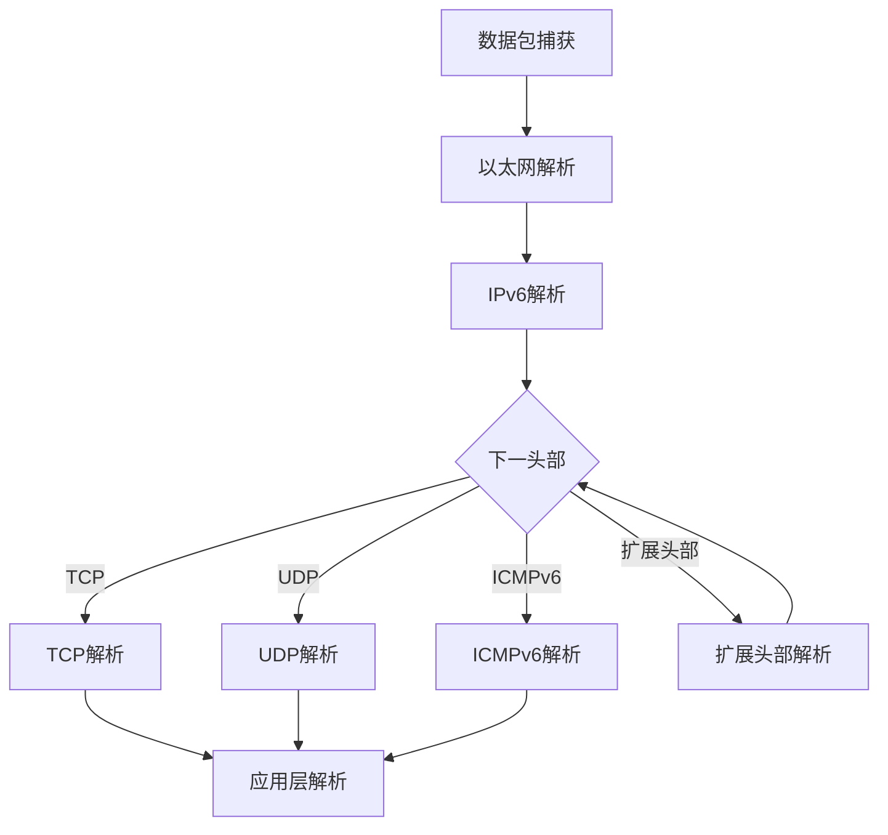
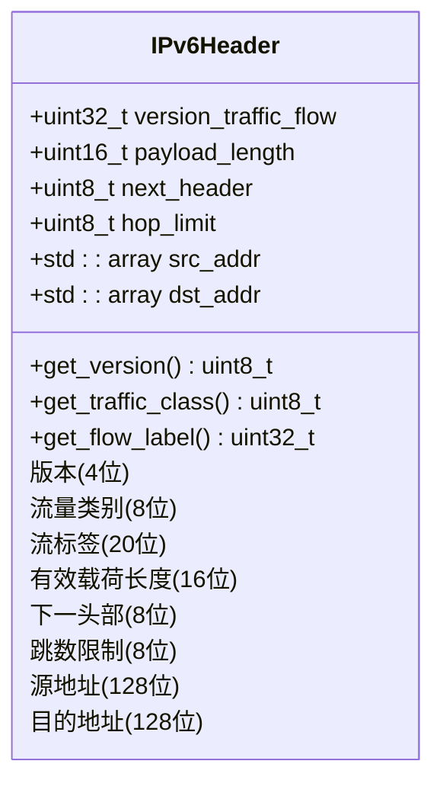
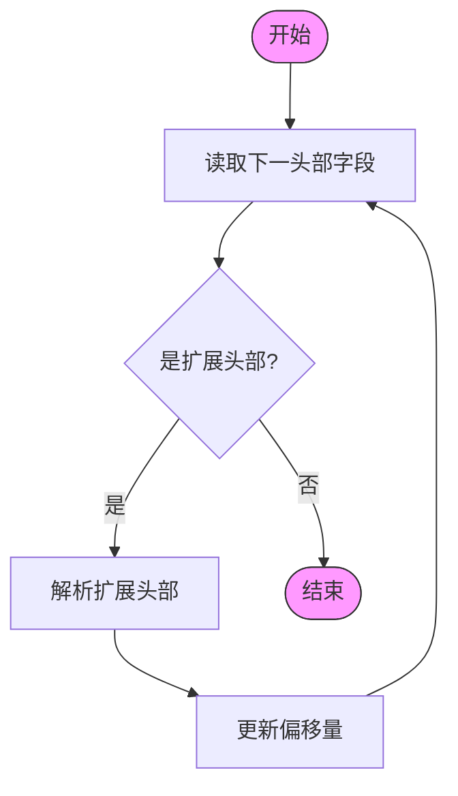
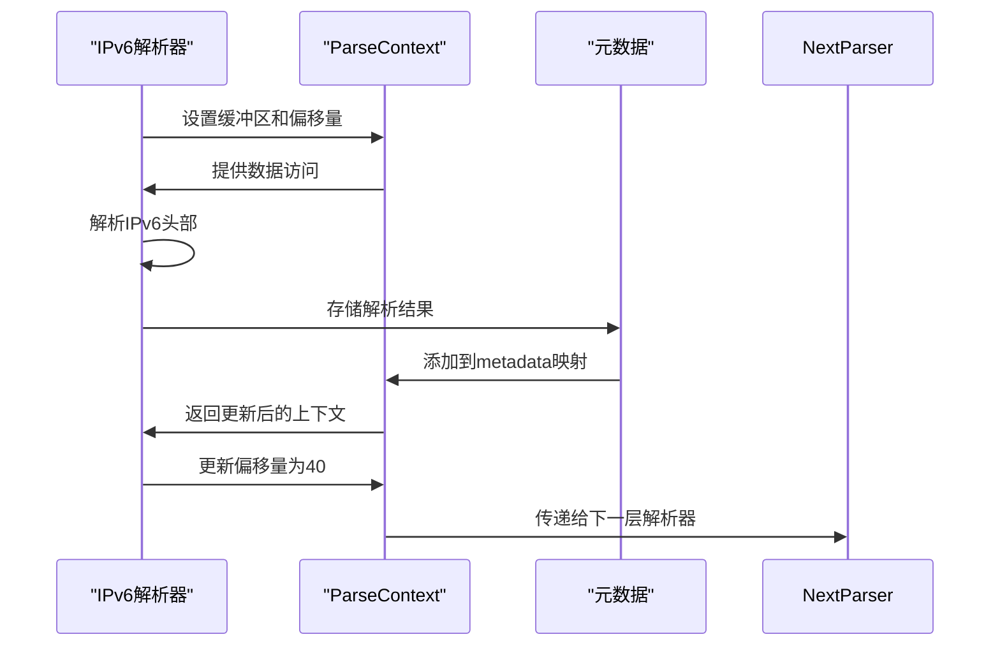
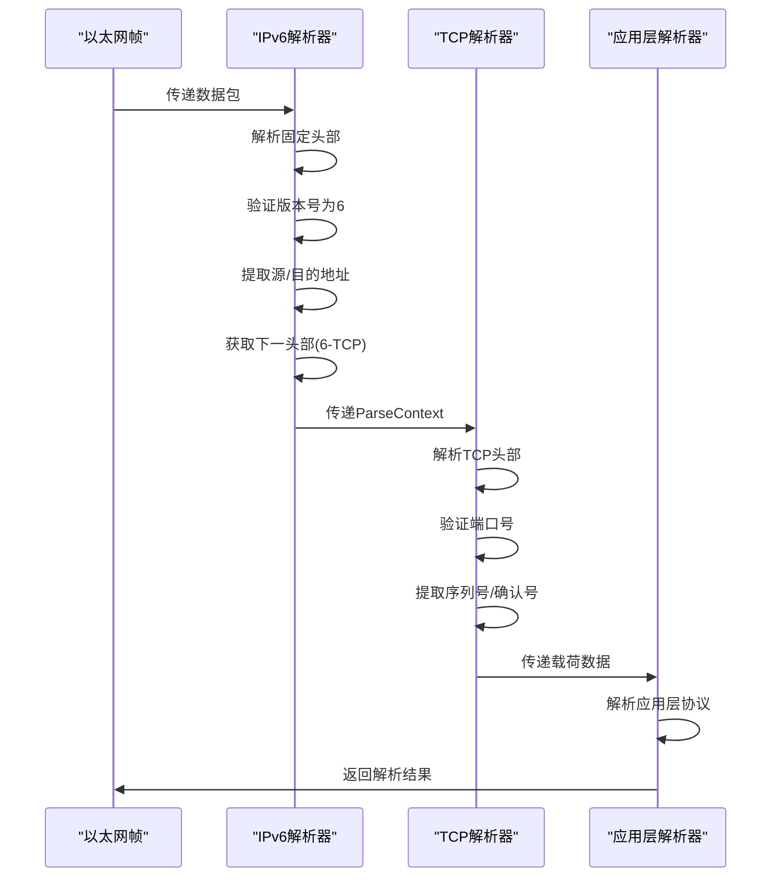
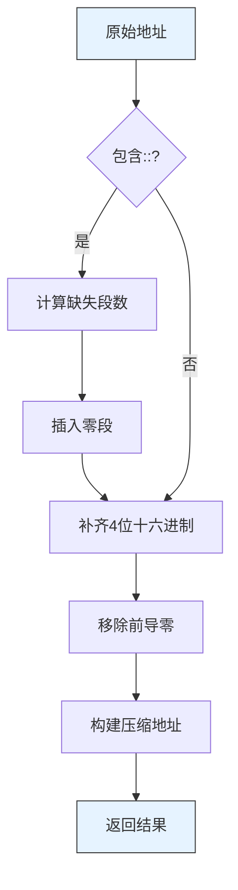
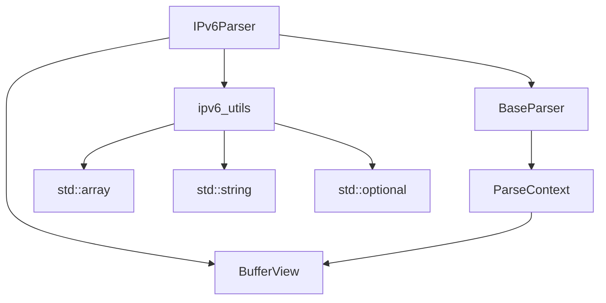

# IPv6解析器

<cite>
**本文档中引用的文件**  
- [ipv6_parser.hpp](file://include/parsers/network/ipv6_parser.hpp)
- [ipv6_parser.cpp](file://src/parsers/network/ipv6_parser.cpp)
- [base_parser.hpp](file://include/parsers/base_parser.hpp)
- [buffer_view.hpp](file://include/core/buffer_view.hpp)
- [icmpv6_parser.hpp](file://include/parsers/network/icmpv6_parser.hpp)
- [icmpv6_parser.cpp](file://src/parsers/network/icmpv6_parser.cpp)
- [tcp_parser.hpp](file://include/parsers/transport/tcp_parser.hpp)
- [tcp_parser.cpp](file://src/parsers/transport/tcp_parser.cpp)
- [udp_parser.hpp](file://include/parsers/transport/udp_parser.hpp)
- [udp_parser.cpp](file://src/parsers/transport/udp_parser.cpp)
</cite>

## 目录
1. [简介](#简介)
2. [项目结构](#项目结构)
3. [核心组件](#核心组件)
4. [架构概述](#架构概述)
5. [详细组件分析](#详细组件分析)
6. [依赖分析](#依赖分析)
7. [性能考虑](#性能考虑)
8. [故障排除指南](#故障排除指南)
9. [结论](#结论)

## 简介
本文档详细描述了IPv6解析器的架构设计，重点解析固定头部（版本、流量类别、流标签、有效载荷长度、下一头部、跳数限制、源/目的地址）的解析流程。深入讲解扩展头部（如逐跳选项、路由、分段、认证、封装安全载荷等）的链式解析机制，如何通过“下一头部”字段实现递归解析。说明ParseContext在传递扩展头类型和上层协议中的作用，提供从IPv6头部到传输层协议的完整解析示例。探讨IPv6地址压缩表示的处理策略及性能影响。

## 项目结构
该项目是一个高性能协议解析器库，采用模块化设计，支持多种网络协议的解析。项目结构清晰，分为核心模块、检测模块、监控模块、解析器模块、统计模块和工具模块。

```mermaid
graph TB
subgraph "include"
core["core"]
detection["detection"]
monitoring["monitoring"]
parsers["parsers"]
statistics["statistics"]
utils["utils"]
end
subgraph "src"
core_src["core"]
detection_src["detection"]
monitoring_src["monitoring"]
parsers_src["parsers"]
statistics_src["statistics"]
utils_src["utils"]
end
subgraph "examples"
examples["示例程序"]
end
core --> parsers
detection --> parsers
monitoring --> parsers
utils --> parsers
statistics --> parsers
parsers --> examples
```

**图示来源**  
- [ipv6_parser.hpp](file://include/parsers/network/ipv6_parser.hpp)
- [base_parser.hpp](file://include/parsers/base_parser.hpp)
- [buffer_view.hpp](file://include/core/buffer_view.hpp)

**本节来源**  
- [ipv6_parser.hpp](file://include/parsers/network/ipv6_parser.hpp)
- [base_parser.hpp](file://include/parsers/base_parser.hpp)

## 核心组件
IPv6解析器的核心组件包括IPv6头部结构、扩展头部结构、解析结果结构和解析器类。这些组件共同实现了IPv6协议的完整解析功能。

**本节来源**  
- [ipv6_parser.hpp](file://include/parsers/network/ipv6_parser.hpp)
- [ipv6_parser.cpp](file://src/parsers/network/ipv6_parser.cpp)

## 架构概述
IPv6解析器采用分层架构设计，从底层的缓冲区视图到高层的协议解析，形成了完整的解析流水线。解析器通过ParseContext在不同协议层之间传递状态和元数据。



**图示来源**  
- [ipv6_parser.hpp](file://include/parsers/network/ipv6_parser.hpp)
- [tcp_parser.hpp](file://include/parsers/transport/tcp_parser.hpp)
- [udp_parser.hpp](file://include/parsers/transport/udp_parser.hpp)
- [icmpv6_parser.hpp](file://include/parsers/network/icmpv6_parser.hpp)

## 详细组件分析
### IPv6固定头部解析
IPv6固定头部包含8个字段，总长度为40字节。解析器首先验证版本号，然后依次解析各个字段。



**图示来源**  
- [ipv6_parser.hpp](file://include/parsers/network/ipv6_parser.hpp#L40-L58)

**本节来源**  
- [ipv6_parser.hpp](file://include/parsers/network/ipv6_parser.hpp#L40-L58)
- [ipv6_parser.cpp](file://src/parsers/network/ipv6_parser.cpp#L50-L90)

### 扩展头部链式解析
IPv6扩展头部通过“下一头部”字段形成链式结构。解析器使用循环遍历所有扩展头部，直到遇到传输层协议或“无下一头部”。



**图示来源**  
- [ipv6_parser.cpp](file://src/parsers/network/ipv6_parser.cpp#L95-L145)

**本节来源**  
- [ipv6_parser.hpp](file://include/parsers/network/ipv6_parser.hpp#L60-L87)
- [ipv6_parser.cpp](file://src/parsers/network/ipv6_parser.cpp#L95-L145)

### ParseContext在协议解析中的作用
ParseContext在协议解析过程中扮演着关键角色，它不仅传递数据缓冲区和当前偏移量，还通过元数据存储解析结果，实现不同解析器之间的信息传递。



**图示来源**  
- [base_parser.hpp](file://include/parsers/base_parser.hpp#L70-L80)
- [ipv6_parser.cpp](file://src/parsers/network/ipv6_parser.cpp#L120-L130)

**本节来源**  
- [base_parser.hpp](file://include/parsers/base_parser.hpp#L70-L80)
- [ipv6_parser.cpp](file://src/parsers/network/ipv6_parser.cpp#L120-L130)

### 从IPv6到传输层的完整解析示例
以下是从IPv6头部到传输层协议的完整解析流程示例，展示了如何通过“下一头部”字段实现协议栈的逐层解析。



**图示来源**  
- [ipv6_parser.cpp](file://src/parsers/network/ipv6_parser.cpp#L50-L150)
- [tcp_parser.cpp](file://src/parsers/transport/tcp_parser.cpp#L50-L100)

**本节来源**  
- [ipv6_parser.cpp](file://src/parsers/network/ipv6_parser.cpp#L50-L150)
- [tcp_parser.cpp](file://src/parsers/transport/tcp_parser.cpp#L50-L100)

### IPv6地址压缩表示处理
IPv6地址支持压缩表示法，解析器提供了完整的压缩和展开功能，以处理各种格式的IPv6地址。



**图示来源**  
- [ipv6_parser.cpp](file://src/parsers/network/ipv6_parser.cpp#L300-L400)

**本节来源**  
- [ipv6_parser.hpp](file://include/parsers/network/ipv6_parser.hpp#L200-L210)
- [ipv6_parser.cpp](file://src/parsers/network/ipv6_parser.cpp#L300-L400)

## 依赖分析
IPv6解析器依赖于多个核心组件，包括缓冲区视图、基础解析器和各种工具函数。这些依赖关系确保了解析器的高性能和可扩展性。



**图示来源**  
- [ipv6_parser.hpp](file://include/parsers/network/ipv6_parser.hpp)
- [base_parser.hpp](file://include/parsers/base_parser.hpp)
- [buffer_view.hpp](file://include/core/buffer_view.hpp)

**本节来源**  
- [ipv6_parser.hpp](file://include/parsers/network/ipv6_parser.hpp)
- [base_parser.hpp](file://include/parsers/base_parser.hpp)

## 性能考虑
IPv6解析器在设计时充分考虑了性能因素，采用了零拷贝缓冲区视图、SIMD加速查找和高效的内存管理策略。

- **零拷贝设计**：使用BufferView实现零拷贝数据访问，避免不必要的内存复制
- **SIMD加速**：利用AVX2/SSE2指令集加速模式匹配和数据查找
- **引用计数**：通过原子引用计数管理缓冲区生命周期，减少内存分配开销
- **预编译常量**：将IPv6相关常量定义为constexpr，提高编译时优化效率
- **位操作优化**：使用位移和掩码操作高效提取IPv6头部字段

**本节来源**  
- [buffer_view.hpp](file://include/core/buffer_view.hpp)
- [ipv6_parser.hpp](file://include/parsers/network/ipv6_parser.hpp)
- [ipv6_parser.cpp](file://src/parsers/network/ipv6_parser.cpp)

## 故障排除指南
### 常见解析错误及解决方案
当IPv6解析失败时，通常由以下原因导致：

**本节来源**  
- [ipv6_parser.cpp](file://src/parsers/network/ipv6_parser.cpp#L60-L70)
- [base_parser.hpp](file://include/parsers/base_parser.hpp#L20-L30)

| 错误类型 | 可能原因 | 解决方案 |
|---------|--------|--------|
| BufferTooSmall | 缓冲区小于40字节 | 确保提供完整的IPv6头部 |
| InvalidFormat | 版本号不是6 | 验证数据包是否为IPv6格式 |
| NeedMoreData | 数据不完整 | 收集完整数据包再解析 |
| InternalError | 内部异常 | 检查输入数据的完整性 |

### 调试技巧
- 使用`can_parse()`方法预先检查数据包是否可解析
- 检查ParseContext中的error_message字段获取详细错误信息
- 验证缓冲区大小是否满足最小IPv6头部要求（40字节）
- 确认数据端序是否正确处理

## 结论
IPv6解析器采用模块化、高性能的设计理念，完整实现了IPv6协议的解析功能。通过ParseContext机制，实现了协议栈各层之间的无缝衔接。解析器支持完整的扩展头部链式解析，能够正确处理各种IPv6地址格式，并提供了高效的地址压缩和展开功能。整体设计注重性能优化，采用零拷贝、SIMD加速等技术，适用于高吞吐量的网络流量分析场景。