# 网络层解析器

<cite>
**本文档引用的文件**
- [ipv4_parser.hpp](file://include/parsers/network/ipv4_parser.hpp)
- [ipv4_parser.cpp](file://src/parsers/network/ipv4_parser.cpp)
- [ipv6_parser.hpp](file://include/parsers/network/ipv6_parser.hpp)
- [ipv6_parser.cpp](file://src/parsers/network/ipv6_parser.cpp)
- [icmp_parser.hpp](file://include/parsers/network/icmp_parser.hpp)
- [icmp_parser.cpp](file://src/parsers/network/icmp_parser.cpp)
- [icmpv6_parser.hpp](file://include/parsers/network/icmpv6_parser.hpp)
- [icmpv6_parser.cpp](file://src/parsers/network/icmpv6_parser.cpp)
- [base_parser.hpp](file://include/parsers/base_parser.hpp)
- [buffer_view.hpp](file://include/core/buffer_view.hpp)
</cite>

## 目录
1. [项目结构](#项目结构)
2. [核心组件](#核心组件)
3. [IPv4解析器实现](#ipv4解析器实现)
4. [IPv6解析器实现](#ipv6解析器实现)
5. [ICMP与ICMPv6解析器实现](#icmp与icmpv6解析器实现)
6. [解析上下文与状态机](#解析上下文与状态机)
7. [多层嵌套解析流程](#多层嵌套解析流程)
8. [性能优化分析](#性能优化分析)

## 项目结构

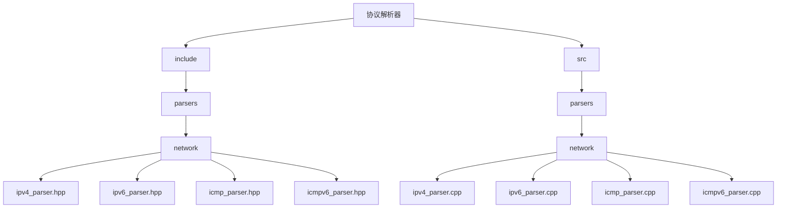

**图示来源**
- [ipv4_parser.hpp](file://include/parsers/network/ipv4_parser.hpp)
- [ipv6_parser.hpp](file://include/parsers/network/ipv6_parser.hpp)
- [icmp_parser.hpp](file://include/parsers/network/icmp_parser.hpp)
- [icmpv6_parser.hpp](file://include/parsers/network/icmpv6_parser.hpp)

**本节来源**
- [ipv4_parser.hpp](file://include/parsers/network/ipv4_parser.hpp)
- [ipv6_parser.hpp](file://include/parsers/network/ipv6_parser.hpp)

## 核心组件

网络层解析器的核心组件包括IPv4、IPv6、ICMP和ICMPv6解析器，它们均继承自`BaseParser`基类，实现了统一的解析接口。解析器通过工厂模式注册到`ParserRegistry`中，支持协议类型的动态识别和解析。`BufferView`类提供了零拷贝的缓冲区视图，支持SIMD加速和引用计数管理，为高性能解析提供了基础。

**本节来源**
- [base_parser.hpp](file://include/parsers/base_parser.hpp)
- [buffer_view.hpp](file://include/core/buffer_view.hpp)

## IPv4解析器实现

### IPv4头字段解析策略

IPv4解析器通过`IPv4Header::parse`静态方法解析IP头字段。解析过程首先检查缓冲区大小是否满足最小头部长度（20字节），然后逐字段解析版本、服务类型、总长度、标识、标志与片偏移、TTL、协议、校验和、源IP和目标IP。版本和头部长度字段通过位操作分离，头部长度以4字节为单位。

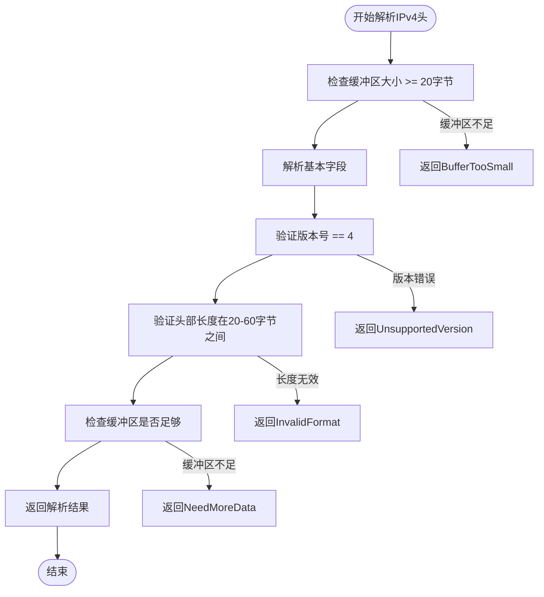

**图示来源**
- [ipv4_parser.cpp](file://src/parsers/network/ipv4_parser.cpp#L100-L150)

**本节来源**
- [ipv4_parser.hpp](file://include/parsers/network/ipv4_parser.hpp#L50-L100)
- [ipv4_parser.cpp](file://src/parsers/network/ipv4_parser.cpp#L100-L150)

### TTL与分片处理

TTL（生存时间）字段直接从第8字节读取，表示数据包在网络中的最大跳数。分片处理通过标志字段的第14位（DF位）和第13位（MF位）以及片偏移字段实现。`dont_fragment()`方法检查DF位，`has_more_fragments()`检查MF位，`get_fragment_offset()`计算片偏移（以8字节为单位）。

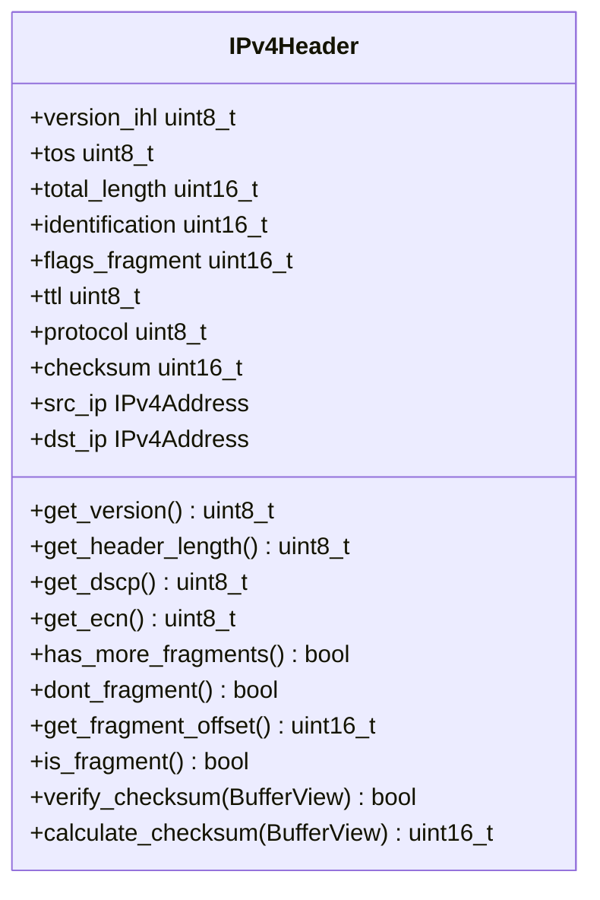

**图示来源**
- [ipv4_parser.hpp](file://include/parsers/network/ipv4_parser.hpp#L50-L100)

**本节来源**
- [ipv4_parser.hpp](file://include/parsers/network/ipv4_parser.hpp#L100-L150)

### 选项字段解析

IPv4选项字段在头部长度大于20字节时解析。选项由类型、长度和数据组成，类型0（End of Options List）和1（No Operation）长度为1字节，其他选项长度字段指定总长度。解析器通过`parse_single_option`方法逐个解析选项，支持安全的缓冲区边界检查。

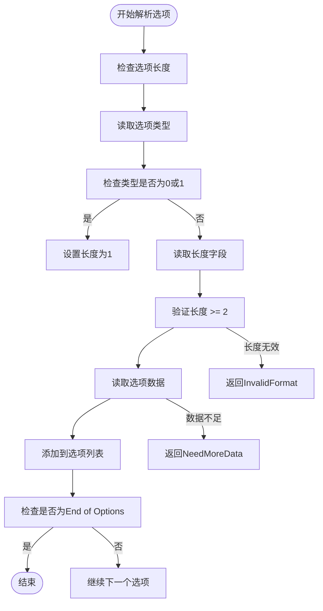

**图示来源**
- [ipv4_parser.cpp](file://src/parsers/network/ipv4_parser.cpp#L250-L300)

**本节来源**
- [ipv4_parser.hpp](file://include/parsers/network/ipv4_parser.hpp#L150-L200)
- [ipv4_parser.cpp](file://src/parsers/network/ipv4_parser.cpp#L250-L300)

## IPv6解析器实现

### IPv6头字段解析策略

IPv6解析器通过`IPv6Parser::parse`方法解析固定40字节的头部。版本、流量类别和流标签字段组合在第一个32位字中，通过位掩码分离。载荷长度、下一个头部、跳数限制、源地址和目标地址依次解析。版本号必须为6。

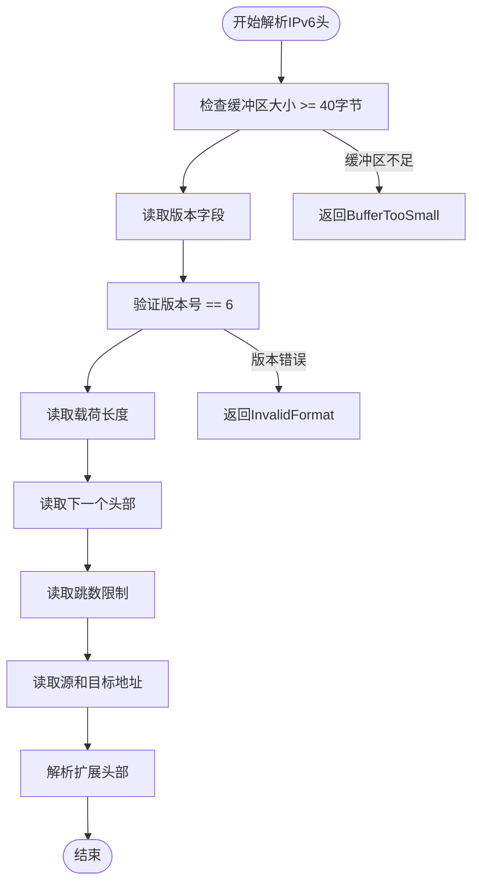

**图示来源**
- [ipv6_parser.cpp](file://src/parsers/network/ipv6_parser.cpp#L50-L100)

**本节来源**
- [ipv6_parser.hpp](file://include/parsers/network/ipv6_parser.hpp#L50-L100)
- [ipv6_parser.cpp](file://src/parsers/network/ipv6_parser.cpp#L50-L100)

### 扩展头处理机制

IPv6扩展头部通过`is_extension_header`方法识别，包括逐跳选项、路由、分片、目的选项等。解析器遍历扩展头部链，计算总头部长度，直到遇到非扩展头部的下一个头部类型。每个扩展头部的长度字段以8字节为单位。

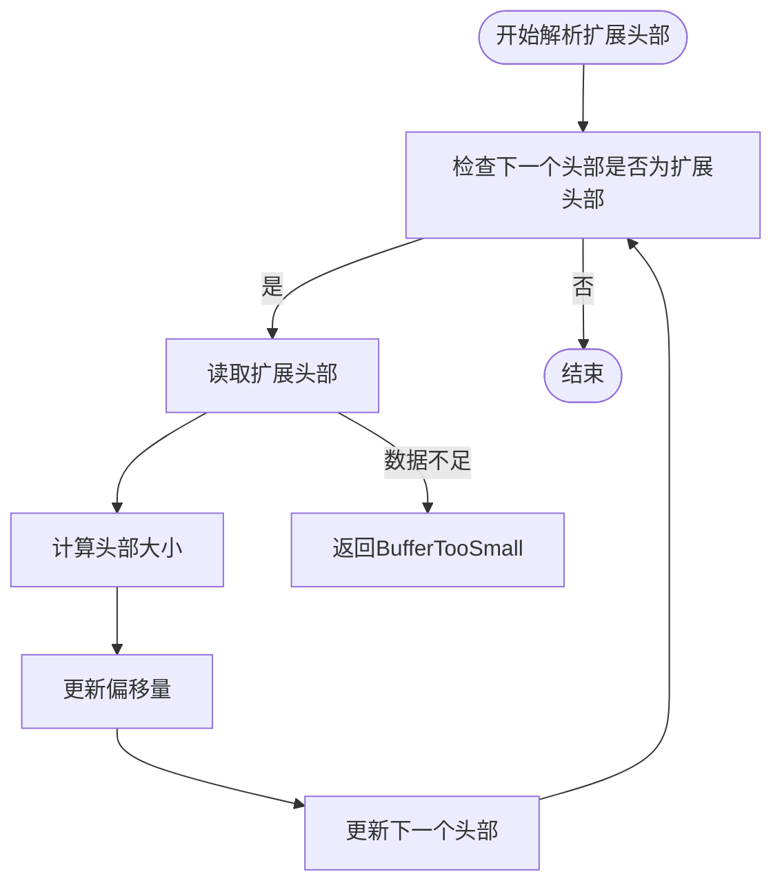

**图示来源**
- [ipv6_parser.cpp](file://src/parsers/network/ipv6_parser.cpp#L150-L200)

**本节来源**
- [ipv6_parser.hpp](file://include/parsers/network/ipv6_parser.hpp#L100-L150)
- [ipv6_parser.cpp](file://src/parsers/network/ipv6_parser.cpp#L150-L200)

## ICMP与ICMPv6解析器实现

### ICMP消息类型与代码分类

ICMP解析器通过`ICMPType`和`ICMPCode`命名空间定义消息类型和代码常量。ICMPv4类型包括回显请求/回复、目标不可达、时间超时等，ICMPv6类型包括邻居发现、多播监听器发现等。`is_error_message`和`is_info_message`方法根据类型范围分类消息。

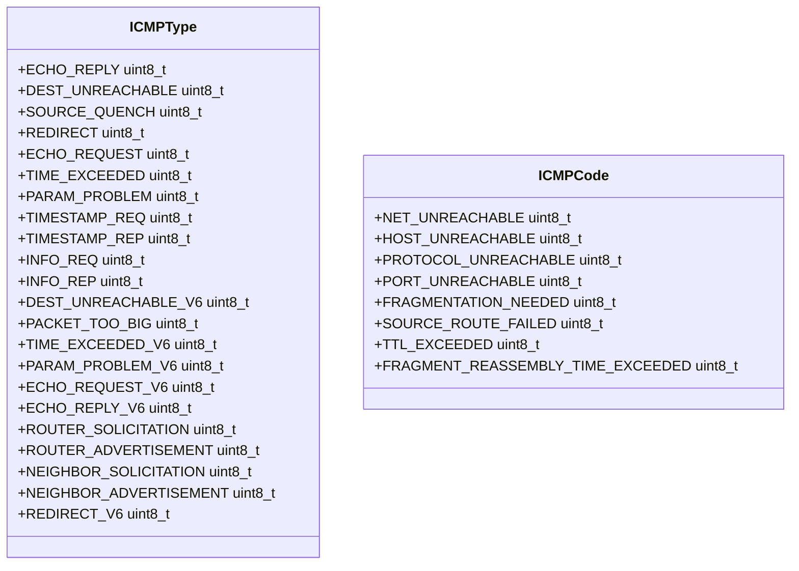

**图示来源**
- [icmp_parser.hpp](file://include/parsers/network/icmp_parser.hpp#L10-L50)

**本节来源**
- [icmp_parser.hpp](file://include/parsers/network/icmp_parser.hpp#L10-L50)
- [icmpv6_parser.hpp](file://include/parsers/network/icmpv6_parser.hpp#L10-L50)

### ICMPv6邻居发现选项解析

ICMPv6解析器支持邻居发现协议（NDP）选项解析，包括源/目标链路层地址、前缀信息、重定向头部和MTU。`parse_nd_options`方法根据消息类型跳过固定字段，然后循环解析选项，每个选项的长度以8字节为单位。

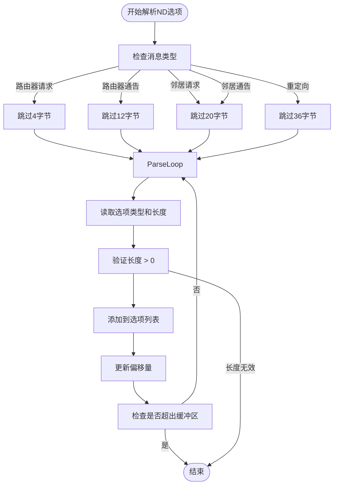

**图示来源**
- [icmpv6_parser.cpp](file://src/parsers/network/icmpv6_parser.cpp#L250-L300)

**本节来源**
- [icmpv6_parser.hpp](file://include/parsers/network/icmpv6_parser.hpp#L50-L100)
- [icmpv6_parser.cpp](file://src/parsers/network/icmpv6_parser.cpp#L250-L300)

## 解析上下文与状态机

### ParseContext传递上层协议信息

`ParseContext`结构体包含数据缓冲区、当前偏移、解析状态和元数据映射。元数据用于传递上层协议信息，如IPv6地址用于ICMPv6校验和计算。解析器通过`metadata`字段存储解析结果，供后续解析器使用。

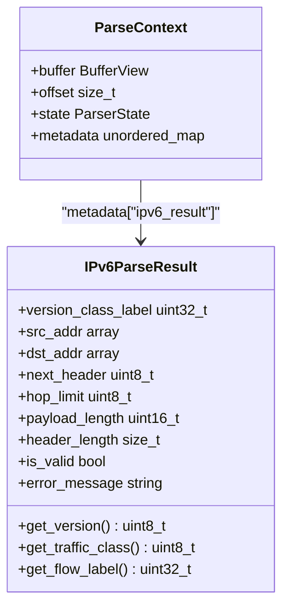

**图示来源**
- [base_parser.hpp](file://include/parsers/base_parser.hpp#L50-L100)
- [ipv6_parser.hpp](file://include/parsers/network/ipv6_parser.hpp#L150-L200)

**本节来源**
- [base_parser.hpp](file://include/parsers/base_parser.hpp#L50-L100)
- [ipv6_parser.hpp](file://include/parsers/network/ipv6_parser.hpp#L150-L200)

### 状态机驱动解析流程

解析器继承`BaseParser`，使用状态机模式驱动解析流程。`StateMachine`包含状态转换映射，`execute`方法根据当前状态调用相应的转换函数。IPv4解析器的状态机包括初始、解析头部、解析选项、解析载荷和完成状态。

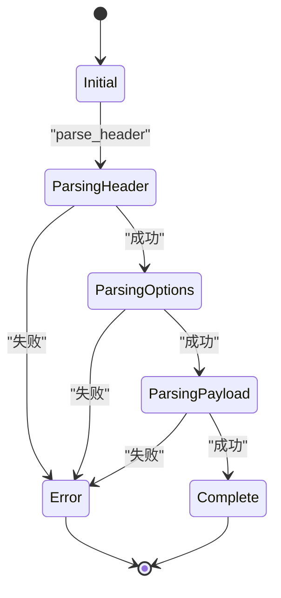

**图示来源**
- [base_parser.hpp](file://include/parsers/base_parser.hpp#L100-L150)
- [ipv4_parser.cpp](file://src/parsers/network/ipv4_parser.cpp#L300-L350)

**本节来源**
- [base_parser.hpp](file://include/parsers/base_parser.hpp#L100-L150)
- [ipv4_parser.cpp](file://src/parsers/network/ipv4_parser.cpp#L300-L350)

## 多层嵌套解析流程

### 完整解析路径示例

从以太网帧到ICMP报文的完整解析路径：以太网解析器识别IPv4类型（0x0800），调用IPv4解析器；IPv4解析器解析头部，识别协议为ICMP（1），调用ICMP解析器；ICMP解析器解析ICMP头部和载荷。解析结果通过`ParseContext::metadata`逐层传递。

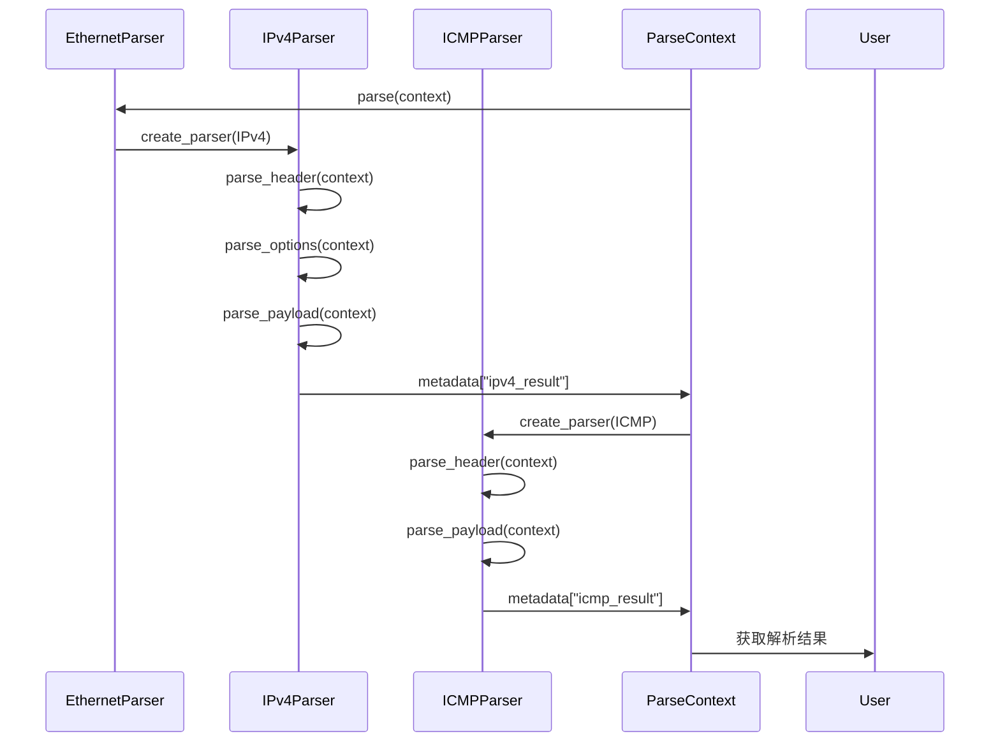

**图示来源**
- [ipv4_parser.cpp](file://src/parsers/network/ipv4_parser.cpp#L350-L400)
- [icmp_parser.cpp](file://src/parsers/network/icmp_parser.cpp#L200-L250)

**本节来源**
- [ipv4_parser.cpp](file://src/parsers/network/ipv4_parser.cpp#L350-L400)
- [icmp_parser.cpp](file://src/parsers/network/icmp_parser.cpp#L200-L250)

## 性能优化分析

### SIMD加速可能性

`BufferView`类实现了SIMD加速的查找方法，包括`find_avx2`、`find_sse2`和`find_scalar`。这些方法利用AVX2或SSE2指令集加速字节模式匹配，在解析选项或分片时可显著提升性能。编译时通过`immintrin.h`包含SIMD支持。

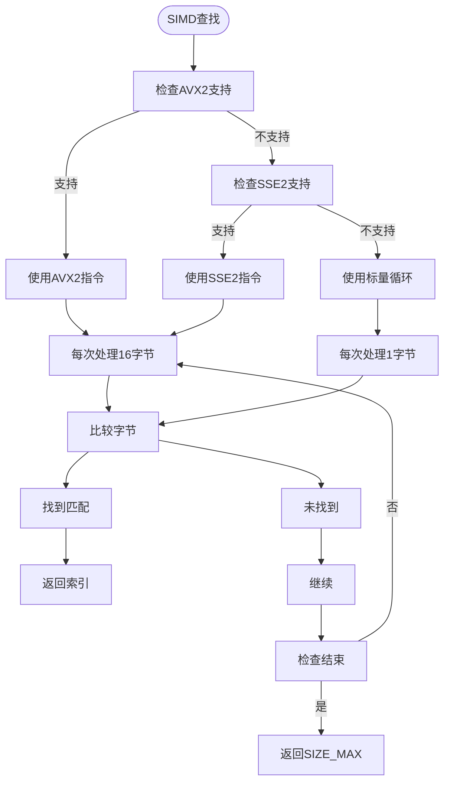

**图示来源**
- [buffer_view.hpp](file://include/core/buffer_view.hpp#L50-L100)

**本节来源**
- [buffer_view.hpp](file://include/core/buffer_view.hpp#L50-L100)