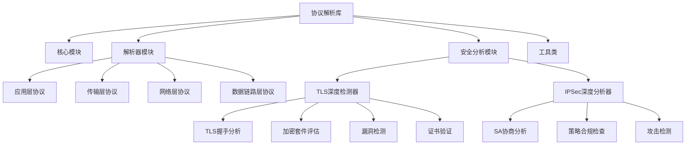
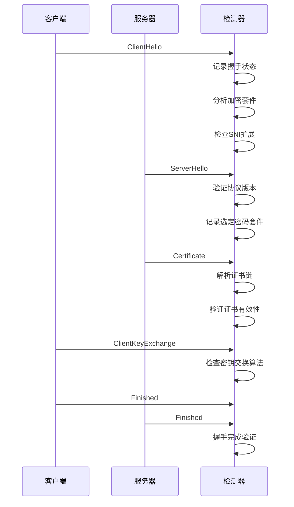
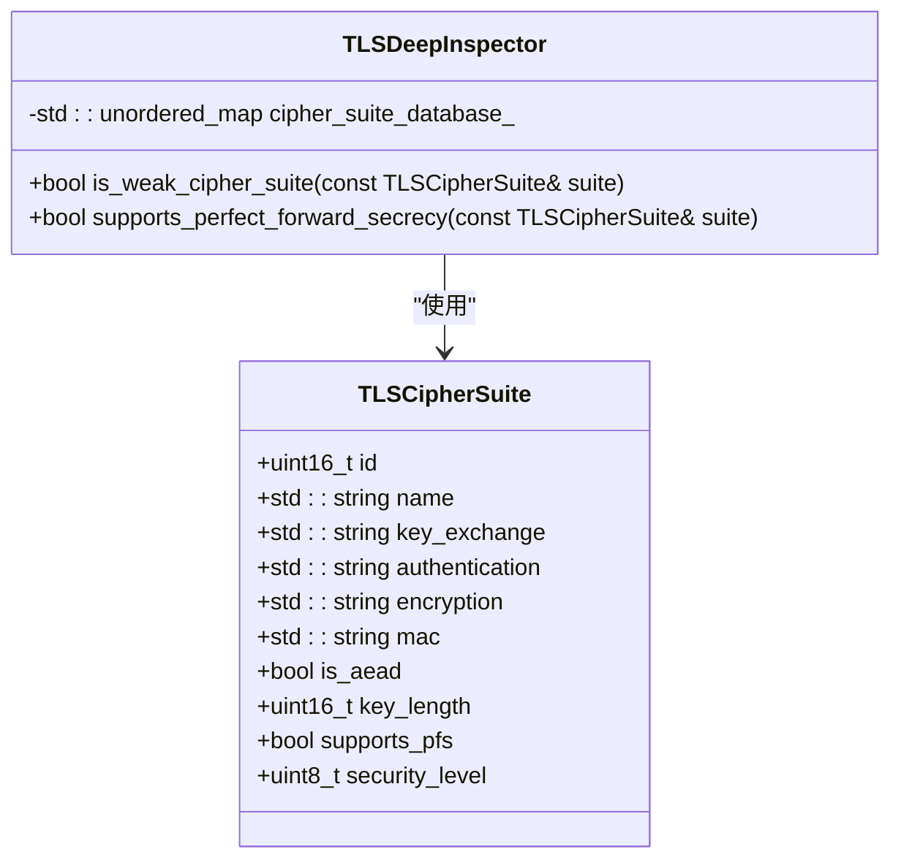
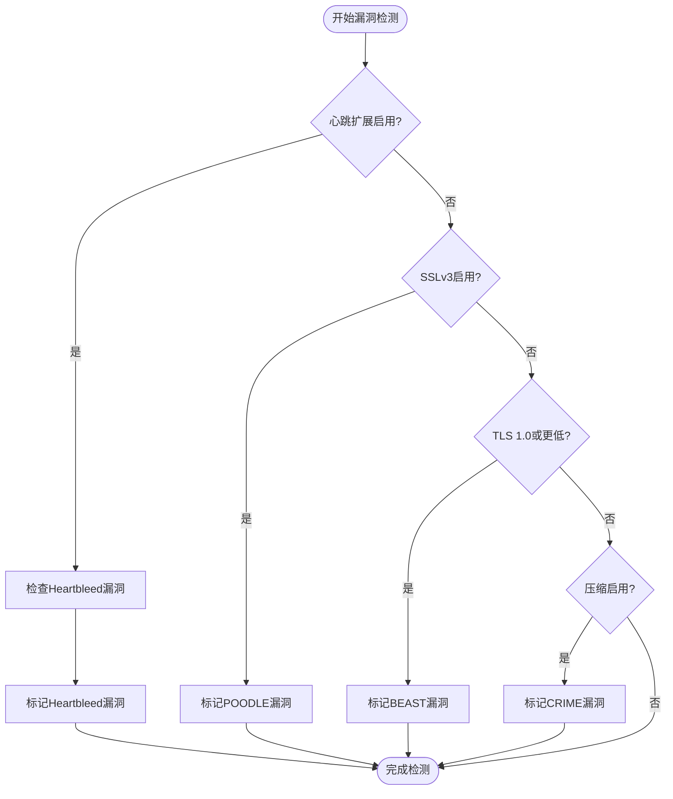
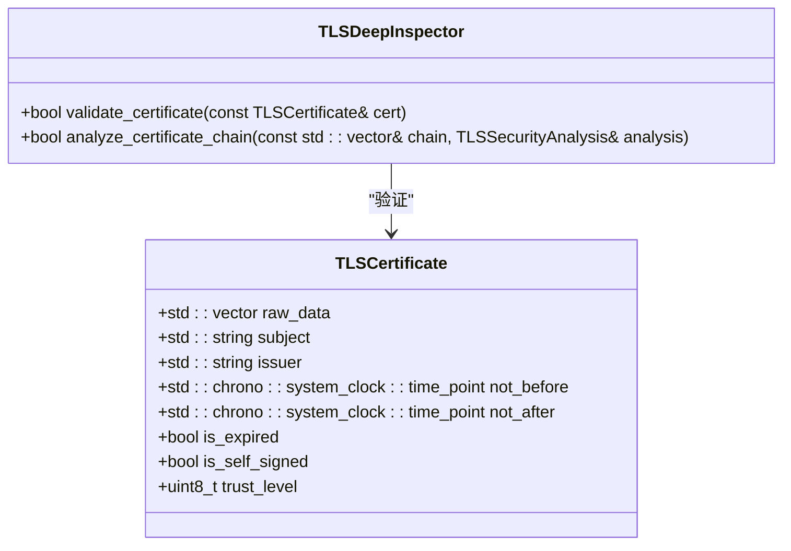
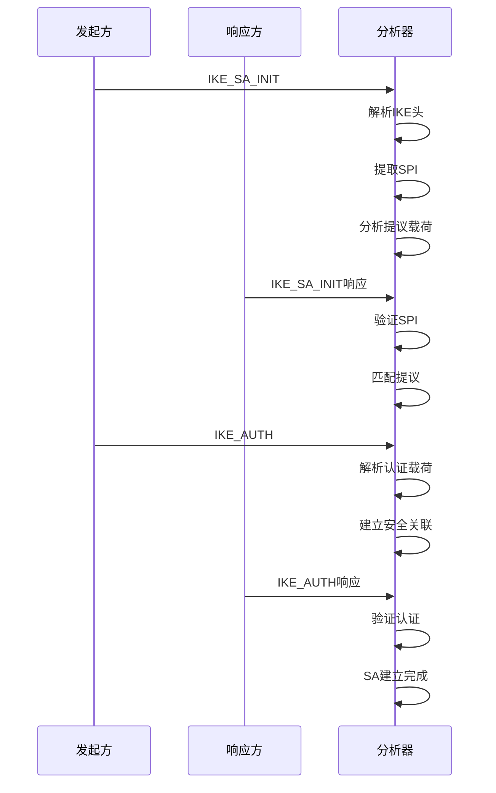
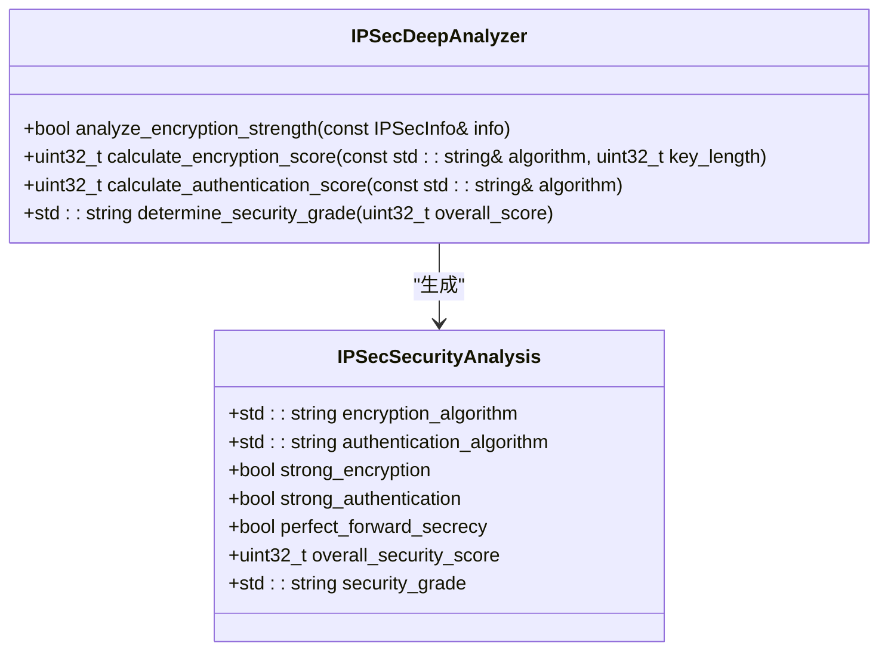
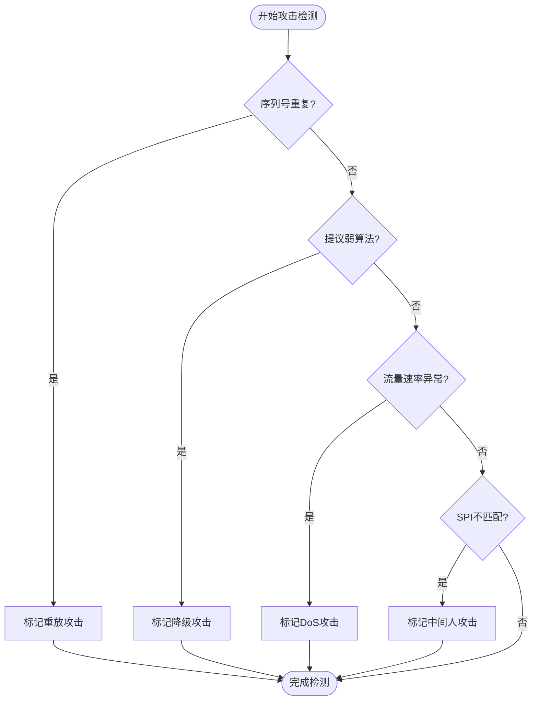
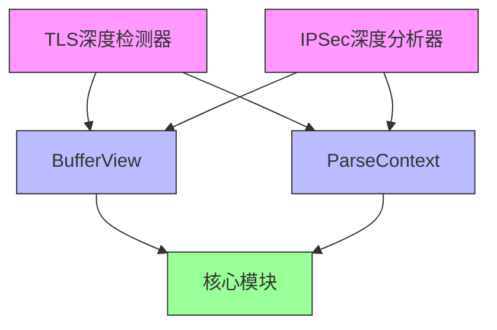

# 安全协议深度检测器

<cite>
**本文档引用文件**  
- [tls_deep_inspector.hpp](file://include/parsers/security/tls_deep_inspector.hpp)
- [tls_deep_inspector.cpp](file://src/parsers/security/tls_deep_inspector.cpp)
- [ipsec_deep_analyzer.hpp](file://include/parsers/security/ipsec_deep_analyzer.hpp)
- [README.md](file://README.md)
- [org_design_doc.md](file://org_design_doc.md)
</cite>

## 目录
1. [简介](#简介)
2. [项目结构](#项目结构)
3. [核心组件](#核心组件)
4. [TLS深度检测分析](#tls深度检测分析)
5. [IPSec深度分析](#ipsec深度分析)
6. [依赖关系分析](#依赖关系分析)
7. [性能考量](#性能考量)
8. [故障排查指南](#故障排查指南)
9. [结论](#结论)

## 简介
本项目是一个基于C++20的高性能网络协议解析库，专注于安全协议的深度检测。该库支持TLS握手分析、加密套件评估、已知漏洞检测（如Heartbleed）、证书有效性验证，以及IPSec的SA协商过程分析和策略合规性检查。采用零拷贝设计和SIMD加速技术，确保在高吞吐量场景下的卓越性能。

## 项目结构
项目采用模块化设计，主要分为核心组件、协议解析器、安全分析模块和工具类。安全协议分析功能集中在`include/parsers/security/`目录下，包含TLS和IPSec的深度分析器。

**图示来源**  
- [org_design_doc.md](file://org_design_doc.md#L1-L50)

**本节来源**  
- [README.md](file://README.md#L1-L100)
- [org_design_doc.md](file://org_design_doc.md#L1-L100)

## 核心组件
安全协议深度检测器的核心组件包括TLS深度检测器和IPSec深度分析器。TLS深度检测器负责TLS握手过程的完整分析，包括版本协商、加密套件选择、证书链验证和已知漏洞检测。IPSec深度分析器则专注于IPSec协议的安全性评估，包括ESP/AH头解析、IKE协商过程分析和安全关联（SA）管理。

**本节来源**  
- [tls_deep_inspector.hpp](file://include/parsers/security/tls_deep_inspector.hpp#L1-L50)
- [ipsec_deep_analyzer.hpp](file://include/parsers/security/ipsec_deep_analyzer.hpp#L1-L50)

## TLS深度检测分析

### TLS握手分析
TLS深度检测器能够完整解析TLS握手过程，跟踪从ClientHello到Finished的各个阶段。通过`TLSHandshakeState`结构体维护握手状态，确保能够准确识别握手完成情况。

**图示来源**  
- [tls_deep_inspector.hpp](file://include/parsers/security/tls_deep_inspector.hpp#L300-L350)
- [tls_deep_inspector.cpp](file://src/parsers/security/tls_deep_inspector.cpp#L200-L300)

### 加密套件评估
TLS深度检测器内置密码套件数据库，能够评估所选加密套件的安全性。通过`TLSCipherSuite`结构体存储密码套件信息，包括加密算法、认证机制、密钥长度等。

**图示来源**  
- [tls_deep_inspector.hpp](file://include/parsers/security/tls_deep_inspector.hpp#L100-L150)

### 已知漏洞检测
TLS深度检测器能够检测多种已知漏洞，包括Heartbleed、POODLE、BEAST、CRIME等。通过`TLSSecurityAnalysis`结构体记录检测结果。

**图示来源**  
- [tls_deep_inspector.hpp](file://include/parsers/security/tls_deep_inspector.hpp#L200-L250)
- [tls_deep_inspector.cpp](file://src/parsers/security/tls_deep_inspector.cpp#L400-L450)

### 证书有效性验证
TLS深度检测器能够解析和验证X.509证书链，检查证书的有效期、签名算法、密钥用法等属性。通过`TLSCertificate`结构体存储证书信息。

**图示来源**  
- [tls_deep_inspector.hpp](file://include/parsers/security/tls_deep_inspector.hpp#L150-L200)

**本节来源**  
- [tls_deep_inspector.hpp](file://include/parsers/security/tls_deep_inspector.hpp#L1-L432)
- [tls_deep_inspector.cpp](file://src/parsers/security/tls_deep_inspector.cpp#L1-L419)

## IPSec深度分析

### SA协商过程分析
IPSec深度分析器能够解析IKE协商过程，跟踪安全关联（SA）的建立。通过`IKEInfo`结构体存储IKE消息信息，包括SPI、交换类型、载荷等。

**图示来源**  
- [ipsec_deep_analyzer.hpp](file://include/parsers/security/ipsec_deep_analyzer.hpp#L50-L100)

### 策略合规性检查
IPSec深度分析器能够检查IPSec配置是否符合安全策略，包括加密算法强度、认证机制、PFS支持等。通过`IPSecSecurityAnalysis`结构体记录分析结果。

**图示来源**  
- [ipsec_deep_analyzer.hpp](file://include/parsers/security/ipsec_deep_analyzer.hpp#L100-L150)

### 攻击检测
IPSec深度分析器能够检测多种针对IPSec的攻击，包括重放攻击、降级攻击、DoS攻击等。通过维护序列号窗口和流量模式分析来识别异常行为。

**图示来源**  
- [ipsec_deep_analyzer.hpp](file://include/parsers/security/ipsec_deep_analyzer.hpp#L200-L250)

**本节来源**  
- [ipsec_deep_analyzer.hpp](file://include/parsers/security/ipsec_deep_analyzer.hpp#L1-L304)

## 依赖关系分析
安全协议深度检测器依赖于核心缓冲区视图和基础解析框架。TLS和IPSec分析器都使用`BufferView`进行零拷贝数据访问，并遵循统一的解析器接口。

**图示来源**  
- [tls_deep_inspector.hpp](file://include/parsers/security/tls_deep_inspector.hpp#L1-L20)
- [ipsec_deep_analyzer.hpp](file://include/parsers/security/ipsec_deep_analyzer.hpp#L1-L20)

**本节来源**  
- [tls_deep_inspector.hpp](file://include/parsers/security/tls_deep_inspector.hpp#L1-L432)
- [ipsec_deep_analyzer.hpp](file://include/parsers/security/ipsec_deep_analyzer.hpp#L1-L304)

## 性能考量
安全协议深度检测器采用多种性能优化技术，包括零拷贝设计、SIMD加速和内存池管理。这些优化确保在高吞吐量场景下仍能保持低延迟。

**本节来源**  
- [README.md](file://README.md#L200-L250)
- [org_design_doc.md](file://org_design_doc.md#L100-L150)

## 故障排查指南
当遇到解析失败或性能问题时，可以启用调试模式查看详细日志。检查输入数据的有效性，确保缓冲区大小符合协议头长度要求。

**本节来源**  
- [README.md](file://README.md#L400-L450)

## 结论
安全协议深度检测器提供了一套完整的TLS和IPSec协议分析功能，能够有效检测已知漏洞和配置问题。通过模块化设计和性能优化，该库适用于各种网络安全监控场景。