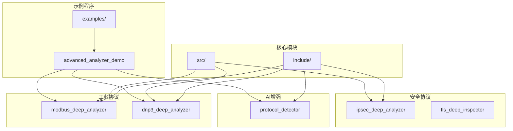
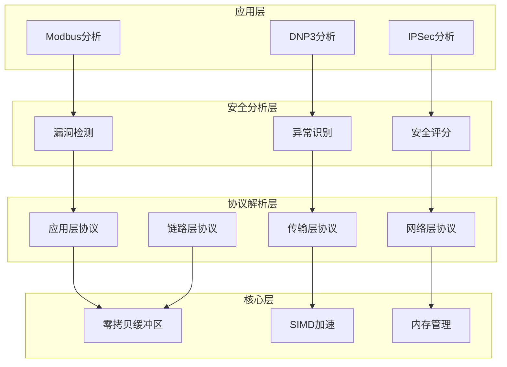
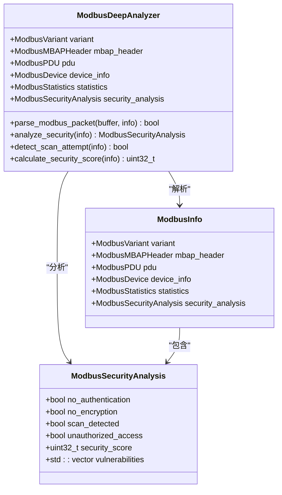
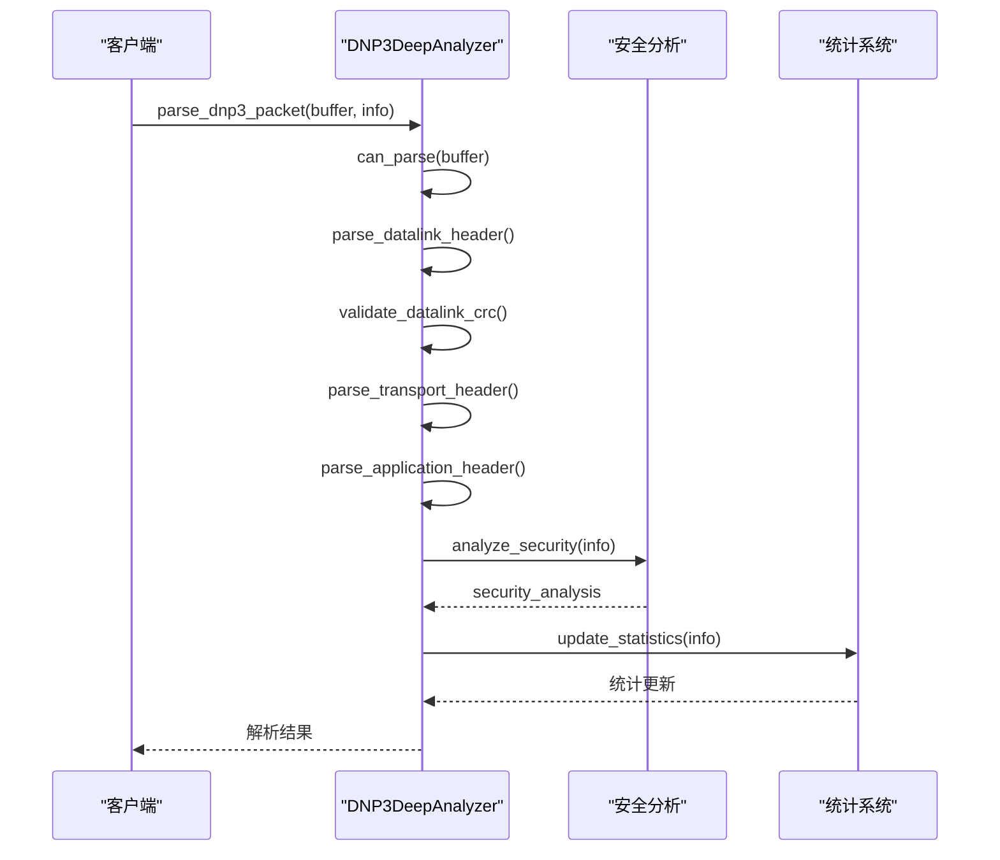
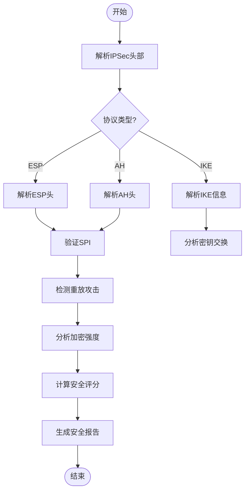
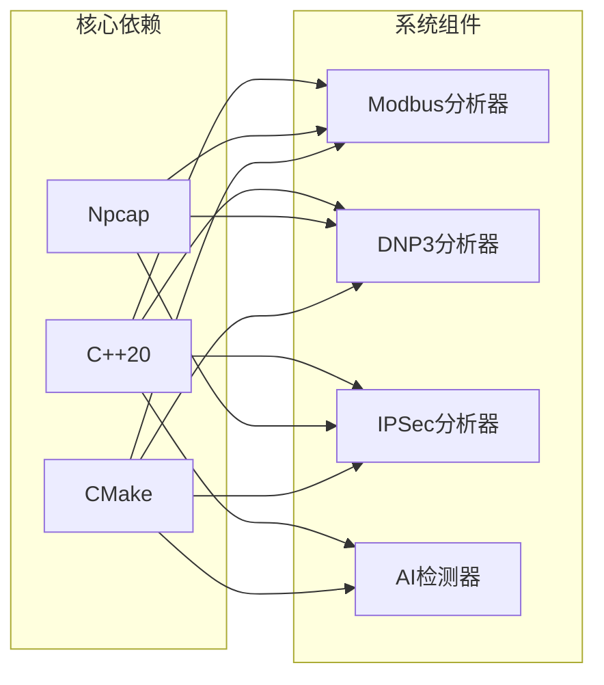

# 工业协议安全分析

<cite>
**本文档引用的文件**   
- [modbus_deep_analyzer.hpp](file://include/parsers/industrial/modbus_deep_analyzer.hpp)
- [modbus_deep_analyzer.cpp](file://src/parsers/industrial/modbus_deep_analyzer.cpp)
- [dnp3_deep_analyzer.hpp](file://include/parsers/industrial/dnp3_deep_analyzer.hpp)
- [dnp3_deep_analyzer.cpp](file://src/parsers/industrial/dnp3_deep_analyzer.cpp)
- [ipsec_deep_analyzer.hpp](file://include/parsers/security/ipsec_deep_analyzer.hpp)
- [README.md](file://README.md)
- [IMPLEMENTATION_SUMMARY.md](file://IMPLEMENTATION_SUMMARY.md)
- [org_design_doc.md](file://org_design_doc.md)
</cite>

## 目录
1. [引言](#引言)
2. [项目结构](#项目结构)
3. [核心组件](#核心组件)
4. [架构概述](#架构概述)
5. [详细组件分析](#详细组件分析)
6. [依赖分析](#依赖分析)
7. [性能考虑](#性能考虑)
8. [故障排除指南](#故障排除指南)
9. [结论](#结论)
10. [附录](#附录)（如有必要）

## 引言
本文档详细说明了工业协议安全分析功能，重点介绍Modbus、DNP3和IPSec等协议的深度分析能力。该系统基于C++20构建，采用零拷贝设计和SIMD加速技术，提供漏洞检测、异常行为识别和安全评分等高级特性。通过AI增强的协议检测引擎，系统能够智能识别网络流量中的潜在威胁，并提供实时监控和攻击检测功能。文档还包含实际攻击检测案例和配置指南，为工业网络环境的安全防护提供全面的技术支持。

## 项目结构
该项目采用模块化设计，将不同协议的解析器分离到独立的目录中，便于维护和扩展。核心功能分布在`include`和`src`目录下，其中`include/parsers/industrial`目录包含工业协议解析器，`include/parsers/security`目录包含安全协议解析器。示例程序位于`examples`目录，展示了如何使用这些高级分析功能。



**图源**
- [modbus_deep_analyzer.hpp](file://include/parsers/industrial/modbus_deep_analyzer.hpp)
- [dnp3_deep_analyzer.hpp](file://include/parsers/industrial/dnp3_deep_analyzer.hpp)
- [ipsec_deep_analyzer.hpp](file://include/parsers/security/ipsec_deep_analyzer.hpp)

**本节源**
- [README.md](file://README.md)
- [org_design_doc.md](file://org_design_doc.md)

## 核心组件
系统的核心组件包括Modbus深度分析器、DNP3深度分析器和IPSec深度分析器，这些组件共同构成了工业协议安全分析的基础。每个分析器都实现了完整的协议栈解析功能，能够深入分析协议载荷内容，检测潜在的安全漏洞和异常行为。AI协议检测器作为智能增强组件，通过机器学习算法提高协议识别的准确性和可靠性。这些核心组件协同工作，为工业网络环境提供全面的安全防护。

**本节源**
- [IMPLEMENTATION_SUMMARY.md](file://IMPLEMENTATION_SUMMARY.md)
- [README.md](file://README.md)

## 架构概述
系统采用分层架构设计，从底层的缓冲区管理到上层的协议分析，每一层都经过精心优化以确保高性能和高可靠性。核心层提供零拷贝缓冲区视图和SIMD加速功能，为上层协议解析提供高效的数据访问。协议解析层采用状态机架构，支持从数据链路层到应用层的完整协议栈解析。安全分析层集成AI增强检测引擎，能够实时监控网络流量并识别潜在威胁。



**图源**
- [org_design_doc.md](file://org_design_doc.md)
- [README.md](file://README.md)

## 详细组件分析
本节深入分析各个关键组件的实现细节，包括其数据结构、算法逻辑和安全特性。通过详细的代码分析和架构图示，全面展示各组件的功能特性和技术优势。

### Modbus深度分析器
Modbus深度分析器实现了对Modbus TCP/RTU/ASCII协议的完整解析和安全分析功能。该分析器能够检测扫描行为、未授权访问和重放攻击等安全威胁，并提供详细的安全评分和报告。

#### 对象导向组件


**图源**
- [modbus_deep_analyzer.hpp](file://include/parsers/industrial/modbus_deep_analyzer.hpp)
- [modbus_deep_analyzer.cpp](file://src/parsers/industrial/modbus_deep_analyzer.cpp)

### DNP3深度分析器
DNP3深度分析器提供了对DNP3协议栈的完整解析能力，包括数据链路层、传输层和应用层。该分析器能够检测广播滥用、时间攻击和重放攻击等安全威胁，并提供实时监控和告警功能。

#### API/服务组件


**图源**
- [dnp3_deep_analyzer.hpp](file://include/parsers/industrial/dnp3_deep_analyzer.hpp)
- [dnp3_deep_analyzer.cpp](file://src/parsers/industrial/dnp3_deep_analyzer.cpp)

### IPSec深度分析器
IPSec深度分析器专注于IPSec协议的安全分析，能够检测降级攻击、重放攻击和DoS攻击等威胁。该分析器支持ESP和AH协议的解析，并提供加密强度评估和安全策略验证功能。

#### 复杂逻辑组件


**图源**
- [ipsec_deep_analyzer.hpp](file://include/parsers/security/ipsec_deep_analyzer.hpp)

**本节源**
- [modbus_deep_analyzer.hpp](file://include/parsers/industrial/modbus_deep_analyzer.hpp)
- [dnp3_deep_analyzer.hpp](file://include/parsers/industrial/dnp3_deep_analyzer.hpp)
- [ipsec_deep_analyzer.hpp](file://include/parsers/security/ipsec_deep_analyzer.hpp)

## 依赖分析
系统依赖关系清晰，各组件之间耦合度低，便于独立开发和测试。核心依赖包括C++20标准库、Npcap库（用于Windows平台的数据包捕获）和现代编译器支持。通过CMake构建系统，可以轻松配置和管理这些依赖关系。



**图源**
- [README.md](file://README.md)
- [CMakeLists.txt](file://CMakeLists.txt)

**本节源**
- [README.md](file://README.md)
- [IMPLEMENTATION_SUMMARY.md](file://IMPLEMENTATION_SUMMARY.md)

## 性能考虑
系统在设计时充分考虑了性能优化，采用零拷贝设计和SIMD加速技术，确保在高负载环境下仍能保持高效的处理能力。通过内存池和对象复用机制，减少了动态内存分配的开销。并行处理支持使得系统能够充分利用多核CPU的计算能力，实现线性性能扩展。

## 故障排除指南
当遇到问题时，首先检查编译器是否支持C++20特性，确保使用GCC 10+、Clang 12+或MSVC 2019+等现代编译器。链接错误通常与库文件路径或依赖项有关，需要验证库文件的正确性。运行时错误可能源于输入数据的有效性问题，建议启用调试模式以获取更详细的错误信息。

**本节源**
- [README.md](file://README.md)

## 结论
本文档全面介绍了工业协议安全分析系统的架构和功能。该系统通过Modbus、DNP3和IPSec等协议的深度分析，提供了强大的漏洞检测、异常行为识别和安全评分能力。结合AI增强的协议检测引擎，系统能够智能识别网络流量中的潜在威胁，为工业网络环境提供全面的安全防护。未来的工作将集中在扩展更多工业协议的支持和优化AI检测算法的准确性上。

## 附录
### 配置示例
```cpp
// 启用Modbus安全监控
modbus_analyzer.set_security_monitoring_enabled(true);
modbus_analyzer.set_anomaly_detection_enabled(true);

// 配置DNP3监控地址
dnp3_analyzer.add_monitored_address(10);
dnp3_analyzer.add_monitored_address(11);

// 设置IPSec安全策略
ipsec_analyzer.set_security_policy("strict");
```

### 攻击检测案例
- **Modbus扫描检测**：当同一源地址在短时间内连续访问多个不同目标地址时，系统会标记为扫描行为。
- **DNP3重放攻击检测**：通过跟踪序列号和时间戳，系统能够识别重复的请求，防止重放攻击。
- **IPSec降级攻击检测**：分析IKE交换过程，检测是否存在强制使用弱加密算法的行为。