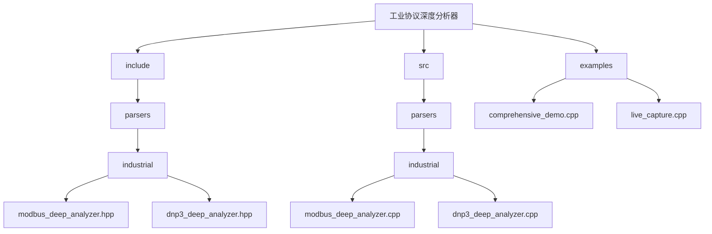
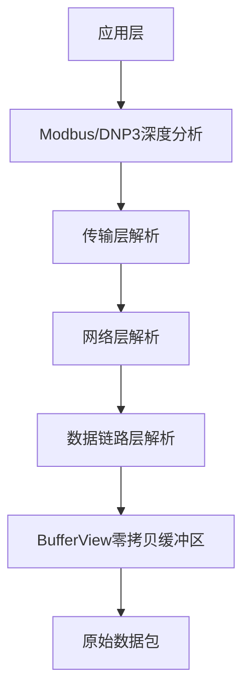
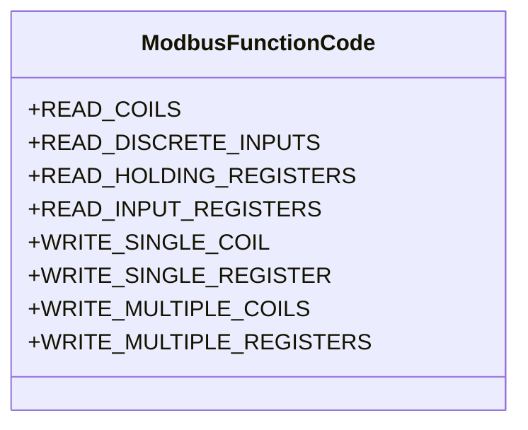
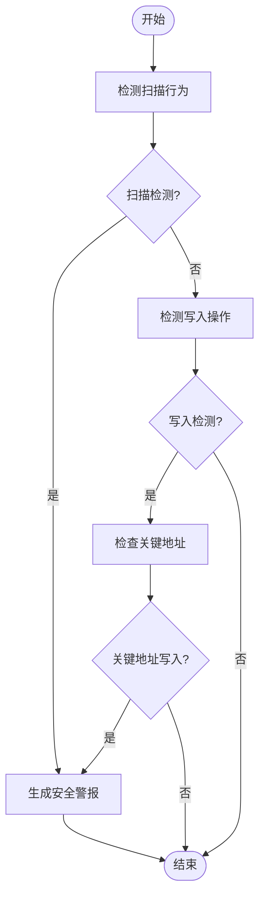
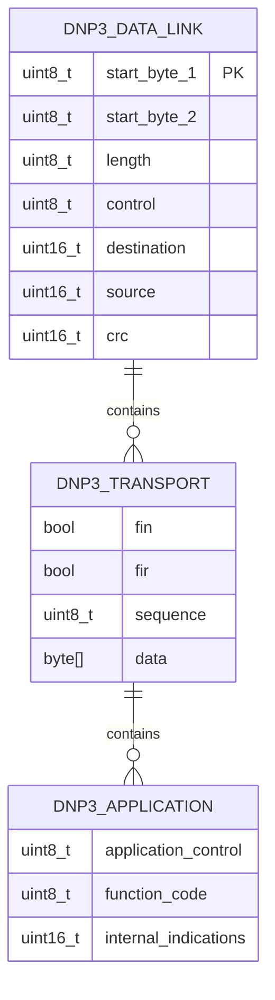
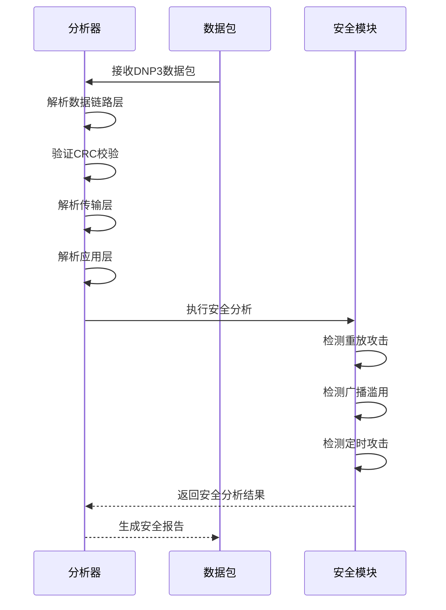
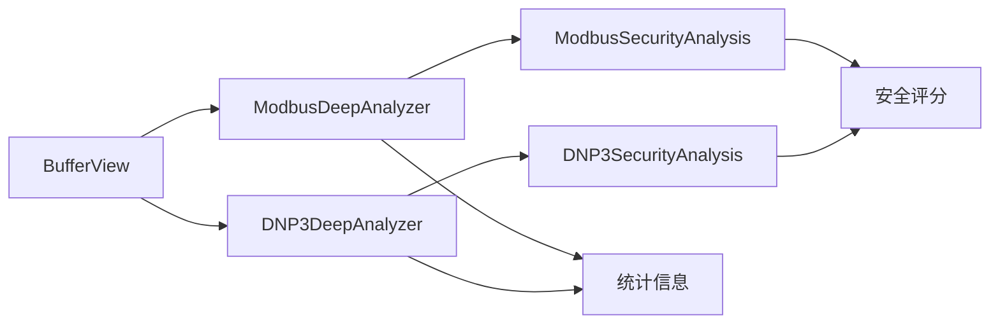

# 工业协议深度分析器

<cite>
**本文档引用的文件**
- [modbus_deep_analyzer.hpp](file://include/parsers/industrial/modbus_deep_analyzer.hpp)
- [modbus_deep_analyzer.cpp](file://src/parsers/industrial/modbus_deep_analyzer.cpp)
- [dnp3_deep_analyzer.hpp](file://include/parsers/industrial/dnp3_deep_analyzer.hpp)
- [dnp3_deep_analyzer.cpp](file://src/parsers/industrial/dnp3_deep_analyzer.cpp)
- [README.md](file://README.md)
- [org_design_doc.md](file://org_design_doc.md)
</cite>

## 目录
1. [引言](#引言)
2. [项目结构](#项目结构)
3. [核心组件](#核心组件)
4. [架构概述](#架构概述)
5. [详细组件分析](#详细组件分析)
6. [依赖分析](#依赖分析)
7. [性能考虑](#性能考虑)
8. [故障排除指南](#故障排除指南)
9. [结论](#结论)

## 引言
工业协议深度分析器是一个基于C++20的高性能网络协议解析库，专注于工业控制系统的安全分析。该系统能够深度解析Modbus和DNP3协议，提供功能码分析、异常流量检测、常见攻击模式识别、安全评分机制和实际部署案例。通过零拷贝设计和SIMD加速，该分析器在保持高性能的同时，能够实时监控和分析工业网络流量，为关键基础设施提供安全保障。

## 项目结构
工业协议深度分析器的项目结构清晰，采用模块化设计，便于扩展和维护。核心功能集中在`include/parsers/industrial`目录下，包含Modbus和DNP3协议的深度分析器。系统采用分层架构，从数据链路层到应用层提供完整的协议解析能力。

**Diagram sources**
- [modbus_deep_analyzer.hpp](file://include/parsers/industrial/modbus_deep_analyzer.hpp)
- [dnp3_deep_analyzer.hpp](file://include/parsers/industrial/dnp3_deep_analyzer.hpp)

**Section sources**
- [README.md](file://README.md#L1-L511)
- [org_design_doc.md](file://org_design_doc.md#L1-L416)

## 核心组件
工业协议深度分析器的核心组件包括Modbus深度分析器和DNP3深度分析器，它们分别负责解析和分析两种主要的工业协议。这些组件提供了丰富的功能，包括协议检测、安全分析、异常检测和统计报告。

**Section sources**
- [modbus_deep_analyzer.hpp](file://include/parsers/industrial/modbus_deep_analyzer.hpp#L1-L390)
- [dnp3_deep_analyzer.hpp](file://include/parsers/industrial/dnp3_deep_analyzer.hpp#L1-L288)

## 架构概述
工业协议深度分析器采用分层架构设计，从底层的缓冲区管理到上层的协议解析，每一层都经过精心设计以确保高性能和可扩展性。系统支持从数据链路层到应用层的完整协议栈解析，特别针对工业协议进行了优化。

**Diagram sources**
- [modbus_deep_analyzer.hpp](file://include/parsers/industrial/modbus_deep_analyzer.hpp#L1-L390)
- [dnp3_deep_analyzer.hpp](file://include/parsers/industrial/dnp3_deep_analyzer.hpp#L1-L288)

## 详细组件分析
### Modbus深度分析器
Modbus深度分析器提供了对Modbus协议的全面解析能力，包括RTU、ASCII、TCP和UDP变体。它能够识别各种功能码，检测异常流量，并提供安全评分。

#### 功能码分析

**Diagram sources**
- [modbus_deep_analyzer.hpp](file://include/parsers/industrial/modbus_deep_analyzer.hpp#L15-L30)

#### 异常流量检测

**Diagram sources**
- [modbus_deep_analyzer.cpp](file://src/parsers/industrial/modbus_deep_analyzer.cpp#L300-L400)

### DNP3深度分析器
DNP3深度分析器提供了对DNP3协议的深度解析能力，包括数据链路层、传输层和应用层的完整解析。

#### 协议层次结构

**Diagram sources**
- [dnp3_deep_analyzer.hpp](file://include/parsers/industrial/dnp3_deep_analyzer.hpp#L1-L288)

#### 攻击模式识别

**Diagram sources**
- [dnp3_deep_analyzer.cpp](file://src/parsers/industrial/dnp3_deep_analyzer.cpp#L500-L700)

**Section sources**
- [modbus_deep_analyzer.hpp](file://include/parsers/industrial/modbus_deep_analyzer.hpp#L1-L390)
- [modbus_deep_analyzer.cpp](file://src/parsers/industrial/modbus_deep_analyzer.cpp#L1-L570)
- [dnp3_deep_analyzer.hpp](file://include/parsers/industrial/dnp3_deep_analyzer.hpp#L1-L288)
- [dnp3_deep_analyzer.cpp](file://src/parsers/industrial/dnp3_deep_analyzer.cpp#L1-L772)

## 依赖分析
工业协议深度分析器的组件之间存在清晰的依赖关系。核心的BufferView类为所有解析器提供零拷贝数据访问，而各个协议解析器则依赖于这个核心组件。

**Diagram sources**
- [modbus_deep_analyzer.hpp](file://include/parsers/industrial/modbus_deep_analyzer.hpp#L1-L390)
- [dnp3_deep_analyzer.hpp](file://include/parsers/industrial/dnp3_deep_analyzer.hpp#L1-L288)

**Section sources**
- [modbus_deep_analyzer.hpp](file://include/parsers/industrial/modbus_deep_analyzer.hpp#L1-L390)
- [dnp3_deep_analyzer.hpp](file://include/parsers/industrial/dnp3_deep_analyzer.hpp#L1-L288)

## 性能考虑
工业协议深度分析器在设计时充分考虑了性能因素。通过零拷贝设计、SIMD加速和优化的内存访问模式，系统能够在高负载下保持稳定的性能表现。

**Section sources**
- [README.md](file://README.md#L100-L150)
- [org_design_doc.md](file://org_design_doc.md#L100-L200)

## 故障排除指南
当使用工业协议深度分析器时，可能会遇到一些常见问题。本节提供了一些故障排除的建议和技巧。

**Section sources**
- [README.md](file://README.md#L400-L450)
- [org_design_doc.md](file://org_design_doc.md#L300-L350)

## 结论
工业协议深度分析器提供了一个强大而灵活的平台，用于分析和保护工业控制系统。通过深度解析Modbus和DNP3协议，系统能够识别潜在的安全威胁，提供实时的监控和警报。其模块化设计和高性能特性使其成为工业网络安全的理想选择。