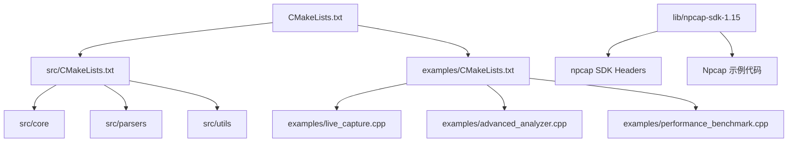

# 快速入门指南

<cite>
**本文档中引用的文件**  
- [README.md](file://README.md)
- [CMakeLists.txt](file://CMakeLists.txt)
- [examples/live_capture.cpp](file://examples/live_capture.cpp)
- [include/parsers/base_parser.hpp](file://include/parsers/base_parser.hpp)
- [src/parsers/base_parser.cpp](file://src/parsers/base_parser.cpp)
- [examples/CMakeLists.txt](file://examples/CMakeLists.txt)
- [src/CMakeLists.txt](file://src/CMakeLists.txt)
</cite>

## 目录
1. [简介](#简介)
2. [项目结构](#项目结构)
3. [环境准备](#环境准备)
4. [构建与编译](#构建与编译)
5. [运行示例程序](#运行示例程序)
6. [常见构建问题排查](#常见构建问题排查)
7. [最简协议解析代码示例](#最简协议解析代码示例)
8. [结论](#结论)

## 简介
本指南旨在帮助新手开发者快速上手 `protocol_praser` 项目。通过本教程，您将学习如何在本地环境中配置依赖项、克隆项目、使用 CMake 构建项目，并成功运行示例程序（如 `live_capture.cpp`）。同时，本文还提供常见错误的解决方案和一个最简化的协议解析代码片段，确保首次接触该项目的开发者也能顺利开始。

## 项目结构
`protocol_praser` 项目采用模块化设计，主要分为以下几个目录：

- `include/`：包含所有头文件，按功能划分为 `core`、`parsers`、`detection` 等子模块。
- `src/`：源代码实现文件，与 `include/` 中的头文件一一对应。
- `examples/`：提供多个使用示例，包括 `live_capture.cpp`（实时抓包）、`advanced_analyzer.cpp` 和 `performance_benchmark.cpp`。
- `lib/npcap-sdk-1.15/`：内置 Npcap SDK，用于 Windows 平台的网络数据包捕获。
- 根目录下的 `CMakeLists.txt`：主构建配置文件，协调整个项目的编译流程。



**Diagram sources**  
- [CMakeLists.txt](file://CMakeLists.txt#L1-L50)
- [examples/CMakeLists.txt](file://examples/CMakeLists.txt#L1-L20)
- [src/CMakeLists.txt](file://src/CMakeLists.txt#L1-L15)

**Section sources**  
- [CMakeLists.txt](file://CMakeLists.txt#L1-L100)

## 环境准备
要成功构建和运行 `protocol_praser`，需确保以下依赖项已正确安装：

### 1. Npcap SDK
项目已自带 `lib/npcap-sdk-1.15`，无需额外下载。该 SDK 提供了 `pcap.h` 和相关库文件，用于调用底层网络接口进行数据包捕获。

### 2. CMake
建议安装 **CMake 3.15 或更高版本**。可通过以下方式安装：
- Windows：从 [cmake.org](https://cmake.org/download/) 下载安装程序。
- 使用包管理器（如 vcpkg、choco）安装。

验证安装：
```bash
cmake --version
```

### 3. C++20 兼容编译器
推荐使用：
- **MSVC (Visual Studio 2019 或 2022)**：支持 `/std:c++20` 标准。
- **MinGW-w64 (GCC 10+)**：支持 `-std=c++20`。
- **Clang (12+)**。

确保编译器已添加至系统 PATH。

**Section sources**  
- [README.md](file://README.md#L1-L30)

## 构建与编译
按照以下步骤构建项目：

### 步骤 1：克隆仓库
```bash
git clone https://github.com/your-repo/protocol_praser.git
cd protocol_praser
```

### 步骤 2：创建构建目录
```bash
mkdir build
cd build
```

### 步骤 3：配置 CMake
```bash
cmake ..
```
CMake 将自动检测 Npcap SDK 路径（位于 `lib/npcap-sdk-1.15`），并生成相应的构建文件。

### 步骤 4：编译项目
```bash
cmake --build .
```
或使用原生命令（如 `msbuild`, `make`）。

构建成功后，可执行文件将生成在 `build/examples/` 目录下。

**Section sources**  
- [CMakeLists.txt](file://CMakeLists.txt#L20-L80)
- [examples/CMakeLists.txt](file://examples/CMakeLists.txt#L1-L30)

## 运行示例程序
编译完成后，可运行 `live_capture` 示例程序进行实时抓包：

```bash
./examples/live_capture
```

程序将列出可用的网络接口，选择一个接口后开始捕获数据包，并解析以太网、IP、TCP/UDP 等协议层。

**Section sources**  
- [examples/live_capture.cpp](file://examples/live_capture.cpp#L1-L100)

## 常见构建问题排查
### 1. Npcap 路径未找到
**错误信息**：`Could NOT find NPCAP` 或 `pcap.h: No such file or directory`  
**解决方案**：
- 确认 `lib/npcap-sdk-1.15/Include` 存在且包含 `pcap.h`。
- 检查 `CMakeLists.txt` 中是否正确设置 `NPCAP_ROOT`：
  ```cmake
  set(NPCAP_ROOT "${CMAKE_SOURCE_DIR}/lib/npcap-sdk-1.15")
  include_directories(${NPCAP_ROOT}/Include)
  ```

### 2. C++20 不支持
**错误信息**：`error: invalid value 'c++20' in '-std=c++20'`  
**解决方案**：
- 升级编译器至支持 C++20 的版本。
- 在 `CMakeLists.txt` 中检查：
  ```cmake
  set(CMAKE_CXX_STANDARD 20)
  set(CMAKE_CXX_STANDARD_REQUIRED ON)
  ```

### 3. 链接错误（如 `unresolved external symbol pcap_open_live`）
**原因**：未正确链接 `Packet.lib`。  
**解决方案**：
- 确保 `CMakeLists.txt` 中添加了库路径和链接指令：
  ```cmake
  link_directories(${NPCAP_ROOT}/Lib)
  target_link_libraries(your_target Packet.lib)
  ```

**Section sources**  
- [CMakeLists.txt](file://CMakeLists.txt#L40-L70)
- [examples/CMakeLists.txt](file://examples/CMakeLists.txt#L10-L25)

## 最简协议解析代码示例
以下是一个最简化的协议解析流程示例，展示如何使用项目中的解析器模块：

```cpp
// 伪代码示意，实际实现见具体文件
auto buffer = /* 原始数据包 */;
auto eth_parser = EthernetParser();
auto eth_result = eth_parser.parse(buffer);

if (eth_result.protocol == Protocol::IPv4) {
    auto ipv4_parser = IPv4Parser();
    auto ip_result = ipv4_parser.parse(eth_result.payload);
    // 继续解析 TCP/UDP...
}
```

该逻辑在 `src/parsers/` 各实现文件中完成，采用链式解析模式。

**Section sources**  
- [include/parsers/base_parser.hpp](file://include/parsers/base_parser.hpp#L1-L20)
- [src/parsers/base_parser.cpp](file://src/parsers/base_parser.cpp#L1-L15)

## 结论
通过本指南，您已掌握 `protocol_praser` 项目的完整构建与运行流程。项目结构清晰，依赖明确，结合 CMake 可轻松在本地环境中编译和调试。遇到问题时，可参考常见错误排查部分进行修复。下一步建议阅读 `SOTA_IMPLEMENTATION_REPORT.md` 了解协议解析的高级实现细节。