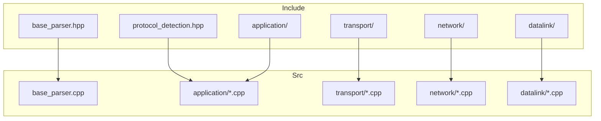
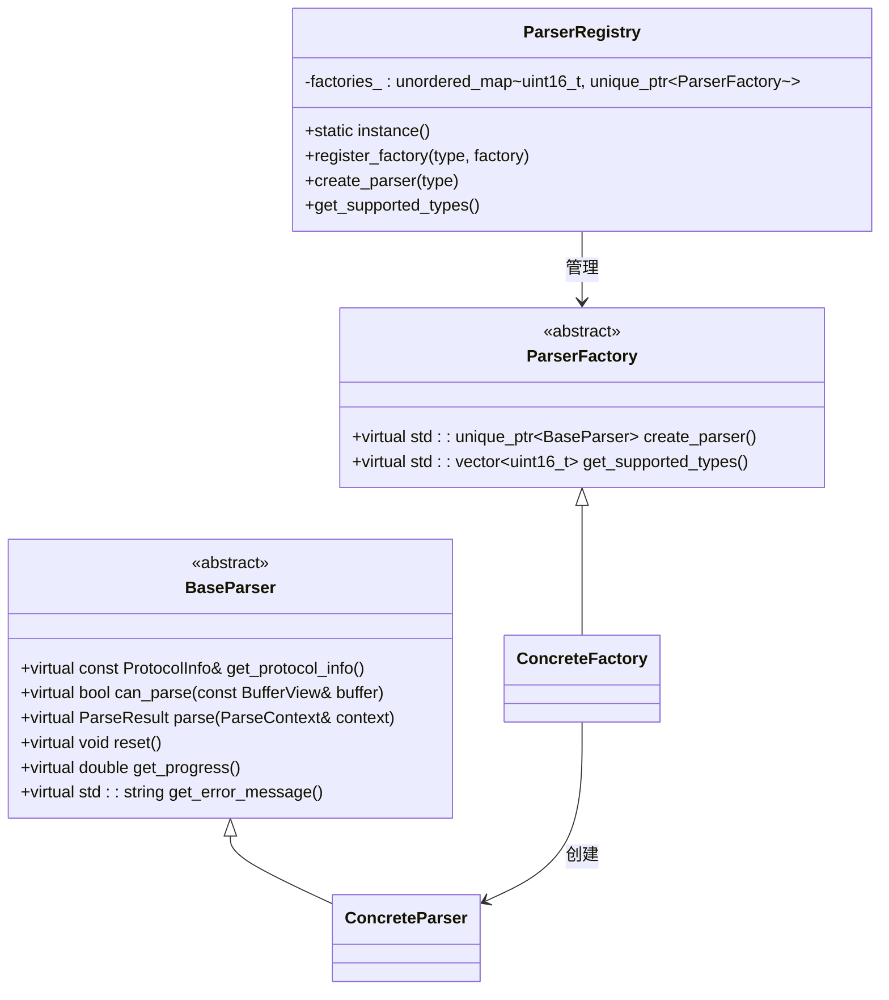
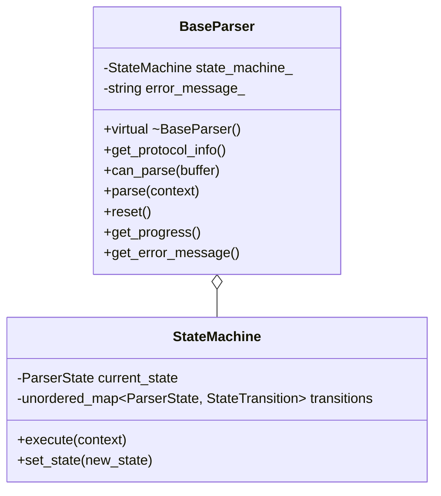
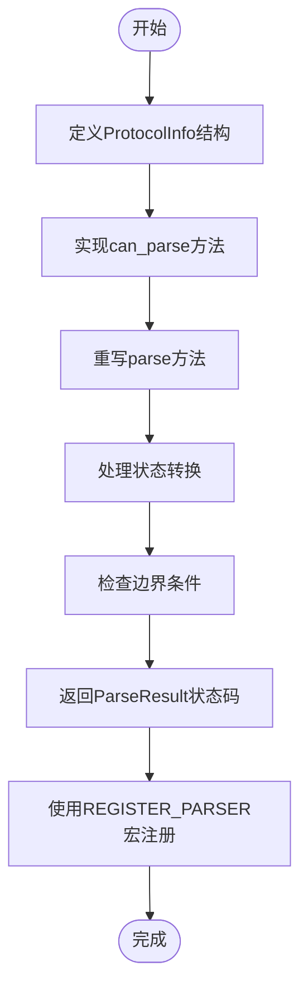
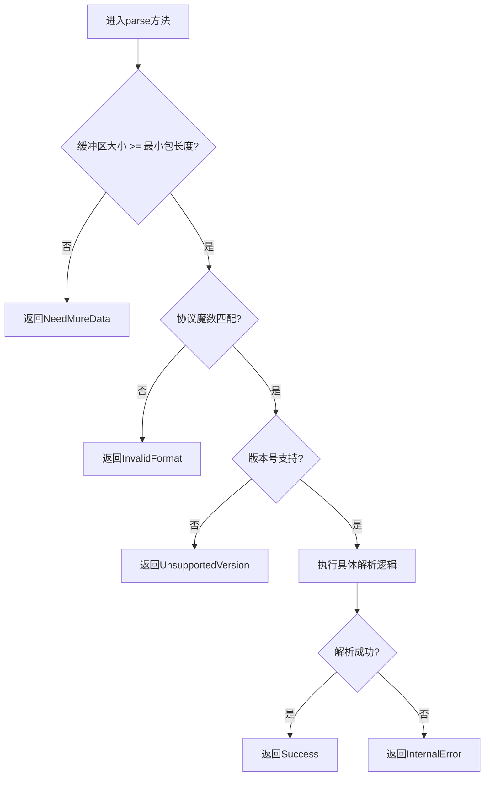
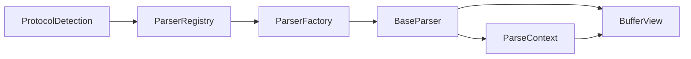

# 协议解析器扩展指南

<cite>
**本文档引用文件**  
- [base_parser.hpp](file://include/parsers/base_parser.hpp#L1-L187)
- [dhcp_parser.hpp](file://include/parsers/application/dhcp_parser.hpp)
- [dns_parser.hpp](file://include/parsers/application/dns_parser.hpp)
- [http_parser.hpp](file://include/parsers/application/http_parser.hpp)
- [tcp_parser.hpp](file://include/parsers/transport/tcp_parser.hpp)
- [udp_parser.hpp](file://include/parsers/transport/udp_parser.hpp)
- [protocol_detection.hpp](file://include/detection/protocol_detection.hpp)
- [base_parser.cpp](file://src/parsers/base_parser.cpp)
</cite>

## 目录
1. [引言](#引言)
2. [项目结构](#项目结构)
3. [核心组件](#核心组件)
4. [架构概述](#架构概述)
5. [详细组件分析](#详细组件分析)
6. [依赖分析](#依赖分析)
7. [性能考虑](#性能考虑)
8. [故障排除指南](#故障排除指南)
9. [结论](#结论)

## 引言
本文档旨在为开发人员提供一份详尽的指南，说明如何通过继承`BaseParser`抽象基类来扩展新的协议解析器。内容涵盖`parse`方法的重写规范、协议头结构体的设计原则、边界条件处理（如缓冲区不足、校验和错误）、`ParseResult`状态码的正确返回机制。以实现MQTT或自定义应用层协议为例，展示从定义协议特征（魔数、端口范围）到完成解析逻辑的完整流程。同时说明如何将新解析器注册到`ProtocolDetection`引擎中，并确保与现有解析链兼容。还将介绍虚函数调用、RAII资源管理和SIMD优化在扩展中的应用。

## 项目结构
项目采用分层模块化设计，主要分为`include`和`src`目录，分别存放头文件和源文件。核心组件包括解析器基类、各类协议解析器、协议检测模块、性能监控和统计模块等。整体结构清晰，便于扩展和维护。

**图示来源**  
- [base_parser.hpp](file://include/parsers/base_parser.hpp#L1-L187)
- [protocol_detection.hpp](file://include/detection/protocol_detection.hpp)

**本节来源**  
- [base_parser.hpp](file://include/parsers/base_parser.hpp#L1-L187)

## 核心组件
核心组件包括`BaseParser`抽象基类、`ParseResult`与`ParserState`枚举类型、`ProtocolInfo`与`ParseContext`数据结构，以及`ParserFactory`和`ParserRegistry`工厂与注册机制。这些组件共同构成了协议解析框架的基础。

**本节来源**  
- [base_parser.hpp](file://include/parsers/base_parser.hpp#L1-L187)

## 架构概述
系统采用基于状态机的解析架构，所有解析器继承自`BaseParser`，通过多态机制实现统一接口调用。`ParserRegistry`负责管理所有解析器工厂实例，`ProtocolDetection`引擎根据协议特征动态选择合适的解析器进行数据包解析。

**图示来源**  
- [base_parser.hpp](file://include/parsers/base_parser.hpp#L1-L187)

## 详细组件分析

### BaseParser 基类分析
`BaseParser`是所有协议解析器的抽象基类，定义了统一的接口和状态机框架。派生类必须实现`get_protocol_info`、`can_parse`、`parse`和`reset`四个纯虚函数。

#### 类结构图

**图示来源**  
- [base_parser.hpp](file://include/parsers/base_parser.hpp#L1-L187)

### 协议解析器扩展流程
扩展新的协议解析器需遵循以下步骤：定义协议信息结构、实现`can_parse`方法识别协议、重写`parse`方法执行解析逻辑、使用`REGISTER_PARSER`宏注册解析器。

#### 扩展流程图

**图示来源**  
- [base_parser.hpp](file://include/parsers/base_parser.hpp#L1-L187)

**本节来源**  
- [base_parser.hpp](file://include/parsers/base_parser.hpp#L1-L187)

### 边界条件处理
在`parse`方法中必须正确处理各种边界条件，包括缓冲区不足、格式错误、版本不支持等情况，并返回相应的`ParseResult`状态码。

#### 边界条件处理流程

**图示来源**  
- [base_parser.hpp](file://include/parsers/base_parser.hpp#L1-L187)

**本节来源**  
- [base_parser.hpp](file://include/parsers/base_parser.hpp#L1-L187)

## 依赖分析
系统通过`ParserRegistry`单例模式管理所有解析器工厂，实现了松耦合的依赖关系。各解析器仅依赖`BaseParser`接口，不直接相互依赖。

**图示来源**  
- [base_parser.hpp](file://include/parsers/base_parser.hpp#L1-L187)

**本节来源**  
- [base_parser.hpp](file://include/parsers/base_parser.hpp#L1-L187)

## 性能考虑
- 使用`noexcept`关键字标记接口函数，避免异常开销
- `BufferView`采用非拥有式视图设计，避免内存拷贝
- 状态机模式减少条件判断开销
- 可结合SIMD指令优化特定协议的字段解析
- RAII机制确保资源安全释放

## 故障排除指南
当新解析器无法正常工作时，请检查以下事项：
- `can_parse`方法是否正确定义协议识别逻辑
- `parse`方法是否正确处理所有`ParseResult`状态
- 是否使用`REGISTER_PARSER`宏正确注册
- 协议类型编号是否冲突
- `ProtocolInfo`中头部大小和最小包大小是否准确

**本节来源**  
- [base_parser.hpp](file://include/parsers/base_parser.hpp#L1-L187)

## 结论
通过继承`BaseParser`抽象基类，开发人员可以方便地扩展新的协议解析器。框架提供了统一的接口、状态机管理和错误处理机制，确保了解析器的一致性和可靠性。结合工厂模式和注册机制，实现了灵活的协议检测与解析能力。建议在实现新解析器时严格遵循设计规范，充分利用RAII和可能的SIMD优化提升性能。