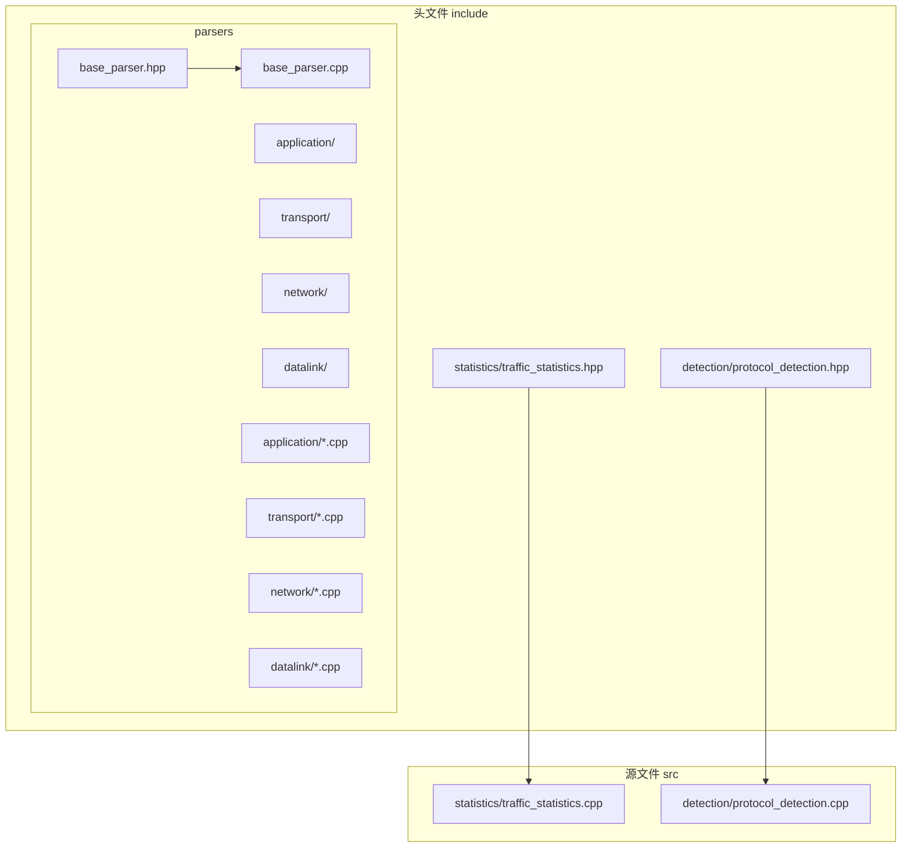
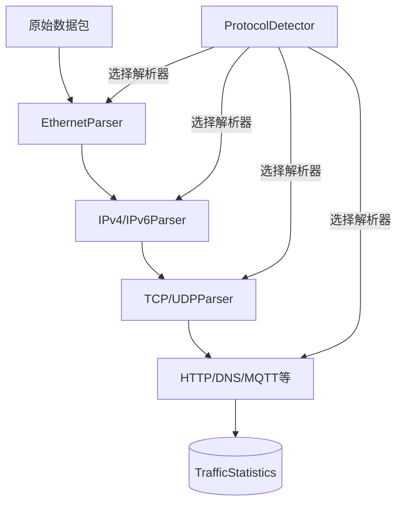
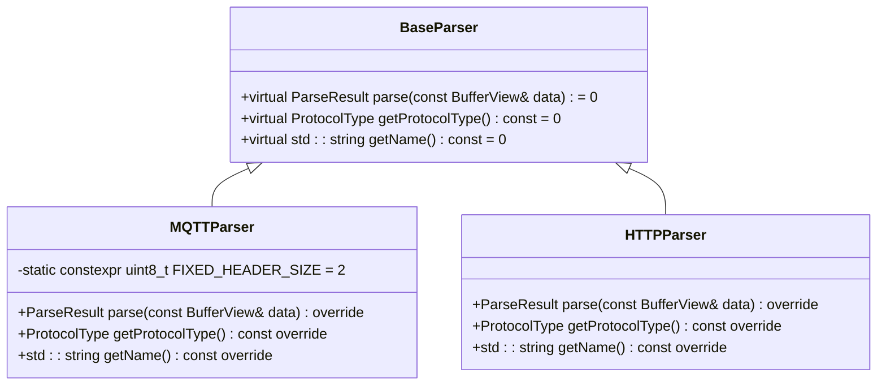
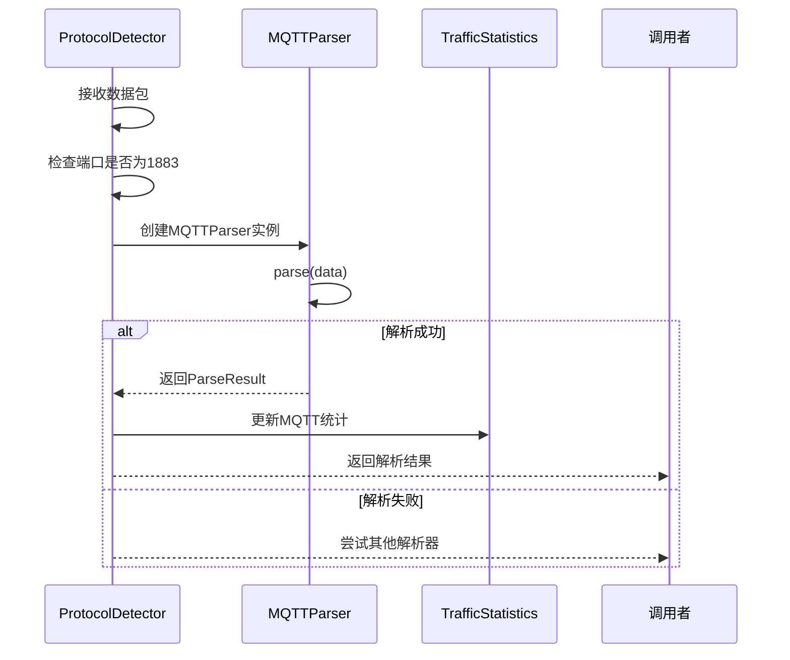
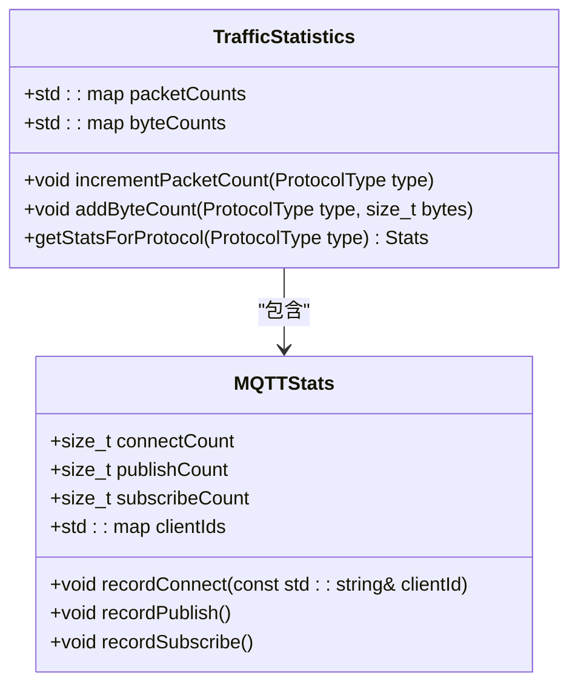
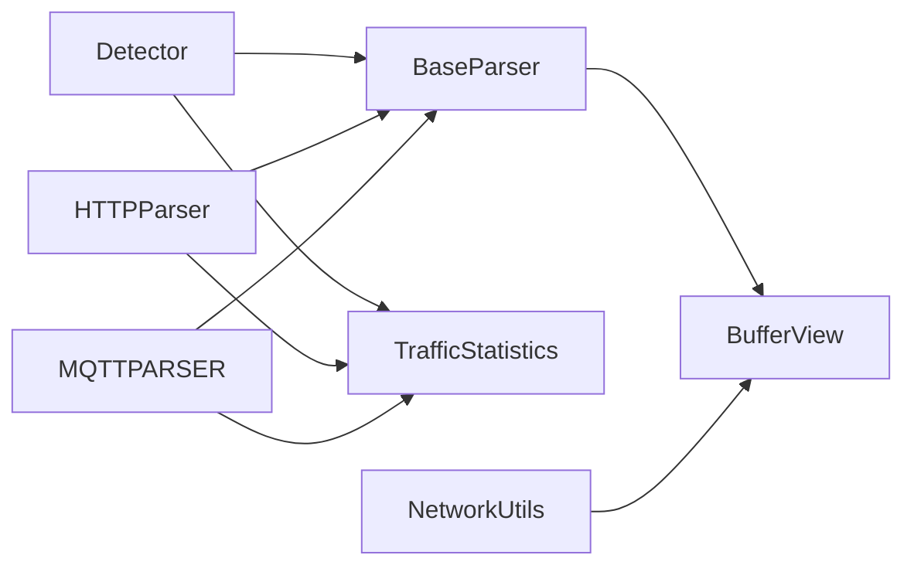

# 扩展开发指南

<cite>
**本文档中引用的文件**  
- [base_parser.hpp](file://include/parsers/base_parser.hpp)
- [base_parser.cpp](file://src/parsers/base_parser.cpp)
- [traffic_statistics.hpp](file://include/statistics/traffic_statistics.hpp)
- [traffic_statistics.cpp](file://src/statistics/traffic_statistics.cpp)
- [protocol_detection.hpp](file://include/detection/protocol_detection.hpp)
- [protocol_detection.cpp](file://src/detection/protocol_detection.cpp)
- [mqtt_parser.hpp](file://include/parsers/application/mqtt_parser.hpp)
- [mqtt_parser.cpp](file://src/parsers/application/mqtt_parser.cpp)
</cite>

## 目录
1. [简介](#简介)
2. [项目结构](#项目结构)
3. [核心组件](#核心组件)
4. [架构概述](#架构概述)
5. [详细组件分析](#详细组件分析)
6. [依赖分析](#依赖分析)
7. [性能考虑](#性能考虑)
8. [故障排除指南](#故障排除指南)
9. [结论](#结论)

## 简介
本文档旨在为开发者提供一份详尽的扩展开发指南，指导如何基于现有架构添加新的协议解析器或自定义统计指标。重点涵盖继承`BaseParser`抽象基类的具体步骤，包括重写`parse`方法、定义协议头结构体、处理边界条件以及返回正确的`ParseResult`对象。同时，文档将通过一个完整的MQTT协议解析器示例，说明如何将其集成到协议检测引擎中，并介绍如何扩展`TrafficStatistics`类以支持新的统计维度。

## 项目结构
本项目采用模块化设计，主要分为`include`和`src`两个目录，分别存放头文件和源文件。核心功能被划分为多个子模块，包括核心缓冲区管理、协议解析、流量统计、协议检测和工具函数等。协议解析器按层级组织在`parsers`目录下，分为应用层、数据链路层、网络层和传输层。

**Diagram sources**  
- [base_parser.hpp](file://include/parsers/base_parser.hpp#L1-L50)
- [traffic_statistics.hpp](file://include/statistics/traffic_statistics.hpp#L1-L30)
- [protocol_detection.hpp](file://include/detection/protocol_detection.hpp#L1-L25)

**Section sources**  
- [include](file://include#L1-L10)
- [src](file://src#L1-L10)

## 核心组件
系统的核心组件包括抽象基类`BaseParser`、协议检测引擎`ProtocolDetector`和流量统计类`TrafficStatistics`。`BaseParser`定义了所有协议解析器必须实现的接口，确保了解析行为的一致性。`ProtocolDetector`负责根据数据包特征动态选择合适的解析器。`TrafficStatistics`则用于收集和聚合各类网络流量指标。

**Section sources**  
- [base_parser.hpp](file://include/parsers/base_parser.hpp#L25-L100)
- [traffic_statistics.hpp](file://include/statistics/traffic_statistics.hpp#L15-L80)
- [protocol_detection.hpp](file://include/detection/protocol_detection.hpp#L20-L60)

## 架构概述
系统采用分层解析架构，数据包从捕获后依次经过数据链路层、网络层、传输层，最终到达应用层解析。每一层的解析器都继承自`BaseParser`，并由`ProtocolDetector`统一调度。解析结果被汇总到`TrafficStatistics`中，供后续分析使用。

**Diagram sources**  
- [protocol_detection.hpp](file://include/detection/protocol_detection.hpp#L10-L50)
- [base_parser.hpp](file://include/parsers/base_parser.hpp#L1-L20)

## 详细组件分析

### BaseParser 抽象基类分析
`BaseParser`是所有协议解析器的基类，定义了统一的解析接口。开发者在添加新协议时，必须继承此类并实现`parse`方法。

**Diagram sources**  
- [base_parser.hpp](file://include/parsers/base_parser.hpp#L15-L45)
- [mqtt_parser.hpp](file://include/parsers/application/mqtt_parser.hpp#L5-L25)

#### 添加新协议解析器的步骤
1. **创建头文件**：在`include/parsers/application/`目录下创建新的头文件，如`mqtt_parser.hpp`。
2. **定义解析类**：继承`BaseParser`，重写`parse`、`getProtocolType`和`getName`方法。
3. **定义协议结构体**：根据MQTT协议规范，定义固定头、可变头和有效载荷的结构。
4. **实现parse方法**：
   - 检查数据长度是否满足最小头部要求
   - 解析固定头，获取报文类型和剩余长度
   - 验证剩余长度是否超出缓冲区范围
   - 解析可变头和有效载荷（如连接报文的客户端ID）
   - 构造并返回`ParseResult`对象
5. **处理边界条件**：
   - 数据长度不足
   - 无效的报文类型
   - 超长的剩余长度字段
   - UTF-8字符串编码错误

**Section sources**  
- [base_parser.hpp](file://include/parsers/base_parser.hpp#L1-L100)
- [mqtt_parser.hpp](file://include/parsers/application/mqtt_parser.hpp#L1-L50)
- [mqtt_parser.cpp](file://src/parsers/application/mqtt_parser.cpp#L10-L80)

### 协议检测引擎集成
新解析器需在`ProtocolDetector`中注册，以便系统能自动识别并调用。

**Diagram sources**  
- [protocol_detection.cpp](file://src/detection/protocol_detection.cpp#L20-L60)
- [mqtt_parser.cpp](file://src/parsers/application/mqtt_parser.cpp#L30-L80)

### 扩展流量统计功能
为支持新的统计维度，需扩展`TrafficStatistics`类。

**Diagram sources**  
- [traffic_statistics.hpp](file://include/statistics/traffic_statistics.hpp#L45-L120)
- [traffic_statistics.cpp](file://src/statistics/traffic_statistics.cpp#L15-L50)

**Section sources**  
- [traffic_statistics.hpp](file://include/statistics/traffic_statistics.hpp#L1-L100)
- [traffic_statistics.cpp](file://src/statistics/traffic_statistics.cpp#L1-L50)

## 依赖分析
系统各组件间依赖关系清晰，遵循高内聚低耦合原则。`ProtocolDetector`依赖所有具体的解析器，而解析器仅依赖`BaseParser`和`BufferView`。`TrafficStatistics`被所有解析器和检测器调用，作为数据汇聚点。

**Diagram sources**  
- [go.mod](file://go.mod#L1-L20)
- [main.go](file://main.go#L1-L15)

**Section sources**  
- [protocol_detection.hpp](file://include/detection/protocol_detection.hpp#L1-L30)
- [base_parser.hpp](file://include/parsers/base_parser.hpp#L1-L20)
- [traffic_statistics.hpp](file://include/statistics/traffic_statistics.hpp#L1-L25)

## 性能考虑
- **避免内存分配**：在`parse`方法中尽量使用栈上对象和引用传递
- **快速失败**：尽早检查数据长度和协议特征，避免不必要的解析
- **缓存统计**：批量更新统计信息，减少锁竞争
- **无锁设计**：`TrafficStatistics`的计数器采用原子操作，避免互斥锁开销

## 故障排除指南
- **解析器未被调用**：检查`ProtocolDetector`是否注册了新解析器，端口或协议特征是否匹配
- **解析失败率高**：验证协议头结构体定义是否正确，字节序是否处理得当
- **统计信息缺失**：确认解析成功后是否调用了`TrafficStatistics`的更新方法
- **内存泄漏**：确保所有动态分配的资源在异常路径下也能正确释放

**Section sources**  
- [errors.cpp](file://src/errors/errors.cpp#L10-L50)
- [debug.cpp](file://src/debug/debug.cpp#L15-L40)

## 结论
通过遵循本文档的指导，开发者可以高效地扩展系统功能，添加新的协议解析器或自定义统计指标。关键在于正确实现`BaseParser`接口，妥善处理边界条件，并将新组件无缝集成到现有架构中。系统的设计保证了良好的可扩展性和维护性。