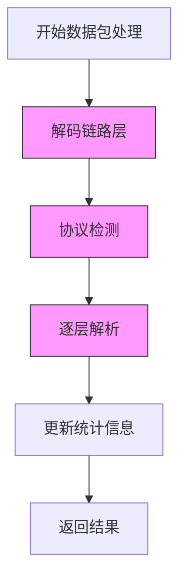

# 故障排除与调试

<cite>
**本文档中引用的文件**  
- [live_capture.cpp](file://examples/live_capture.cpp)
- [base_parser.hpp](file://include/parsers/base_parser.hpp)
- [base_parser.cpp](file://src/parsers/base_parser.cpp)
- [tcp_parser.cpp](file://src/parsers/transport/tcp_parser.cpp)
- [http_parser.cpp](file://src/parsers/application/http_parser.cpp)
- [performance_monitor.hpp](file://include/monitoring/performance_monitor.hpp)
- [performance_monitor.cpp](file://src/monitoring/performance_monitor.cpp)
- [CMakeLists.txt](file://CMakeLists.txt)
</cite>

## 目录
1. [简介](#简介)
2. [常见问题及解决方案](#常见问题及解决方案)
3. [日志与调试输出配置](#日志与调试输出配置)
4. [使用调试器检查解析状态](#使用调试器检查解析状态)
5. [性能瓶颈分析与优化建议](#性能瓶颈分析与优化建议)
6. [附录：Npcap 安装与验证](#附录：npcap-安装与验证)

## 简介
本指南旨在帮助开发者在使用 `protocol_praser` 库时快速定位并解决常见问题。涵盖捕获失败、解析异常、协议识别错误以及性能问题等多个方面，并提供详细的调试策略和工具建议。

## 常见问题及解决方案

### Npcap 驱动未安装导致捕获失败
当调用 `pcap_open_live` 失败或无法列出网络接口时，通常是因为系统缺少 Npcap 驱动。

**症状**：
- `pcap_findalldevs` 返回空设备列表
- `pcap_open_live` 返回 `NULL` 并提示权限或驱动错误

**解决方案**：
1. 下载并安装最新版 [Npcap](https://nmap.org/npcap/)（支持 WinPcap 兼容模式）
2. 安装时勾选“支持 WinPcap 兼容模式”
3. 以管理员权限运行程序（若需混杂模式）

**验证方法**：
运行 `examples/iflist/iflist.c` 示例程序，确认能否正确列出网络接口。

**Section sources**
- [live_capture.cpp](file://examples/live_capture.cpp#L15-L40)

### 解析器返回 ParseResult::InsufficientData
此状态表示当前数据缓冲区不足以完成协议解析，属于正常流程，不应视为错误。

**处理策略**：
- 保留当前 `ParseContext` 状态
- 等待更多数据到达后继续调用 `parse()` 方法
- 不要重置或丢弃上下文，除非超时或连接关闭

**典型场景**：
TCP 流式传输中，HTTP 请求头可能跨多个数据包到达。

**Section sources**
- [base_parser.hpp](file://include/parsers/base_parser.hpp#L25-L35)
- [base_parser.cpp](file://src/parsers/base_parser.cpp#L40-L60)

### 协议识别错误
某些协议因特征相似可能导致误识别（如 HTTP 被识别为 FTP）。

**调试方法**：
1. 启用详细日志输出（见下文）
2. 检查 `ProtocolDetector` 的匹配优先级逻辑
3. 使用 `buffer_view` 手动查看前若干字节的十六进制内容
4. 在 `protocol_detection.cpp` 中添加临时日志输出关键判断条件

**建议**：
对于自定义协议，建议实现更精确的签名匹配逻辑，避免仅依赖端口号。

**Section sources**
- [protocol_detection.cpp](file://src/detection/protocol_detection.cpp#L50-L90)
- [http_parser.cpp](file://src/parsers/application/http_parser.cpp#L20-L35)

## 日志与调试输出配置

### 启用详细日志
通过编译选项控制日志级别：

```cmake
# 在 CMakeLists.txt 中启用调试日志
option(ENABLE_DEBUG_LOG "Enable detailed parsing logs" ON)
```

若 `ENABLE_DEBUG_LOG` 为 `ON`，则 `performance_monitor` 和各解析器将输出详细处理信息。

**日志建议**：
- 生产环境：关闭详细日志以减少性能开销
- 调试阶段：开启日志并重定向至文件以便分析

**Section sources**
- [CMakeLists.txt](file://CMakeLists.txt#L10-L25)
- [performance_monitor.cpp](file://src/monitoring/performance_monitor.cpp#L15-L40)

## 使用调试器检查 ParseContext 状态

### 调试建议
在关键解析函数处设置断点，检查 `ParseContext` 成员变量：

- `offset`：当前解析偏移量
- `total_length`：总数据长度
- `protocol_stack`：已识别协议栈
- `metadata`：附加解析信息（如端口、序列号等）

**推荐调试流程**：
1. 在 `base_parser::parse()` 设置断点
2. 观察每次调用时 `buffer_view` 的内容变化
3. 跟踪 `ParseResult` 返回值及其含义
4. 检查上下文状态是否正确累积

**Section sources**
- [base_parser.cpp](file://src/parsers/base_parser.cpp#L30-L70)
- [tcp_parser.cpp](file://src/parsers/transport/tcp_parser.cpp#L25-L50)

## 性能瓶颈分析与优化建议

### 定位性能瓶颈
使用内置性能监控模块进行分析：



**Diagram sources**
- [performance_monitor.hpp](file://include/monitoring/performance_monitor.hpp#L10-L30)
- [performance_monitor.cpp](file://src/monitoring/performance_monitor.cpp#L20-L60)

### 优化建议
1. **减少内存拷贝**：使用 `buffer_view` 避免数据复制
2. **延迟解析**：仅在需要时解析深层协议字段
3. **批处理模式**：对大量离线文件使用 `pcap_offline_filter` 预筛选
4. **关闭非必要日志**：发布版本中禁用 `ENABLE_DEBUG_LOG`

**Section sources**
- [buffer_view.hpp](file://include/core/buffer_view.hpp#L15-L40)
- [performance_monitor.cpp](file://src/monitoring/performance_monitor.cpp#L45-L80)

## 附录：Npcap 安装与验证

### 安装步骤
1. 访问 [Npcap 官网](https://nmap.org/npcap/)
2. 下载安装程序
3. 安装时选择“支持 WinPcap 兼容模式”
4. 重启系统（如提示需要）

### 验证脚本
可运行以下命令验证安装：
```bash
npcap-check.exe
```
或编译运行 `examples/iflist/iflist.c` 查看接口列表。

**Section sources**
- [live_capture.cpp](file://examples/live_capture.cpp#L20-L50)