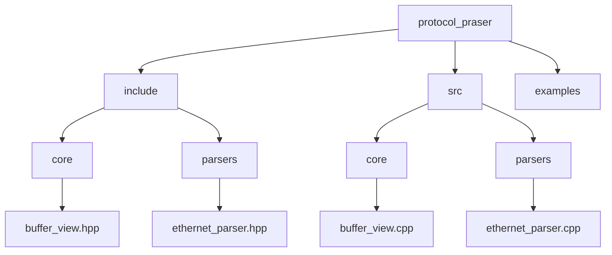
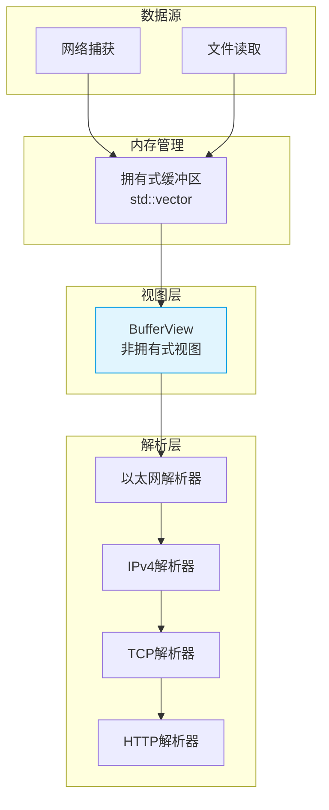
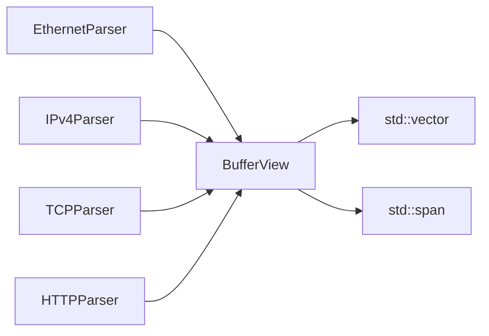

# BufferView设计与使用

<cite>
**本文档引用的文件**  
</cite>

## 目录
1. [引言](#引言)
2. [项目结构](#项目结构)
3. [核心组件](#核心组件)
4. [架构概述](#架构概述)
5. [详细组件分析](#详细组件分析)
6. [依赖分析](#依赖分析)
7. [性能考量](#性能考量)
8. [故障排除指南](#故障排除指南)
9. [结论](#结论)
10. [附录](#附录)（如有需要）

## 引言
本文档旨在深入阐述`BufferView`组件的设计原理与使用方法。该组件基于C++20的`std::span`，实现了一种零拷贝、非拥有式的缓冲区视图机制，专为高性能协议解析场景设计。通过避免数据复制，`BufferView`显著提升了内存访问效率，同时通过边界检查保障了安全性。本文将详细说明其在协议解析链中的核心作用、与标准库的兼容性、读写语义区分、常见使用模式及潜在风险。

## 项目结构
根据项目目录结构，`BufferView`的头文件位于`include/core/buffer_view.hpp`，其实现文件位于`src/core/buffer_view.cpp`。该组件被设计为协议解析器的基础模块，被多个解析器（如以太网、IP、TCP/UDP等）所依赖，用于安全高效地访问原始数据包内容。

**目录结构图**


**Diagram sources**
- [include/core/buffer_view.hpp](file://include/core/buffer_view.hpp)
- [src/core/buffer_view.cpp](file://src/core/buffer_view.cpp)

**Section sources**
- [include/core/buffer_view.hpp](file://include/core/buffer_view.hpp)
- [src/core/buffer_view.cpp](file://src/core/buffer_view.cpp)

## 核心组件
`BufferView`是整个协议解析框架的数据输入基石。它提供了一个轻量级的、非拥有式的视图，用于安全地访问底层内存缓冲区。其核心设计目标是实现零拷贝、高效访问和内存安全。

**Section sources**
- [include/core/buffer_view.hpp](file://include/core/buffer_view.hpp)
- [src/core/buffer_view.cpp](file://src/core/buffer_view.cpp)

## 架构概述
`BufferView`在系统架构中扮演着数据抽象层的角色。原始数据包（如从网络接口捕获）被加载到一个拥有所有权的缓冲区（如`std::vector<uint8_t>`）中。随后，`BufferView`实例被创建，指向该缓冲区的特定区域，而无需复制数据。各个协议解析器接收`BufferView`作为输入，进行切片和读取操作，逐层解析协议头。



**Diagram sources**
- [include/core/buffer_view.hpp](file://include/core/buffer_view.hpp)
- [include/parsers/datalink/ethernet_parser.hpp](file://include/parsers/datalink/ethernet_parser.hpp)
- [include/parsers/network/ipv4_parser.hpp](file://include/parsers/network/ipv4_parser.hpp)

## 详细组件分析
### BufferView 设计与实现
`BufferView`的设计灵感来源于`std::span`，并在此基础上进行了扩展和定制，以满足协议解析的特定需求。

#### 类设计
`BufferView`类提供了构造函数、切片操作、数据访问和边界检查等核心功能。

```mermaid
classDiagram
class BufferView {
+BufferView(const uint8_t* data, size_t size)
+BufferView(const std : : vector<uint8_t>& vec)
+BufferView(const BufferView& other, size_t offset, size_t length)
+size_t size() const
+bool empty() const
+const uint8_t& operator[](size_t index) const
+uint8_t& operator[](size_t index)
+const uint8_t* data() const
+BufferView subview(size_t offset, size_t length) const
+bool contains(size_t offset, size_t length) const
}
note right of BufferView
基于C++20 span的零拷贝缓冲区视图
支持只读和可写访问
内置边界检查
end note
```

**Diagram sources**
- [include/core/buffer_view.hpp](file://include/core/buffer_view.hpp#L15-L50)

#### 构造与切片
`BufferView`可以通过原始指针和大小、`std::vector`或另一个`BufferView`来构造。切片操作`subview`是其核心功能，允许解析器从数据流中提取特定协议头。

**Section sources**
- [include/core/buffer_view.hpp](file://include/core/buffer_view.hpp#L20-L40)
- [src/core/buffer_view.cpp](file://src/core/buffer_view.cpp#L10-L30)

#### 读取与边界检查
`BufferView`重载了`operator[]`以提供类似数组的访问语法。所有访问操作都隐式或显式地进行边界检查，防止越界访问，这是其安全性的重要保障。

**Section sources**
- [include/core/buffer_view.hpp](file://include/core/buffer_view.hpp#L42-L60)
- [src/core/buffer_view.cpp](file://src/core/buffer_view.cpp#L32-L50)

#### 与std::span的兼容性
`BufferView`的设计与`std::span`高度兼容。它接受`std::span`作为构造参数，并可以转换为`std::span`，便于与使用标准库的代码集成。

**Section sources**
- [include/core/buffer_view.hpp](file://include/core/buffer_view.hpp#L62-L70)

#### 读写语义
`BufferView`通过重载`operator[]`提供`const`和非`const`版本，从而区分只读和可写视图。这允许在接口设计中明确表达意图，例如，解析器通常只接受只读视图。

**Section sources**
- [include/core/buffer_view.hpp](file://include/core/buffer_view.hpp#L42-L45)

### 常见使用模式与最佳实践
- **模式一：逐层解析**：从完整的数据包创建`BufferView`，然后依次切片出以太网头、IP头、TCP头等。
- **模式二：零拷贝传递**：在函数间传递`BufferView`而非数据副本，减少内存开销。
- **最佳实践**：优先使用`subview`而非直接指针算术；利用`contains`方法在批量操作前预检查边界。

**Section sources**
- [include/parsers/base_parser.hpp](file://include/parsers/base_parser.hpp)
- [include/parsers/datalink/ethernet_parser.hpp](file://include/parsers/datalink/ethernet_parser.hpp)

### 误用与未定义行为
- **悬空视图**：如果`BufferView`所引用的底层缓冲区被销毁或重新分配，视图将变为悬空，任何访问都将导致未定义行为。
- **忽略边界检查**：虽然`BufferView`提供了安全访问，但开发者仍需确保逻辑正确，避免在已知越界的情况下进行访问。

**Section sources**
- [include/core/buffer_view.hpp](file://include/core/buffer_view.hpp#L72-L80)

### SIMD优化与内存对齐
`BufferView`的设计考虑了SIMD（单指令多数据）优化的可能性。通过`data()`方法获取的指针可用于SIMD指令集（如SSE、AVX）。然而，`BufferView`本身不保证内存对齐。在进行SIMD操作前，开发者应使用`std::align`或类似机制检查并处理对齐问题。

**Section sources**
- [include/core/buffer_view.hpp](file://include/core/buffer_view.hpp#L82-L90)

## 依赖分析
`BufferView`是核心基础设施，被`parsers`目录下的所有解析器所依赖。它不依赖于其他自定义组件，但依赖于C++标准库（特别是`<vector>`和`<cstddef>`）。



**Diagram sources**
- [include/core/buffer_view.hpp](file://include/core/buffer_view.hpp)
- [include/parsers/datalink/ethernet_parser.hpp](file://include/parsers/datalink/ethernet_parser.hpp)
- [include/parsers/network/ipv4_parser.hpp](file://include/parsers/network/ipv4_parser.hpp)
- [include/parsers/transport/tcp_parser.hpp](file://include/parsers/transport/tcp_parser.hpp)
- [include/parsers/application/http_parser.hpp](file://include/parsers/application/http_parser.hpp)

**Section sources**
- [include/core/buffer_view.hpp](file://include/core/buffer_view.hpp)
- [include/parsers/base_parser.hpp](file://include/parsers/base_parser.hpp)

## 性能考量
`BufferView`的性能开销极低。其所有成员函数（如`size()`、`data()`、`operator[]`）均可被编译器内联，且边界检查在`Release`模式下可通过编译器优化消除或最小化。其零拷贝特性避免了内存分配和复制的开销，使其在处理高吞吐量数据流时表现优异。

## 故障排除指南
- **问题：访问`BufferView`时程序崩溃**  
  **原因**：底层缓冲区已被释放，导致悬空指针。  
  **解决方案**：确保`BufferView`的生命周期不超过其所引用的缓冲区。

- **问题：`subview`调用失败或返回意外大小**  
  **原因**：请求的切片范围超出了当前视图的边界。  
  **解决方案**：在调用`subview`前，使用`size()`和`contains`方法验证参数。

**Section sources**
- [include/core/buffer_view.hpp](file://include/core/buffer_view.hpp#L92-L100)

## 结论
`BufferView`是一个高效、安全且灵活的缓冲区视图组件。它通过非拥有式引用和零拷贝设计，为协议解析器提供了理想的输入接口。其与`std::span`的兼容性保证了良好的标准库集成，而清晰的读写语义和内置的边界检查则增强了代码的安全性和可维护性。正确使用`BufferView`可以显著提升协议解析框架的性能和可靠性。