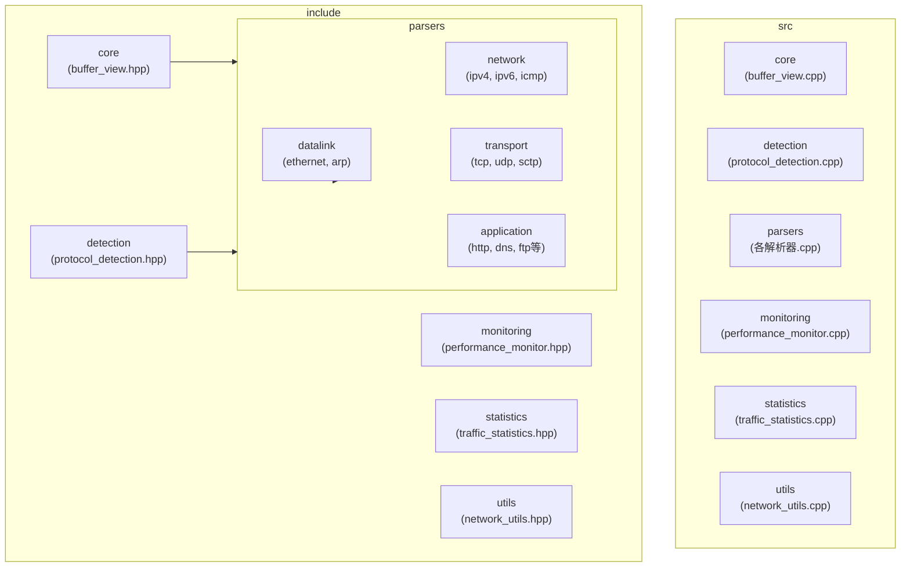
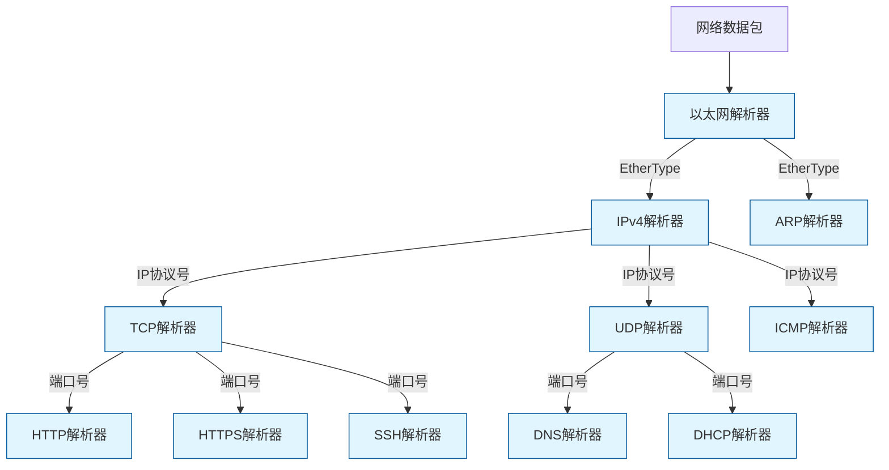
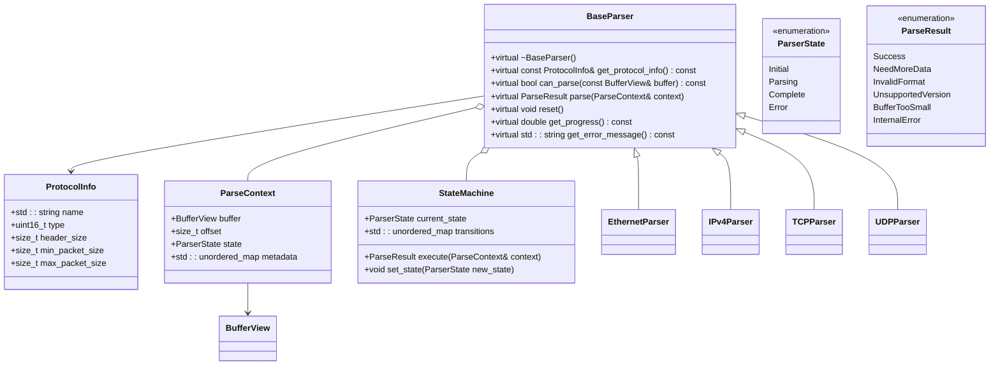
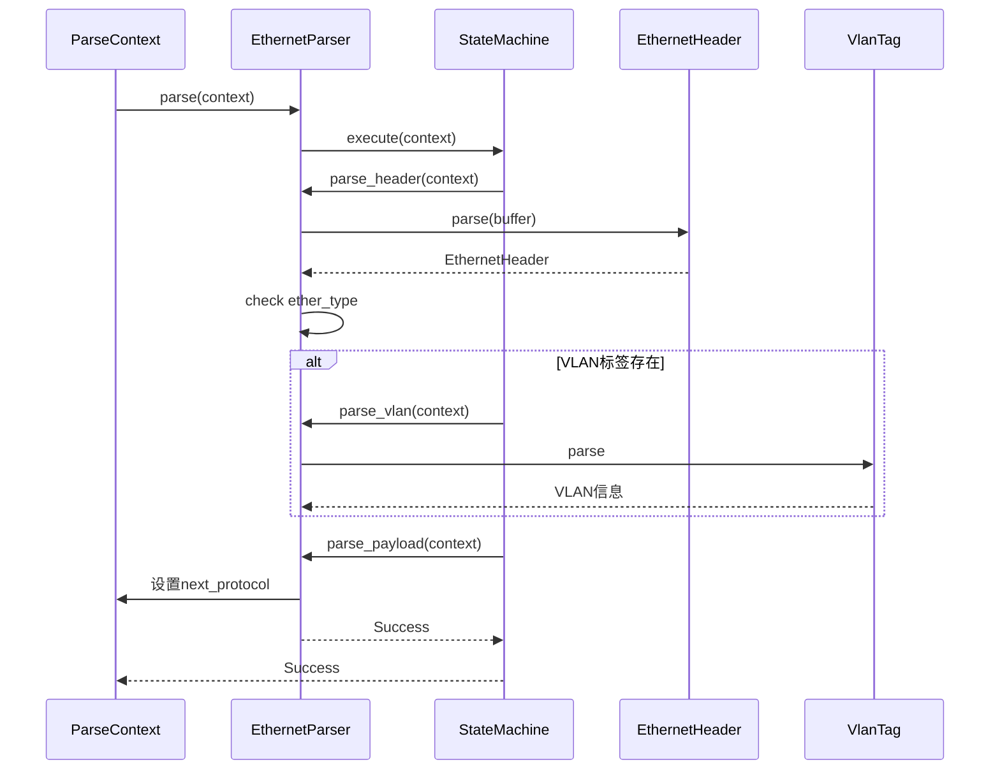
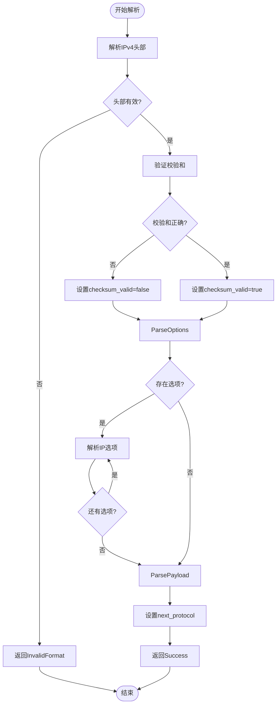

# 协议识别引擎

<cite>
**本文档引用的文件**
- [base_parser.hpp](file://include/parsers/base_parser.hpp)
- [ethernet_parser.hpp](file://include/parsers/datalink/ethernet_parser.hpp)
- [ipv4_parser.hpp](file://include/parsers/network/ipv4_parser.hpp)
- [tcp_parser.hpp](file://include/parsers/transport/tcp_parser.hpp)
- [udp_parser.hpp](file://include/parsers/transport/udp_parser.hpp)
- [http_parser.hpp](file://include/parsers/application/http_parser.hpp)
- [https_parser.hpp](file://include/parsers/application/https_parser.hpp)
- [dns_parser.hpp](file://include/parsers/application/dns_parser.hpp)
- [dhcp_parser.hpp](file://include/parsers/application/dhcp_parser.hpp)
- [arp_parser.hpp](file://include/parsers/datalink/arp_parser.hpp)
- [icmp_parser.hpp](file://include/parsers/network/icmp_parser.hpp)
</cite>

## 目录
1. [引言](#引言)
2. [项目结构](#项目结构)
3. [核心组件](#核心组件)
4. [架构概述](#架构概述)
5. [详细组件分析](#详细组件分析)
6. [依赖分析](#依赖分析)
7. [性能考量](#性能考量)
8. [故障排除指南](#故障排除指南)
9. [结论](#结论)

## 引言
本文档深入阐述协议识别引擎的技术实现，重点分析ProtocolDetection组件如何通过多层机制实现智能协议识别。系统介绍其基于EtherType、IP协议号、端口号、魔数签名和上下文启发式规则的综合判断逻辑，解析状态转移机制、解析链动态选择策略、识别优先级与冲突解决机制，以及自定义规则扩展接口。结合实际网络流量场景说明识别决策过程，并探讨其在处理隧道协议和加密流量时的应对策略与局限性。

## 项目结构
协议识别引擎采用分层模块化设计，代码组织清晰，遵循网络协议栈的分层模型。项目主要包含核心缓冲区管理、协议检测、解析器实现、性能监控和工具类等模块。



**图示来源**
- [base_parser.hpp](file://include/parsers/base_parser.hpp#L1-L187)
- [ethernet_parser.hpp](file://include/parsers/datalink/ethernet_parser.hpp#L1-L181)
- [ipv4_parser.hpp](file://include/parsers/network/ipv4_parser.hpp#L1-L246)

**本节来源**
- [base_parser.hpp](file://include/parsers/base_parser.hpp#L1-L187)
- [ethernet_parser.hpp](file://include/parsers/datalink/ethernet_parser.hpp#L1-L181)
- [ipv4_parser.hpp](file://include/parsers/network/ipv4_parser.hpp#L1-L246)

## 核心组件
协议识别引擎的核心组件包括解析器基类（BaseParser）、协议信息结构（ProtocolInfo）、解析上下文（ParseContext）和解析器注册表（ParserRegistry）。这些组件共同构建了可扩展的协议解析框架。

**本节来源**
- [base_parser.hpp](file://include/parsers/base_parser.hpp#L1-L187)

## 架构概述
协议识别引擎采用基于状态机的分层解析架构，通过解析器注册机制实现协议的动态发现与扩展。引擎通过解析链（Parsing Chain）逐层解析网络数据包，每层解析器负责特定协议的识别与解析。



**图示来源**
- [ethernet_parser.hpp](file://include/parsers/datalink/ethernet_parser.hpp#L1-L181)
- [ipv4_parser.hpp](file://include/parsers/network/ipv4_parser.hpp#L1-L246)
- [tcp_parser.hpp](file://include/parsers/transport/tcp_parser.hpp)
- [udp_parser.hpp](file://include/parsers/transport/udp_parser.hpp)

## 详细组件分析

### 解析器基类分析
解析器基类（BaseParser）为所有协议解析器提供统一的接口和状态机框架，是协议识别引擎的核心抽象。



**图示来源**
- [base_parser.hpp](file://include/parsers/base_parser.hpp#L1-L187)

**本节来源**
- [base_parser.hpp](file://include/parsers/base_parser.hpp#L1-L187)

### 以太网解析器分析
以太网解析器负责解析数据链路层的以太网帧，识别EtherType以确定上层协议类型。



**图示来源**
- [ethernet_parser.hpp](file://include/parsers/datalink/ethernet_parser.hpp#L1-L181)

**本节来源**
- [ethernet_parser.hpp](file://include/parsers/datalink/ethernet_parser.hpp#L1-L181)

### IPv4解析器分析
IPv4解析器负责解析网络层的IPv4数据包，通过IP协议号确定传输层协议类型。



**图示来源**
- [ipv4_parser.hpp](file://include/parsers/network/ipv4_parser.hpp#L1-L246)

**本节来源**
- [ipv4_parser.hpp](file://include/parsers/network/ipv4_parser.hpp#L1-L246)

## 依赖分析
协议识别引擎采用工厂模式和注册表机制管理解析器依赖关系，实现了松耦合的组件架构。

```mermaid
erDiagram
PARSER_REGISTRY ||--o{ PARSER_FACTORY : 注册
PARSER_FACTORY ||--o{ BASE_PARSER : 创建
BASE_PARSER ||--o{ PARSE_CONTEXT : 使用
BASE_PARSER ||--o{ PROTOCOL_INFO : 包含
PARSE_CONTEXT ||--o{ BUFFER_VIEW : 包含
ETHERNET_PARSER ||--|| BASE_PARSER : 继承
IPV4_PARSER ||--|| BASE_PARSER : 继承
TCP_PARSER ||--|| BASE_PARSER : 继承
UDP_PARSER ||--|| BASE_PARSER : 继承
class PARSER_REGISTRY {
+factories_: unordered_map
+instance()
+register_factory()
+create_parser()
}
class PARSER_FACTORY {
+create_parser()
+get_supported_types()
}
class BASE_PARSER {
+state_machine_
+error_message_
+get_protocol_info()
+can_parse()
+parse()
+reset()
}
class PARSE_CONTEXT {
+buffer
+offset
+state
+metadata
}
```

**图示来源**
- [base_parser.hpp](file://include/parsers/base_parser.hpp#L1-L187)
- [ethernet_parser.hpp](file://include/parsers/datalink/ethernet_parser.hpp#L1-L181)
- [ipv4_parser.hpp](file://include/parsers/network/ipv4_parser.hpp#L1-L246)

**本节来源**
- [base_parser.hpp](file://include/parsers/base_parser.hpp#L1-L187)

## 性能考量
协议识别引擎在设计时充分考虑了性能因素，采用零拷贝缓冲区视图、状态机优化和预编译正则表达式等技术提升解析效率。

## 故障排除指南
当协议识别出现异常时，可通过检查解析器状态、验证数据完整性、确认协议支持列表和调试解析流程来定位问题。

**本节来源**
- [base_parser.hpp](file://include/parsers/base_parser.hpp#L1-L187)
- [ethernet_parser.hpp](file://include/parsers/datalink/ethernet_parser.hpp#L1-L181)
- [ipv4_parser.hpp](file://include/parsers/network/ipv4_parser.hpp#L1-L246)

## 结论
协议识别引擎通过分层解析架构和状态机机制，实现了对多层协议的智能识别。其模块化设计和扩展接口支持自定义协议的快速集成，为网络流量分析提供了强大的基础能力。