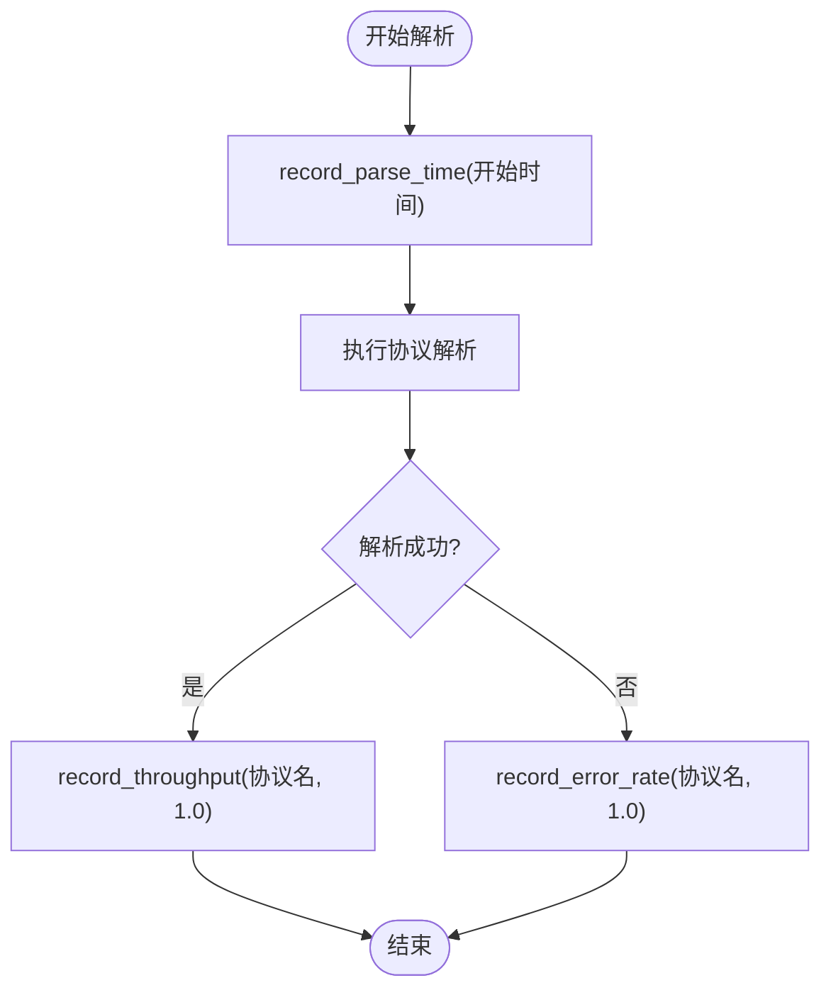

# 性能监控模块

<cite>
**本文档引用文件**  
- [performance_monitor.hpp](file://include/monitoring/performance_monitor.hpp#L1-L340)
- [advanced_features_demo.cpp](file://examples/advanced_features_demo.cpp#L1-L297)
</cite>

## 目录
1. [简介](#简介)
2. [核心指标采集机制](#核心指标采集机制)
3. [性能数据记录接口](#性能数据记录接口)
4. [实时统计与聚合分析](#实时统计与聚合分析)
5. [阈值告警系统](#阈值告警系统)
6. [性能基准测试功能](#性能基准测试功能)
7. [数据导出与持久化](#数据导出与持久化)
8. [系统集成与非侵入式监控](#系统集成与非侵入式监控)
9. [性能回溯与瓶颈分析](#性能回溯与瓶颈分析)
10. [配置管理与运行控制](#配置管理与运行控制)

## 简介
PerformanceMonitor 模块是协议解析系统中的核心性能监控组件，专为高精度、低开销的运行时性能分析而设计。该模块支持毫秒级时间序列记录，能够精确测量解析延迟、吞吐量、CPU 使用率和内存消耗等关键性能指标。通过非侵入式集成方式，可在不影响主解析路径性能的前提下实现全面监控。模块提供丰富的数据分析、阈值告警、基准测试和优化建议功能，为系统性能调优和故障排查提供强有力的支持。

**Section sources**
- [performance_monitor.hpp](file://include/monitoring/performance_monitor.hpp#L1-L50)

## 核心指标采集机制
PerformanceMonitor 模块采用高精度时钟源（`std::chrono::steady_clock`）进行时间测量，确保纳秒级精度的时间戳记录。所有性能数据点均封装为 `MetricDataPoint` 结构，包含时间戳、数值、标签和指标类型。模块支持多种关键性能指标的采集：

- **解析延迟**：记录单个协议包从开始到完成解析所消耗的时间
- **吞吐量**：统计单位时间内成功解析的数据包数量或字节数
- **资源消耗**：监控内存使用量和 CPU 占用率
- **错误率**：跟踪解析失败的比例
- **自定义指标**：支持用户定义的特定性能度量

采集过程通过原子操作和细粒度锁机制保证线程安全，最小化对主业务逻辑的性能影响。

**Section sources**
- [performance_monitor.hpp](file://include/monitoring/performance_monitor.hpp#L30-L45)
- [performance_monitor.hpp](file://include/monitoring/performance_monitor.hpp#L197-L210)

## 性能数据记录接口
模块提供一系列类型安全的记录接口，便于在协议解析链中嵌入性能监控点：



**Diagram sources**
- [performance_monitor.hpp](file://include/monitoring/performance_monitor.hpp#L212-L220)

**Section sources**
- [performance_monitor.hpp](file://include/monitoring/performance_monitor.hpp#L212-L220)

## 实时统计与聚合分析
模块内置 `RealTimeCalculator` 模板类，采用环形缓冲区结构实现滑动窗口统计计算。对于每个指标，系统维护一个固定大小的值窗口，并实时计算以下聚合统计量：

- 最小值、最大值、平均值
- 中位数、95% 和 99% 百分位值
- 方差与标准差
- 数据点计数与速率

`PerformanceStats` 结构封装了完整的统计结果，包括时间范围、持续时间和每秒速率等衍生指标。统计计算在后台线程中异步执行，避免阻塞主监控路径。


**Diagram sources**
- [performance_monitor.hpp](file://include/monitoring/performance_monitor.hpp#L75-L120)
- [performance_monitor.hpp](file://include/monitoring/performance_monitor.hpp#L45-L73)

**Section sources**
- [performance_monitor.hpp](file://include/monitoring/performance_monitor.hpp#L75-L120)

## 阈值告警系统
PerformanceMonitor 提供灵活的阈值告警机制，支持多级告警策略。`PerformanceThreshold` 结构定义了指标的警告和严重阈值，以及检查间隔。当指标值超过设定阈值时，系统自动生成 `PerformanceAlert` 事件，并通过用户注册的回调函数进行通知。

告警级别包括：
- INFO：信息性事件
- WARNING：警告状态
- CRITICAL：严重问题
- RESOLVED：问题已恢复

用户可通过 `set_alert_callback()` 注册自定义告警处理器，实现日志记录、通知发送或自动化响应。


**Diagram sources**
- [performance_monitor.hpp](file://include/monitoring/performance_monitor.hpp#L135-L180)
- [performance_monitor.hpp](file://include/monitoring/performance_monitor.hpp#L300-L310)

**Section sources**
- [performance_monitor.hpp](file://include/monitoring/performance_monitor.hpp#L135-L180)

## 性能基准测试功能
模块内置基准测试功能，支持对协议解析性能进行标准化评估。`run_parse_benchmark()` 方法可对指定协议执行解析性能测试，返回包含以下信息的 `BenchmarkResult`：

- 每秒操作数（operations_per_second）
- 平均、最小、最大操作时间
- CPU 利用率和内存峰值使用量
- 测试通过状态和错误信息

`run_throughput_benchmark()` 方法用于测试系统在高负载下的吞吐能力。这些基准测试功能可用于版本对比、性能回归检测和硬件适配评估。

**Section sources**
- [performance_monitor.hpp](file://include/monitoring/performance_monitor.hpp#L270-L285)

## 数据导出与持久化
PerformanceMonitor 支持多种格式的性能数据导出，便于外部系统分析和长期存储。`export_metrics()` 方法支持以下格式：

- **JSON**：结构化数据，适合程序解析
- **CSV**：表格数据，适合电子表格处理
- **BINARY**：二进制格式，高效存储
- **PROMETHEUS**：Prometheus 监控系统兼容格式

导出内容可限定时间窗口（如最近一小时），并可通过 `export_to_file()` 直接写入文件。导出功能采用零拷贝优化策略，确保大数据量导出时的性能表现。

**Section sources**
- [performance_monitor.hpp](file://include/monitoring/performance_monitor.hpp#L290-L295)

## 系统集成与非侵入式监控
PerformanceMonitor 通过 RAII（资源获取即初始化）模式和智能指针实现非侵入式集成。典型集成方式如下：

1. 在解析器初始化时创建 `PerformanceMonitor` 实例
2. 在关键代码路径插入性能记录调用
3. 启动监控循环 `start_monitoring()`
4. 程序退出时自动析构清理资源

模块采用后台线程执行耗时操作（如阈值检查、数据清理），主记录接口保持轻量级。内存预分配和对象池技术进一步降低了运行时开销。

```cpp
// 示例集成代码（来自 advanced_features_demo.cpp）
// Monitoring::PerformanceMonitor monitor(1000);
// monitor.start_monitoring();
// auto start = std::chrono::high_resolution_clock::now();
// auto result = parser->parse(buffer);
// auto end = std::chrono::high_resolution_clock::now();
// monitor.record_parse_time("DHCP", end - start);
```

**Section sources**
- [advanced_features_demo.cpp](file://examples/advanced_features_demo.cpp#L118-L120)
- [advanced_features_demo.cpp](file://examples/advanced_features_demo.cpp#L140-L145)

## 性能回溯与瓶颈分析
模块提供 `generate_performance_report()` 方法，生成全面的性能分析报告。报告包含：

- 各协议的性能统计对比
- 系统整体性能指标
- 自动识别的性能瓶颈列表
- 基于统计模式的优化建议
- 0-100 分的效率评分

通过分析百分位值、方差和趋势变化，系统能够识别间歇性延迟尖峰、内存泄漏倾向和资源竞争等问题，为深度性能调优提供指导。

**Section sources**
- [performance_monitor.hpp](file://include/monitoring/performance_monitor.hpp#L250-L260)

## 配置管理与运行控制
PerformanceMonitor 支持动态配置管理，通过 `MonitorConfig` 结构可调整以下参数：

- 最大指标历史记录数
- 指标保留时间
- 告警检查间隔
- 实时统计开关
- 内存使用上限

运行控制接口包括：
- `start_monitoring()` / `stop_monitoring()`：启动/停止监控
- `pause_monitoring()` / `resume_monitoring()`：暂停/恢复监控
- `is_monitoring_active()`：查询监控状态

这些控制接口允许在运行时根据系统负载动态调整监控策略，实现性能与可观测性的最佳平衡。

**Section sources**
- [performance_monitor.hpp](file://include/monitoring/performance_monitor.hpp#L287-L300)