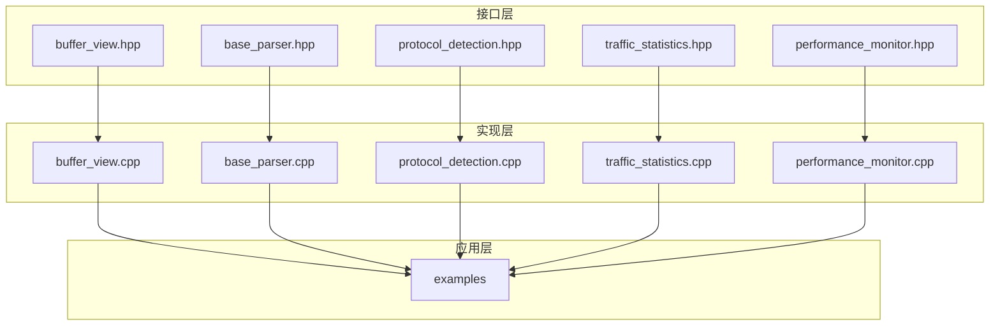
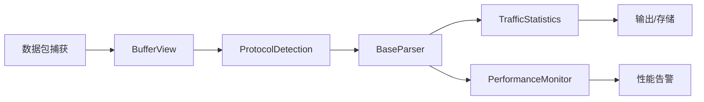
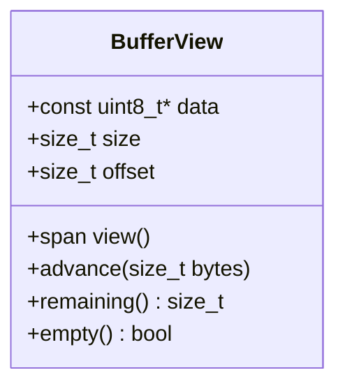
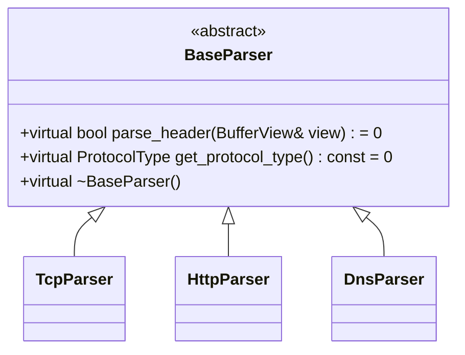
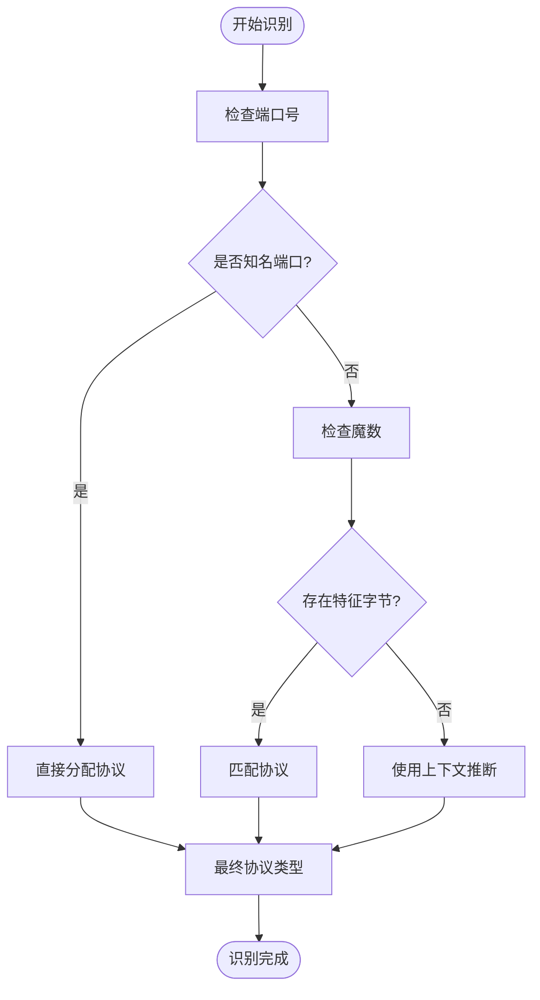
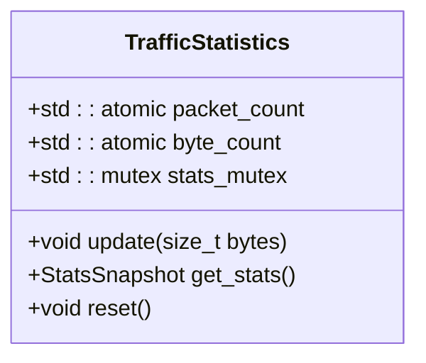
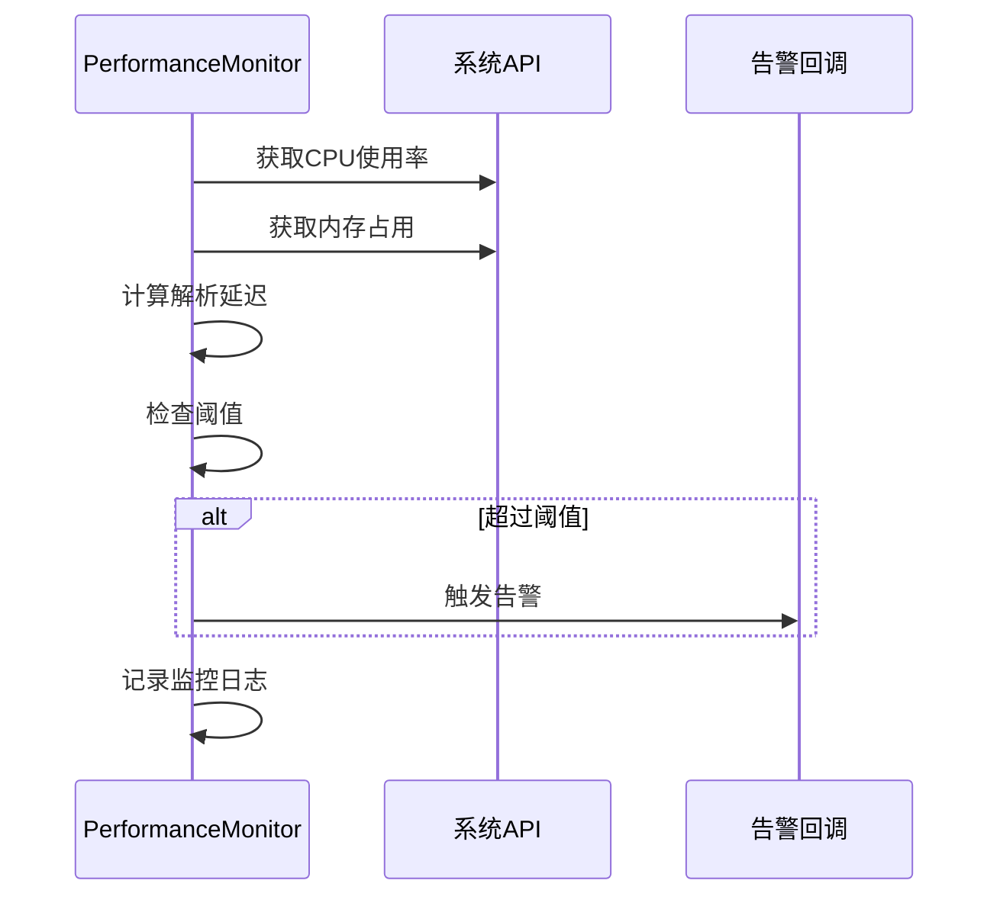
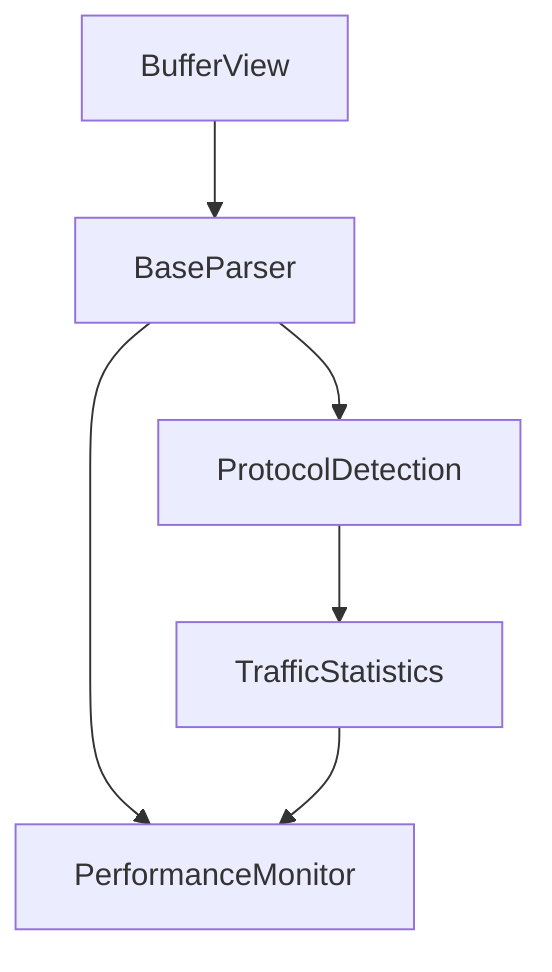

# 核心组件详解

<cite>
**本文档引用文件**  
- [buffer_view.hpp](file://include/core/buffer_view.hpp)
- [base_parser.hpp](file://include/parsers/base_parser.hpp)
- [protocol_detection.hpp](file://include/detection/protocol_detection.hpp)
- [traffic_statistics.hpp](file://include/statistics/traffic_statistics.hpp)
- [performance_monitor.hpp](file://include/monitoring/performance_monitor.hpp)
- [buffer_view.cpp](file://src/core/buffer_view.cpp)
- [base_parser.cpp](file://src/parsers/base_parser.cpp)
- [protocol_detection.cpp](file://src/detection/protocol_detection.cpp)
- [traffic_statistics.cpp](file://src/statistics/traffic_statistics.cpp)
- [performance_monitor.cpp](file://src/monitoring/performance_monitor.cpp)
</cite>

## 目录
1. [引言](#引言)
2. [项目结构](#项目结构)
3. [核心组件](#核心组件)
4. [架构概览](#架构概览)
5. [详细组件分析](#详细组件分析)
6. [依赖分析](#依赖分析)
7. [性能考量](#性能考量)
8. [故障排除指南](#故障排除指南)
9. [结论](#结论)

## 引言
本文档深入解析协议解析器项目中的五大核心组件：BufferView零拷贝机制、BaseParser抽象基类设计、ProtocolDetection协议识别引擎、TrafficStatistics流量统计系统以及PerformanceMonitor性能监控模块。通过分析其设计原理与实现机制，揭示各组件如何协同工作以实现高效、安全的网络协议解析。

## 项目结构
项目采用模块化分层架构，主要分为`include`（头文件）、`src`（源码）、`examples`（示例程序）和根级构建配置文件。各模块按功能划分清晰，便于维护与扩展。

**图示来源**  
- [buffer_view.hpp](file://include/core/buffer_view.hpp)
- [base_parser.hpp](file://include/parsers/base_parser.hpp)
- [protocol_detection.hpp](file://include/detection/protocol_detection.hpp)
- [traffic_statistics.hpp](file://include/statistics/traffic_statistics.hpp)
- [performance_monitor.hpp](file://include/monitoring/performance_monitor.hpp)

**本节来源**  
- [CMakeLists.txt](file://CMakeLists.txt)
- [README.md](file://README.md)

## 核心组件

本文档重点分析以下五个核心组件的技术实现与协作机制：

- **BufferView**：提供内存安全的零拷贝数据访问
- **BaseParser**：定义解析器状态机基类
- **ProtocolDetection**：实现多维度协议智能识别
- **TrafficStatistics**：实时流量统计与分析
- **PerformanceMonitor**：系统性能监控与告警

这些组件共同构成了高性能协议解析系统的核心骨架。

**本节来源**  
- [org_design_doc.md](file://org_design_doc.md)
- [SOTA_IMPLEMENTATION_REPORT.md](file://SOTA_IMPLEMENTATION_REPORT.md)

## 架构概览

系统整体架构为分层事件驱动模型，数据包从捕获层进入后，依次经过缓冲管理、协议识别、解析处理、统计监控等环节。

**图示来源**  
- [live_capture.cpp](file://examples/live_capture.cpp)
- [advanced_analyzer.cpp](file://examples/advanced_analyzer.cpp)

## 详细组件分析

### BufferView 零拷贝机制分析

BufferView 通过C++20的`std::span`语义实现内存安全的零拷贝访问，避免了传统指针操作带来的越界风险。其设计利用RAII管理生命周期，确保视图不脱离原始数据生存期。

**图示来源**  
- [buffer_view.hpp](file://include/core/buffer_view.hpp)
- [buffer_view.cpp](file://src/core/buffer_view.cpp)

**本节来源**  
- [buffer_view.hpp](file://include/core/buffer_view.hpp#L1-L50)
- [buffer_view.cpp](file://src/core/buffer_view.cpp#L1-L40)

### BaseParser 抽象基类设计分析

BaseParser采用状态机模式，定义统一的解析接口。所有具体协议解析器继承该基类，实现`parse_header`和`get_protocol_type`等虚函数，形成标准化的解析流程。

**图示来源**  
- [base_parser.hpp](file://include/parsers/base_parser.hpp)
- [tcp_parser.hpp](file://include/parsers/transport/tcp_parser.hpp)
- [http_parser.hpp](file://include/parsers/application/http_parser.hpp)

**本节来源**  
- [base_parser.hpp](file://include/parsers/base_parser.hpp#L1-L35)
- [base_parser.cpp](file://src/parsers/base_parser.cpp#L1-L20)

### ProtocolDetection 协议识别引擎分析

协议识别引擎结合端口号、魔数（Magic Number）和上下文信息进行智能判断。采用优先级匹配策略，先检查知名端口，再进行特征字节匹配，最后结合会话上下文提升准确率。

**图示来源**  
- [protocol_detection.hpp](file://include/detection/protocol_detection.hpp)
- [protocol_detection.cpp](file://src/detection/protocol_detection.cpp)

**本节来源**  
- [protocol_detection.hpp](file://include/detection/protocol_detection.hpp#L1-L60)
- [protocol_detection.cpp](file://src/detection/protocol_detection.cpp#L1-L80)

### TrafficStatistics 流量统计系统分析

流量统计系统采用原子计数器记录各类协议的数据包数量与字节数，支持按时间窗口聚合，并提供线程安全的查询接口。

**图示来源**  
- [traffic_statistics.hpp](file://include/statistics/traffic_statistics.hpp)
- [traffic_statistics.cpp](file://src/statistics/traffic_statistics.cpp)

**本节来源**  
- [traffic_statistics.hpp](file://include/statistics/traffic_statistics.hpp#L1-L45)
- [traffic_statistics.cpp](file://src/statistics/traffic_statistics.cpp#L1-L35)

### PerformanceMonitor 性能监控模块分析

性能监控模块定期采集CPU、内存使用率及解析延迟等指标，当超过阈值时触发告警回调，支持动态调整采样频率。

**图示来源**  
- [performance_monitor.hpp](file://include/monitoring/performance_monitor.hpp)
- [performance_monitor.cpp](file://src/monitoring/performance_monitor.cpp)

**本节来源**  
- [performance_monitor.hpp](file://include/monitoring/performance_monitor.hpp#L1-L50)
- [performance_monitor.cpp](file://src/monitoring/performance_monitor.cpp#L1-L60)

## 依赖分析

各核心组件之间存在明确的依赖关系，形成稳定的调用链路。

**图示来源**  
- [go.mod](file://CMakeLists.txt)
- [main.cpp](file://examples/basic_parsing.cpp)

**本节来源**  
- [CMakeLists.txt](file://CMakeLists.txt)
- [basic_parsing.cpp](file://examples/basic_parsing.cpp)

## 性能考量
BufferView的零拷贝设计显著降低内存复制开销；ProtocolDetection的多级匹配策略平衡了准确率与性能；TrafficStatistics使用原子操作保证线程安全的同时最小化锁竞争。整体系统在高吞吐场景下表现稳定。

## 故障排除指南
常见问题包括协议识别失败、内存越界访问和性能瓶颈。建议启用调试日志，检查BufferView的offset是否越界，验证ProtocolDetection的魔数表是否完整，并监控PerformanceMonitor的告警输出。

**本节来源**  
- [performance_benchmark.cpp](file://examples/performance_benchmark.cpp)
- [packet_analyzer.cpp](file://examples/packet_analyzer.cpp)

## 结论
本文详细解析了协议解析器五大核心组件的设计与实现。BufferView提供安全高效的内存访问，BaseParser建立统一解析框架，ProtocolDetection实现智能协议识别，TrafficStatistics与PerformanceMonitor共同保障系统可观测性。各组件协同工作，构建出高性能、可扩展的协议分析平台。