# 流量统计系统

<cite>
**本文档引用的文件**  
- [traffic_statistics.hpp](file://include/statistics/traffic_statistics.hpp)
- [traffic_statistics.cpp](file://src/statistics/traffic_statistics.cpp)
</cite>

## 目录
1. [简介](#简介)
2. [核心数据结构](#核心数据结构)
3. [统计记录机制](#统计记录机制)
4. [多维度数据聚合](#多维度数据聚合)
5. [线程安全设计](#线程安全设计)
6. [实时性能分析](#实时性能分析)
7. [API接口说明](#api接口说明)
8. [监控系统集成示例](#监控系统集成示例)
9. [内存与性能优化策略](#内存与性能优化策略)
10. [总结](#总结)

## 简介
流量统计模块（TrafficStatistics）是协议解析系统中的核心监控组件，负责在数据包解析过程中实时收集和分析网络流量指标。该模块支持按协议类型进行细粒度统计，提供高精度计数、速率计算和性能分析功能。通过高效的线程安全设计，能够应对高并发解析场景，并支持滑动时间窗口分析。模块还提供了丰富的API接口用于查询统计结果、重置计数器和订阅统计事件，便于与外部监控系统集成。

**Section sources**
- [traffic_statistics.hpp](file://include/statistics/traffic_statistics.hpp#L1-L50)

## 核心数据结构
流量统计模块采用分层数据结构设计，确保统计信息的完整性和高效访问。

### 原子度量类（AtomicMetric）
`AtomicMetric` 类是统计系统的基础构建块，采用无锁并发设计，确保在高并发场景下的高性能。

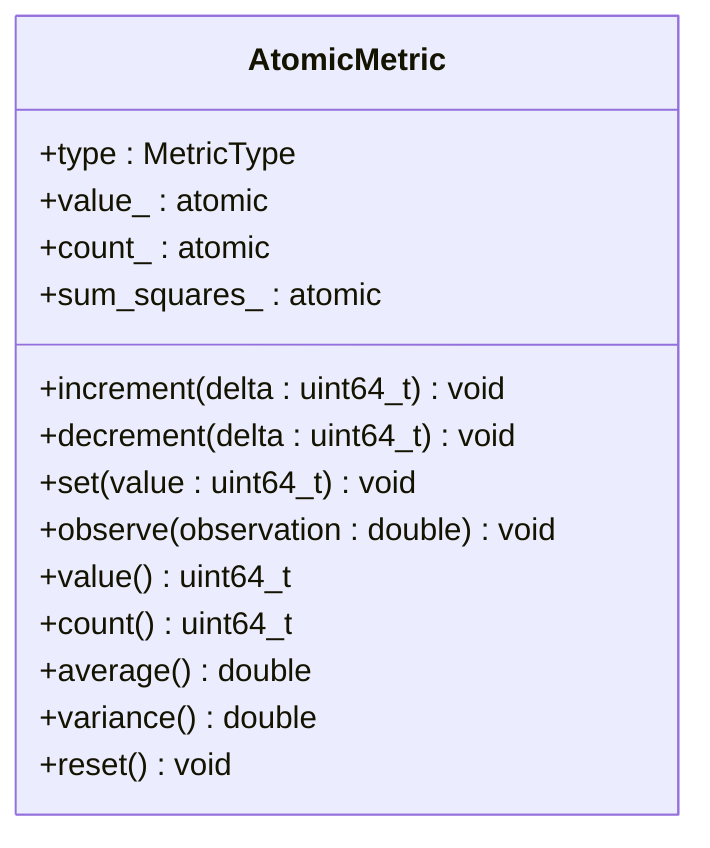

**Diagram sources**
- [traffic_statistics.hpp](file://include/statistics/traffic_statistics.hpp#L30-L97)

### 协议统计结构（ProtocolStats）
`ProtocolStats` 结构体封装了单个协议的完整统计信息，包含多种类型的度量值。

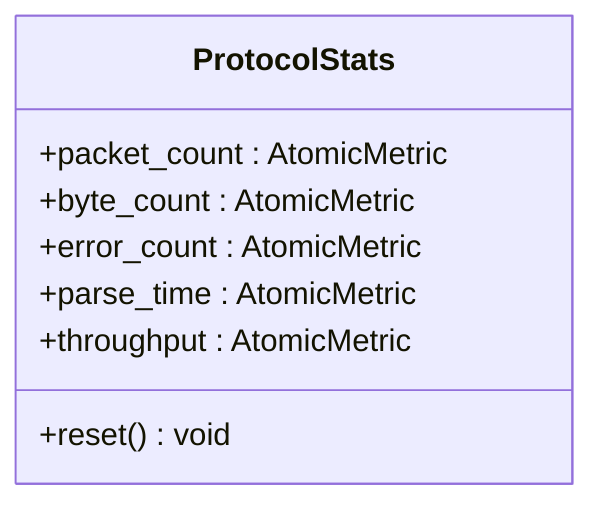

**Diagram sources**
- [traffic_statistics.hpp](file://include/statistics/traffic_statistics.hpp#L100-L114)

## 统计记录机制
流量统计模块提供多种接口用于记录不同类型的统计信息。

### 基本统计记录
模块提供了一系列线程安全的记录接口，用于在解析过程中实时更新统计信息。

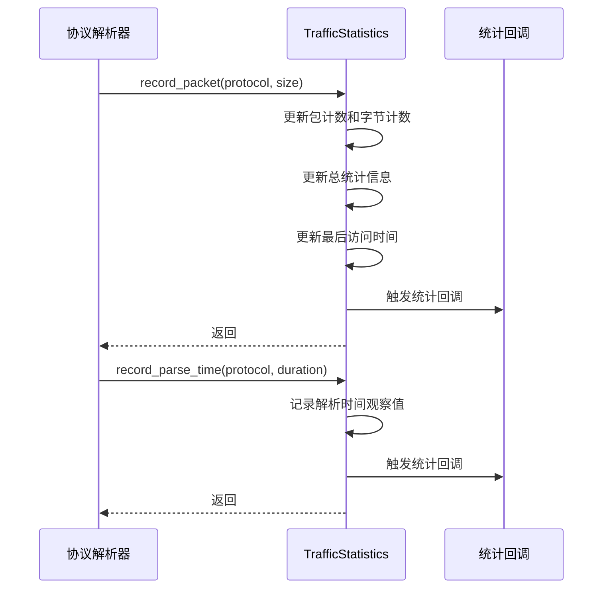

**Diagram sources**
- [traffic_statistics.cpp](file://src/statistics/traffic_statistics.cpp#L17-L67)

### 批量统计优化
为提高高性能场景下的统计效率，模块提供了批量记录接口 `record_batch`，能够一次性处理多个数据包的统计信息。

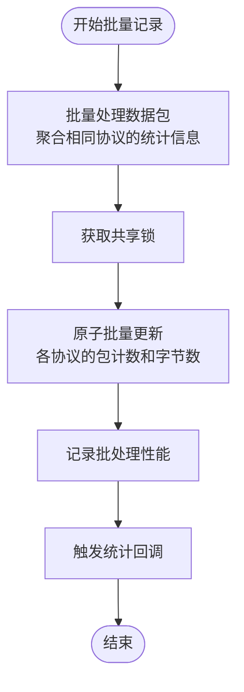

**Diagram sources**
- [traffic_statistics.hpp](file://include/statistics/traffic_statistics.hpp#L50-L70)
- [traffic_statistics.cpp](file://src/statistics/traffic_statistics.cpp#L250-L287)

## 多维度数据聚合
流量统计模块支持从多个维度对网络流量进行聚合分析。

### 按协议层级聚合
系统自动按协议类型进行数据聚合，每个协议都有独立的统计信息存储。

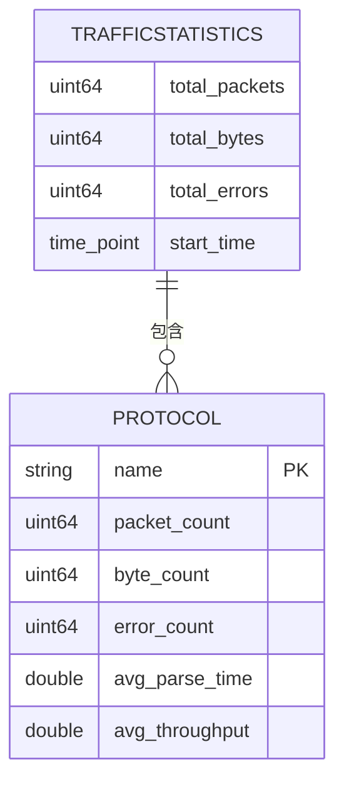

**Diagram sources**
- [traffic_statistics.hpp](file://include/statistics/traffic_statistics.hpp#L117-L214)

### 高精度计数与速率计算
模块采用原子操作实现高精度计数，并通过观察模式计算实时速率。

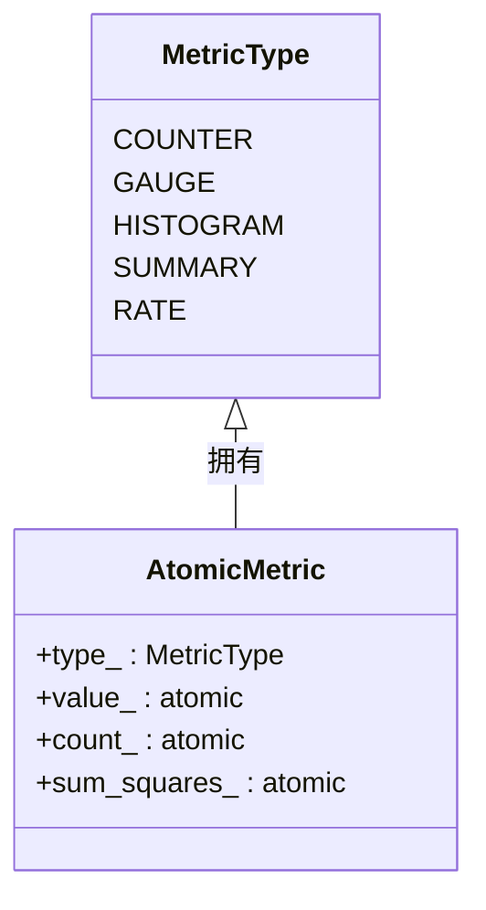

**Diagram sources**
- [traffic_statistics.hpp](file://include/statistics/traffic_statistics.hpp#L20-L25)

## 线程安全设计
为应对高并发解析场景，流量统计模块采用了多层次的线程安全设计。

### 读写锁优化
使用 `std::shared_mutex` 实现读写分离，允许多个读操作并发执行，同时保证写操作的独占性。

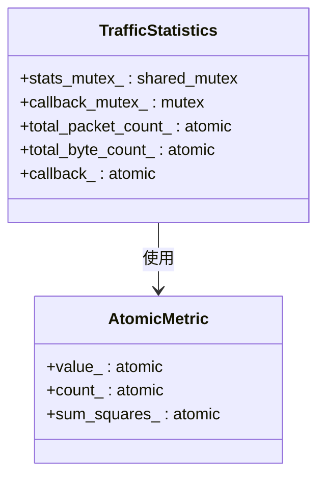

**Diagram sources**
- [traffic_statistics.hpp](file://include/statistics/traffic_statistics.hpp#L190-L205)

### 无锁原子操作
对于简单的计数操作，直接使用 `std::atomic` 类型，避免锁开销，提高性能。

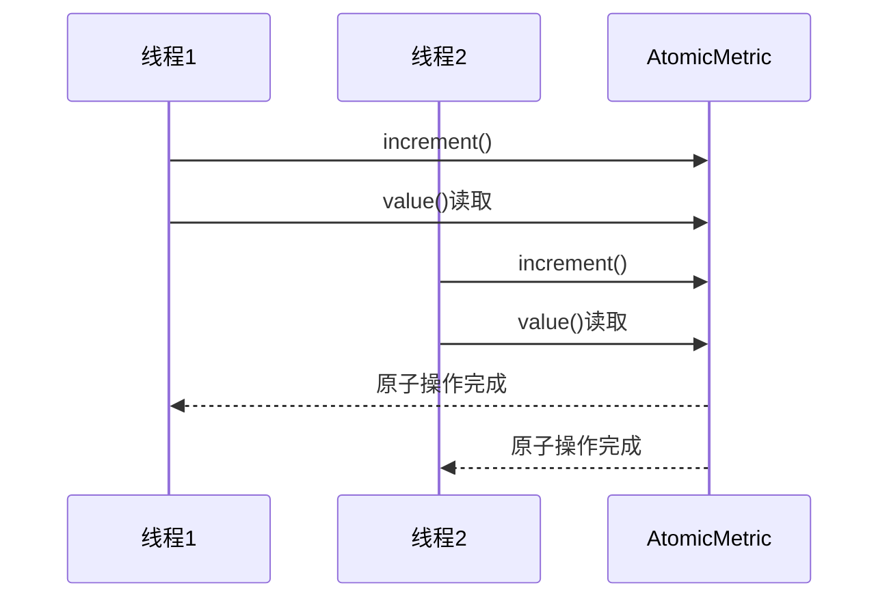

**Diagram sources**
- [traffic_statistics.hpp](file://include/statistics/traffic_statistics.hpp#L30-L97)

## 实时性能分析
模块提供实时性能分析功能，支持滑动窗口算法进行流量分析。

### 性能指标计算
`get_performance_metrics` 方法计算系统级性能指标，包括吞吐量、错误率等。

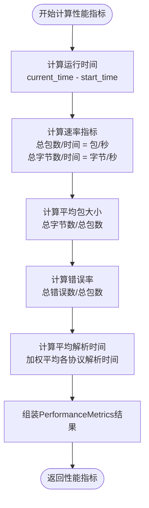

**Diagram sources**
- [traffic_statistics.cpp](file://src/statistics/traffic_statistics.cpp#L103-L142)

### 时间窗口统计
`get_time_window_stats` 方法提供指定时间窗口内的统计信息，支持实时流量分析。

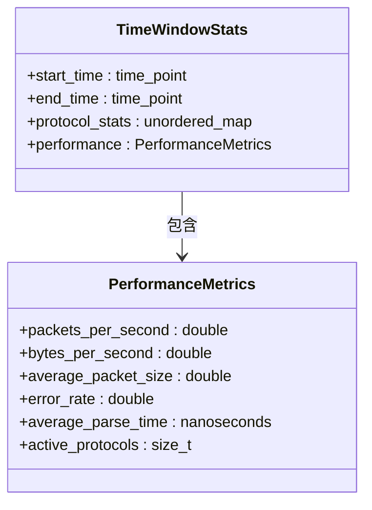

**Diagram sources**
- [traffic_statistics.hpp](file://include/statistics/traffic_statistics.hpp#L150-L165)

## API接口说明
流量统计模块提供了一套完整的API接口，便于外部系统集成和使用。

### 查询接口
提供多种查询方法获取统计信息。

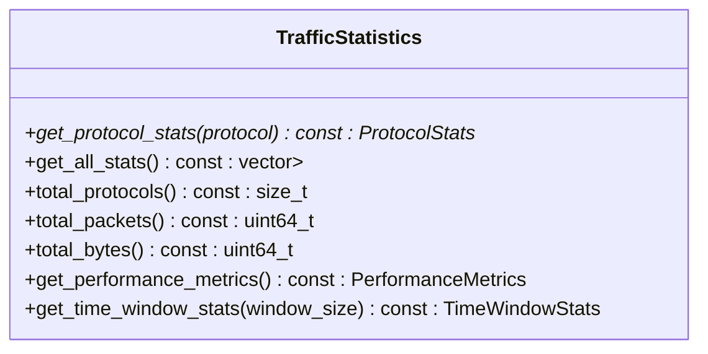

**Diagram sources**
- [traffic_statistics.hpp](file://include/statistics/traffic_statistics.hpp#L75-L95)

### 控制接口
提供统计信息的重置和清理功能。

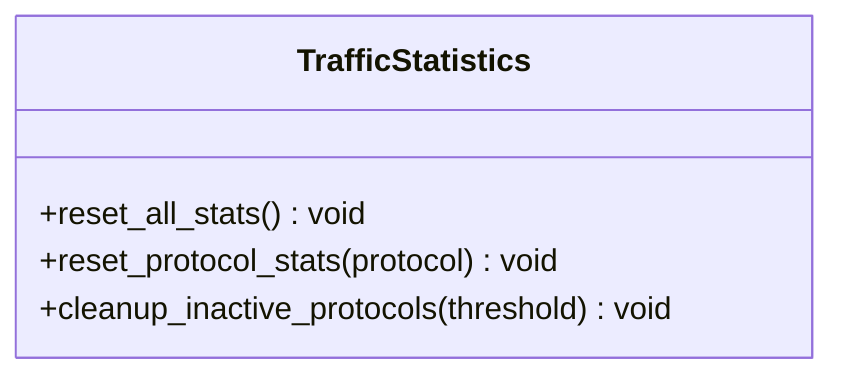

**Diagram sources**
- [traffic_statistics.hpp](file://include/statistics/traffic_statistics.hpp#L168-L174)

### 导出接口
支持多种格式的统计信息导出。

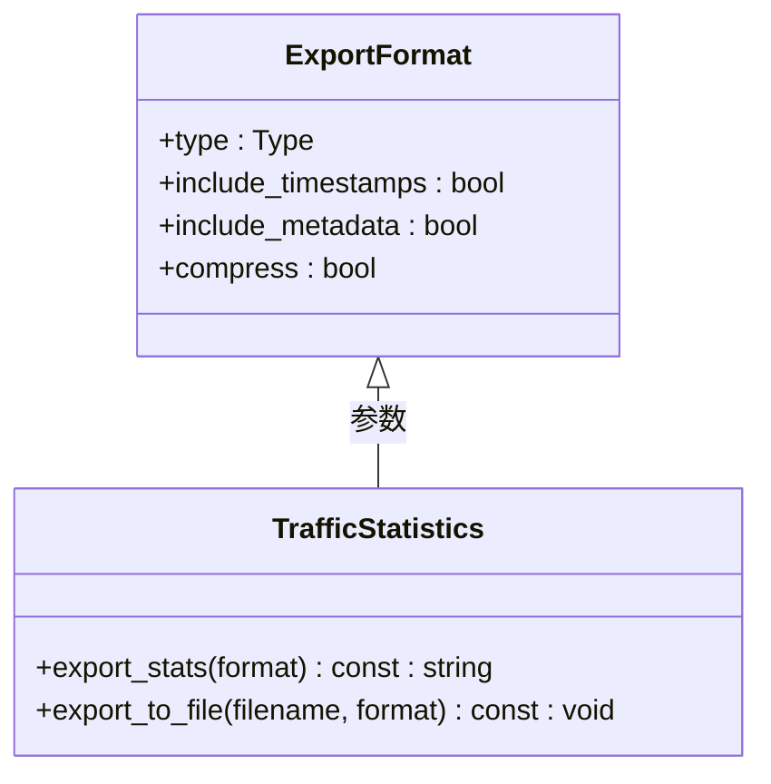

**Diagram sources**
- [traffic_statistics.hpp](file://include/statistics/traffic_statistics.hpp#L176-L185)

### 实时监控钩子
支持设置回调函数，在统计信息更新时实时通知外部系统。

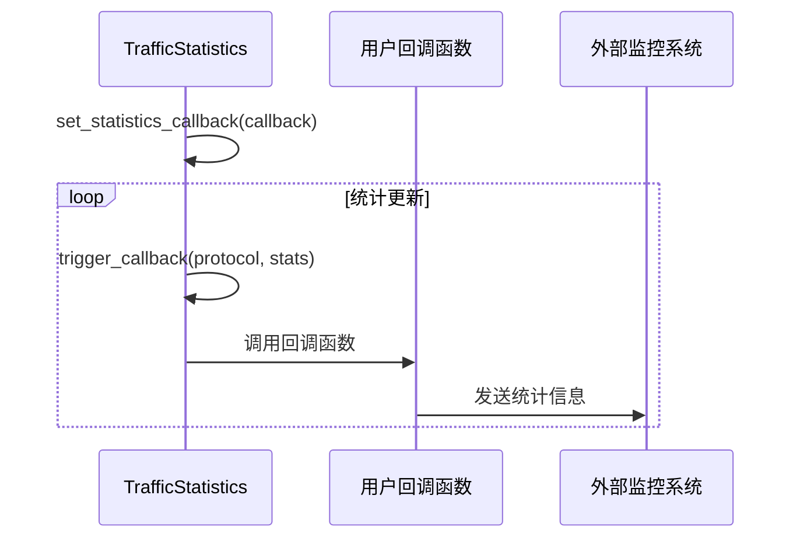

**Diagram sources**
- [traffic_statistics.hpp](file://include/statistics/traffic_statistics.hpp#L187-L190)
- [traffic_statistics.cpp](file://src/statistics/traffic_statistics.cpp#L277-L287)

## 监控系统集成示例
以下示例展示如何将流量统计模块集成到监控系统中。

### Prometheus监控集成
```cpp
// 创建流量统计实例
ProtocolParser::Statistics::TrafficStatistics stats(100);

// 设置Prometheus导出回调
stats.set_statistics_callback([&](const std::string& protocol, const auto& stats) {
    // 将统计信息转换为Prometheus格式并发送
    std::string prometheus_data = stats.export_stats(
        {ProtocolParser::Statistics::TrafficStatistics::ExportFormat::PROMETHEUS});
    prometheus_client.send(prometheus_data);
});

// 在解析循环中记录统计信息
while (packet = capture.next_packet()) {
    auto protocol = detector.detect(packet);
    stats.record_packet(protocol, packet.size());
    stats.record_parse_time(protocol, parse_duration);
}
```

**Section sources**
- [traffic_statistics.hpp](file://include/statistics/traffic_statistics.hpp#L187-L190)
- [traffic_statistics.cpp](file://src/statistics/traffic_statistics.cpp#L235-L245)

## 内存与性能优化策略
流量统计模块采用多种策略平衡内存占用与性能开销。

### 内存优化
- 使用 `std::shared_mutex` 减少读操作的锁竞争
- 采用原子操作避免简单计数的锁开销
- 预分配协议统计容器空间以减少内存碎片

### 性能优化
- 批量统计接口减少函数调用开销
- 读写分离设计提高并发性能
- 无锁数据结构提高高并发场景下的吞吐量

### 资源管理
- `cleanup_inactive_protocols` 方法清理长时间未活动的协议统计
- `max_protocols_` 限制防止内存无限增长
- 原子指针管理回调函数，避免锁竞争

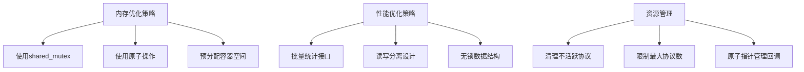

**Diagram sources**
- [traffic_statistics.hpp](file://include/statistics/traffic_statistics.hpp#L190-L205)
- [traffic_statistics.cpp](file://src/statistics/traffic_statistics.cpp#L187-L195)

## 总结
流量统计模块通过精心设计的数据结构和并发控制机制，实现了高效、可靠的网络流量监控功能。模块支持多维度数据聚合、实时性能分析和灵活的API接口，能够满足高并发场景下的统计需求。通过合理的内存和性能优化策略，确保了系统在长时间运行下的稳定性和效率。该模块可轻松集成到各种监控系统中，为网络流量分析提供强大的支持。