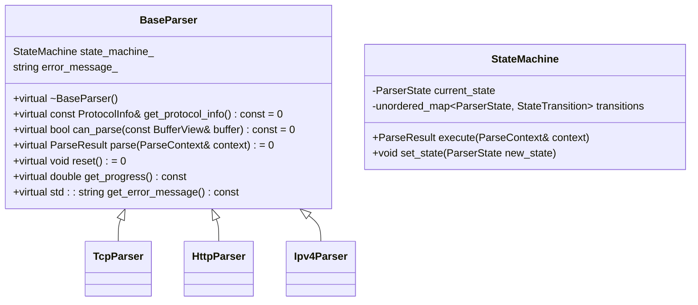
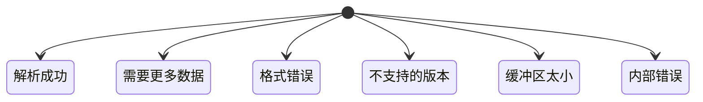
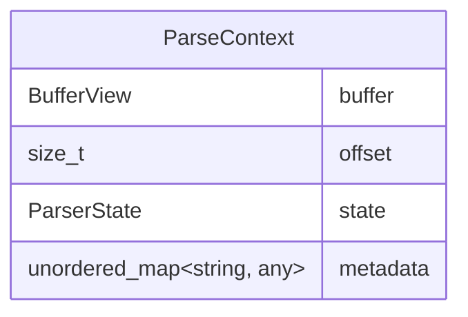
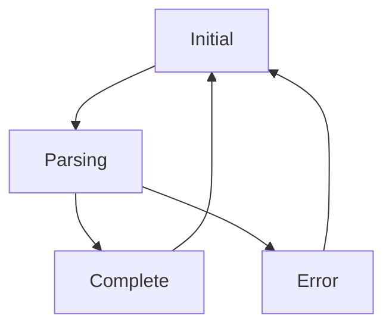
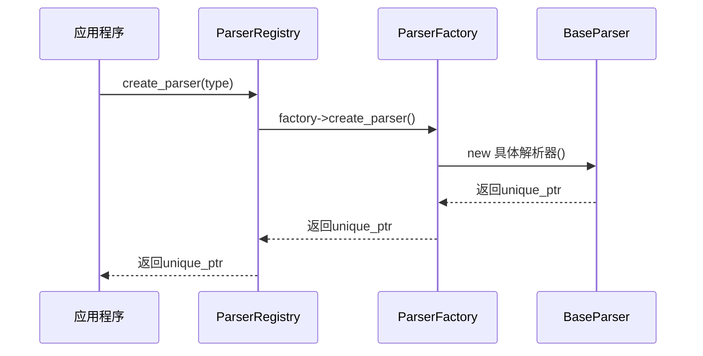

# 解析器基类架构

<cite>
**本文档引用的文件**
- [base_parser.hpp](file://include/parsers/base_parser.hpp#L1-L187)
- [base_parser.cpp](file://src/parsers/base_parser.cpp#L1-L50)
</cite>

## 目录
1. [引言](#引言)
2. [核心组件概述](#核心组件概述)
3. [BaseParser 抽象基类设计](#baseparser-抽象基类设计)
4. [ParseResult 枚举与解析语义](#parseresult-枚举与解析语义)
5. [ParseContext 上下文对象结构](#parsecontext-上下文对象结构)
6. [状态机机制与RAII异常安全](#状态机机制与raii异常安全)
7. [模板化解析器工厂模式](#模板化解析器工厂模式)
8. [继承体系与自定义解析器实现](#继承体系与自定义解析器实现)
9. [性能优化建议与最佳实践](#性能优化建议与最佳实践)
10. [结论](#结论)

## 引言
本项目旨在构建一个高效、可扩展的协议解析框架，其中 `BaseParser` 作为所有协议解析器的统一抽象基类，承担着核心接口定义和状态管理的职责。该类通过纯虚函数规范了解析行为契约，并结合状态机模型实现复杂协议的分阶段解析。本文将深入剖析其设计原理与实现机制，阐述如何通过类型安全的工厂模式支持动态解析器注册与创建，以及如何利用 RAII 原则确保异常安全的状态管理。

## 核心组件概述

`BaseParser` 类位于 `include/parsers/base_parser.hpp`，是整个解析器体系的核心抽象层。它定义了所有具体协议解析器必须遵循的接口规范，包括协议信息获取、数据可解析性判断、核心解析流程执行及状态重置等功能。同时，该头文件还定义了配套的 `ParserFactory`、`ParserRegistry` 和 `REGISTER_PARSER` 宏，共同构成了插件式解析器注册与实例化机制的基础。

**Section sources**
- [base_parser.hpp](file://include/parsers/base_parser.hpp#L1-L187)

## BaseParser 抽象基类设计

`BaseParser` 是一个纯虚基类，采用非虚接口（NVI）模式对外暴露稳定的公有接口，同时通过受保护成员为派生类提供状态机等基础设施。其核心方法包括：

- `get_protocol_info()`：返回协议元信息，用于运行时识别。
- `can_parse()`：预检缓冲区是否符合协议特征。
- `parse()`：核心解析入口，接收 `ParseContext` 并返回 `ParseResult`。
- `reset()`：重置内部状态，支持解析器复用。
- `get_progress()` 和 `get_error_message()`：提供解析过程的反馈信息。

此类设计保证了接口一致性，同时允许各协议解析器灵活实现特定逻辑。



**Diagram sources**
- [base_parser.hpp](file://include/parsers/base_parser.hpp#L62-L128)

**Section sources**
- [base_parser.hpp](file://include/parsers/base_parser.hpp#L62-L128)

## ParseResult 枚举与解析语义

`ParseResult` 枚举定义了解析过程的五种可能结果，每种结果具有明确的语义：



**Diagram sources**
- [base_parser.hpp](file://include/parsers/base_parser.hpp#L18-L25)

**Section sources**
- [base_parser.hpp](file://include/parsers/base_parser.hpp#L18-L25)

## ParseContext 上下文对象结构

`ParseContext` 结构体封装了解析过程中所需的所有上下文信息，包括当前数据缓冲区、读取偏移量、解析状态和元数据存储。这种设计使得解析器无需维护复杂的内部状态，提升了线程安全性与可测试性。



**Diagram sources**
- [base_parser.hpp](file://include/parsers/base_parser.hpp#L51-L56)

**Section sources**
- [base_parser.hpp](file://include/parsers/base_parser.hpp#L51-L56)

## 状态机机制与RAII异常安全

`BaseParser` 内嵌 `StateMachine` 结构，通过状态转移函数映射实现有限状态机。每个状态关联一个 `StateTransition` 函数对象，在状态切换时自动执行相应逻辑。配合 `noexcept` 异常规范和析构函数中的自动清理，确保了即使在异常抛出时也能正确释放资源，符合 RAII 原则。



**Diagram sources**
- [base_parser.hpp](file://include/parsers/base_parser.hpp#L90-L105)

**Section sources**
- [base_parser.hpp](file://include/parsers/base_parser.hpp#L90-L105)

## 模板化解析器工厂模式

通过 `ParserFactory` 抽象工厂和 `ParserRegistry` 单例注册表，系统实现了类型安全的解析器动态创建机制。`REGISTER_PARSER` 宏在全局作用域中静态注册工厂实例，确保程序启动时完成所有解析器的注册，避免了手动注册的错误。



**Diagram sources**
- [base_parser.hpp](file://include/parsers/base_parser.hpp#L133-L172)

**Section sources**
- [base_parser.hpp](file://include/parsers/base_parser.hpp#L133-L172)

## 继承体系与自定义解析器实现

所有具体协议解析器（如 `TcpParser`、`HttpParser`）均继承自 `BaseParser`，必须实现纯虚函数并注册到全局工厂。派生类可通过重写 `parse()` 方法实现协议特定逻辑，或利用内置状态机进行分步解析。

```cpp
// 示例：自定义解析器继承结构
class MyProtocolParser : public BaseParser {
public:
    const ProtocolInfo& get_protocol_info() const override;
    bool can_parse(const BufferView& buffer) const override;
    ParseResult parse(ParseContext& context) override;
    void reset() noexcept override;
};
```

**Section sources**
- [base_parser.hpp](file://include/parsers/base_parser.hpp#L62-L128)

## 性能优化建议与最佳实践

为提升解析性能，建议：
1. 在 `can_parse()` 中使用快速特征检测（如魔数匹配）。
2. 尽量减少 `metadata` 的使用以降低开销。
3. 利用 `noexcept` 提高编译器优化效率。
4. 复用 `ParseContext` 实例避免频繁内存分配。
5. 在 `reset()` 中仅重置必要状态，避免全量初始化。

**Section sources**
- [base_parser.hpp](file://include/parsers/base_parser.hpp#L62-L128)

## 结论

`BaseParser` 抽象基类通过严谨的接口设计、状态机支持和工厂模式集成，为协议解析系统提供了统一、安全且高效的架构基础。其模块化设计不仅便于新协议的快速接入，也保障了系统的稳定性和可维护性，是构建高性能网络协议分析工具的理想选择。