# 现代应用协议解析

<cite>
**本文档引用文件**  
- [mqtt_parser.hpp](file://include/parsers/application/mqtt_parser.hpp)
- [websocket_parser.hpp](file://include/parsers/application/websocket_parser.hpp)
- [grpc_parser.hpp](file://include/parsers/application/grpc_parser.hpp)
- [mqtt_parser.cpp](file://src/parsers/application/mqtt_parser.cpp)
- [websocket_parser.cpp](file://src/parsers/application/websocket_parser.cpp)
- [grpc_parser.cpp](file://src/parsers/application/grpc_parser.cpp)
- [README.md](file://README.md)
- [org_design_doc.md](file://org_design_doc.md)
- [IMPLEMENTATION_SUMMARY.md](file://IMPLEMENTATION_SUMMARY.md)
</cite>

## 目录
1. [引言](#引言)
2. [协议支持概述](#协议支持概述)
3. [MQTT协议解析](#mqtt协议解析)
4. [WebSocket协议解析](#websocket协议解析)
5. [gRPC协议解析](#grpc协议解析)
6. [解析器配置与API使用](#解析器配置与api使用)
7. [性能优化建议](#性能优化建议)
8. [常见问题排查](#常见问题排查)
9. [结论](#结论)

## 引言
现代网络应用依赖多种应用层协议进行通信，其中MQTT、WebSocket和gRPC在物联网、实时通信和微服务架构中扮演着关键角色。本综合文档详细说明了高性能网络协议解析库对MQTT 3.1/3.1.1/5.0、WebSocket RFC 6455和gRPC基于HTTP/2的解析机制。文档涵盖协议特点、解析器配置、API使用示例、性能优化建议和常见问题排查，为开发者提供全面的技术参考。

## 协议支持概述
本协议解析库支持从数据链路层到应用层的完整协议栈解析，特别针对现代应用协议提供了深度解析功能。根据项目文档，库已实现对MQTT、WebSocket和gRPC等关键应用层协议的完整支持，具备高性能、零拷贝设计和SIMD加速等特性。

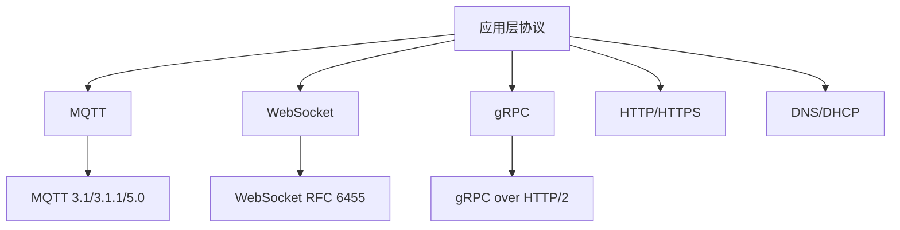

**图示来源**  
- [README.md](file://README.md#L100-L150)

**本节来源**  
- [README.md](file://README.md#L1-L100)
- [org_design_doc.md](file://org_design_doc.md#L1-L50)

## MQTT协议解析

### MQTT版本支持
本解析库全面支持MQTT 3.1、3.1.1和5.0版本，通过`MQTTVersion`枚举进行版本区分。MQTT 3.1.1是最常用的版本，而MQTT 5.0引入了丰富的属性系统和增强功能。

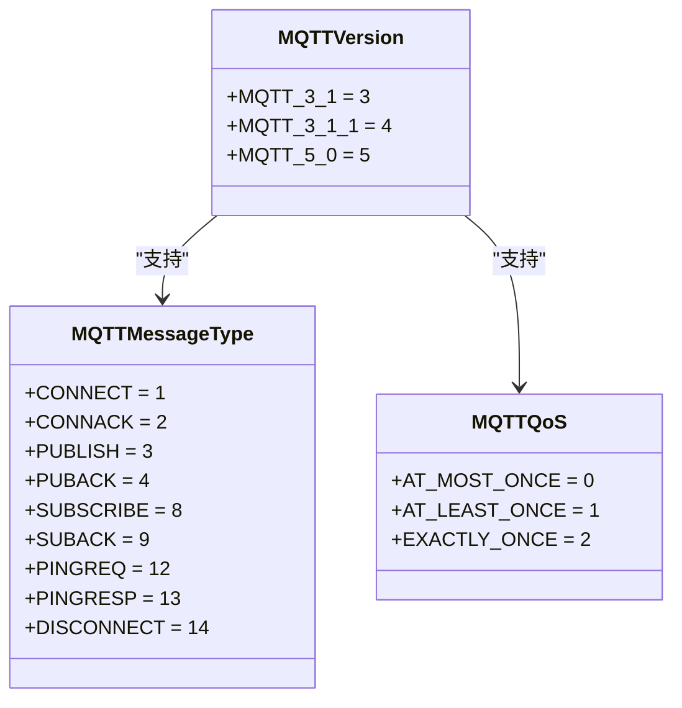

**图示来源**  
- [mqtt_parser.hpp](file://include/parsers/application/mqtt_parser.hpp#L20-L100)

**本节来源**  
- [mqtt_parser.hpp](file://include/parsers/application/mqtt_parser.hpp#L1-L200)
- [mqtt_parser.cpp](file://src/parsers/application/mqtt_parser.cpp#L1-L100)

### MQTT消息结构
MQTT协议采用二进制消息格式，由固定头部、可变头部和载荷组成。固定头部包含消息类型、QoS等级和剩余长度等基本信息。

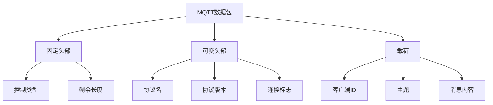

**图示来源**  
- [mqtt_parser.hpp](file://include/parsers/application/mqtt_parser.hpp#L150-L200)

### MQTT解析器功能
`MQTTParser`类提供了完整的MQTT协议解析功能，包括连接、发布、订阅等消息类型的解析。解析器支持端口检测、安全检查和流量统计等高级功能。

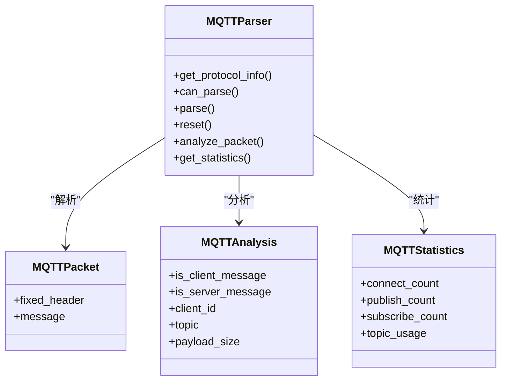

**图示来源**  
- [mqtt_parser.hpp](file://include/parsers/application/mqtt_parser.hpp#L300-L400)

**本节来源**  
- [mqtt_parser.hpp](file://include/parsers/application/mqtt_parser.hpp#L200-L500)
- [mqtt_parser.cpp](file://src/parsers/application/mqtt_parser.cpp#L100-L300)

## WebSocket协议解析

### WebSocket协议特点
WebSocket协议（RFC 6455）提供全双工通信通道，通过HTTP升级机制建立连接。协议支持文本帧、二进制帧和控制帧，具备低延迟和高效率的特点。

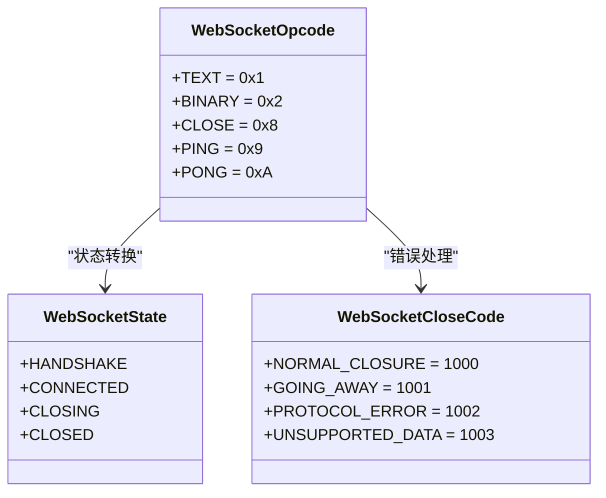

**图示来源**  
- [websocket_parser.hpp](file://include/parsers/application/websocket_parser.hpp#L10-L80)

**本节来源**  
- [websocket_parser.hpp](file://include/parsers/application/websocket_parser.hpp#L1-L100)
- [websocket_parser.cpp](file://src/parsers/application/websocket_parser.cpp#L1-L100)

### WebSocket握手过程
WebSocket连接通过HTTP升级请求建立，客户端发送包含特定头部的HTTP请求，服务器响应101状态码完成握手。

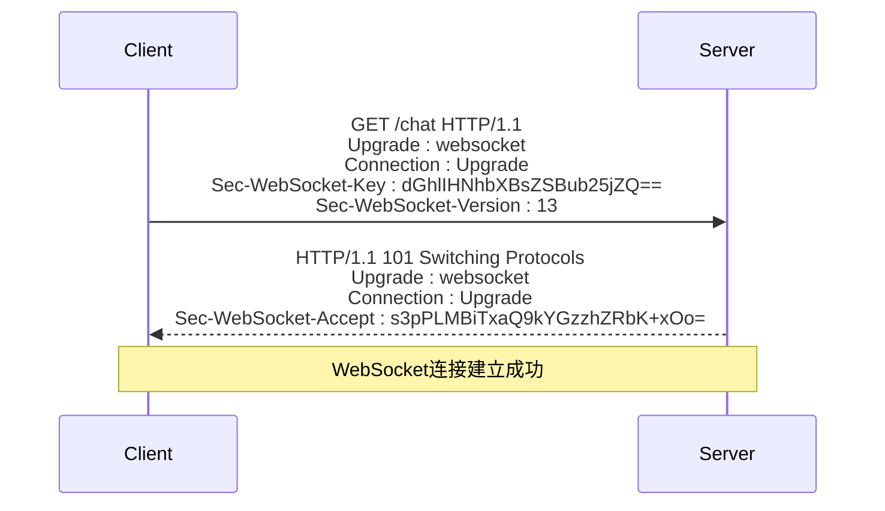

**图示来源**  
- [websocket_parser.hpp](file://include/parsers/application/websocket_parser.hpp#L150-L200)

### WebSocket帧结构
WebSocket数据以帧的形式传输，每个帧包含头部和可选的载荷。头部包含FIN标志、操作码、掩码标志和载荷长度等信息。

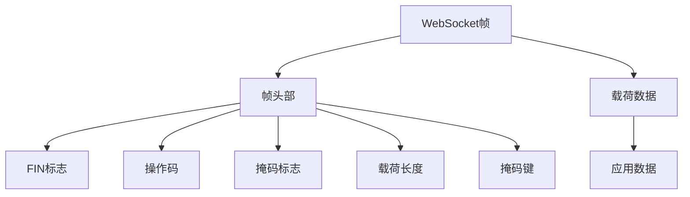

**图示来源**  
- [websocket_parser.hpp](file://include/parsers/application/websocket_parser.hpp#L80-L150)

### WebSocket解析器功能
`WebSocketParser`类实现了完整的WebSocket协议解析，包括握手检测、帧解析、掩码处理和UTF-8验证等功能。

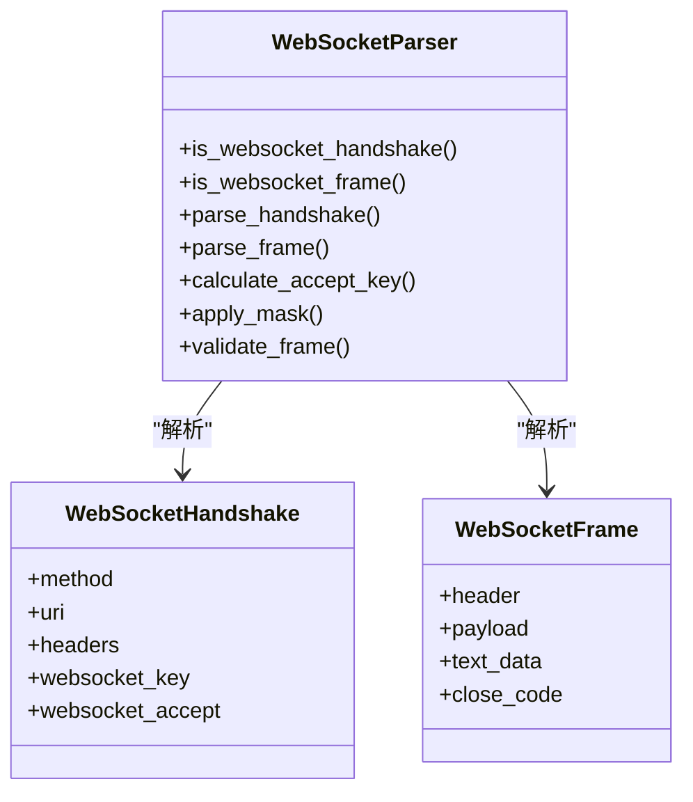

**图示来源**  
- [websocket_parser.hpp](file://include/parsers/application/websocket_parser.hpp#L200-L300)

**本节来源**  
- [websocket_parser.hpp](file://include/parsers/application/websocket_parser.hpp#L100-L400)
- [websocket_parser.cpp](file://src/parsers/application/websocket_parser.cpp#L100-L400)

## gRPC协议解析

### gRPC协议基础
gRPC是基于HTTP/2的高性能RPC框架，使用Protocol Buffers作为接口定义语言。gRPC消息封装在HTTP/2帧中，支持流式通信和双向流。

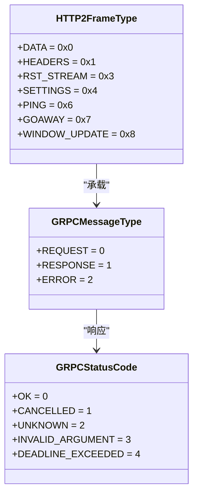

**图示来源**  
- [grpc_parser.hpp](file://include/parsers/application/grpc_parser.hpp#L30-L100)

**本节来源**  
- [grpc_parser.hpp](file://include/parsers/application/grpc_parser.hpp#L1-L150)
- [grpc_parser.cpp](file://src/parsers/application/grpc_parser.cpp#L1-L100)

### gRPC消息格式
gRPC消息在HTTP/2 DATA帧中传输，消息前缀包含压缩标志和长度信息。消息体通常是Protocol Buffers序列化数据。

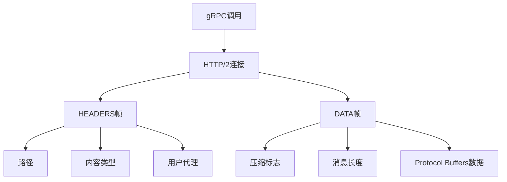

**图示来源**  
- [grpc_parser.hpp](file://include/parsers/application/grpc_parser.hpp#L150-L200)

### gRPC解析器功能
`GRPCParser`类提供了完整的gRPC协议解析功能，能够识别gRPC流量、解析HTTP/2帧和提取gRPC消息。

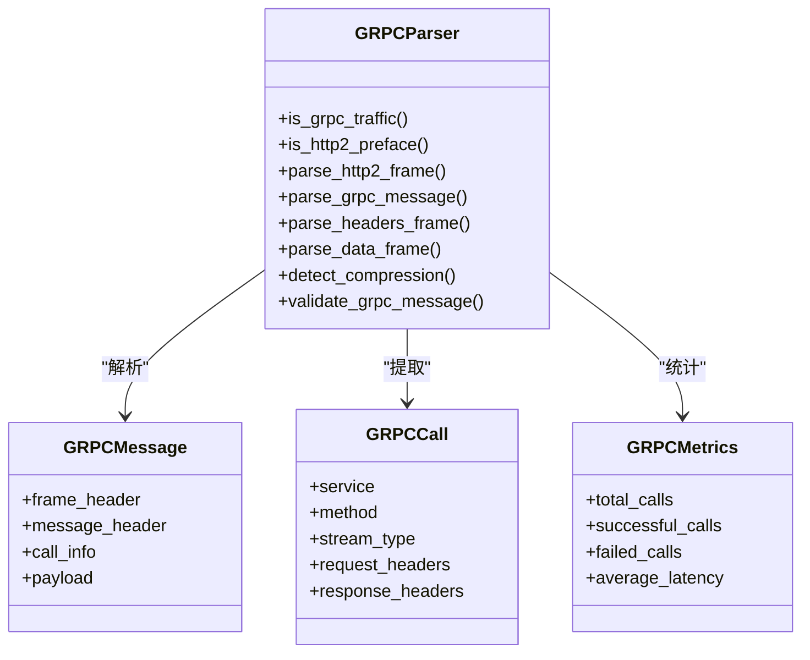

**图示来源**  
- [grpc_parser.hpp](file://include/parsers/application/grpc_parser.hpp#L250-L350)

**本节来源**  
- [grpc_parser.hpp](file://include/parsers/application/grpc_parser.hpp#L150-L400)
- [grpc_parser.cpp](file://src/parsers/application/grpc_parser.cpp#L100-L300)

## 解析器配置与API使用

### 解析器初始化
所有协议解析器都继承自`BaseParser`基类，提供统一的接口。解析器可以通过默认构造函数创建。

```cpp
// [MQTTParser](file://include/parsers/application/mqtt_parser.hpp#L300-L310)
MQTTParser mqtt_parser;

// [WebSocketParser](file://include/parsers/application/websocket_parser.hpp#L250-L260)
WebSocketParser websocket_parser;

// [GRPCParser](file://include/parsers/application/grpc_parser.hpp#L250-L260)
GRPCParser grpc_parser;
```

### 基本解析流程
解析流程遵循统一的模式：创建缓冲区视图、调用解析方法、检查解析结果。

```cpp
// 假设你有一个数据包
std::vector<uint8_t> packet_data = { /* 数据包数据 */ };

// 创建缓冲区视图
BufferView buffer(packet_data.data(), packet_data.size());
ParseContext context;

// 解析MQTT数据包
auto mqtt_result = mqtt_parser.parse(buffer, context);
if (mqtt_result.status == ParseStatus::Complete) {
    // 处理解析结果
    const auto& mqtt_packet = mqtt_parser.get_mqtt_packet();
    auto analysis = mqtt_parser.analyze_packet();
}

// 解析WebSocket数据
auto ws_result = websocket_parser.parse(buffer, context);
if (ws_result.status == ParseStatus::Complete) {
    // 处理解析结果
    WebSocketHandshake handshake;
    auto result = websocket_parser.parse_handshake(buffer, handshake);
}

// 解析gRPC数据
auto grpc_result = grpc_parser.parse(buffer, context);
if (grpc_result.status == ParseStatus::Complete) {
    // 处理解析结果
    GRPCMessage message;
    auto result = grpc_parser.parse_grpc_message(buffer, message);
}
```

**本节来源**  
- [mqtt_parser.hpp](file://include/parsers/application/mqtt_parser.hpp#L300-L400)
- [websocket_parser.hpp](file://include/parsers/application/websocket_parser.hpp#L250-L350)
- [grpc_parser.hpp](file://include/parsers/application/grpc_parser.hpp#L250-L350)

## 性能优化建议

### 零拷贝设计
本库采用零拷贝设计，`BufferView`类不复制数据，只维护指针和大小，避免了不必要的内存复制开销。


### SIMD加速
库自动检测CPU特性并使用相应的SIMD指令进行加速，支持AVX2、SSE2等指令集。

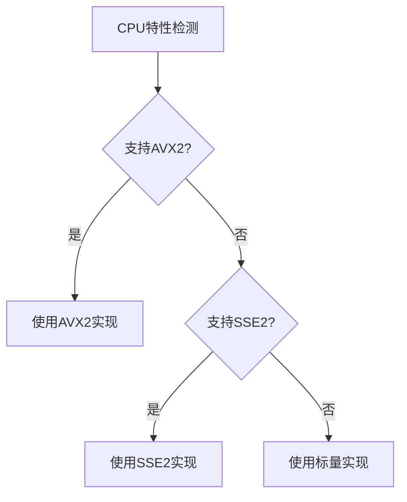

### 内存管理
采用高效的内存管理策略，包括对象池、线性池和栈池，减少内存分配开销。

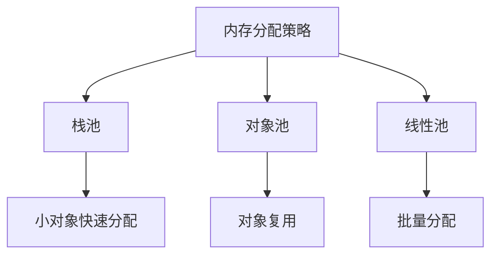

**本节来源**  
- [org_design_doc.md](file://org_design_doc.md#L50-L100)
- [README.md](file://README.md#L200-L250)

## 常见问题排查

### 编译问题
确保使用支持C++20的编译器，并正确配置CMake选项。

```bash
# 使用CMake构建
cmake .. -DCMAKE_CXX_STANDARD=20 -DBUILD_EXAMPLES=ON
cmake --build . --config Release
```

### 解析失败
检查输入数据的有效性，确保数据包完整且格式正确。

```cpp
// 启用调试模式
context.debug_mode = true;

// 检查解析状态
if (result.status != ParseStatus::Complete) {
    switch (result.status) {
        case ParseStatus::NeedMoreData:
            std::cerr << "需要更多数据" << std::endl;
            break;
        case ParseStatus::ParseError:
            std::cerr << "解析错误" << std::endl;
            break;
        case ParseStatus::ChecksumError:
            std::cerr << "校验和错误" << std::endl;
            break;
        default:
            std::cerr << "未知错误" << std::endl;
    }
}
```

### 性能问题
启用SIMD优化，使用适当的编译器优化选项。

```bash
# GCC/Clang优化选项
-O3 -march=native -DNDEBUG

# MSVC优化选项
/O2 /arch:AVX2 /DNDEBUG
```

**本节来源**  
- [README.md](file://README.md#L400-L500)
- [org_design_doc.md](file://org_design_doc.md#L300-L350)

## 结论
本协议解析库提供了对MQTT、WebSocket和gRPC等现代应用协议的完整支持，具备高性能、模块化和易扩展的特点。通过零拷贝设计、SIMD加速和高效的内存管理，库能够高效处理大规模网络流量。开发者可以利用统一的API接口轻松集成这些解析功能，满足各种网络分析和监控需求。