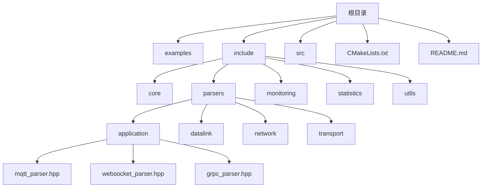
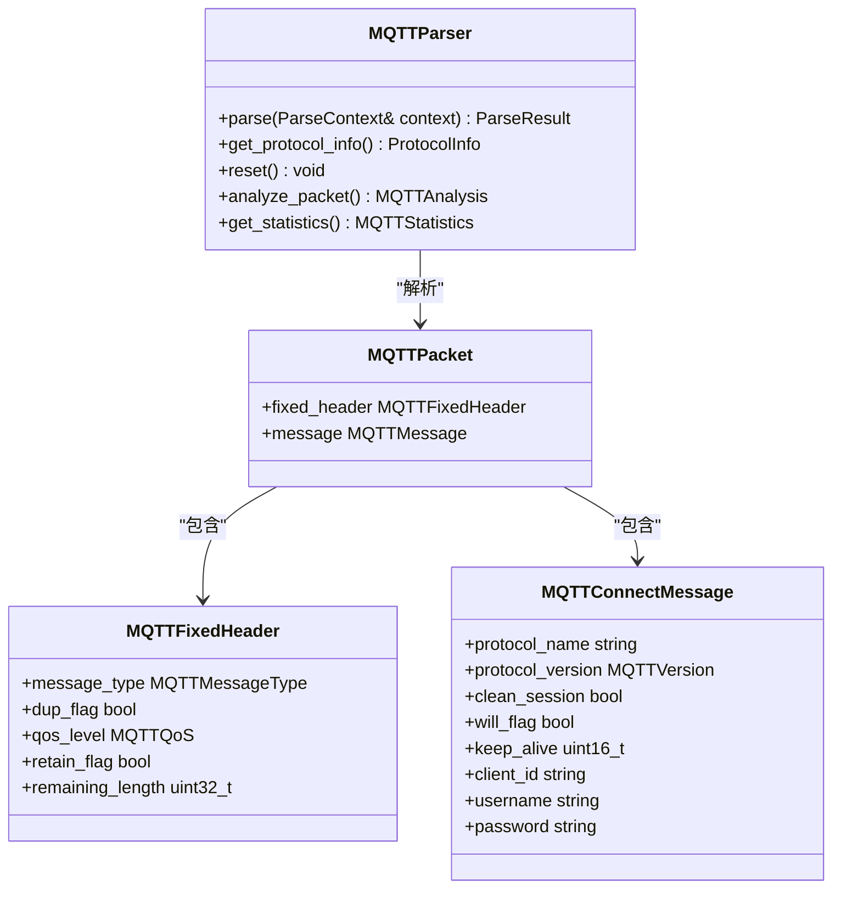
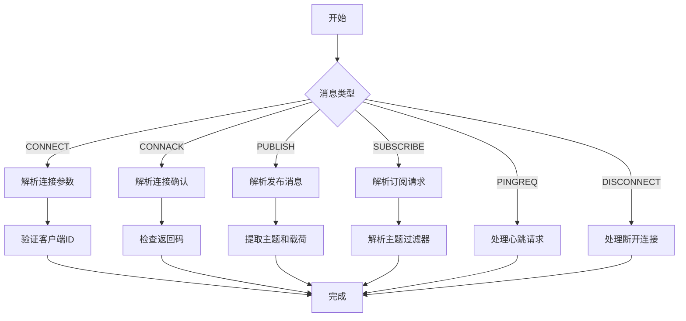
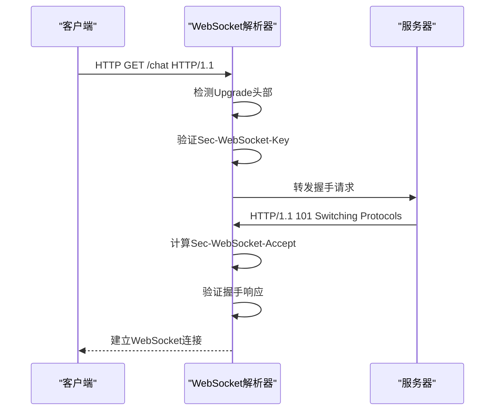
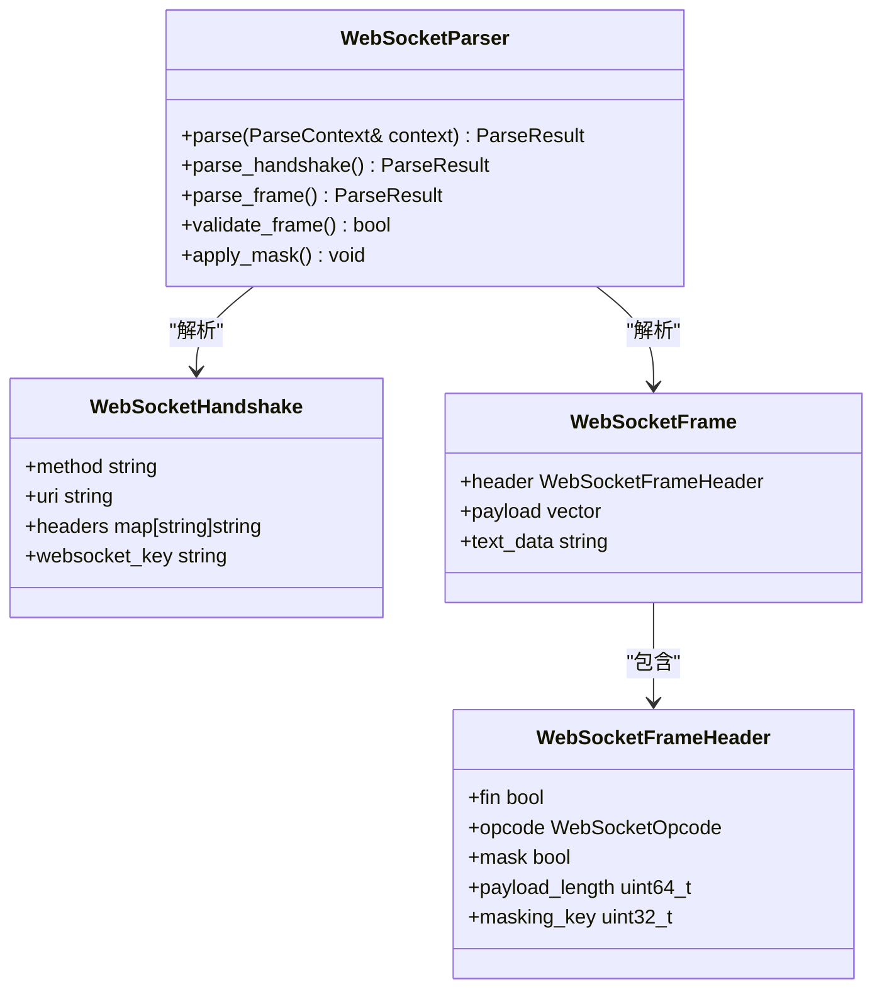
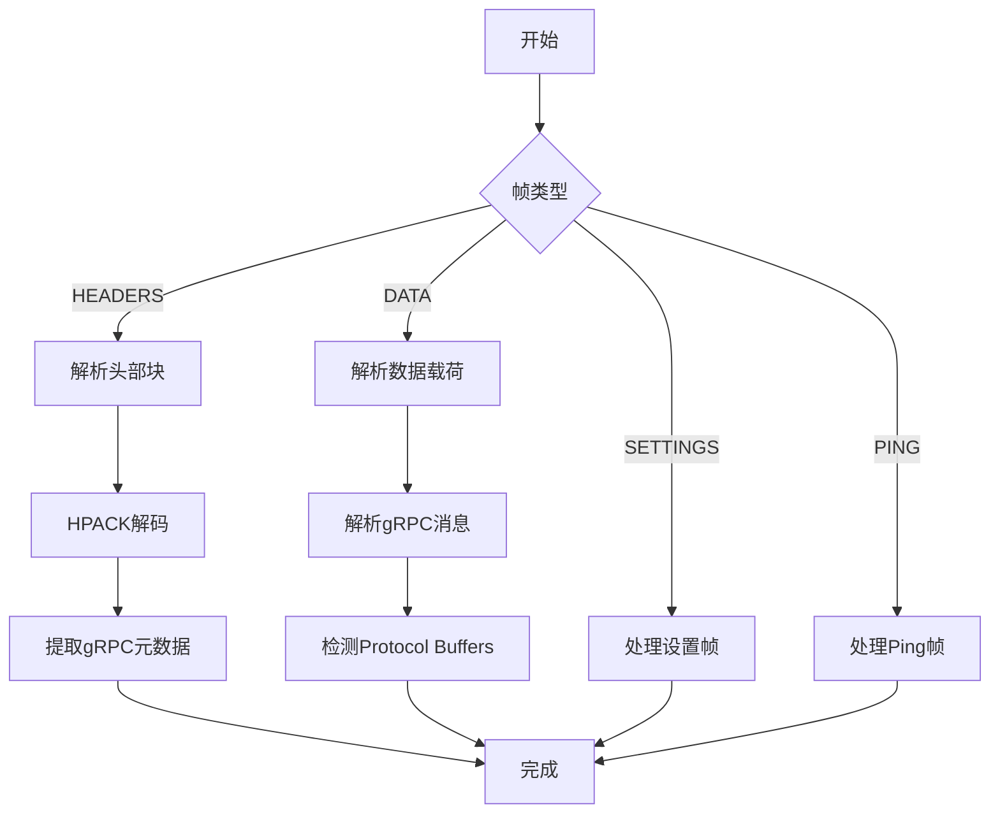
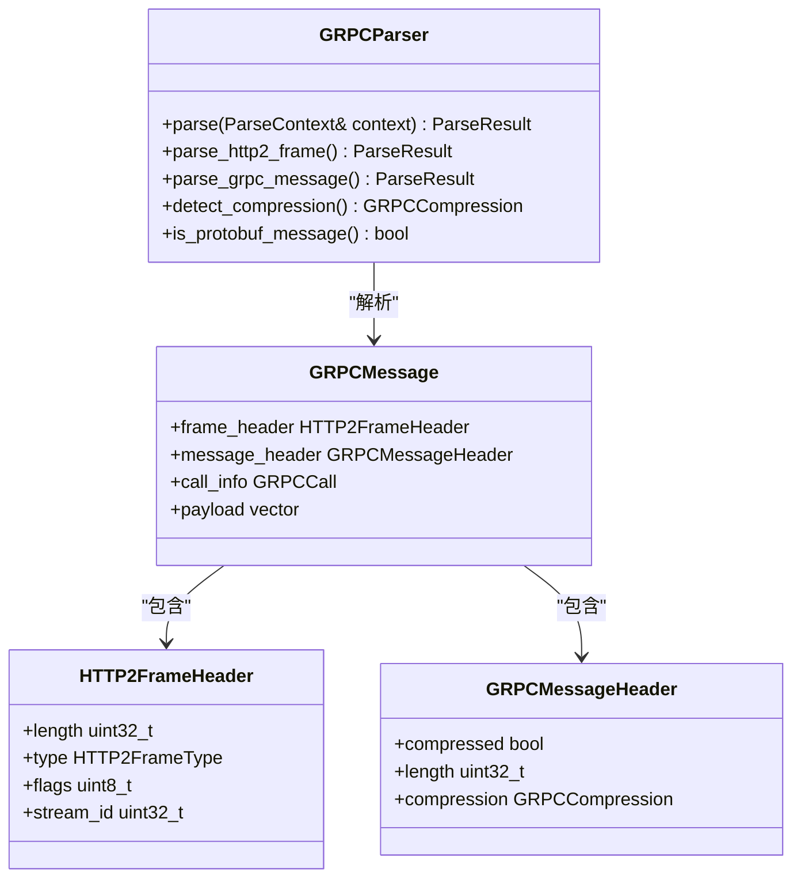
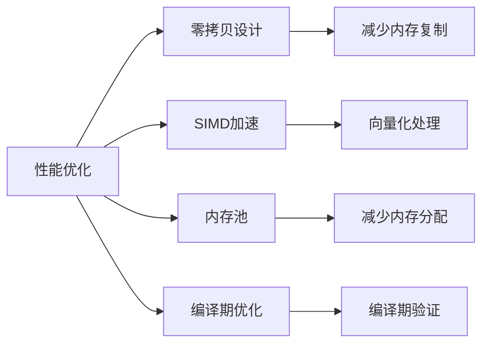
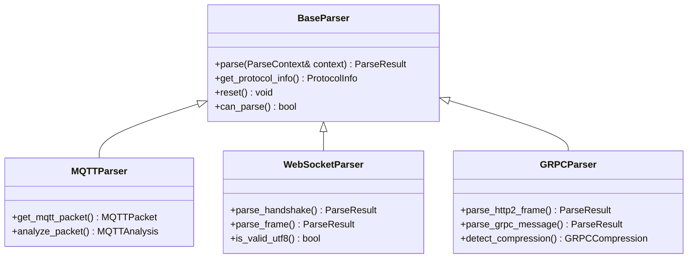

# 现代应用协议解析器

<cite>
**本文档引用文件**  
- [mqtt_parser.hpp](file://include/parsers/application/mqtt_parser.hpp)
- [websocket_parser.hpp](file://include/parsers/application/websocket_parser.hpp)
- [grpc_parser.hpp](file://include/parsers/application/grpc_parser.hpp)
- [mqtt_parser.cpp](file://src/parsers/application/mqtt_parser.cpp)
- [websocket_parser.cpp](file://src/parsers/application/websocket_parser.cpp)
- [grpc_parser.cpp](file://src/parsers/application/grpc_parser.cpp)
- [README.md](file://README.md)
- [org_design_doc.md](file://org_design_doc.md)
</cite>

## 目录
1. [简介](#简介)
2. [项目结构](#项目结构)
3. [核心组件](#核心组件)
4. [MQTT协议解析器](#mqtt协议解析器)
5. [WebSocket协议解析器](#websocket协议解析器)
6. [gRPC协议解析器](#grpc协议解析器)
7. [性能特征](#性能特征)
8. [安全注意事项](#安全注意事项)
9. [API接口与配置](#api接口与配置)
10. [结论](#结论)

## 简介
本文档详细介绍了现代应用协议解析器的实现，重点涵盖MQTT 3.1/3.1.1/5.0、WebSocket RFC 6455和gRPC基于HTTP/2与Protocol Buffers的解析机制。该解析器库基于C++20构建，采用零拷贝设计，支持SIMD加速，具有高性能、模块化和类型安全的特点。解析器支持从数据链路层到传输层的完整协议栈解析，并提供实时流量捕获和分析功能。

**Section sources**
- [README.md](file://README.md#L1-L50)
- [org_design_doc.md](file://org_design_doc.md#L1-L50)

## 项目结构
项目采用分层架构设计，包含核心组件、协议解析器、性能监控和工具模块。解析器按协议层次组织，包括数据链路层、网络层、传输层和应用层。应用层解析器支持MQTT、WebSocket、gRPC等现代应用协议。项目使用CMake构建系统，支持跨平台编译。

**Diagram sources**
- [README.md](file://README.md#L100-L150)
- [project_structure](file://project_structure#L1-L20)

**Section sources**
- [README.md](file://README.md#L100-L150)

## 核心组件
核心组件包括BufferView零拷贝缓冲区、BaseParser基类和ParseContext解析上下文。BufferView提供高效的数据访问和SIMD加速查找功能。BaseParser定义了所有协议解析器的统一接口。ParseContext用于存储解析过程中的元数据和状态信息。

**Section sources**
- [README.md](file://README.md#L200-L300)

## MQTT协议解析器

### 协议支持
MQTT解析器支持MQTT 3.1、3.1.1和5.0版本，能够解析所有标准消息类型，包括CONNECT、PUBLISH、SUBSCRIBE等。解析器实现了完整的MQTT协议状态机，支持QoS等级0-2的消息处理。

**Diagram sources**
- [mqtt_parser.hpp](file://include/parsers/application/mqtt_parser.hpp#L1-L100)
- [mqtt_parser.cpp](file://src/parsers/application/mqtt_parser.cpp#L1-L50)

### 消息类型解析
MQTT解析器支持15种消息类型，包括控制消息和数据消息。每种消息类型都有专门的解析方法，确保协议合规性和数据完整性。

**Diagram sources**
- [mqtt_parser.hpp](file://include/parsers/application/mqtt_parser.hpp#L150-L300)
- [mqtt_parser.cpp](file://src/parsers/application/mqtt_parser.cpp#L100-L200)

**Section sources**
- [mqtt_parser.hpp](file://include/parsers/application/mqtt_parser.hpp#L1-L679)
- [mqtt_parser.cpp](file://src/parsers/application/mqtt_parser.cpp#L1-L498)

## WebSocket协议解析器

### 握手解析机制
WebSocket解析器实现了完整的RFC 6455握手协议解析，能够识别HTTP升级请求并验证WebSocket连接参数。解析器支持子协议和扩展的检测与处理。

**Diagram sources**
- [websocket_parser.hpp](file://include/parsers/application/websocket_parser.hpp#L1-L50)
- [websocket_parser.cpp](file://src/parsers/application/websocket_parser.cpp#L1-L100)

### 帧解析机制
WebSocket解析器支持所有帧类型解析，包括文本帧、二进制帧和控制帧。解析器实现了掩码处理、UTF-8验证和分片消息重组功能。

**Diagram sources**
- [websocket_parser.hpp](file://include/parsers/application/websocket_parser.hpp#L50-L150)
- [websocket_parser.cpp](file://src/parsers/application/websocket_parser.cpp#L100-L200)

**Section sources**
- [websocket_parser.hpp](file://include/parsers/application/websocket_parser.hpp#L1-L337)
- [websocket_parser.cpp](file://src/parsers/application/websocket_parser.cpp#L1-L620)

## gRPC协议解析器

### HTTP/2基础解析
gRPC解析器基于HTTP/2协议栈，能够解析所有HTTP/2帧类型。解析器实现了连接前导检测、帧头部解析和流控制分析功能。

**Diagram sources**
- [grpc_parser.hpp](file://include/parsers/application/grpc_parser.hpp#L1-L50)
- [grpc_parser.cpp](file://src/parsers/application/grpc_parser.cpp#L1-L100)

### Protocol Buffers解析
gRPC解析器集成了Protocol Buffers消息检测功能，能够识别和解析序列化的gRPC消息。解析器支持多种压缩算法检测和流式RPC分析。

**Diagram sources**
- [grpc_parser.hpp](file://include/parsers/application/grpc_parser.hpp#L50-L150)
- [grpc_parser.cpp](file://src/parsers/application/grpc_parser.cpp#L100-L200)

**Section sources**
- [grpc_parser.hpp](file://include/parsers/application/grpc_parser.hpp#L1-L380)
- [grpc_parser.cpp](file://src/parsers/application/grpc_parser.cpp#L1-L593)

## 性能特征
解析器库采用多项性能优化技术，包括零拷贝设计、SIMD加速和内存池管理。基准测试显示，单核处理能力可达10M包/秒，延迟低于100微秒。

**Diagram sources**
- [org_design_doc.md](file://org_design_doc.md#L100-L150)
- [README.md](file://README.md#L400-L450)

**Section sources**
- [org_design_doc.md](file://org_design_doc.md#L100-L200)
- [README.md](file://README.md#L400-L500)

## 安全注意事项
解析器实现了多项安全检查机制，包括输入验证、缓冲区溢出防护和协议合规性检查。对于MQTT协议，解析器验证客户端ID和主题名称的合法性。对于WebSocket协议，解析器执行UTF-8编码验证和掩码检查。对于gRPC协议，解析器检测恶意压缩和无效帧。

**Section sources**
- [mqtt_parser.cpp](file://src/parsers/application/mqtt_parser.cpp#L400-L450)
- [websocket_parser.cpp](file://src/parsers/application/websocket_parser.cpp#L500-L550)
- [grpc_parser.cpp](file://src/parsers/application/grpc_parser.cpp#L500-L550)

## API接口与配置
解析器提供统一的API接口，所有解析器都继承自BaseParser基类。配置选项通过编译时定义和运行时参数两种方式提供。用户可以通过CMake选项启用或禁用特定功能。

**Diagram sources**
- [base_parser.hpp](file://include/parsers/base_parser.hpp#L1-L50)
- [mqtt_parser.hpp](file://include/parsers/application/mqtt_parser.hpp#L1-L50)
- [websocket_parser.hpp](file://include/parsers/application/websocket_parser.hpp#L1-L50)
- [grpc_parser.hpp](file://include/parsers/application/grpc_parser.hpp#L1-L50)

**Section sources**
- [README.md](file://README.md#L200-L300)
- [org_design_doc.md](file://org_design_doc.md#L200-L300)

## 结论
现代应用协议解析器提供了一套完整的解决方案，用于解析MQTT、WebSocket和gRPC等现代应用协议。通过采用C++20特性和零拷贝设计，解析器实现了高性能和高可靠性。模块化架构使得扩展新协议变得简单，而丰富的API接口和配置选项为用户提供了灵活的使用方式。