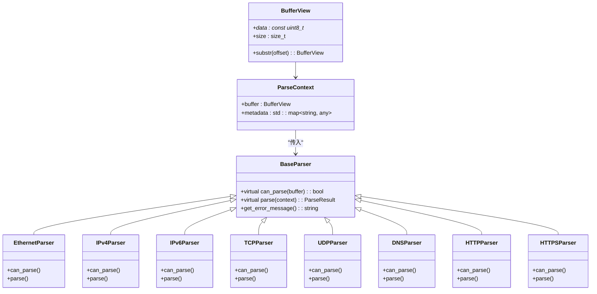

# 实时数据包捕获示例详解

<cite>
**本文档引用文件**  
- [live_capture.cpp](file://examples/live_capture.cpp)
- [buffer_view.hpp](file://include/core/buffer_view.hpp)
- [ethernet_parser.hpp](file://include/parsers/datalink/ethernet_parser.hpp)
- [ipv4_parser.hpp](file://include/parsers/network/ipv4_parser.hpp)
- [ipv6_parser.hpp](file://include/parsers/network/ipv6_parser.hpp)
- [tcp_parser.hpp](file://include/parsers/transport/tcp_parser.hpp)
- [udp_parser.hpp](file://include/parsers/transport/udp_parser.hpp)
- [dns_parser.hpp](file://include/parsers/application/dns_parser.hpp)
- [http_parser.hpp](file://include/parsers/application/http_parser.hpp)
- [https_parser.hpp](file://include/parsers/application/https_parser.hpp)
- [pcap.h](file://examples/lib/npcap-sdk-1.15/Include/pcap/pcap.h)
</cite>

## 目录
1. [引言](#引言)
2. [项目结构](#项目结构)
3. [核心组件](#核心组件)
4. [架构概述](#架构概述)
5. [详细组件分析](#详细组件分析)
6. [依赖分析](#依赖分析)
7. [性能考虑](#性能考虑)
8. [故障排除指南](#故障排除指南)
9. [结论](#结论)

## 引言
本文档详细解析 `live_capture.cpp` 的实现机制，重点描述如何通过 Npcap SDK 与 `protocol_praser` 库协同工作，实现从网络接口实时捕获数据包并进行即时解析的完整流程。涵盖数据包捕获配置、缓冲区管理、零拷贝传递至解析器的实现方式，以及实时解析过程中的错误处理与性能监控策略。通过实际代码分析，展示如何处理连续数据流、维护解析状态并输出动态结果。同时提供运行该示例所需的权限要求、网络接口选择方法及典型应用场景。

## 项目结构
本项目采用模块化设计，分为示例程序、头文件和源文件三大主要部分。`examples` 目录包含使用 Npcap SDK 的实时捕获示例，`include` 和 `src` 分别存放协议解析库的接口与实现。

```mermaid
graph TB
subgraph "示例"
live_capture["live_capture.cpp"]
lib_npcap["lib\\npcap-sdk-1.15"]
end
subgraph "头文件"
core["core"]
parsers["parsers"]
detection["detection"]
monitoring["monitoring"]
statistics["statistics"]
utils["utils"]
end
subgraph "源文件"
src_core["core"]
src_parsers["parsers"]
src_detection["detection"]
src_monitoring["monitoring"]
src_statistics["statistics"]
src_utils["utils"]
end
live_capture --> lib_npcap : "使用"
live_capture --> core : "包含"
live_capture --> parsers : "包含"
src_parsers --> parsers : "实现"
```

**图示来源**  
- [live_capture.cpp](file://examples/live_capture.cpp#L1-L50)
- [CMakeLists.txt](file://CMakeLists.txt#L1-L20)

## 核心组件
`live_capture.cpp` 是一个完整的实时网络数据包捕获与解析示例，其核心功能包括：
- 使用 Npcap SDK 打开指定网络接口进行数据包捕获
- 通过回调函数 `packet_handler` 接收每一个捕获的数据包
- 利用 `protocol_praser` 库逐层解析以太网、IP、传输层和应用层协议
- 实时输出结构化数据包信息，并将原始数据保存为 `.pcap` 文件
- 支持按 Ctrl+C 中断捕获并输出统计摘要

该程序通过全局变量 `g_running` 和信号处理函数 `signal_handler` 实现优雅退出，确保资源正确释放。

**本节来源**  
- [live_capture.cpp](file://examples/live_capture.cpp#L25-L100)

## 架构概述
系统采用分层解析架构，结合 Npcap 的底层捕获能力与自定义协议解析库的高层语义分析能力。


**图示来源**  
- [live_capture.cpp](file://examples/live_capture.cpp#L150-L700)
- [pcap.h](file://examples/lib/npcap-sdk-1.15/Include/pcap/pcap.h#L100-L200)

## 详细组件分析

### 数据包捕获与回调机制
程序通过 `pcap_open_live` 打开指定网络设备，设置最大捕获长度为 65536 字节，启用混杂模式，并设置 1000ms 超时。捕获循环由 `pcap_loop` 启动，接收数据包后调用 `packet_handler` 回调函数。


**图示来源**  
- [live_capture.cpp](file://examples/live_capture.cpp#L550-L650)
- [pcap.h](file://examples/lib/npcap-sdk-1.15/Include/pcap/pcap.h#L300-L400)

### 协议分层解析流程
程序实现了一个递归分层解析模型，从以太网帧开始，根据类型字段逐层向下解析。

#### 分层解析类图


**图示来源**  
- [buffer_view.hpp](file://include/core/buffer_view.hpp#L10-L50)
- [base_parser.hpp](file://include/parsers/base_parser.hpp#L15-L80)
- [live_capture.cpp](file://examples/live_capture.cpp#L200-L500)

### 零拷贝与缓冲区管理
程序通过 `BufferView` 结构实现零拷贝传递。该结构仅包含指向原始数据的指针和长度，通过 `substr` 方法创建子视图，避免内存复制。每一层解析器接收 `BufferView` 并返回解析结果，元数据通过 `ParseContext` 中的 `metadata` 字典传递。

```mermaid
flowchart TD
A[原始数据包] --> B[BufferView]
B --> C[EthernetParser]
C --> D[提取 EtherType]
D --> E[BufferView.substr(eth_header_size)]
E --> F[IPv4Parser]
F --> G[提取 Protocol]
G --> H[BufferView.substr(ip_header_size)]
H --> I[TCPParser]
I --> J[提取端口]
J --> K[BufferView.substr(tcp_header_size)]
K --> L[应用层解析]
```

**图示来源**  
- [buffer_view.hpp](file://include/core/buffer_view.hpp#L1-L30)
- [live_capture.cpp](file://examples/live_capture.cpp#L300-L450)

### 错误处理与性能监控
程序通过全局 `PacketStats` 结构体收集统计信息，包括各协议数据包数量、端口分布、IP 地址访问频率等。所有解析操作均包裹在 `try-catch` 块中，捕获异常并记录到 `parse_errors` 计数器。信号处理函数 `signal_handler` 确保程序可被优雅终止。


**图示来源**  
- [live_capture.cpp](file://examples/live_capture.cpp#L100-L200)
- [live_capture.cpp](file://examples/live_capture.cpp#L600-L650)

## 依赖分析
程序依赖 Npcap SDK 提供底层数据包捕获能力，并依赖 `protocol_praser` 库提供协议解析功能。


**图示来源**  
- [live_capture.cpp](file://examples/live_capture.cpp#L1-L50)
- [CMakeLists.txt](file://examples/CMakeLists.txt#L1-L10)

## 性能考虑
程序在设计上注重性能优化：
- 使用零拷贝 `BufferView` 避免内存复制
- 通过 `pcap_open_live` 设置大缓冲区（65536 字节）减少丢包
- 解析流程采用短路判断，仅在端口匹配时尝试应用层解析
- 统计信息使用 `std::map` 和 `std::vector` 高效聚合
- 输出采用 `std::cout` 直接打印，避免中间缓冲

在高流量场景下，建议降低输出详细度或启用异步日志以减少 I/O 开销。

## 故障排除指南
常见问题及解决方案：

| 问题 | 原因 | 解决方案 |
|------|------|----------|
| 无法打开设备 | 权限不足或设备不存在 | 以管理员身份运行，确认设备编号正确 |
| 捕获不到数据包 | 网络接口未活动 | 选择正确的网络接口，确保有流量 |
| 解析错误过多 | 数据包损坏或协议不支持 | 检查网络环境，确认协议支持范围 |
| 程序崩溃 | 内存访问越界 | 检查解析器边界检查逻辑 |
| 保存 pcap 失败 | 文件权限或路径问题 | 检查当前目录写权限 |

**本节来源**  
- [live_capture.cpp](file://examples/live_capture.cpp#L50-L100)
- [live_capture.cpp](file://examples/live_capture.cpp#L650-L700)

## 结论
`live_capture.cpp` 展示了一个完整的实时网络数据包捕获与解析系统。通过 Npcap SDK 与自定义协议解析库的协同工作，实现了从物理层到应用层的全栈解析。程序结构清晰，采用分层解析、零拷贝传递、实时统计等关键技术，具备良好的可扩展性和实用性。适用于网络监控、协议分析、安全审计等场景。建议在生产环境中结合多线程和异步 I/O 进一步提升性能。