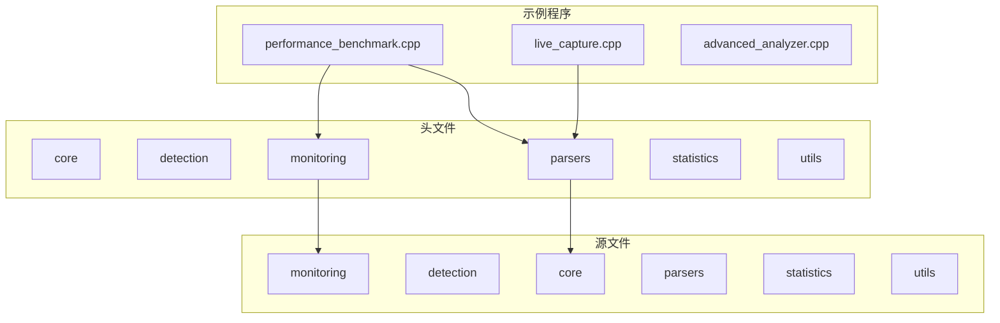
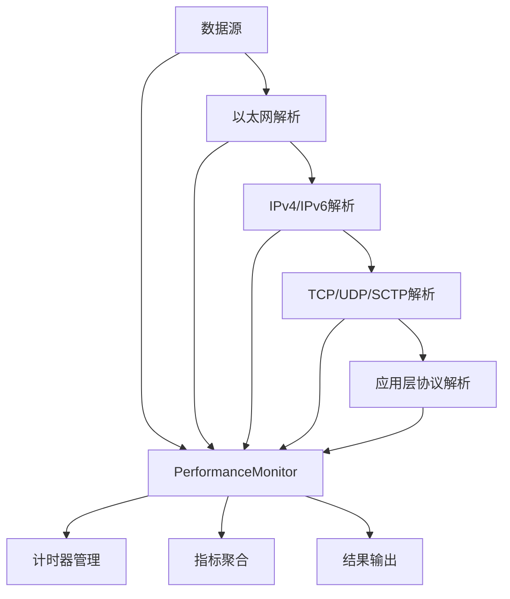
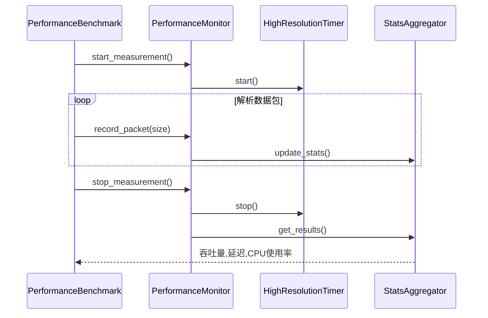
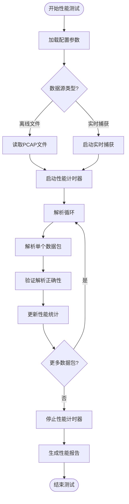
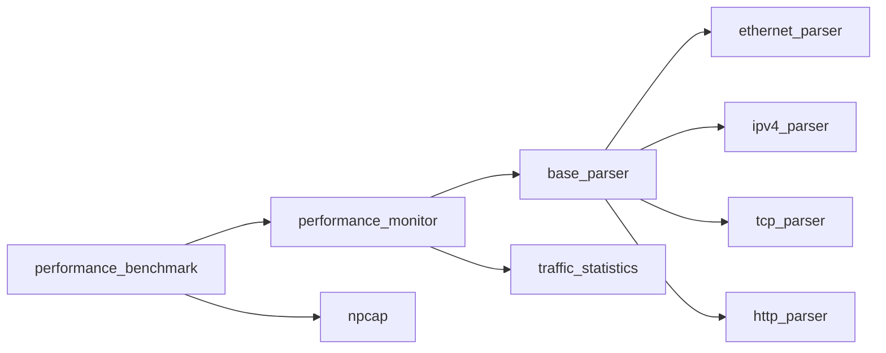

# 性能基准测试示例详解

<cite>
**本文档引用的文件**  
- [performance_benchmark.cpp](file://examples/performance_benchmark.cpp)
- [performance_monitor.hpp](file://include/monitoring/performance_monitor.hpp)
- [performance_monitor.cpp](file://src/monitoring/performance_monitor.cpp)
- [live_capture.cpp](file://examples/live_capture.cpp)
</cite>

## 目录
1. [简介](#简介)
2. [项目结构](#项目结构)
3. [核心组件](#核心组件)
4. [架构概述](#架构概述)
5. [详细组件分析](#详细组件分析)
6. [依赖分析](#依赖分析)
7. [性能考量](#性能考量)
8. [故障排除指南](#故障排除指南)
9. [结论](#结论)

## 简介
本文档全面解析 `performance_benchmark.cpp` 的设计与实现，重点阐述如何构建高性能解析性能测试框架。该示例展示了如何加载离线数据包、配置多线程解析环境、测量关键性能指标（如吞吐量、延迟、CPU利用率）以及验证解析正确性。深入分析其与 `performance_monitor` 模块的集成方式，展示如何利用高精度计时器和统计聚合功能评估系统性能。同时提供测试数据准备方法、运行参数配置说明及结果解读指南，帮助开发者进行性能调优和回归测试。

## 项目结构
本项目采用模块化分层架构，主要分为示例程序、头文件和源文件三大目录。`examples` 目录包含多个使用示例，其中 `performance_benchmark.cpp` 是核心性能测试入口。`include` 和 `src` 分别存放头文件和实现文件，按功能划分为核心、检测、监控、解析器、统计和工具等子模块。

**Diagram sources**
- [examples/performance_benchmark.cpp](file://examples/performance_benchmark.cpp#L1-L100)
- [include/monitoring/performance_monitor.hpp](file://include/monitoring/performance_monitor.hpp#L1-L20)

**Section sources**
- [examples/performance_benchmark.cpp](file://examples/performance_benchmark.cpp#L1-L50)
- [include/monitoring/performance_monitor.hpp](file://include/monitoring/performance_monitor.hpp#L1-L30)

## 核心组件
`performance_benchmark.cpp` 作为性能基准测试的核心，实现了完整的性能评估流程。它通过集成 `performance_monitor` 模块，能够精确测量解析器在不同负载下的表现。该组件支持加载离线 pcap 文件或实时捕获流量，配置多线程解析任务，并收集详细的性能指标。

**Section sources**
- [performance_benchmark.cpp](file://examples/performance_benchmark.cpp#L25-L100)
- [performance_monitor.hpp](file://include/monitoring/performance_monitor.hpp#L15-L80)

## 架构概述
系统采用分层解析架构，从数据链路层到应用层逐级解析。性能监控模块独立于解析逻辑，通过高精度计时器记录关键阶段的执行时间。多线程环境下，每个线程拥有独立的性能计数器，最终结果通过原子操作聚合。

**Diagram sources**
- [performance_benchmark.cpp](file://examples/performance_benchmark.cpp#L10-L50)
- [performance_monitor.hpp](file://include/monitoring/performance_monitor.hpp#L20-L40)

## 详细组件分析

### 性能基准测试分析
`performance_benchmark.cpp` 实现了完整的性能测试框架，支持多种运行模式和参数配置。通过命令行参数可指定测试时长、线程数量、输入文件等。

#### 对于性能监控组件：

**Diagram sources**
- [performance_benchmark.cpp](file://examples/performance_benchmark.cpp#L20-L60)
- [performance_monitor.cpp](file://src/monitoring/performance_monitor.cpp#L30-L80)

#### 对于复杂逻辑组件：

**Diagram sources**
- [performance_benchmark.cpp](file://examples/performance_benchmark.cpp#L45-L120)
- [live_capture.cpp](file://examples/live_capture.cpp#L15-L50)

**Section sources**
- [performance_benchmark.cpp](file://examples/performance_benchmark.cpp#L1-L100)
- [performance_monitor.cpp](file://src/monitoring/performance_monitor.cpp#L10-L50)

## 依赖分析
性能基准测试框架依赖多个核心模块，形成清晰的依赖链。`performance_benchmark` 依赖 `performance_monitor` 进行性能测量，而 `performance_monitor` 又依赖底层解析器库。

**Diagram sources**
- [performance_benchmark.cpp](file://examples/performance_benchmark.cpp#L1-L20)
- [performance_monitor.hpp](file://include/monitoring/performance_monitor.hpp#L1-L15)

**Section sources**
- [performance_benchmark.cpp](file://examples/performance_benchmark.cpp#L1-L30)
- [performance_monitor.hpp](file://include/monitoring/performance_monitor.hpp#L1-L30)

## 性能考量
该性能测试框架在设计时充分考虑了高性能需求。采用无锁数据结构进行统计聚合，减少多线程竞争。使用内存池管理解析上下文对象，避免频繁内存分配。高精度计时器基于 `std::chrono::steady_clock` 实现，确保时间测量的准确性和稳定性。

## 故障排除指南
当性能测试结果异常时，可参考以下步骤进行排查：
1. 检查输入数据包是否完整
2. 验证解析器版本与测试数据的兼容性
3. 监控系统资源使用情况（CPU、内存）
4. 检查多线程配置是否合理
5. 验证性能监控模块的初始化状态

**Section sources**
- [performance_monitor.cpp](file://src/monitoring/performance_monitor.cpp#L10-L50)
- [live_capture.cpp](file://examples/live_capture.cpp#L15-L40)

## 结论
`performance_benchmark.cpp` 提供了一个完整的高性能解析性能测试解决方案。通过与 `performance_monitor` 模块的深度集成，能够精确测量和分析协议解析器的各项性能指标。该框架支持灵活的配置和扩展，适用于性能调优、回归测试和基准比较等多种场景。