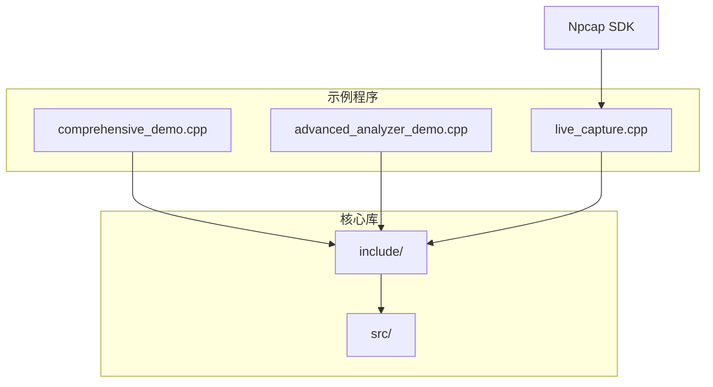
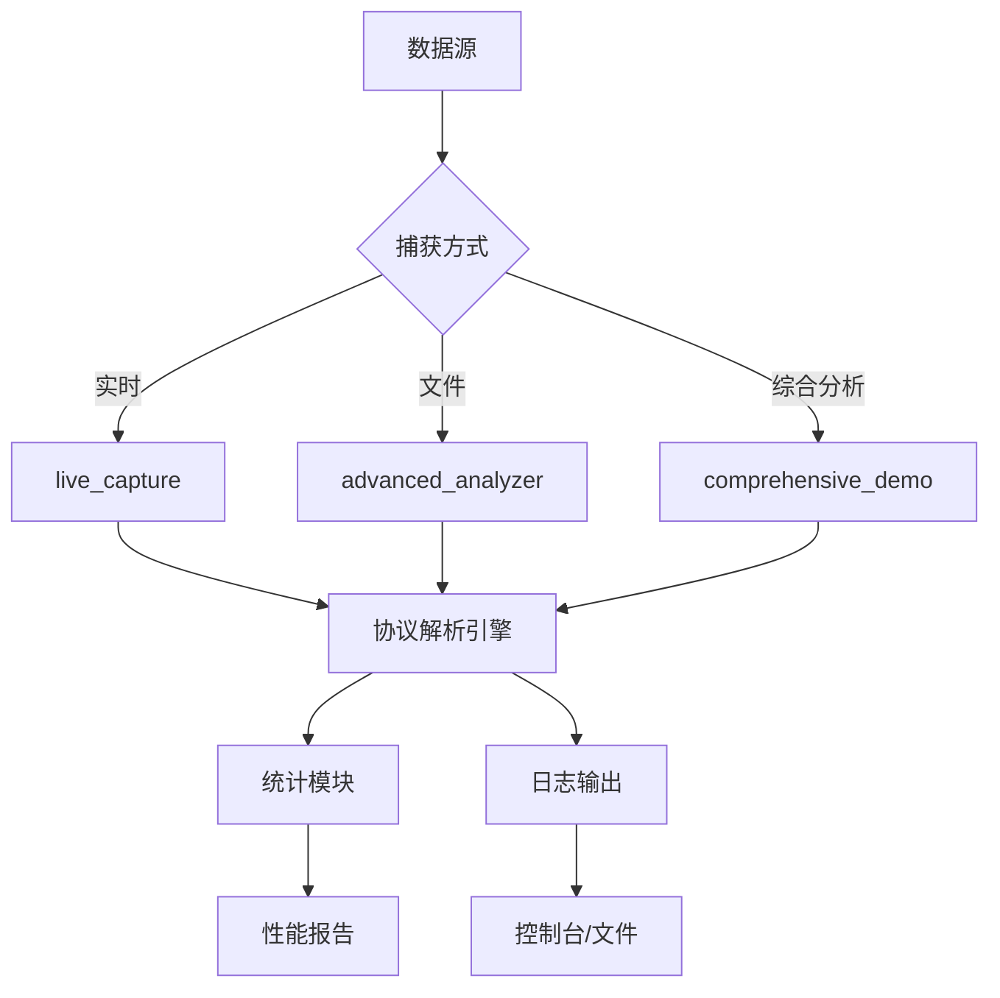
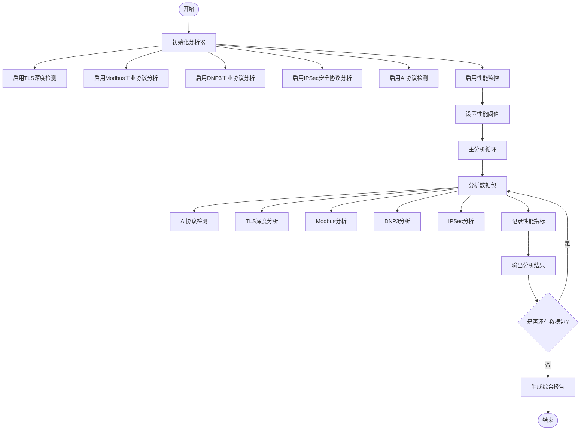
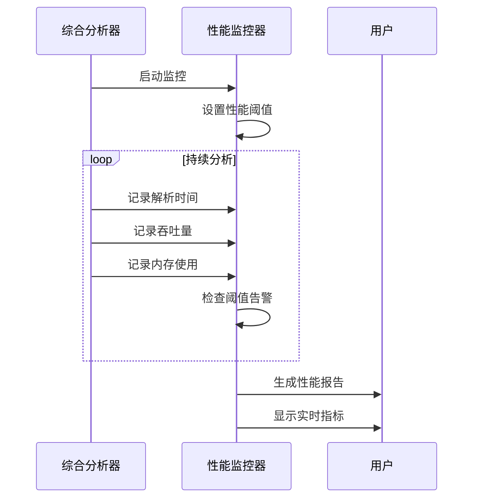
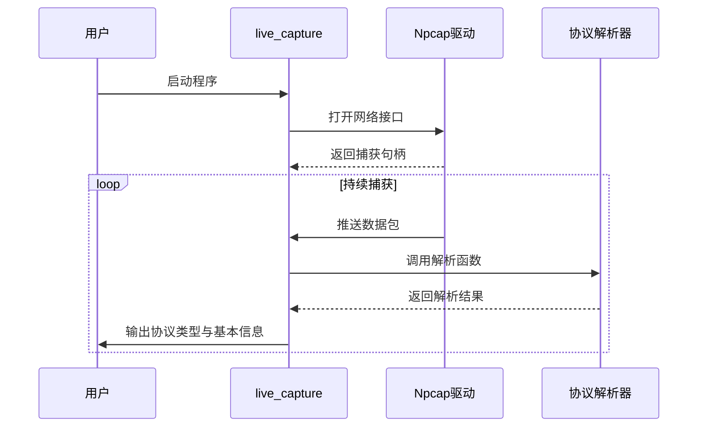
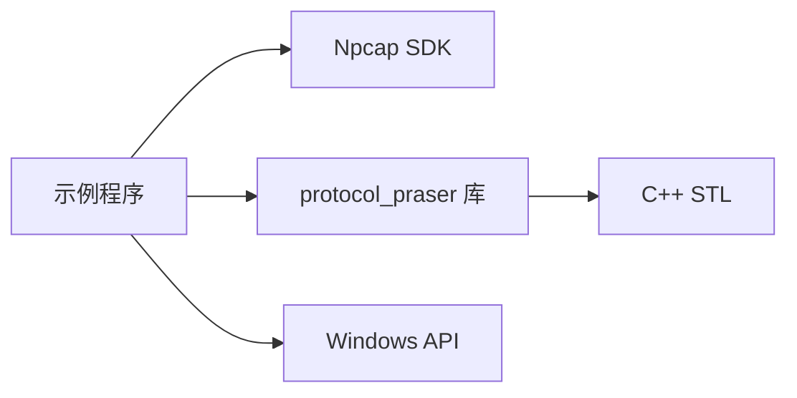

# 示例程序详解

<cite>
**本文档中引用的文件**  
- [comprehensive_demo.cpp](file://examples/comprehensive_demo.cpp) - *新增的综合示例程序*
- [advanced_analyzer_demo.cpp](file://examples/advanced_analyzer_demo.cpp) - *高级分析器示例*
- [live_capture.cpp](file://examples/live_capture.cpp) - *实时捕获示例*
- [CMakeLists.txt](file://examples/CMakeLists.txt) - *示例程序构建配置*
- [performance_monitor.hpp](file://include/monitoring/performance_monitor.hpp) - *性能监控器头文件*
- [performance_monitor.cpp](file://src/monitoring/performance_monitor.cpp) - *性能监控器实现*
- [tls_deep_inspector.hpp](file://include/parsers/security/tls_deep_inspector.hpp) - *TLS深度检测器*
- [modbus_deep_analyzer.hpp](file://include/parsers/industrial/modbus_deep_analyzer.hpp) - *Modbus深度分析器*
- [dnp3_deep_analyzer.hpp](file://include/parsers/industrial/dnp3_deep_analyzer.hpp) - *DNP3深度分析器*
- [ipsec_deep_analyzer.hpp](file://include/parsers/security/ipsec_deep_analyzer.hpp) - *IPSec深度分析器*
- [protocol_detector.hpp](file://include/ai/protocol_detector.hpp) - *AI协议检测器*
</cite>

## 更新摘要
**变更内容**  
- 新增了对 `comprehensive_demo.cpp` 综合示例程序的详细说明
- 更新了项目结构和架构概览以包含新的综合分析器
- 新增了"综合协议分析器"章节，详细解析新示例程序的实现逻辑
- 更新了依赖分析和性能考量部分以反映新功能
- 修正了现有示例程序的文件名引用

## 目录
1. [简介](#简介)
2. [项目结构](#项目结构)
3. [核心组件](#核心组件)
4. [架构概览](#架构概览)
5. [详细组件分析](#详细组件分析)
6. [依赖分析](#依赖分析)
7. [性能考量](#性能考量)
8. [故障排除指南](#故障排除指南)
9. [结论](#结论)

## 简介
本文档旨在全面解析 `examples` 目录下的示例程序，包括 `advanced_analyzer_demo.cpp`（高级流量分析）、`live_capture.cpp`（实时数据包捕获）、`comprehensive_demo.cpp`（综合协议分析）等。通过逐个讲解其设计逻辑、构建方式、运行参数与预期输出，揭示如何在实际项目中集成 `protocol_praser` 库，展示从 Npcap 捕获数据包到协议解析再到结果输出的完整工作流。

## 项目结构
`examples` 目录包含多个示例程序，分别用于演示不同场景下的协议解析能力。这些程序依赖于 `include` 和 `src` 目录中的核心库模块，并通过 CMake 构建系统进行编译。示例程序展示了库的典型使用模式，包括实时捕获、深度协议分析和性能评估。

**图示来源**  
- [comprehensive_demo.cpp](file://examples/comprehensive_demo.cpp)
- [advanced_analyzer_demo.cpp](file://examples/advanced_analyzer_demo.cpp)
- [live_capture.cpp](file://examples/live_capture.cpp)
- [CMakeLists.txt](file://examples/CMakeLists.txt)

**本节来源**  
- [examples](file://examples)
- [include](file://include)
- [src](file://src)

## 核心组件
各示例程序共享以下核心功能模块：
- **协议检测引擎**：基于 `protocol_detection.hpp` 实现多层协议识别。
- **解析器基类**：`base_parser.hpp` 提供统一接口，支持扩展应用层、传输层、网络层和数据链路层解析器。
- **流量统计模块**：`traffic_statistics.hpp` 用于收集和汇总网络流量信息。
- **网络工具集**：`network_utils.hpp` 提供 IP 地址转换、端口识别等辅助功能。

这些组件共同构成协议解析库的核心能力，被各示例程序调用以实现具体功能。

**本节来源**  
- [protocol_detection.hpp](file://include/detection/protocol_detection.hpp)
- [base_parser.hpp](file://include/parsers/base_parser.hpp)
- [traffic_statistics.hpp](file://include/statistics/traffic_statistics.hpp)
- [network_utils.hpp](file://include/utils/network_utils.hpp)

## 架构概览
整个示例系统的架构分为三层：捕获层、解析层和输出层。捕获层使用 Npcap 进行数据包获取；解析层调用 `protocol_praser` 库进行逐层协议解析；输出层负责将分析结果以结构化形式打印或记录。

**图示来源**  
- [comprehensive_demo.cpp](file://examples/comprehensive_demo.cpp)
- [advanced_analyzer_demo.cpp](file://examples/advanced_analyzer_demo.cpp)
- [live_capture.cpp](file://examples/live_capture.cpp)

## 详细组件分析

### 综合协议分析器（comprehensive_demo.cpp）
该程序是一个综合性的协议分析演示程序，集成了多种高级功能，包括TLS深度安全分析、Modbus和DNP3工业协议分析、IPSec安全协议分析以及AI智能协议检测。它还包含了实时性能监控和综合报告生成功能。

#### 主要特性

**图示来源**  
- [comprehensive_demo.cpp](file://examples/comprehensive_demo.cpp#L394-L702)

**本节来源**  
- [comprehensive_demo.cpp](file://examples/comprehensive_demo.cpp)

#### 实现逻辑分析
`ComprehensiveProtocolAnalyzer` 类是综合协议分析器的核心，它集成了多个深度分析器实例：

- **TLS深度检测器**：`tls_inspector_` 用于分析TLS/SSL加密流量，检测安全漏洞
- **Modbus深度分析器**：`modbus_analyzer_` 用于工业控制系统协议分析
- **DNP3深度分析器**：`dnp3_analyzer_` 用于电力系统协议分析
- **IPSec深度分析器**：`ipsec_analyzer_` 用于安全隧道协议分析
- **AI协议检测引擎**：`ai_detector_` 使用机器学习算法识别未知协议
- **性能监控器**：`performance_monitor_` 实时监控系统性能指标

分析流程首先进行AI协议检测，然后根据端口号和协议特征进行针对性的深度分析。每个分析器都会记录性能指标，用于后续的性能评估。

**本节来源**  
- [comprehensive_demo.cpp](file://examples/comprehensive_demo.cpp#L394-L702)
- [performance_monitor.hpp](file://include/monitoring/performance_monitor.hpp)
- [tls_deep_inspector.hpp](file://include/parsers/security/tls_deep_inspector.hpp)
- [modbus_deep_analyzer.hpp](file://include/parsers/industrial/modbus_deep_analyzer.hpp)
- [dnp3_deep_analyzer.hpp](file://include/parsers/industrial/dnp3_deep_analyzer.hpp)
- [ipsec_deep_analyzer.hpp](file://include/parsers/security/ipsec_deep_analyzer.hpp)
- [protocol_detector.hpp](file://include/ai/protocol_detector.hpp)

#### 性能监控功能
程序集成了强大的性能监控功能，通过 `PerformanceMonitor` 类实现：

**图示来源**  
- [comprehensive_demo.cpp](file://examples/comprehensive_demo.cpp#L500-L550)
- [performance_monitor.hpp](file://include/monitoring/performance_monitor.hpp)

**本节来源**  
- [comprehensive_demo.cpp](file://examples/comprehensive_demo.cpp)
- [performance_monitor.hpp](file://include/monitoring/performance_monitor.hpp)
- [performance_monitor.cpp](file://src/monitoring/performance_monitor.cpp)

### 高级流量分析器（advanced_analyzer_demo.cpp）
该程序用于对离线 pcap 文件进行深度协议分析。支持多层协议识别，包括 HTTP、DNS、FTP、SMTP 等应用层协议，并能提取关键字段如 URL、域名、邮件地址等。

#### 主要流程

**图示来源**  
- [advanced_analyzer_demo.cpp](file://examples/advanced_analyzer_demo.cpp)

**本节来源**  
- [advanced_analyzer_demo.cpp](file://examples/advanced_analyzer_demo.cpp)

### 实时数据包捕获（live_capture.cpp）
该程序实现网络接口的实时监听，持续捕获并解析经过的数据包。适用于网络监控、入侵检测等场景。

#### 实时捕获流程

**图示来源**  
- [live_capture.cpp](file://examples/live_capture.cpp)

**本节来源**  
- [live_capture.cpp](file://examples/live_capture.cpp)

## 依赖分析
示例程序依赖以下外部和内部组件：
- **Npcap SDK**：提供底层数据包捕获能力。
- **protocol_praser 核心库**：实现协议解析逻辑。
- **C++ STL**：用于容器、字符串处理等。
- **系统 API**：Windows 平台相关调用。

**图示来源**  
- [examples/CMakeLists.txt](file://examples/CMakeLists.txt)
- [include](file://include)
- [src](file://src)

**本节来源**  
- [CMakeLists.txt](file://examples/CMakeLists.txt)

## 性能考量
- `comprehensive_demo.cpp` 提供了全面的性能监控功能，可以实时跟踪解析时间、吞吐量和资源使用情况。
- 所有示例均采用零拷贝设计，通过 `buffer_view` 减少内存复制开销。
- 协议检测使用状态机模型，确保 O(n) 时间复杂度。
- 性能监控器实现了滑动窗口统计、百分位计算和实时告警功能。

## 故障排除指南
常见问题包括：
- Npcap 未安装导致捕获失败。
- 权限不足无法访问网络接口。
- pcap 文件格式不兼容。
- 解析器未正确注册导致协议识别失败。

建议检查日志输出、确认环境配置，并使用 `iflist.c` 示例验证网络接口状态。

**本节来源**  
- [errors.cpp](file://src/utils/errors.cpp)
- [logging.hpp](file://include/utils/logging.hpp)

## 结论
`examples` 目录中的示例程序完整展示了 `protocol_praser` 库的集成方式与使用场景。特别是新增的 `comprehensive_demo.cpp` 程序，集成了多种高级分析功能，为开发者提供了全面的参考模板。开发者可基于这些模板快速构建自定义的网络分析工具，实现从数据捕获到深度解析的全流程控制。