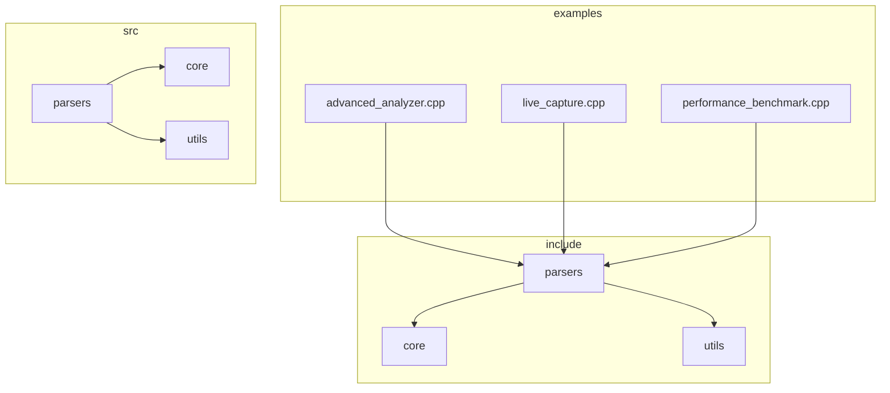
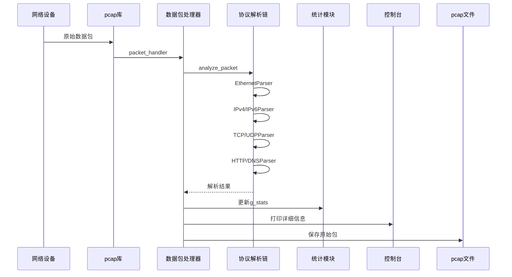
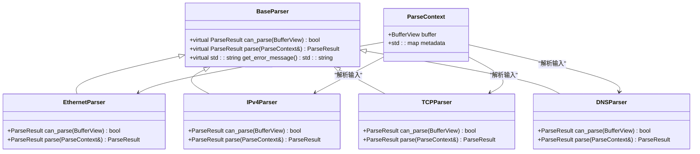
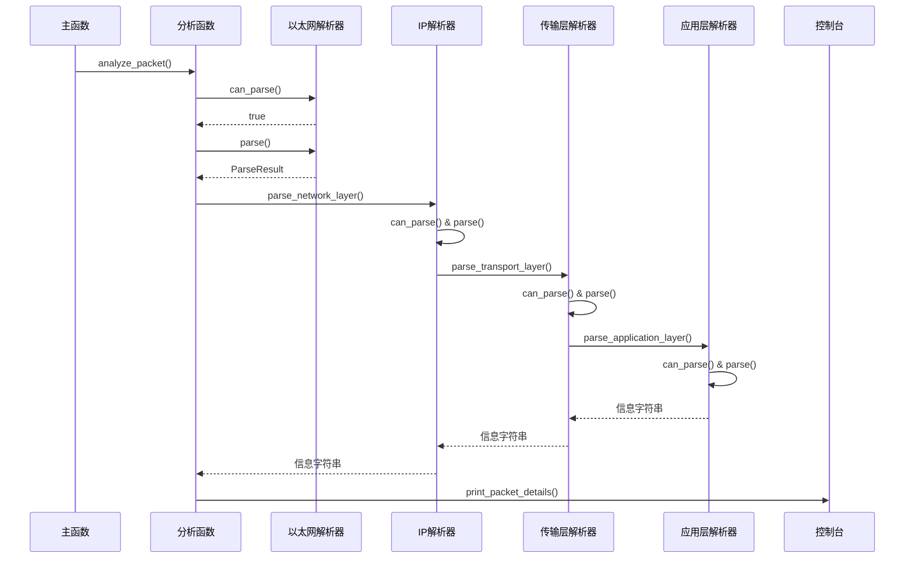
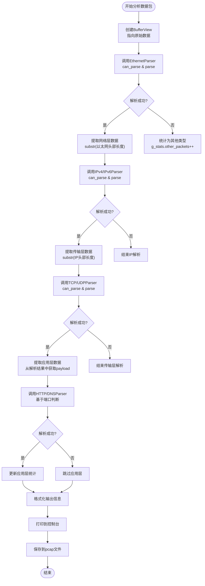
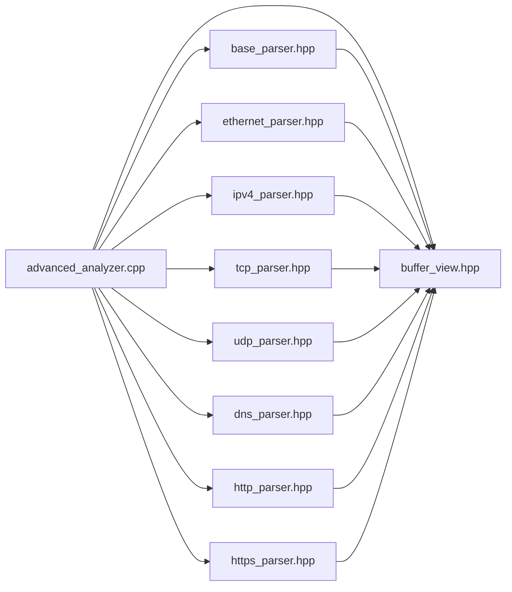

# 高级流量分析示例详解

<cite>
**本文档引用文件**  
- [examples\advanced_analyzer.cpp](file://examples\advanced_analyzer.cpp)
- [include\core\buffer_view.hpp](file://include\core\buffer_view.hpp)
- [include\parsers\base_parser.hpp](file://include\parsers\base_parser.hpp)
- [include\parsers\datalink\ethernet_parser.hpp](file://include\parsers\datalink\ethernet_parser.hpp)
- [include\parsers\network\ipv4_parser.hpp](file://include\parsers\network\ipv4_parser.hpp)
- [include\parsers\network\ipv6_parser.hpp](file://include\parsers\network\ipv6_parser.hpp)
- [include\parsers\transport\tcp_parser.hpp](file://include\parsers\transport\tcp_parser.hpp)
- [include\parsers\transport\udp_parser.hpp](file://include\parsers\transport\udp_parser.hpp)
- [include\parsers\application\dns_parser.hpp](file://include\parsers\application\dns_parser.hpp)
- [include\parsers\application\http_parser.hpp](file://include\parsers\application\http_parser.hpp)
- [include\parsers\application\https_parser.hpp](file://include\parsers\application\https_parser.hpp)
</cite>

## 目录
1. [简介](#简介)
2. [项目结构](#项目结构)
3. [核心组件](#核心组件)
4. [架构概览](#架构概览)
5. [详细组件分析](#详细组件分析)
6. [依赖分析](#依赖分析)
7. [性能考量](#性能考量)
8. [故障排除指南](#故障排除指南)
9. [结论](#结论)

## 简介
本文档深入解析 `advanced_analyzer.cpp` 的实现逻辑，重点阐述如何利用 `protocol_praser` 库进行多层协议解析与流量特征提取。说明该示例如何集成 BufferView、协议解析链、协议检测引擎和流量统计模块，展示复杂网络流量分析的实际应用模式。通过代码逐段分析，解释解析上下文（ParseContext）的传递机制、解析结果的聚合方式以及统计信息的输出格式。提供构建和运行该示例的具体命令，并列举典型输出结果及其含义，帮助开发者理解高级分析场景下的库集成方法。

## 项目结构

**图示来源**  
- [examples\advanced_analyzer.cpp](file://examples\advanced_analyzer.cpp)
- [include\parsers\base_parser.hpp](file://include\parsers\base_parser.hpp)
- [include\core\buffer_view.hpp](file://include\core\buffer_view.hpp)

**本节来源**  
- [examples\advanced_analyzer.cpp](file://examples\advanced_analyzer.cpp)
- [include\core\buffer_view.hpp](file://include\core\buffer_view.hpp)

## 核心组件

`advanced_analyzer.cpp` 实现了一个完整的网络流量分析系统，集成了协议解析、上下文管理、统计聚合和实时输出功能。核心组件包括 `BufferView` 用于零拷贝数据访问，`ParseContext` 用于跨层解析状态传递，以及多层协议解析器链（以太网 → IP → TCP/UDP → HTTP/DNS）实现深度包检测。

**本节来源**  
- [examples\advanced_analyzer.cpp](file://examples\advanced_analyzer.cpp#L1-L100)
- [include\core\buffer_view.hpp](file://include\core\buffer_view.hpp#L1-L50)

## 架构概览

**图示来源**  
- [examples\advanced_analyzer.cpp](file://examples\advanced_analyzer.cpp#L200-L400)
- [include\parsers\base_parser.hpp](file://include\parsers\base_parser.hpp)

## 详细组件分析

### 协议解析链分析

#### 对象导向组件：

**图示来源**  
- [include\parsers\base_parser.hpp](file://include\parsers\base_parser.hpp#L1-L30)
- [include\parsers\datalink\ethernet_parser.hpp](file://include\parsers\datalink\ethernet_parser.hpp#L1-L20)
- [include\parsers\network\ipv4_parser.hpp](file://include\parsers\network\ipv4_parser.hpp#L1-L20)

#### API/服务组件：

**图示来源**  
- [examples\advanced_analyzer.cpp](file://examples\advanced_analyzer.cpp#L450-L700)
- [include\parsers\network\ipv4_parser.hpp](file://include\parsers\network\ipv4_parser.hpp#L25-L40)

#### 复杂逻辑组件：

**图示来源**  
- [examples\advanced_analyzer.cpp](file://examples\advanced_analyzer.cpp#L500-L650)
- [include\core\buffer_view.hpp](file://include\core\buffer_view.hpp#L100-L120)

**本节来源**  
- [examples\advanced_analyzer.cpp](file://examples\advanced_analyzer.cpp#L200-L700)
- [include\core\buffer_view.hpp](file://include\core\buffer_view.hpp#L50-L100)

## 依赖分析

**图示来源**  
- [examples\advanced_analyzer.cpp](file://examples\advanced_analyzer.cpp#L10-L50)
- [include\parsers\base_parser.hpp](file://include\parsers\base_parser.hpp#L1-L10)

**本节来源**  
- [examples\advanced_analyzer.cpp](file://examples\advanced_analyzer.cpp#L1-L50)
- [include\parsers\base_parser.hpp](file://include\parsers\base_parser.hpp#L1-L20)

## 性能考量
`BufferView` 类采用零拷贝设计和引用计数机制，避免了数据复制开销。其内部实现支持 SIMD 指令集（AVX2/SSE2）加速字节查找，显著提升协议特征匹配效率。`ParseContext` 结构体通过 `std::any` 类型安全地在各解析层间传递元数据，避免了复杂的回调机制。整体架构采用分层解析模式，每层解析器仅关注特定协议，符合单一职责原则，便于维护和扩展。

## 故障排除指南

当遇到解析失败或统计异常时，可检查以下方面：
- 确认 Npcap 驱动已正确安装并运行
- 检查设备权限是否足够（管理员权限）
- 验证 `pcap_findalldevs` 能枚举出预期的网络接口
- 查看 `get_error_message()` 输出的详细错误信息
- 确认 `BufferView` 的 `offset` 和 `size` 在有效范围内
- 检查 `ParseContext` 中 `metadata` 的键名是否正确

**本节来源**  
- [examples\advanced_analyzer.cpp](file://examples\advanced_analyzer.cpp#L100-L150)
- [include\parsers\base_parser.hpp](file://include\parsers\base_parser.hpp#L50-L60)

## 结论
`advanced_analyzer.cpp` 示例展示了如何构建一个高效、可扩展的网络流量分析系统。通过 `BufferView` 实现零拷贝数据访问，利用分层解析器链进行多协议深度检测，并通过 `ParseContext` 统一管理解析状态。该设计模式适用于需要高性能协议识别和流量特征提取的场景，如入侵检测系统（IDS）、网络性能监控（NPM）和应用识别（DPI）等。