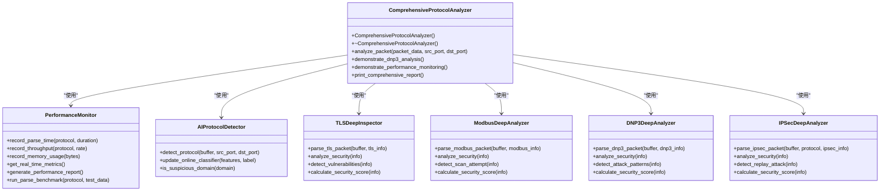
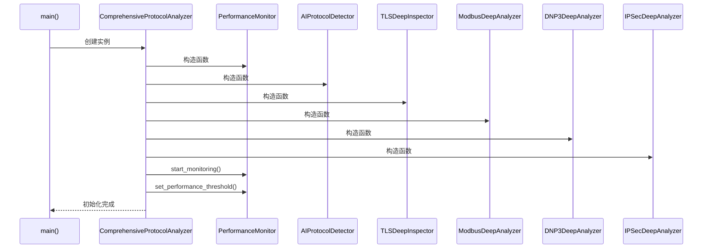
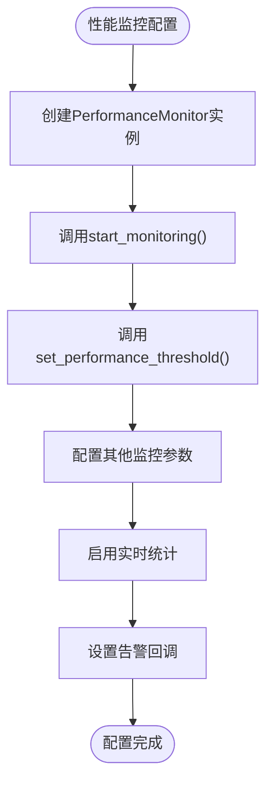
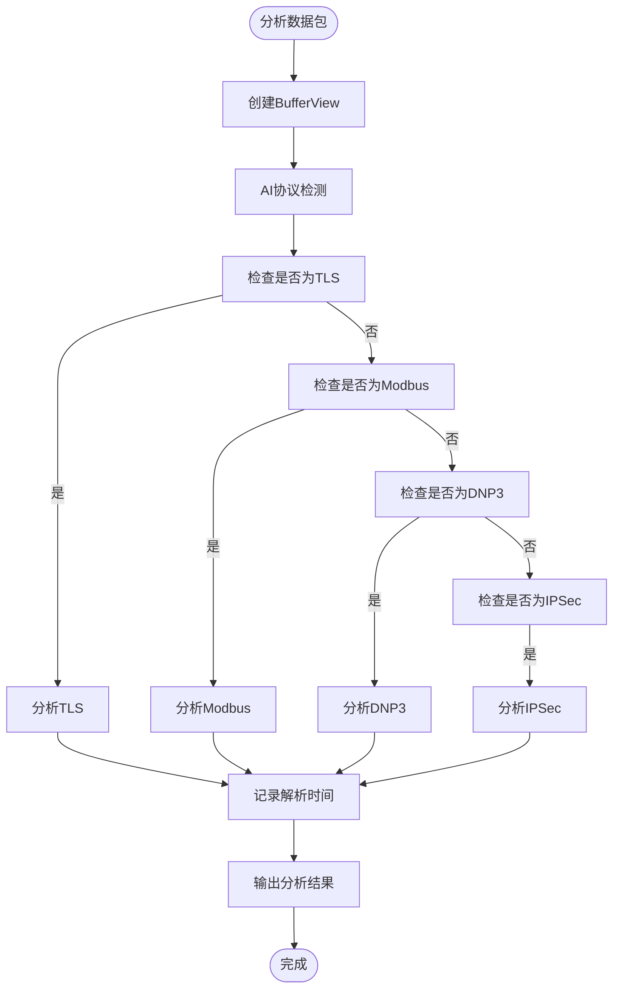
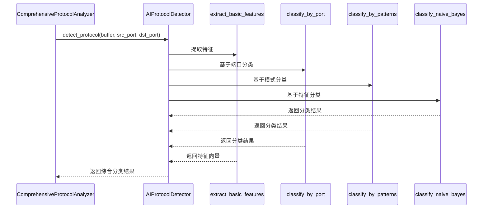
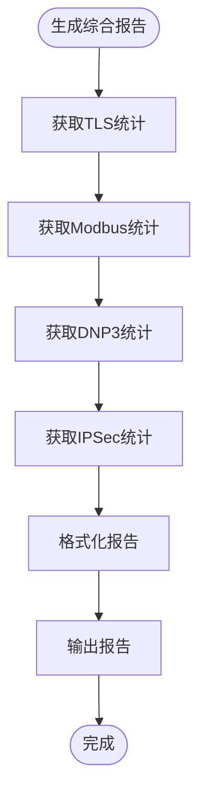

# 综合示例程序详解

<cite>
**本文档引用的文件**  
- [comprehensive_demo.cpp](file://examples/comprehensive_demo.cpp)
- [performance_monitor.hpp](file://include/monitoring/performance_monitor.hpp)
- [performance_monitor.cpp](file://src/monitoring/performance_monitor.cpp)
- [protocol_detector.hpp](file://include/ai/protocol_detector.hpp)
- [protocol_detector.cpp](file://src/ai/protocol_detector.cpp)
- [tls_deep_inspector.hpp](file://include/parsers/security/tls_deep_inspector.hpp)
- [tls_deep_inspector.cpp](file://src/parsers/security/tls_deep_inspector.cpp)
- [modbus_deep_analyzer.hpp](file://include/parsers/industrial/modbus_deep_analyzer.hpp)
- [modbus_deep_analyzer.cpp](file://src/parsers/industrial/modbus_deep_analyzer.cpp)
- [dnp3_deep_analyzer.hpp](file://include/parsers/industrial/dnp3_deep_analyzer.hpp)
- [dnp3_deep_analyzer.cpp](file://src/parsers/industrial/dnp3_deep_analyzer.cpp)
- [ipsec_deep_analyzer.hpp](file://include/parsers/security/ipsec_deep_analyzer.hpp)
- [ipsec_deep_analyzer.cpp](file://src/parsers/security/ipsec_deep_analyzer.cpp)
</cite>

## 目录
1. [项目概述](#项目概述)
2. [核心组件分析](#核心组件分析)
3. [协议解析器初始化](#协议解析器初始化)
4. [性能监控配置](#性能监控配置)
5. [解析结果处理](#解析结果处理)
6. [AI协议检测集成](#ai协议检测集成)
7. [综合分析报告生成](#综合分析报告生成)
8. [使用指南](#使用指南)

## 项目概述

本项目是一个基于C++20的高性能网络协议解析库，专注于提供完整的协议栈解析能力。`comprehensive_demo.cpp`作为综合示例程序，展示了如何集成多种高级功能，包括TLS深度检测、Modbus工业协议分析、DNP3工业协议分析、IPSec安全协议分析以及AI智能协议检测。该示例程序通过`ComprehensiveProtocolAnalyzer`类协调各个解析器和监控组件，实现了对网络数据包的全面分析。

程序采用模块化设计，各协议解析器独立实现，通过统一的接口进行集成。性能监控系统提供了实时的性能指标收集和分析功能，而AI协议检测引擎则利用多种特征提取和分类算法来识别未知协议。整个系统设计注重性能和可扩展性，适用于需要深度网络流量分析的场景。

**Section sources**
- [comprehensive_demo.cpp](file://examples/comprehensive_demo.cpp#L1-L50)

## 核心组件分析

`ComprehensiveProtocolAnalyzer`类是综合示例程序的核心，负责协调各个协议解析器和监控组件。该类在构造函数中初始化了TLS深度检测器、Modbus工业协议分析器、DNP3工业协议分析器、IPSec安全协议分析器、AI协议检测引擎和性能监控器。这些组件通过组合而非继承的方式集成，体现了良好的模块化设计原则。

性能监控器`PerformanceMonitor`提供了全面的性能指标收集和分析功能，包括解析时间、吞吐量、内存使用等。它支持实时监控、阈值告警、基准测试和性能报告生成。AI协议检测引擎`AIProtocolDetector`采用集成学习方法，结合端口分析、模式匹配和朴素贝叶斯分类等多种技术来识别协议。各个协议解析器如`TLSDeepInspector`、`ModbusDeepAnalyzer`等都提供了深度分析功能，能够检测安全漏洞和异常行为。

**Diagram sources**
- [comprehensive_demo.cpp](file://examples/comprehensive_demo.cpp#L394-L702)
- [performance_monitor.hpp](file://include/monitoring/performance_monitor.hpp#L187-L339)
- [protocol_detector.hpp](file://include/ai/protocol_detector.hpp#L26-L74)
- [tls_deep_inspector.hpp](file://include/parsers/security/tls_deep_inspector.hpp#L357-L429)
- [modbus_deep_analyzer.hpp](file://include/parsers/industrial/modbus_deep_analyzer.hpp#L283-L387)
- [dnp3_deep_analyzer.hpp](file://include/parsers/industrial/dnp3_deep_analyzer.hpp#L172-L285)
- [ipsec_deep_analyzer.hpp](file://include/parsers/security/ipsec_deep_analyzer.hpp#L170-L301)

**Section sources**
- [comprehensive_demo.cpp](file://examples/comprehensive_demo.cpp#L394-L702)
- [performance_monitor.hpp](file://include/monitoring/performance_monitor.hpp#L187-L339)
- [protocol_detector.hpp](file://include/ai/protocol_detector.hpp#L26-L74)
- [tls_deep_inspector.hpp](file://include/parsers/security/tls_deep_inspector.hpp#L357-L429)
- [modbus_deep_analyzer.hpp](file://include/parsers/industrial/modbus_deep_analyzer.hpp#L283-L387)
- [dnp3_deep_analyzer.hpp](file://include/parsers/industrial/dnp3_deep_analyzer.hpp#L172-L285)
- [ipsec_deep_analyzer.hpp](file://include/parsers/security/ipsec_deep_analyzer.hpp#L170-L301)

## 协议解析器初始化

`ComprehensiveProtocolAnalyzer`的构造函数负责初始化所有协议解析器和相关组件。初始化过程包括创建各个解析器实例、启动性能监控以及设置性能阈值。TLS深度检测器、Modbus工业协议分析器、DNP3工业协议分析器和IPSec安全协议分析器都是通过组合的方式集成到主分析器中，这种设计提高了系统的模块化和可维护性。

AI协议检测引擎在初始化时会加载基本的分类器和签名数据库，为后续的协议识别做好准备。性能监控器在构造时指定指标历史大小为5000，这意味着它将保留最近5000个性能指标用于分析。初始化完成后，系统会输出初始化成功的提示信息，包括各个组件的启用状态。

**Diagram sources**
- [comprehensive_demo.cpp](file://examples/comprehensive_demo.cpp#L394-L420)
- [performance_monitor.cpp](file://src/monitoring/performance_monitor.cpp#L11-L15)
- [protocol_detector.cpp](file://src/ai/protocol_detector.cpp#L9-L16)
- [tls_deep_inspector.cpp](file://src/parsers/security/tls_deep_inspector.cpp#L14-L16)
- [modbus_deep_analyzer.cpp](file://src/parsers/industrial/modbus_deep_analyzer.cpp#L8-L37)
- [dnp3_deep_analyzer.cpp](file://src/parsers/industrial/dnp3_deep_analyzer.cpp#L45-L57)
- [ipsec_deep_analyzer.cpp](file://src/parsers/security/ipsec_deep_analyzer.cpp#L45-L57)

**Section sources**
- [comprehensive_demo.cpp](file://examples/comprehensive_demo.cpp#L394-L420)

## 性能监控配置

性能监控系统在`ComprehensiveProtocolAnalyzer`的构造函数中被配置和启动。首先调用`start_monitoring()`方法启动后台监控线程，然后通过`set_performance_threshold()`方法设置性能阈值。示例中设置了TLS解析时间的警告阈值（1ms）和严重阈值（5ms），当解析时间超过这些阈值时会触发告警。

性能监控器提供了丰富的配置选项，包括指标历史大小、指标保留时间、告警检查间隔等。它支持多种性能指标的记录，如解析时间、吞吐量、内存使用、CPU使用率等。监控数据可以导出为JSON、CSV、二进制或Prometheus格式，便于与其他监控系统集成。此外，还支持自定义告警回调函数，允许用户在性能问题发生时执行特定的处理逻辑。

**Diagram sources**
- [comprehensive_demo.cpp](file://examples/comprehensive_demo.cpp#L410-L418)
- [performance_monitor.hpp](file://include/monitoring/performance_monitor.hpp#L187-L339)

**Section sources**
- [comprehensive_demo.cpp](file://examples/comprehensive_demo.cpp#L410-L418)
- [performance_monitor.hpp](file://include/monitoring/performance_monitor.hpp#L187-L339)

## 解析结果处理

`analyze_packet()`方法是处理解析结果的核心函数。该方法首先创建一个`BufferView`对象来访问数据包内容，然后依次尝试AI协议检测、TLS分析、Modbus分析、DNP3分析和IPSec分析。每个分析方法都会检查相应的条件（如端口号或协议特征）来决定是否进行分析。

对于每个成功解析的协议，系统会输出详细的分析结果，包括协议版本、密码套件、安全评分等信息。如果检测到安全漏洞或异常行为，会以警告形式输出。所有分析操作的耗时都会被记录到性能监控器中，便于后续的性能分析。这种方法实现了协议的并行分析，提高了处理效率。

**Diagram sources**
- [comprehensive_demo.cpp](file://examples/comprehensive_demo.cpp#L422-L500)

**Section sources**
- [comprehensive_demo.cpp](file://examples/comprehensive_demo.cpp#L422-L500)

## AI协议检测集成

AI协议检测引擎通过`detect_protocol()`方法集成到主分析流程中。该方法接收数据包缓冲区和源/目的端口号作为输入，返回一个包含协议名称和置信度的分类结果列表。AI检测器采用集成学习方法，结合了端口分析、模式匹配和朴素贝叶斯分类等多种技术来提高识别准确率。

在初始化时，AI检测器会加载基本的分类器和签名数据库。`extract_basic_features()`方法负责从数据包中提取特征，如熵值、ASCII字符比例等。`classify_by_port()`、`classify_by_patterns()`和`classify_naive_bayes()`方法分别基于端口、模式和特征向量进行分类。最终结果是这些分类器的加权组合，确保了较高的识别准确率。

**Diagram sources**
- [comprehensive_demo.cpp](file://examples/comprehensive_demo.cpp#L430-L438)
- [protocol_detector.hpp](file://include/ai/protocol_detector.hpp#L26-L74)

**Section sources**
- [comprehensive_demo.cpp](file://examples/comprehensive_demo.cpp#L430-L438)
- [protocol_detector.hpp](file://include/ai/protocol_detector.hpp#L26-L74)

## 综合分析报告生成

`print_comprehensive_report()`方法负责生成综合分析报告，汇总各个协议解析器的统计信息。报告包括TLS安全分析统计、Modbus工业协议统计、DNP3工业协议统计和IPSec安全协议统计。每个统计部分都包含关键指标，如连接数、数据包数、安全评分和发现的漏洞数量。

报告生成过程通过调用各个解析器的`get_statistics()`方法获取统计信息，然后格式化输出。这种方法实现了统计信息的集中展示，便于用户全面了解网络流量的分析结果。报告还支持生成安全报告和设备报告，为安全分析提供了更多维度的数据支持。

**Diagram sources**
- [comprehensive_demo.cpp](file://examples/comprehensive_demo.cpp#L502-L580)

**Section sources**
- [comprehensive_demo.cpp](file://examples/comprehensive_demo.cpp#L502-L580)

## 使用指南

要使用综合示例程序，首先需要确保开发环境满足要求：支持C++20的编译器（GCC 10+、Clang 12+或MSVC 2019+）、CMake 3.15+。构建项目后，运行`comprehensive_demo`可执行文件即可看到演示效果。

程序的主要使用流程包括：1) 创建`ComprehensiveProtocolAnalyzer`实例，2) 调用`analyze_packet()`方法分析数据包，3) 调用`demonstrate_performance_monitoring()`查看性能监控演示，4) 调用`print_comprehensive_report()`生成综合报告。用户可以根据需要修改数据包内容或添加新的协议解析器。

对于生产环境，建议根据实际需求调整性能监控的阈值和历史大小，优化AI检测器的分类模型，并定期更新协议特征库以提高检测准确率。系统设计具有良好的扩展性，可以方便地集成新的协议解析器或监控组件。

**Section sources**
- [comprehensive_demo.cpp](file://examples/comprehensive_demo.cpp#L704-L758)