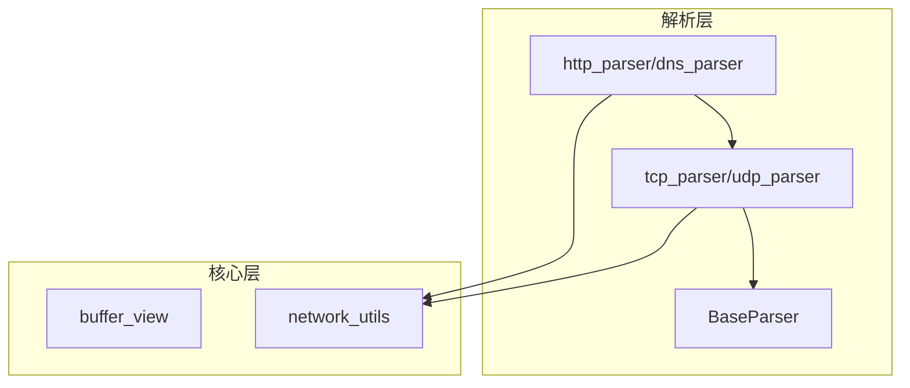
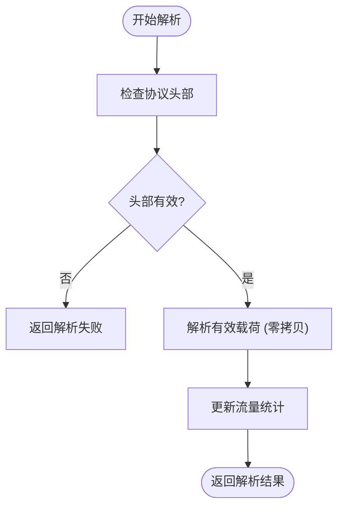

# 贡献指南

<cite>
**本文档中引用的文件**  
- [org_design_doc.md](file://org_design_doc.md)
- [CMakeLists.txt](file://CMakeLists.txt)
- [include/core/buffer_view.hpp](file://include/core/buffer_view.hpp)
- [src/core/buffer_view.cpp](file://src/core/buffer_view.cpp)
- [include/parsers/base_parser.hpp](file://include/parsers/base_parser.hpp)
- [src/parsers/base_parser.cpp](file://src/parsers/base_parser.cpp)
- [include/parsers/transport/tcp_parser.hpp](file://include/parsers/transport/tcp_parser.hpp)
- [src/parsers/transport/tcp_parser.cpp](file://src/parsers/transport/tcp_parser.cpp)
- [include/utils/network_utils.hpp](file://include/utils/network_utils.hpp)
- [src/utils/network_utils.cpp](file://src/utils/network_utils.cpp)
</cite>

## 目录
1. [引言](#引言)
2. [代码风格规范](#代码风格规范)
3. [提交流程](#提交流程)
4. [测试要求](#测试要求)
5. [设计原则与架构一致性](#设计原则与架构一致性)
6. [解析器扩展开发指南](#解析器扩展开发指南)
7. [API 兼容性保证](#api-兼容性保证)
8. [性能与类型安全实践](#性能与类型安全实践)
9. [结论](#结论)

## 引言
本贡献指南旨在为开发者提供清晰、一致的开发规范，确保所有对协议解析项目（protocol_praser）的贡献均符合项目的高质量标准。项目基于模块化架构设计，强调高性能、零拷贝数据处理和类型安全。本文档结合 `org_design_doc.md` 中的架构思想，指导贡献者如何在不破坏现有系统稳定性的前提下，安全地扩展功能。

## 代码风格规范
为保持代码库的一致性和可读性，所有贡献必须遵循以下编码规范：

- **命名约定**：采用 `snake_case` 命名法。类名、结构体名使用首字母大写的 `PascalCase`，函数和变量使用全小写加下划线。
- **注释要求**：所有公共接口（头文件中的函数、类、方法）必须包含 Doxygen 风格注释，说明功能、参数、返回值和异常情况。复杂逻辑块需在源文件中添加内联注释。
- **头文件保护**：所有头文件必须使用 `#pragma once` 指令防止重复包含。
- **C++ 标准**：代码应符合 C++17 标准，鼓励使用现代 C++ 特性（如 `auto`、`constexpr`、智能指针），但避免过度模板化或元编程以保持可维护性。

**Section sources**
- [include/core/buffer_view.hpp](file://include/core/buffer_view.hpp#L1-L10)
- [include/parsers/base_parser.hpp](file://include/parsers/base_parser.hpp#L1-L15)

## 提交流程
为确保代码质量和协作效率，贡献者应遵循以下提交流程：

1. **分支管理**：从 `main` 分支创建功能分支，命名格式为 `feature/your-feature-name` 或 `fix/issue-description`。
2. **Pull Request 模板**：提交 PR 时必须填写标准模板，包括：
   - 功能描述或修复的问题
   - 相关的测试结果
   - 是否影响 API 兼容性
   - 是否包含性能基准测试
3. **代码审查**：所有 PR 必须经过至少一名核心维护者审查，确保符合代码风格、设计原则和测试覆盖率要求。
4. **CI 集成**：PR 触发的 CI 流水线将自动运行构建、静态分析和单元测试，全部通过后方可合并。

**Section sources**
- [CMakeLists.txt](file://CMakeLists.txt#L1-L20)

## 测试要求
所有新功能或修改必须附带相应的测试用例，确保功能正确性和长期稳定性。

- **单元测试**：每个解析器模块（如 `tcp_parser`）必须提供完整的单元测试，覆盖正常流程和边界条件。
- **性能基准测试**：对于性能敏感的组件（如 `buffer_view`），需提供基准测试以量化性能影响。
- **集成测试**：新增协议解析器应集成到高级分析器（`advanced_analyzer.cpp`）中进行端到端验证。

**Section sources**
- [src/core/buffer_view.cpp](file://src/core/buffer_view.cpp#L50-L100)
- [examples/performance_benchmark.cpp](file://examples/performance_benchmark.cpp#L1-L30)

## 设计原则与架构一致性
新功能的开发必须遵循 `org_design_doc.md` 中定义的模块化架构思想，确保系统可扩展性和可维护性。

- **模块化设计**：新功能应封装在独立模块中，避免跨层依赖。例如，应用层协议解析器应仅依赖传输层接口，而非直接访问网络层。
- **单一职责原则**：每个类或函数应只负责一项明确任务，如 `ProtocolDetection` 仅负责协议识别，不参与数据解析。
- **依赖注入**：组件间依赖应通过接口或构造函数注入，便于测试和替换。

**Diagram sources**
- [include/parsers/base_parser.hpp](file://include/parsers/base_parser.hpp#L10-L40)
- [include/utils/network_utils.hpp](file://include/utils/network_utils.hpp#L5-L20)

## 解析器扩展开发指南
贡献者在开发新的协议解析器时，应遵循以下步骤：

1. **继承基类**：新建解析器类应继承 `BaseParser`，实现 `parse()` 和 `get_protocol_name()` 等虚函数。
2. **使用 buffer_view**：解析过程中应使用 `buffer_view` 进行零拷贝数据访问，避免内存复制。
3. **注册到检测系统**：在 `ProtocolDetection` 模块中注册新解析器，确保能被自动识别。
4. **提供默认构造函数**：便于通过工厂模式创建实例。

**Section sources**
- [include/parsers/base_parser.hpp](file://include/parsers/base_parser.hpp#L20-L50)
- [src/parsers/base_parser.cpp](file://src/parsers/base_parser.cpp#L1-L20)

## API 兼容性保证
为维护现有用户代码的稳定性，所有变更必须确保向后兼容：

- **禁止修改公共接口**：不得删除或重命名已暴露的函数、类或枚举值。
- **新增功能应可选**：新添加的参数应提供默认值，确保旧调用方式仍有效。
- **弃用而非删除**：若需移除功能，应先标记为 `[[deprecated]]` 并在文档中说明替代方案，至少保留两个版本周期。

**Section sources**
- [include/parsers/application/http_parser.hpp](file://include/parsers/application/http_parser.hpp#L15-L30)
- [include/parsers/transport/tcp_parser.hpp](file://include/parsers/transport/tcp_parser.hpp#L10-L25)

## 性能与类型安全实践
项目核心价值观包括高性能、零拷贝和类型安全，贡献者应严格遵守：

- **零拷贝原则**：所有数据解析应基于 `buffer_view` 的只读视图进行，避免 `std::string` 或 `std::vector` 的频繁拷贝。
- **RAII 资源管理**：使用智能指针（`std::unique_ptr`）管理动态资源，确保异常安全。
- **编译期检查**：利用 `static_assert` 和强类型枚举（`enum class`）提升类型安全性。
- **避免虚函数开销**：在性能关键路径上，优先使用模板特化或策略模式替代虚函数调用。

**Diagram sources**
- [include/core/buffer_view.hpp](file://include/core/buffer_view.hpp#L20-L40)
- [src/statistics/traffic_statistics.cpp](file://src/statistics/traffic_statistics.cpp#L10-L30)

## 结论
本指南为协议解析项目的贡献提供了全面的规范和实践指导。通过遵循代码风格、提交流程、测试要求和设计原则，贡献者可以确保其代码与项目整体架构保持一致，并维护高性能、类型安全和API稳定性。我们鼓励所有贡献者在开发前仔细阅读 `org_design_doc.md` 并参考现有模块的实现模式，共同推动项目可持续发展。